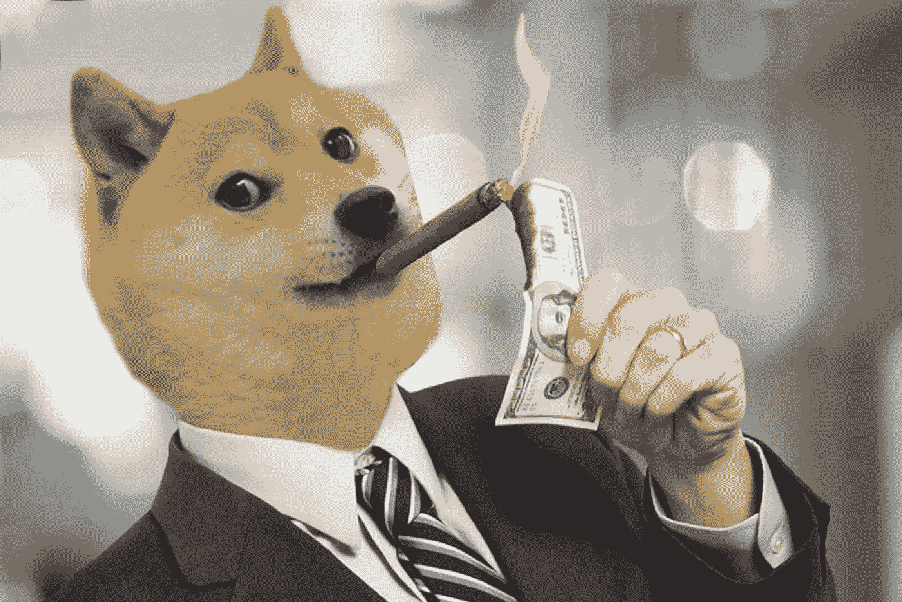

# 我从两个月内采访超过 45 个加密货币项目中学到的 24 条经验

> 原文：<https://medium.com/hackernoon/24-lessons-i-learned-from-interviewing-over-45-cryptocurrency-projects-in-two-months-680dfa213aa6>

For anyone that doesn’t like to read, here’s a video version of this post!

像大多数在 2017 年进入区块链领域的人一样，我们都必须经历一片谎言、不完整信息和大量市场波动。

那是一段美好的时光。

我们很多人赚了钱，也有很多人赔了钱。

大约三个月前，我们决定我们已经受够了 Crypto ( *插入通用名*)关于下一个 100 倍蓝宝月币的重复白皮书和 3 分钟视频。

我们决定要在真正的项目/想法/技术专家和投资他们的人之间架起一座桥梁。

*所以我们开始采访一些项目。*

三个月后，我们采访了超过 45 个项目，与超过 50 人交谈。我想不出比这更实用的加密之旅了。

我知道人们会欣赏采访前后的许多见解。

因此，我整理了一份清单，列出了我们采访的 45 位创始人分享的 25 条智慧。

我没有说他们中的任何一个是真的，我也没有宣传他们的任何项目。这只是我在分享 CEO/创始人的见解，否则你可能也看不到。

***不要脸塞时间——订阅我们的*** [***Youtube 频道***](https://youtube.com/coincrunch) ***精彩视频和新项目访谈。另外，请查看我们的*** [***网站***](https://coincrunch.io) ***或注册我们的简讯加入我们的社区。***

所以让我们开始吧。

我用数字把它分解了，斜体是我自己的想法..他们的想法。

尽情享受，并随时让我知道你的想法。

## 1.不要认为常规的风险投资公司在投资早期科技公司时知道他们在做什么。成功没有规则或明确的标志。绝大多数风险投资资金都没有着落。加密也一样。

我认为大多数 ICO 和早期区块链投资者不知道他们在做什么，这就是为什么他们希望把他们的美元投入到受欢迎的项目中，因为这是唯一可靠的启发。

重要的是要记住，许多风险投资基金也不能准确衡量一个项目是否会成功。

这是一项艰巨的工作，而区块链科技和思想的不可预测性让这项工作变得更加艰难。

## 2.高质量项目的最大挑战是吸引开发者和真正的用户。对于高质量的项目来说，钱不是一个大问题。期待更少的人群销售。

我觉得普通人进入惊艳 ico 的时代已经结束了。很遗憾地说。

价值将更多地转移到风险投资基金，原因很简单——许多大型风险投资基金提供了巨大的增值。无论是宣传还是他们的支持网络，对大多数项目来说都是显而易见的。

更不用说大多数风投基金通常是 100%合法合规的。KYC 没有问题。

## 3.空投将成为新的大众销售方式。

在过去的几个月里，我们已经和很多决定选择空投模式以避免法律审查的项目谈过了。

这也省去了他们应付一大群人在电报中询问“何时装箱”“何时令牌”的麻烦。

人群销售是绝对混乱的，也是黑客的目标。期待所有好的项目马上被风投资金抢走。

## 4.SEC 对 crypto 总体上是友好的，并且希望社区首先自律。

我们不会指名道姓，但我们已经与一些人进行了交谈，这些人经常与美国证券交易委员会交谈，曾经在那里工作过，或者正在参与一项统一的努力，以教育政府官员有关加密的知识。

他们意识到一个巨大的转变即将到来，他们需要适应它。我个人认为，我不担心监管，而且实际上欢迎监管。

很大一部分散户要么不能很好地阅读英语来发现骗局，要么太没文化/太懒。

## 5.流动性是 crypto 面临的最大问题之一，也是它如此不稳定的原因。缺乏流动性池是这里最大的问题。

我很确定这个很容易理解。

缺乏流动性意味着容易操纵的订单簿和更大的波动性。流动性集中在单个订单簿中，不在交易所之间共享。

德克斯有望改变这一切。

## 6.大多数智能合约都不安全，最终会有一些验证安全性的标准。

像 Quantstamp 和 Certik 这样的项目正在寻找审计大量安全漏洞的智能合同。看看这份报告就知道[智能合同中有 34200 个漏洞。](https://eprint.iacr.org/2016/633.pdf)

*呀！*

由此得出的结论是，最终会有一个全球公认的标准来验证智能合同。有点像来自某个备受尊敬的团体的认可或标准的印记。

不管是哪一个项目，都会很有价值。

## 7.文化帮助人们更快地适应加密。一些文化更适合采用加密。

像韩国和日本这样的国家非常重视电子游戏。超过一半的人口玩视频游戏，而数字货币长期以来一直是这些游戏的主要内容。

因此，创造一种真正的货币的采用曲线并没有那么陡。

另一方面，我们的文化在成长过程中并没有如此科技化..这使得只有网络朋克和投机者才会采用加密技术。

## 8.2017 年就像是原始的密码软泥。

我们有很多伟大的项目，但也有很多垃圾。如果我要抛出一些未经验证的估计，我会说 98.5%的垃圾和 1.5%的质量。

*但这不是重点。*

关键是，我们需要这种进化过程来达到我们现在的位置，并有望在未来继续前进。

把它想象成进化。合法的项目将会适应、成长和繁荣，让懒惰的项目自生自灭。

## 9.激励是代币设计中最重要的东西。

巴菲特的得力助手查理·芒格(Charlie Munger)有一句非常适合加密的名言

> "*给我看激励，我就给你看结果*"。

很多项目都忘了这一点。他们中的一些人甚至没有花超过 20 分钟来设计他们的令牌功能。

激励机制的设计首先确保了一个强健而有弹性的生态系统，它将在未来长期存在。

这也是任何网络效应的基础。

## 10.加密市场最终将价值数万亿。

*随便说说* …

## 11.Icon 是一个疯狂的项目。

本周的新货。在这里。

结合高质量的技术+一个有 300 个项目的新孵化器+思想领导力+一个完整的区块链生态系统+大量的韩国人+良好的营销= ICON 太棒了。

## 12.大多数严肃的开发者甚至不考虑价格，他们只关注技术。

这是我们反复看到的事情。

从会议到面试，高质量的项目甚至不担心他们的投资或价格。他们只是继续发展和做他们正在做的事情。

我认为它的价值在于它体现了一种真正的霍德勒人需要具备的态度——对技术和项目方向的绝对信心。

价格只是通往卓越之路的一个暂时的障碍。

## 13.区块链是一个独特的空间，因为你需要了解每件事情的一点点。

这是长期投资者需要了解过多主题的仅有空间之一。

治理、代币经济、功能性、可扩展性以及如何构建社区。如果说有什么不同的话，投资加密技术比传统的蓝筹股投资要难得多。

你需要了解不同的动态，像风投一样思考。没有像市盈率这样明确的公认指标来帮助你做决定。

## 14.场外 BTC 交易量惊人。

BTC 的大部分交易量并不存在于交易所。

这一切都是在场外进行的。卖家和买家直接买卖大量的 it 产品。

*谁在买？*

使用不同化名或公司的金融玩家。

人们正在积累 BTC，他们正在购买……*很多*

## 15.Crypto 需要一个强健的衍生品市场。

卖空者和其他基于衍生工具的金融工具保持了常规市场的健康和稳定，并降低了波动性。

我不是很理解这个概念，但是让一个领先的分散式交易所创始人给我分解，就像我 5 岁的时候一样。

尽管卖空者经常遭到很多人的憎恨，但他们是任何健康市场的重要组成部分。

期待像市场协议和 T2 这样的项目将衍生品交易带到区块链。

## 16.尽管诺沃格拉茨说，大型机构资金还没有进入这个领域。

*巨额、* ***巨额*** 资金还没有进来。

我说的是养老基金、教师退休基金和庞大的指数基金。他们还没有进入密码系统，暂时也不会。

原因有两个

首先，缺乏保管服务来帮助他们方便/购买/存储密码。

其次，这对他们来说太不稳定了。

这使得进入 crypto 的大部分“大资金”成为专注于技术的风险投资基金和一些家族理财室。

## 17.关键管理服务(KMS)在未来将是巨大的。

大多数人不想持有他们的公钥，即使他们试图这样做，一些专家仍然把它搞得一团糟(*不会说是谁*)。

一般人不想成为他们自己的银行，我不能责怪他们。

存储你自己的私钥是非常可怕的。

重要的是要记住，大多数人甚至没有足够的责任心去存钱，更不用说随身携带一个秘密的数字序列，让任何人在 1-2 秒内偷走你的钱。

KMS 在未来将会是一个巨大的市场。一些 KMS 解决方案甚至可能变得像加密银行。

## 18.区块链不是私有的，公司不能在不损害数据隐私规则的情况下将数据存储在公共分类账上。隐私层是巨大的。

如果你真的想了解区块链理工并投资新项目，你肯定需要阅读数据安全法。

我见过太多的 Dapps 提供解放人们和免费数据或创建开放市场。

…… *爽*

但是，您的白皮书没有提到如何存储这些由高度发达的国际数据安全法管理的极其隐私、敏感的数据..是吗？

区块链上的数据隐私作为与底层链的集成，或者作为构建在顶层的层，将创造一个巨大的市场，并且对于扩展消费级应用至关重要。

期待 [Keep Network](https://keep.network/) 和 [Enigma](https://enigma.co/) 来寻找这些解决方案。

## 19.crypto 的主要杀手级应用是更快的技术创新和资金。

有史以来第一次，普通人可以成为风险投资家。我们将曾经属于超级富豪的行业解放给了像我们这样的普通人。

是的，这导致了许多骗子和江湖骗子，但也导致了技术创新的加速。

## 20.数据是新的石油。

越来越多的人将开始意识到数据是多么强大，以及它需要得到保护。

数据是新的石油，像 FB 和亚马逊这样的公司是新的石油美元石油世界的霸主。

幸运的是，区块链提供了一种可靠的方法来打破这些数据孤岛，创造一个可以通过共享数据来解放数据的世界，同时仍然保持不变的账本或其原始所有权，因此允许创造者获得回报。

[海洋协议](https://oceanprotocol.com/)是目前在这方面领先的顶级项目。

## 21.折扣代币模型是坏蛋。

如果你不知道什么是折扣券，这很容易解释。

*考虑奖励积分或航空里程。*

基本上，你用打折代币得到一些好处。首先，它们不是证券。其次，他们鼓励网络的使用和参与。第三，人们倾向于持有它们以备将来使用，这增加了价格稳定的因素。第四，它仍然允许使用其他货币或法定货币进入系统。

我认为折扣券将在 2018-2019 年变得更加流行。这里有一段关于他们的视频。

## 22.大家都喜欢以太坊。

我们采访的每一个项目和开发者都热爱 ETH，热爱这个社区，热爱他们正在努力建设的东西。

以太坊社区的许多元素体现了最初将人们带入区块链世界的相同价值观和理念。

我个人期待 ETH 在未来 2-3 年内拥有更大的市值。

## 23.脂肪协议的论点仍然非常适用。

如果你不知道是什么— [看我的视频](https://youtu.be/5OSCaI4VQQM)。

FAT 协议的理念是价值将在协议层而不是应用层被捕获。

我大体上同意这种说法，我们采访过的大多数创始人仍然认为，我们正处于这个新区块链世界的早期，礼宾项目提供了最佳的长期投资价值。

*专业建议——寻找孵化器为启动新项目而设立的项目。*

## 24.每个人都在试图弄清楚整件事。

*Phewwwww*

那是一种解脱。作为一名企业家，我大部分时间都在纠结于这种感觉，我真的不知道自己到底在做什么。

区块链世界似乎也没有什么不同。许多项目在进行的过程中会发现问题，建立联系并探索新的想法。

这就是我们目前发展阶段的美妙之处。这是一个学习新知识和挑战你认为你知道的东西的欣欣向荣和令人兴奋的时刻。

就是这样。

希望这是有见地的。

我想以最后一点来结束我的演讲——以同样的热情与世界各地致力于同样问题的项目交流，让我比以往任何时候都更加看好区块链空间。

伙计们，我们要开始一场狂野刺激的旅程了。

让我们系好安全带，尽情享受吧。

# 要获得区块链和加密货币的最佳新闻、评论和信息，请访问 [coincrunch.io](https://coincrunch.io) 或查看我们的网站:[Youtube](https://www.youtube.com/channel/UCXyrBCWaRJzHfOtnWaR47Qw)|[Twitter](https://twitter.com/coincrunchio)|[脸书](https://www.facebook.com/realcoincrunch/) | [Reddit](https://www.reddit.com/user/coincrunchio)