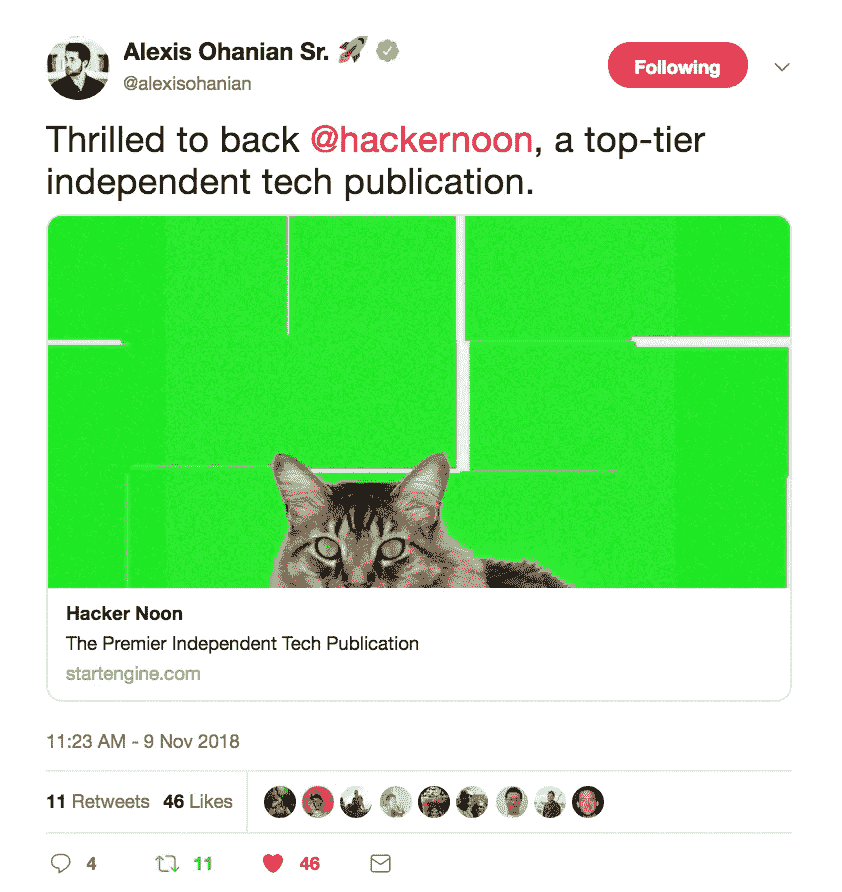
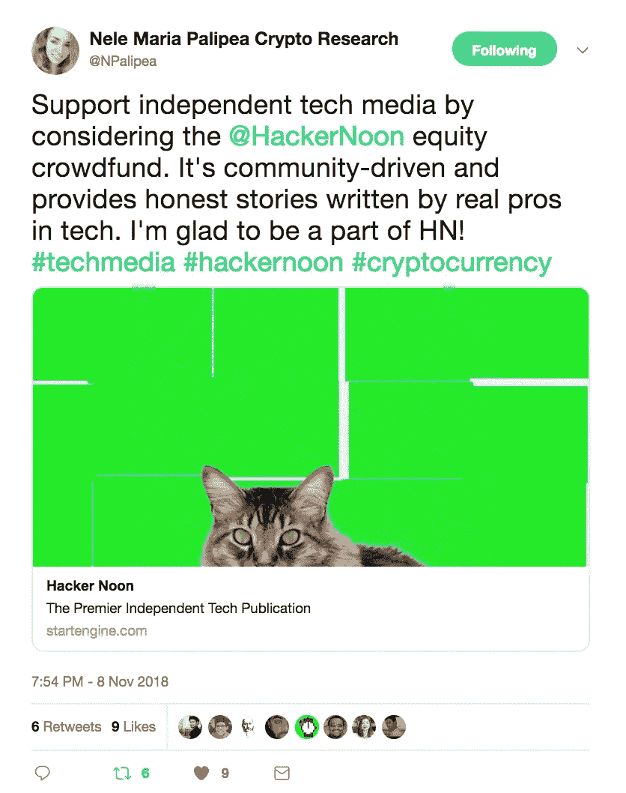

# 24 个顶级科技故事开始你的一周

> 原文：<https://medium.com/hackernoon/24-top-tech-stories-to-start-your-week-7d8f4929b1f2>

## [Hacker Noon 股权众筹活动](http://bit.ly/HNshares)在一周内已经从 366 名投资者那里筹集了 441，000+美元。我们已经完成了目标的 41%,还有 53 天。[通过拥有黑客正午](http://bit.ly/HNshares)的股份来支持独立科技媒体的未来。

## 非常感谢我们最近的一些投资者所说的这些友好的话:[亚历克西斯·奥哈尼安](https://twitter.com/alexisohanian/status/1060976281020497921)、[、**内尔·玛丽亚·帕利佩亚**、、](https://twitter.com/NPalipea/status/1060742373783699456)[费利佩·鲁埃达](https://twitter.com/ferueda/status/1061727540698595328)、[基巴·加托](https://twitter.com/KibaGateaux/status/1061612987163836417)、[瑞安·谁编码](https://twitter.com/ryanwhocodes/status/1061189963889471488)、[多伊尔兄弟](https://twitter.com/stdoyle/status/1060990699389235200)、[汤姆·特拉多](https://twitter.com/tomterado/status/1060882476527243265)、[马克·鲁德布什](https://twitter.com/MarkRoudebush/status/1060820589223374848)、[尼克·索曼](https://twitter.com/nicksoman/status/1060730479190536192)  [亚伦·西尔弗曼](https://twitter.com/aarsilv/status/1060215446744547328)，[罗斯·坎贝尔](https://twitter.com/r_ross_campbell/status/1060196588029648896)，[奥尔加·克里格](https://twitter.com/olgadk7/status/1060968657650675712)，[安朵斯·卡隆](https://twitter.com/andrascaron/status/1060121447832657922)，[乌戈利诺](https://twitter.com/Ugolino_me/status/1060993499095621632)等等。

以下是我周一的科技想法:**一家初创公司如何更好地服务于它的社区？**我认为这要从简单的倾听、学习和(在适当的时候)提问开始。我们在我们的贡献者群体中一直这样做，但我们也第一次通过读者调查系统地这样做。 [**成绩由**](https://medium.com/p/1d2c60573ec4/edit)**[林道斯莫克](https://medium.com/u/79c48b7e8fe7?source=post_page-----7d8f4929b1f2--------------------------------)今天** 公布。这项调查影响了我们的内部决策。例如，71%的受访者表示他们想要一个播客，所以[我们买下了 Crypto Disrupted](https://techstartups.com/2018/09/14/hacker-noon-acquires-blockchain-cryptocurrency-podcast-website-crypto-disrupted/) 并与 Trent Lapinski 一起制作了 [Hacker Noon 播客。此外，我们了解到 57%的读者希望参加黑客正午活动。虽然这可能不超过一半，但我们认为从阅读网站上的故事到想去参加该网站的活动，是一个相当大的飞跃。既然大多数人想要它，那么请关注 2019 年的黑客午间事件:-)](http://podcast.hackernoon.com)

但是为你的社区服务不仅仅是调查和分析数据。在建立一个大型社区的过程中(Hacker Noon 每天有 20 万以上的读者)，我想传递一些任何人都可以做的简单的事情来改善他们自己的创业社区:

1.  最大限度缩短响应时间。这对于一个小团队来说是很难做到的，我们经常做不到这一点，但是就像回复需要帮助的朋友的短信一样，快速的回复时间可以扩大关系。
2.  相信你的社区的反馈。黑客正午 2.0 的大部分想法都是由黑客正午的贡献者首先想到的，而不是我。我只是把它们往前推。
3.  当你和你需要如何适应的时候要透明。每一个年轻的企业都将面临一个时期，他们要么发展，要么死亡。我们的主要收入来源受到威胁，所以我们发展了。我们制定了一个计划，并且几乎已经完成了这个计划财务可行性的一半。

# 以 24 大科技故事开始你的一周:

## 软件情感

[**给准将的情书 64**](https://hackernoon.com/a-love-letter-to-the-commodore-64-bbef869e480) 作者[Christer Enfors](https://medium.com/u/1744f4151595?source=post_page-----7d8f4929b1f2--------------------------------)【10 分钟阅读】。爸爸，如果你不停止谈论 1900 年代的事情，人们会认为你来自 1900 年代自从我女儿在六岁的时候对我说了上面的话，已经过去了九年，现在我几乎已经原谅她了。我仍然爱她，但这个故事不是关于她的。不，这个故事是关于我的初恋——Commodore 64——一台 80 年代的家用电脑，至今仍是最畅销的电脑。当然，从那以后，越来越多的个人电脑被售出，但是没有一种型号的电脑能像当年的 Commodore 64 卖得那么多。

[**为什么 Angular 让我退出 Web Dev**](https://hackernoon.com/why-angular-made-me-quit-web-dev-f63b83a157af)**by[Tobias Merkle](https://medium.com/u/b91a139bce64?source=post_page-----7d8f4929b1f2--------------------------------)【10 分钟阅读】。辨别一家公司是否已经开始衰败的最可靠方法之一，是衡量其产品在一段时间内提供的效用的衍生品。像苹果这样的公司在发布 iPhone 时见证了平均产品效用的巨大飙升，这种增长持续了一段时间，但最终在他们开始取消 3.5 毫米插孔等重要的手机功能时保持平稳。一般来说，大多数公司都经历过这种效用的 S 曲线或抛物线:前一种类型通常找到自己的位置，填补它，并在舒适的利润中运营，而不需要太多的创新；后一类人设法把事情搞砸，并在未能理解其产品的情况下破产。**

## **深层技术思想**

**[**埃隆马斯克要给你超人类认知能力**](https://hackernoon.com/elon-musk-wants-to-give-you-super-human-cognitive-powers-e8930b2ab1e9) by [哈宾德卡罗德](https://medium.com/u/3408d5c56510?source=post_page-----7d8f4929b1f2--------------------------------)【11 分钟阅读】。埃隆说我们已经是电子人了。现代人几乎能在几秒钟内回答你提出的任何问题。我们随身携带的未来设备将我们与人类知识的无限宝库联系在一起。如果有人有所发现，几秒钟之内就可以在互联网上与人类分享。结合我们的设备来访问这个无限的知识库，我们基本上是一个由人类和机器组成的巨大的相互连接的控制论有机体。**

**[**Windows 即服务？**](https://hackernoon.com/windows-as-a-service-f666206233f5) 作者[特里·克劳利](https://medium.com/u/62c00a6ae513?source=post_page-----7d8f4929b1f2--------------------------------)。*最近的* [*问题*](https://www.theverge.com/2018/10/6/17944966/microsoft-windows-10-october-2018-update-documents-deleted-issues-windows-update-paused) *随着 Windows 发布会的质量有了* [*重开讨论*](https://arstechnica.com/gadgets/2018/10/microsofts-problem-isnt-shipping-windows-updates-its-developing-them/) *对交付“Windows 即服务”意味着什么。Windows 10 发布时，微软大言不惭地说这是“Windows 的最后一个版本”。从现在开始，Windows 将作为一系列持续不断的增量功能发布来交付，而不是每 3 年左右发布一次。***

**[**要成为航天文明，我们需要超越火箭，包括 SpaceX 和蓝色起源**](https://hackernoon.com/to-become-a-space-faring-civilization-we-need-to-move-beyond-rockets-including-spacex-and-blue-ff6b4aa11a1d)**by[Riz Virk](https://medium.com/u/4300cfeb5f2d?source=post_page-----7d8f4929b1f2--------------------------------)【16 分钟阅读】。虽然 SpaceX 和 BlueOrigin 等公司在可重复使用的火箭方面取得了进展，但这并没有改变他们仍然基本上依赖于美国宇航局和苏联在 20 世纪 50 年代和 60 年代开发的相同技术的事实。50 年后，你会认为我们已经建造了一些替代品，但我们基本上依赖于同样的旧技术——火箭发动机。基于 Robert Goddard 和 Werner von Braun(他们从纳粹德国带来了自己的专业知识)等先驱的工作，一般来说，火箭(无论使用液体燃料还是固体燃料)的有效载荷平均只占总重量的几个百分比(即有效载荷是太空舱的重量和/或它们携带的东西与火箭总重量或体积的比例)。土星五号的比例是 4%，航天飞机是 1%。这是因为过时的技术，可燃火箭发动机需要大量的燃料。到目前为止，成为星际物种最困难的部分是集体离开地球进入轨道，我们可以称之为“第一英里”问题。****

## ****区块链思考片段****

****[**为什么区块链不变性很重要**](https://hackernoon.com/why-blockchain-immutability-matters-8ce86603914e) 作者[Kevin Doubleday](https://medium.com/u/db8e5ba6af7d?source=post_page-----7d8f4929b1f2--------------------------------)【7 分钟阅读】。*我们在网络安全解决方案上投入了数万亿美元，旨在防止外界窥探我们的敏感数据。但我们很少打内部网络安全战:确保我们的数据没有被公司或其员工操纵、替换或篡改。在许多情况下，我们通过私钥和用户权限等方法简单地相信数据是正确的。但在现实中，我们无法从方法上或数学上证明标准应用程序数据库中的信息绝对没有被篡改。审计成为我们的下一道(也是昂贵的)防线。*****

****[**工作证明和利害关系证明由**](https://hackernoon.com/proof-of-work-and-proof-of-stake-are-regressive-3db6f4d3761)**[琥珀卡泽尔](https://medium.com/u/b98b83c485ad?source=post_page-----7d8f4929b1f2--------------------------------)回归****【10 分钟读取】。*最近加密货币士气低落，这给我们的社区提供了一个反思的机会。我们中的绝大多数加密爱好者都有一颗将技术和社会行动结合起来的真诚的心，我相信现在是我们反思我们希望数字货币走向何方的时候了，诚实地评估区块链今天的技术状态，并严格规划如何改进数字货币的发展。我有幸在斯坦福大学旁听了许多讨论区块链技术和计算机科学激励结构的讲座，这让我得出结论，加密激励驱动了对全球共识的渴望，这掩盖了我们最初心中的重要目标。*******

******[**Stablecoins:你需要知道的**](https://hackernoon.com/stablecoins-what-you-need-to-know-cb0bbf211864) 作者[吉米·宋](https://medium.com/u/4acb12744ff8?source=post_page-----7d8f4929b1f2--------------------------------)【4 分钟阅读】。 *Stablecoins 是一种以美元计价的加密货币。假设的好处是，你可以获得加密货币的便利(快速结算、较少监管障碍等)和美元(或另一种法定货币)的稳定性。这使得交易所之间的套利更加方便，例如，使得交易所之间的 BTC 价格更加稳定。一般来说，1 个稳定的硬币(SteemIt 美元，基础，系绳等)应该值 1 美元。该利率在市场上波动，因为系绳的交易低至 0.85 美元，但这应该是例外，而不是常态。有些应该可以像 Tether 一样直接兑换成美元。如果代币价格上涨或下跌，其他人有机制将价值改为 1 美元。*******

## ****创业故事****

****[**我是如何作为一名应届大学毕业生每天赚到 15000 美元的**](https://hackernoon.com/how-i-made-15-000-day-as-a-fresh-college-grad-74a87a80c253)**[丹尼尔·桑云金](https://medium.com/u/bf7541767d25?source=post_page-----7d8f4929b1f2--------------------------------)【9 分钟阅读】。*由于跨境加密货币交易的监管模糊不清，我的韩国同事说服我暂停交易。* ***回想起来，我觉得那是一个巨大的错误。这个巨大的套利机会存在了几个月，我们本可以赚到足够的钱在夏威夷海滩上啜饮椰汁度过余生。当我们稳扎稳打的时候，有人已经找到了规模化的方法，差距已经缩小了。*********

****[**如何从中国购买 20 美元处方眼镜**](https://hackernoon.com/how-to-buy-awesome-20-dollar-prescription-glasses-from-china-23c12816043) 作者[马克彼得](https://medium.com/u/e1ea6a0f02a6?source=post_page-----7d8f4929b1f2--------------------------------)【5 分钟阅读】。在亚洲生活了一段时间，看到夜市上卖的各种处方的眼镜只有几美元，现在在西方国家支付数百美元似乎很荒谬——尤其是考虑到眼镜只是一块塑料、金属和玻璃。如今，我可以花 100 美元或更少的钱买到一部像样的高科技智能手机。相比之下，花 200-400 美元买一块由机器制造的低技术含量的塑料镜片简直是疯了。Warby Parker 等人已经为在网上购买眼镜铺平了道路。那么，为什么不更进一步，将节省的成本也转嫁给消费者呢？！💸****

## ****加密建筑新闻****

****[**推出数字股票新标准:ERC-1450**](https://hackernoon.com/introducing-a-new-standard-for-digital-stock-certificates-erc-1450-c7ec917258c) by [霍华德马克斯](https://medium.com/u/612939bd0962?source=post_page-----7d8f4929b1f2--------------------------------)【5 分钟读取】。 *StartEngine 是 ERC-1450 的开发者，并使用它来发行数万只最初在 StartEngine 上销售的令牌化证券。如果 StartEngine 的经纪交易商在美国证券交易委员会注册，并且其 ATS(称为 Secondary)可用，它也将使用 ERC-1450 进行证券交易。StartEngine 正在与其他注册转运代理和 ATS 运营商讨论，以支持该标准。*****

*******编者按:*** [*如果你买了 Hacker Noon 的股票，就附赠一张数字股票证书。*](http://bit.ly/HNshares)****

****[**如何构建众包比特币价格预测算法**](https://hackernoon.com/how-to-build-a-crowdsourced-bitcoin-price-prediction-algorithm-b49541c77afe) 作者[马克·霍华德](https://medium.com/u/77199e7d49c9?source=post_page-----7d8f4929b1f2--------------------------------)。*什么最能预测比特币的价格是涨还是跌？如果有一种算法可以至少提前一天预测到这一点会怎么样？这就是我们在*[*algo hive*](http://algohive.com)*项目中构建的内容，我们将一步一步地分享。简单回顾一下，这个项目始于我的第一篇文章，我写了一个* [*比特币预测算法，产生了 29%的正回报*](https://hackernoon.com/how-i-created-a-bitcoin-trading-algorithm-with-a-29-return-rate-using-sentiment-analysis-b0db0e777f4) *。这引发了很多关于如何最好地改进和创建一个更健壮的算法的讨论。我们现在有一个* [*欣欣向荣的社区*](https://algohive.com) *，里面有投资者、机器学习专家、数据科学家，甚至只是想跟随并了解更多的初学者。我们正在做的第一个项目是如何建立一个比特币预测算法，在给定日期给出买入/卖出信号，以实现利润最大化。*****

## ****生产力****

****[**30 款 Chrome 扩展、应用和黑客，让您的工作效率提高两倍**](https://hackernoon.com/30-chrome-extensions-apps-and-hacks-to-2x-your-productivity-440ee18dcb94) 作者[Brian Tan](https://medium.com/u/51d08cbd58a1?source=post_page-----7d8f4929b1f2--------------------------------)【8 分钟阅读】。在过去的三年里，我尝试和测试了数百个应用程序、Chrome 扩展和生产力黑客，以使自己变得更加有效和高效。我通过播客或阅读其他生产力工具列表找到了其中的大部分，但我想写一个列表，列出我喜欢和使用的所有工具。这篇文章就是它的产物，它应该是目前网络上最好的生产力工具和黑客列表。****

## ****Marcell Nimfuehr 的硬币历史****

****[**比特币之前加密货币的惊人故事**](https://hackernoon.com/the-amazing-story-of-cryptocurrencies-before-bitcoin-fe1b0e55155b)**【12 分钟阅读】**。David Chaum** *当他在 1983 年发表一篇科学论文时，他是加州伯克利大学计算机科学专业的一名 28 岁的博士生。他是描述数字货币的第一人。乔姆来自一个富裕的美国家庭，是一位杰出的数学家，被任命为阿姆斯特丹数学学院密码系主任。他在论文中通过* ***匿名*** *描述了他的数字货币区别于信用卡支付的关键点。用户从他们的银行收到数字货币，但随后它被匿名化。这使得银行可以看到谁兑换了多少钱，但不能看到钱的用途。*******

****[**查理·施雷姆:一个从暴富到赤贫的比特币故事**](https://hackernoon.com/charlie-shrem-a-bitcoin-story-from-riches-to-rags-6d51d2790388)**【7 分钟阅读】**。文克莱沃斯双胞胎不止一次受到嘲笑。15 年前，马克·扎克伯格(Mark Zuckerberg)打败了他们，据称他窃取了他们关于社交网络的想法。就在上周，他们宣布 Charlie Shrem 通过在 2012 年拿走他们的美元并且不给他们比特币(花了很长时间才公之于众)盗用了 3200 万美元。是时候回忆一下查理·施雷姆是谁，他在比特币的历史上扮演了什么样的关键角色了。“在监狱里”，Shrem 说，“你越是名人，你得到的尊重就越少。人们对你的评价是基于你作为一个人是什么样的，我喜欢被这样评价，因为我觉得我是一个很好的人。人们喜欢我，对我的评价是基于这一点，而不是比特币的东西。”********

## ****软件趋势****

****[**c++**](https://hackernoon.com/common-misconceptions-of-c-4f49f36b92a)**常见误区 by [Buckaroo - C/C++包管理器](https://medium.com/u/f10a66241e94?source=post_page-----7d8f4929b1f2--------------------------------)【4min read】。 *C++近年来有了很大的发展，但许多人仍然认为它还是 21 世纪初的语言。我们来破除一些迷思吧……“c++是一门垂死的语言……”c++其实在成长！即使计算机变得越来越快，我们对用它们做什么的需求也一直在增加。C++是允许我们最大化硬件潜力的少数语言之一。*******

******[**基于 CNN 的物体检测——当前挑战**](https://hackernoon.com/is-object-detection-a-done-deal-59a7be913fd2) 作者[Alex Punnen](https://medium.com/u/d90c80feab50?source=post_page-----7d8f4929b1f2--------------------------------)【15 分钟阅读】。*我不是一名研究人员，但我基本上已经使用开源算法和框架进行对象检测两年了。从 OpenCV 中基于 ML 的 HOG 和 HAAR 开始，然后是通过 CUDA 和 GPU 的更快版本，最后因为调整这些系统的参数以适应不同视频被证明是徒劳的，所以继续使用基于神经网络的方法；我想写这篇文章，是因为许多使用过像 Yolo 这样的开源实现的人都有一种倾向，认为这已经是板上钉钉的事情了；许多小型专业公司也在大力营销，他们遵循类似的思路，并承诺实现视觉自动化，无论是可定制的还是为某些垂直行业定制的。*******

## ****软件操作指南****

****[**写作速成班更好的自述**](https://hackernoon.com/a-crash-course-on-writing-a-better-readme-d796d1f6b352)**[阿德南·拉希奇](https://medium.com/u/d1aeac7eadae?source=post_page-----7d8f4929b1f2--------------------------------)【6 分钟阅读】。*我开始调查有大量捐款的项目。这让我开始思考。一个共同的模式开始出现。他们都有惊人的* `*readme.md*` *文件。我怀疑如果不是这样的话，做出贡献会很容易。可能有联系。我肯定会说有！先提几个著名的项目像*[*React*](https://github.com/facebook/react)*[*Vue*](https://github.com/vuejs/vue)*[*freeCodeCamp*](https://github.com/freeCodeCamp/freeCodeCamp)*[*sourcer*](https://github.com/sourcerer-io/sourcerer-app)或者 [*Serverless。*](https://github.com/serverless/serverless) *你可以看到他们的* `*readme.md*` *是文档、项目概述、常见问题和贡献步骤的完美结合。他们提到了生态系统、社区，并且用图片解释了开源项目本身。因为开源社区运行这个项目，所以它需要一个中心文件来简化交流。**********

********[**Azure 功能:在队列和活动枢纽**](https://hackernoon.com/azure-functions-choosing-between-queues-and-event-hubs-dac4157eee1c) 之间选择由[杰夫·霍兰](https://medium.com/u/dd6e3fb74d52?source=post_page-----7d8f4929b1f2--------------------------------)【5 分钟读取】。我一周大概有两次这样的对话。有人决定在即将到来的项目中利用无服务器 Azure 功能的优势，但当开始设计架构时，一个问题出现了:“我们应该使用 Azure 事件中心、队列还是事件网格？”老实说，这是一个很好的问题——也是一个有后果的问题。每种消息传递技术都有自己的一套行为，会影响您的解决方案。********

******[**完整指南:在 React-Native iOS app**](https://hackernoon.com/complete-guide-receive-push-notifications-in-react-native-ios-app-38b1ec5b1b15) 中接收推送通知由[Oleg kaly ta](https://medium.com/u/60d25252c92?source=post_page-----7d8f4929b1f2--------------------------------)【5 分钟阅读】。*在应用中添加推送通知不仅是改善用户体验的好方法。如果使用得当，它还有助于:(1)刺激用户参与，(2)留住用户，(3)提高转化率。最近，我们的团队为 React-Native iOS 应用程序实现了推送通知。我们花了几天时间让它完全适用于大多数常见场景。这篇文章的目标是为你节省时间。*******

******[**如何用 Bytenode 编译 Node.js 代码？**](https://hackernoon.com/how-to-compile-node-js-code-using-bytenode-11dcba856fa9) 由[奥萨马·阿巴斯](https://medium.com/u/5865cca088bf?source=post_page-----7d8f4929b1f2--------------------------------)【4 分钟阅读】。在这篇文章中，我将向你展示如何“真正地”将 Node.js (JavaScript)代码编译成 V8 字节码。这使你能够以一种比混淆或其他效率不高的技巧更好的方式隐藏或保护你的源代码(比如使用秘密密钥加密你的代码，这将被嵌入到你的应用程序二进制文件中，这就是为什么我在上面说“真正地”)。所以，使用 `*bytenode*` *工具，你可以发布你的 JavaScript 文件的二进制版本* `*.jsc*` *。您也可以使用 Browserify 捆绑所有的* `*.js*` *文件，然后将单个文件编译成* `*.jsc*` *。*******

******[**如何搞定你的 Java 学习:一个导师的故事**](https://hackernoon.com/how-to-fix-your-java-learning-a-story-of-one-tutor-1bcac1e152f1) 作者[约翰·塞拉斯基](https://medium.com/u/390a59d672a2?source=post_page-----7d8f4929b1f2--------------------------------)【9 分钟阅读】。 ***常见错误及如何斗争:1。从一开始就有太多的理论。*** *于是，你开始学习一门编程语言。你应该先做什么？大量阅读然后编写程序？一点也不，伙计们。读一点然后编码，编码，再编码！回忆一下你的幼儿园或者小学。绘画课…你听了或读了一个讲座，然后如何画？我很确定答案是否定的。你和其他孩子只是拿着蜡笔……画画。你的老师最多能告诉你如何握铅笔，或者告诉你一些关于“红色和蓝色是紫色”的事情。或者你参加了演黄瓜或西兰花的舞台…我想你的戏剧老师那次没有给你解释斯坦尼斯拉夫斯基体系…编程也是一样的故事。开始编码。理论很重要。但是后来。*******

## ******科技职业******

******[**想要导师？别再要了。**](https://hackernoon.com/want-a-mentor-stop-asking-for-one-cc4b12d8287a)**[贝瑟尼水晶](https://medium.com/u/7dbada15a681?source=post_page-----7d8f4929b1f2--------------------------------)【7 分钟读取】。我们谈论师徒关系的方式在文化上有些“另类”。在你脑海中的某个幻想世界中，你可能会想象一个理想的榜样——一个受人爱戴和尊敬的人，他已经拯救了世界两次，有一天拥有你想要的所有经历，顺便说一下，在接下来的六个月里，他碰巧每周四上午 10 点有空一起喝咖啡，告诉你他们生活方式的所有秘密。这个人会在不知道为什么的情况下立刻喜欢上你(有点像阿不思·邓布利多和哈利·波特)，你的瞬间魅力会不知何故地迫使他们放弃一定比例的时间来让你变得更好。********

********[**最大化你的下一份薪水**](https://hackernoon.com/maximizing-you-next-salary-4e3aa2af2f8e) 作者[Yotam kadi shay](https://medium.com/u/29bf9cbbbc63?source=post_page-----7d8f4929b1f2--------------------------------)【7 分钟阅读】。你通过了一家优秀公司的所有面试和测试——恭喜你！招聘人员刚刚打电话给你，说他们对你印象深刻，想给你一份合同，然后她会问你一个最大的问题——一个没有唯一正确答案的大问题——“你期望的薪水是多少？”。希望这个故事能帮助你以最好的方式回答这个问题，并在你签署的下一份合同中最大限度地提高工资。********

******直到下一次，不要把世界的现实想当然。******

******亲切的问候，******

******大卫·斯穆克******

********P.S.** 再次感谢我们最近的一些投资者所说的友好的话:[亚历克西斯·奥哈尼安](https://twitter.com/alexisohanian/status/1060976281020497921)，[内尔·玛丽亚·帕利佩](https://twitter.com/NPalipea/status/1060742373783699456)，[费利佩·鲁埃达](https://twitter.com/ferueda/status/1061727540698595328)，[基巴·加托](https://twitter.com/KibaGateaux/status/1061612987163836417)，[瑞安·谁编的](https://twitter.com/ryanwhocodes/status/1061189963889471488)，[多伊尔兄弟](https://twitter.com/stdoyle/status/1060990699389235200)，[汤姆·特拉多](https://twitter.com/tomterado/status/1060882476527243265)，[马克·鲁德布什](https://twitter.com/MarkRoudebush/status/1060820589223374848)，[尼克·索曼](https://twitter.com/nicksoman/status/1060730479190536192)  [亚伦·西尔弗曼](https://twitter.com/aarsilv/status/1060215446744547328)，[罗斯·坎贝尔](https://twitter.com/r_ross_campbell/status/1060196588029648896)，[奥尔加·克里格](https://twitter.com/olgadk7/status/1060968657650675712)，[安朵斯·卡隆](https://twitter.com/andrascaron/status/1060121447832657922)，[乌戈利诺](https://twitter.com/Ugolino_me/status/1060993499095621632)等等。 [**今天自己的黑客午时股。**](http://bit.ly/HNshares)******

************