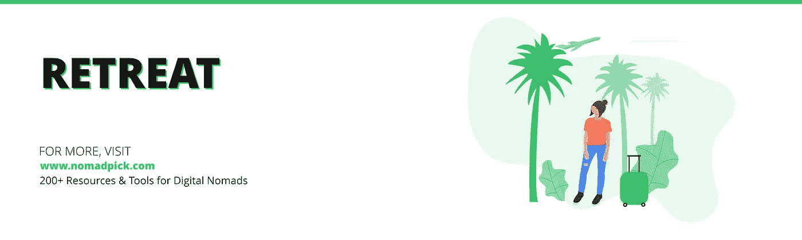

# 面向旅行者和数字游民的 245 种工具和资源

> 原文：<https://medium.com/hackernoon/245-tools-resources-for-travelers-and-digital-nomads-42ae826a63ab>

这里是为数字游民、旅行者、背包客或任何经常移动的人提供的最大的资源和工具列表。帮助您找到便宜的航班、住宿、工作的共同空间、计划您的旅行、获得灵感和 [**等等的资源。**](https://www.nomadpick.com)

## [AIRBNB](http://airbnb.com/)

租赁或出租短期住宿，包括度假别墅、公寓、寄宿家庭、旅舍床位或酒店房间。

## [NESTPICK](https://www.nestpick.com/)

中长期家具公寓搜索引擎。

## [游牧租赁](https://nomadrental.com/)

为远程工作者、数字游民和喜欢冒险的旅行者策划服务式公寓酒店。游牧租赁只列出了每周和每月的长住公寓酒店。

## [STARTUPBNB](https://startupbnb.com/coliving-spaces)

在世界各地寻找和租赁共同生活和共同工作的空间。

## [BOOKING.COM](https://www.booking.com/)

浏览全球 120000 个目的地的酒店点评，寻找优惠。

## [莫蒙多](https://www.momondo.com/hotels)

从所有主要的酒店网站找到最划算的交易。

## [HOMEAWAY](https://homeaway.com/)

预订您的下一个寄宿家庭或度假别墅，在 190 个国家拥有超过 2，000，000 套度假租赁服务。

## [漫游](https://www.roam.co/)

从每周 500 美元开始，你可以进入世界各地令人难以置信的共同生活空间和当地社区。

## [FLIPKEY](https://www.flipkey.com/)

为您的旅行寻找一个完美的住处，享受家的空间、隐私和便利设施带来的巨大价值。

## 酒店旅馆

Hotellook 收集 50 家最大的酒店预订机构和酒店官方网站的价格。搜索和比较最优惠的价格。

## [繁琐](https://www.trivago.com/)

从许多网站上搜索酒店并比较价格。

## [GLAMPING HUB](https://glampinghub.com/)

探索并预订世界各地的豪华露营目的地。

## [TRIPADVISOR 酒店](https://www.tripadvisor.in/Hotels)

无论您去哪里，都可以轻松找到最便宜的机票、最好的酒店、一流的餐厅和有趣的事情。

## [EXPEDIA](https://www.expedia.com/)

查找数千家酒店的评论，为您的下一次旅行预订完美的住宿。

## [户外](https://outsite.co/)

寻找开放的工作空间和充满活力的社区住宿。

## [沙发冲浪](https://www.couchsurfing.com/)

CouchSurfing 提供了一种安全的方式来寻找提供免费住宿的主人。像当地人一样旅行，住在别人家里。

## [受信任的保姆](https://www.trustedhousesitters.com/)

通过免费提供你的时间和照顾他人的房子和宠物，你可以在世界各地免费住宿。

## [世界包装商](https://www.worldpackers.com/)

用你的技能换取住宿。每天帮忙几个小时，免费获得住宿。

## [跳闸](https://www.trip.skyscanner.com/)

社区查看了世界各地成千上万的酒店，以便您找到最理想的住宿地点。

## [HOSTELWORLD](https://www.hostelworld.com/)

搜索 170 多个国家的 33，000 多家旅舍。

## [AGODA](https://www.agoda.com/)

帮助您找到并预订世界上任何地方的任何种类的住宿。

## [工作方式](https://www.workaway.info/)

Workaway 允许成员相互联系，组织寄宿家庭和文化交流。

## 蓝色背景

租用装修精美的公寓，用于中长期住宿。

## [HOTELS.COM](https://www.hotels.com/)

在互联网上找到一个最广泛的住宿选择。

## [皮划艇](https://www.kayak.com/hotels)

同时搜索数百个其他旅游网站，寻找世界各地的完美住宿。

## 猜猜看

使用 Guest to Home exchange 与 187 个国家的 400，000 多个家庭进行交换。

## [房屋交换](https://www.homeexchange.com/)

旅行的时候用你的家省几千。浏览 150 多个国家的 65000 多个房屋交换和房屋交换列表。

## [PRICELINE](https://www.priceline.com/)

帮助您找到与旅行相关的购买折扣，如机票和住宿。

## HOSTELS.COM

在世界各地的旅舍、B&B 和经济型酒店中寻找超值住宿。

## [维基旅行](https://wikitravel.org/)

开源旅游指南，提供景点、酒店、餐馆、旅游提示等最新信息。来自世界各地的免费可靠的建议。

## [极端游牧民族](https://extremenomads.life/)

面向活跃的数字游牧民的运动和户外目的地指南

## [在网格上](https://onthegrid.city/)

网格上是由世界各地城市的本地创意人员精心策划的社区指南集。

## [TRAVELFISH](https://www.travelfish.org/)

东南亚一些最佳旅游目的地的深度旅游指南，包括泰国、老挝、越南和新加坡。

## [维基百科](https://www.wikivoyage.org/)

Wikivoyage，任何人都可以编辑的免费全球旅游指南。

## [孤独星球](https://www.lonelyplanet.com/)

利用来自《孤独星球》的专家建议、旅行提示、目的地信息和灵感，规划您的完美旅行。

## [暗箱图集](https://www.atlasobscura.com/destinations)

世界上最奇妙地方的权威指南。旅游提示，文章，奇怪的事实和独特的事件。

## [IZI。行程](http://www.izi.travel/)

为近 2000 个城市提供 54 种语言的 9000 份免费语音指南。

## 参观一个城市

访问一个城市允许用户用免费的路线、指南、活动和地图来计划旅行。

## [全球和平指数](https://en.wikipedia.org/wiki/Global_Peace_Index)

全球和平指数衡量国家和地区和平的相对位置。

## [航班列表](https://www.flightlist.io/)

发现替代路线&出发日期范围内的廉价单程航班。

## [被跳过的](https://skiplagged.com/)

显示最便宜的定期航班和隐藏城市航班。

## 弗莱斯坦

你的私人廉价航班专家。

## [SKYSCANNER](https://www.skyscanner.com/)

Skyscanner 搜索数百家航空公司和旅行社的数百万条航线，以找到最便宜的机票。

## [奇异果](https://www.kiwi.com/)

使用易于使用的搜索引擎和交互式地图搜索航班。

## 八十天。我

在几秒钟内生成并优化多城市行程的系统。

## [谷歌航班](https://www.google.com/flights)

Google Flights 帮助您比较和跟踪数百家航空公司的机票，帮助您找到最优惠的机票价格。

## [罗马 2 里奥](https://www.rome2rio.com/)

了解如何乘坐飞机、火车、公共汽车、渡轮和汽车到达任何地方。

## [点击列表](http://www.hitlistapp.com/)

只需更新您感兴趣的内容 hitlist 应用程序会为您带来最好的机票选项。

## [HIPMUNK](https://www.hipmunk.com/)

Hipmunk 为您搜索数百个主要的旅游和航空网站，以及包机和美国国家铁路客运公司。

## [料斗](https://www.hopper.com/)

帮助您找到最佳飞行时间，并获得优惠机票。

## [空气漂移](https://airwander.com/)

中途停留航班搜索-通过组合机票查找任何航班上的廉价多日奖励目的地。

## 皮划艇

Kayak 搜索数百个旅游网站，帮助您找到便宜的机票并预订最适合您的航班。

## [周末航班](https://weekendflights.co/)

只需点击一下，即可找到周末的廉价航班。比较全年周末和长周末价格。

## [莫蒙多](https://www.momondo.com/)

查找和比较廉价航班。

## [最佳继续票](https://bestonwardticket.com/)

花 8 美元买一张 48 小时内有效的临时机票，用它作为进入一个国家或获得签证的继续航班。

## [机票监管机构](https://www.airfarewatchdog.com/)

在票价专家的帮助下，为您的旅行找到最优惠的价格。

## JETRADAR

Jetradar 搜索旅游和航空网站，帮助您找到最便宜的航班。

## [向前飞](https://onwardfly.com/)

获得印有你名字的国际机票，作为你出国旅行时继续旅行计划的临时证明。

## [斯科特的廉价航班](https://scottscheapflights.com/)

斯科特的廉价航班是为那些希望在超级廉价的国际机票出现时得到提醒的人准备的。

## [空中救援](https://www.airhelp.com/)

为您的航班延误或取消索赔。

## [PRICELINE](https://www.priceline.com/)

帮助您找到与旅行相关的购买折扣，如机票和住宿。

## [AIRBNB 餐厅](https://www.airbnb.com/s/restaurants)

帮助用户在旅行期间预订餐厅。

## [博纳佩图尔](https://www.bonappetour.com/)

让你发现惊人的美食体验。从美食之旅、烹饪课、酒吧爬行、晚宴等等。

## [四方形](https://foursquare.com/)

发现你附近最好的食物、夜生活和娱乐

## [谷歌地图](https://www.google.com/maps/search/restaurants+near+me/)

在谷歌地图的帮助下找到你附近的地方。

## [YELP](https://www.yelp.com/)

用户对最佳餐厅、购物、夜生活、美食、娱乐、活动、服务等的评论和推荐

## [行程](https://www.trip.skyscanner.com/)

社区查看了世界各地成千上万的酒店，以便您找到最理想的住宿地点。

## [OPENTABLE](https://www.opentable.com/start/home)

在线预订，阅读食客对餐厅的评论，赢取免费餐饮积分。

## [TRIPADVISOR 餐厅](https://www.tripadvisor.in/Restaurants)

无论您去哪里，都可以轻松找到最便宜的机票、最好的酒店、一流的餐厅和有趣的事情。

## [维萨 HQ](https://www.visahq.com/)

全世界人民的签证和护照申请流程。

## [WHERECANI。直播](https://www.wherecani.live/)

一个方便的网站，包含工具和信息，帮助你计划你下一步可以住在哪里，你有资格获得什么样的签证，以及帮助你采取下一步行动的资源。

## [护照索引](https://www.passportindex.org/)

护照索引对世界护照进行管理、分类和排名。

## [按国籍划分的签证要求](https://en.wikipedia.org/wiki/Category:Visa_requirements_by_nationality)

按国籍划分的签证要求

## [签证中心](https://visacentral.com/)

护照申请的逐步指导，获得签证的帮助。

## [TRAVISA](https://www.travisa.com/)

护照和签证快递提供护照申请，更新和更换的快速处理。

## [各国签证政策](https://en.wikipedia.org/wiki/Category:Visa_policy_by_country)

各国签证政策维基百科页面

## [游牧者](https://nomadlist.com/)

根据生活成本、网速、天气和其他指标，这是数字游民远程生活和工作的最佳城市。

## [谷歌旅行](https://get.google.com/trips)

让您比以往任何时候都更容易计划和组织您的旅行。它会自动绘制出半天或一整天的地图，并对要看的东西和要做的事情提出建议。

## [维基旅行](https://wikitravel.org/)

开源旅游指南，提供景点、酒店、餐馆、旅游提示等最新信息。来自世界各地的免费可靠的建议。

## [风向标](https://hoodmaps.com/)

一个众包地图，将城市分为潮人区、游客区、富人区、普通区、西装区和单身区。

## [Rome 2 Rio——旅游指南](https://www.rome2rio.com/travel-guides)

Rome2rio 的旅行指南解释了如何更快、更便宜、更明智地旅行。

## [网格上的](https://onthegrid.city/)

网格上是由世界各地城市的本地创意人员精心策划的社区指南集。

## [罗夫。我](https://rove.me/)

为你的下一次旅行寻找灵感？寻找适合任何季节的旅行创意。

## [TRAVELMATH](https://www.travelmath.com/)

帮助你快速找到答案的在线旅行计算器。你可以测量旅行距离、旅行时间和旅行成本。

## [TRAVELFISH](https://www.travelfish.org/)

东南亚一些最佳旅游目的地的深度旅游指南，包括泰国、老挝、越南和新加坡。

## [维基百科](https://www.wikivoyage.org/)

Wikivoyage，任何人都可以编辑的免费全球旅游指南。

## [新加坡旅游](https://travel.sygic.com/)

Sygic Trip Planner 是一款基于免费地图的旅行路线设计工具，深受数百万旅行者的信赖。

## [孤独星球](https://www.lonelyplanet.com/)

利用来自《孤独星球》的专家建议、旅行提示、目的地信息和灵感，规划您的完美旅行。

## [TRIPADVISOR —要做的事情](https://www.tripadvisor.in/Attractions)

在你附近找事情做。探索附近的顶级景点、旅游和活动，阅读猫途鹰游客的评论。

## [数字](https://www.numbeo.com/)

关于世界范围内城市和国家的用户贡献数据的数据库。它提供当前和及时的世界生活状况信息，包括生活费用，住房指标，健康…

## [越野车](https://roadtrippers.com/)

一个公路旅行规划，帮助您发现非凡的地方，预订酒店，并分享所有从地图上的行程。

## [外国人](https://www.expatistan.com/cost-of-living)

全球数千个城市的生活成本比较。获取最新的全部生活成本比较！

## [TRIPIT](https://www.tripit.com/)

在一个地方组织您的旅行计划。寻找替代航班。发送实时警报。抢到最好的座位。

## [世界旅游指南— TRIPOSO](https://www.triposo.com/travelguide)

通过由当地人或热情的旅行者创建的迷你指南，发现全球 50，000 多个目的地的亮点和隐藏的瑰宝。

## 六十一号座位上的男人

英国、欧洲、全球火车旅行信息

## [INSPIROCK](https://www.inspirock.com/)

免费创建完全定制的每日行程。

## [参观](https://www.showaround.com/)

与当地人一起旅游的市场，他们准备向你展示他们的城市所能提供的最好的东西，并根据你的兴趣定制活动。

## [基本行程](https://www.thebasetrip.com/)

查找、探索和比较世界上任何目的地的旅游信息。

## [参观城市](https://www.visitacity.com/)

访问一个城市允许用户用免费的路线、指南、活动和地图来计划旅行。

## [全球和平指数](https://en.wikipedia.org/wiki/Global_Peace_Index)

全球和平指数衡量国家和地区和平的相对位置。

## [EQUALDEX](http://www.equaldex.com/)

一个协作性的 LGBT 权利网站众包了全世界所有与 LGBT 相关的法律。

## [米努比](https://www.minube.net/)

为你的下一个假期获取灵感，计划你的旅行，选择你不能错过的地方，然后与其他旅行者分享你的经历。

## [羊角面包](https://www.getcroissant.com/)

帮助您找到附近最好的工作地点。

## [WEWORK](https://www.wework.com/)

公司和个人的全球合作空间网络。

## [同事](https://www.coworker.com/)

在 120 多个国家的 7000 多个共同工作空间中设有办公桌、办公室和会议室，拥有友好的社区。

## [在任何地方努力工作](https://itunes.apple.com/app/id930384923)

一个帮助你发现最适合笔记本电脑的咖啡馆和工作场所的应用程序。

## [来自](https://workfrom.co/)的工作

众包推荐的工作场所，比如咖啡店、咖啡馆、酒吧、共同工作空间、餐馆等等。

## [STARTUPBNB](https://startupbnb.com/coworking-spaces)

在世界各地寻找和租赁共同工作空间，无需转换会员身份。

## [共享桌面](https://www.sharedesk.net/)

找到您的下一个工作空间，从数千个独特的工作和会议空间预订。

## [科帕斯](https://copass.org/)

基于订阅的服务，让您只需一次通过即可访问 750 多个独特的工作区。

## 雷格斯

灵活的工作空间解决方案遍布 120 多个国家的 3000 多个地点。

## [桌面通行证](https://www.deskpass.com/)

芝加哥、纽约、洛杉矶、奥斯汀、旧金山和丹佛的每月合作订阅。

## [全球合作](https://www.coworkworldwide.com/)

在全球各地的城市策划合作空间。

## [记账员](https://www.deskbookers.com/en-gb/home)

找到最适合您的工作空间，并立即预订。

## [革命](https://www.revolut.com/)

一个基于手机的活期账户，允许您免费持有、兑换和转账 25 种不同的货币。

## [N26](https://next.n26.com/)

你手机的银行账户。

## [传送方式](https://transferwise.com/)

通过 transferwise 以低成本向国外汇款，轻松快捷。

## [TRIPCOIN](https://tripcoinapp.com/)

旅行者预算跟踪系统

## [蒙佐银行](https://monzo.com/)

总部位于英国的数字化移动银行。

## [蝠鲼](https://manta.life/)

灵活的发票桌面应用程序，具有漂亮和可定制的模板。

## [NEOMY](https://neomy.io/)

帮助您毫不费力地跟踪汇率。并告诉你什么时候是向国外汇款的最佳时机。

## [税率国家列表](https://en.wikipedia.org/wiki/List_of_countries_by_tax_rates)

按税率排列的国家列表。该清单侧重于主要的指示性税种:公司税、个人所得税和销售税，包括增值税和商品及服务税。

## [BLINKSALE](http://www.blinksale.com/)

在线开具发票的简单方法。

## [发票。至](https://invoice.to/)

Stripe 支持的网络和移动发票模板。

## 钱眼开

帮助您找到最佳汇率。

## [远程确认](https://remoteok.io/)

面向数字游民的 30000 多个远程工作的大集合。

## [REMOTE.COM](https://remote.com/)

使用人工智能帮助专业人员联系远程和自由职业者。

## [自由职业者](https://www.freelancer.com/)

全球在线自由职业和众包市场。

## [我们远程工作](https://weworkremotely.com/)

我们远程工作帮助您浏览大量远程工作机会，找到您的下一份工作。

## [跳过驾驶](https://www.skipthedrive.com/)

帮助您找到远程和在家工作的工作。

## [上行](https://www.upwork.com/)

为企业和独立专业人士提供远程联系和协作的自由职业平台。

## [遥控器](http://www.remoteur.com/)

欧洲的远程工作每两周发送到您的收件箱。

## [劳动游牧民族](https://www.workingnomads.co/jobs)

数字工作游民的远程工作。

## [工作假期](https://jobbatical.com/)

Jobbatical 将商业、[技术和创造性的专业人员与在世界各地招聘人才的公司相匹配。](https://hackernoon.com/tagged/technology)

## [JUSTREMOTE](https://justremote.co/)

来自世界各地的完全和部分远程工作。高效的过滤器，快速找到与你相关的角色。

## [顶部总计](https://www.toptal.com/)

在线人才市场，将初创企业、企业和组织与设计师和开发人员的全球网络联系起来。

## [移除](https://remotive.io/find-a-remote-job)

在世界任何地方找一份远程工作。

## [远程工作收集— ANGELLIST](https://angel.co/job-collections/remote)

AngelList 上的远程工作收集中有超过 5500 份工作。

## [工作压力](https://jobspresso.co/remote-work)

寻找技术、营销、客户服务等领域的远程工作。

## [工作](https://workew.com/)

数字游牧者的远程工作。在任何地方远程工作，环游世界。

## [阿达 APP](https://ada.com/)

Ada 可以评估病人的症状，跟踪个人的健康进展，并与医生共享数据。

## [自由竞赛](https://www.freeletics.com/en)

根据您的健康水平制定个人锻炼计划。高强度训练:随时随地。

## [耐克训练俱乐部](https://www.nike.com/us/en_us/c/nike-plus/training-app)

通过从力量和耐力到机动性和瑜伽的 160 多种免费锻炼来强身健体。

## [GYNOPEDIA](https://gynopedia.org/)

全球性健康、生殖健康和女性健康的开放资源维基。

## [浮标健康](https://www.buoyhealth.com/)

一个数字健康工具，帮助你在生病的那一刻了解你的症状。

## [日常瑜伽](https://www.dailyyoga.com/)

提供 500+体式，50+瑜伽课程计划，200+指导瑜伽，普拉提，冥想课程。

## [气场健康](https://www.aurahealth.io/)

通过 3 分钟的引导冥想来缓解压力和焦虑。

## [冷静 APP](https://www.calm.com/)

专注和冥想的应用程序，为你的日常生活带来更多清晰、快乐和宁静。

## [顶空](https://www.headspace.com/)

每天只需几分钟，通过引导冥想和正念技巧，帮助你放松，给你的生活带来平静、健康和平衡。

## [大脑。调频](https://www.brain.fm/)

专为大脑设计的音乐，可以增强注意力、放松、冥想、小睡和睡眠。

## [PACIFICA](https://www.thinkpacifica.com/)

压力、焦虑和抑郁的日常工具以及支持性社区。基于认知行为疗法&正念禅修。

## [圆健](https://roundhealth.co/)

一个帮助你记住和记录你的药物和维生素的应用程序。

## [健康中心](https://www.center.health/)

一款针对糖尿病的应用程序，结合了简单的日志记录、协作和您自己的私人助理。

## [陀螺仪](https://gyrosco.pe/)

这款应用程序可以与您的 iPhone、应用程序、可穿戴设备和其他设备同步，在一个漂亮的健康跟踪仪表盘中显示您的所有数据。

## [明菲](http://www.mindfi.co/)

一款适合你日常生活的冥想应用。

## [支架应用](https://getstandapp.com/)

在您的 Mac 上，每小时都会向您发送通知，提醒您起身。

## 更好的帮助

方便，实惠，私人在线咨询。随时随地。

## [TALKSPACE](https://www.talkspace.com/)

有了 Talkspace 在线治疗，任何人都可以在不去办公室的情况下接受治疗。

## [安全翼](https://www.safetywing.com/)

全球游牧者的旅行医疗保险。

## [世界游牧民族](https://www.worldnomads.com/)

独立旅行者的旅行保险。在线购买、延期和索赔。

## [真正的旅行者](https://www.truetraveller.com/)

度假者、探险旅行者和背包客的旅行保险。

## [克莱门茨全球关怀](https://www.clements.com/intl-health/individuals/globalcare)

为执行国际任务或计划在国外居住六个月或更长时间的个人提供健康保险。

## [INTEGRAGLOBAL](https://integraglobal.com/)

为外籍人士、海事专业人员和其他有独特保险需求的人量身定制健康保险计划。

## [安联全球医疗保险](https://www.allianzworldwidecare.com/en/)

个人、专业人士、学生和家庭的国际健康保险计划。

## [CIGNA 环球](https://www.cignaglobal.com/)

旨在满足您需求的国际健康保险。

## [IMGLOBAL](https://www.imglobal.com/)

旅行者和外国人的保险计划。

## [ROOST 笔记本电脑支架](https://www.therooststand.com/)

超便携、轻便的笔记本电脑支架，可将您的笔记本电脑转变为符合人体工程学的台式机工作站。

## [KINDLE VOYAGE 电子阅读器](https://www.amazon.com/dp/B00IOY8XWQ)

亚马逊的顶级电子阅读器。6 英寸高分辨率显示屏(300 ppi ),带有自适应内置光线和页面压力传感器。

## [minal 随身 2.0](https://www.minaal.com/products/minaal-carry-on-bag)

这是一款旅行随身背包，配有 4 点式负载平衡系统和可调节胸带，可帮助您进行整理。

## [OMNI 20 家电力银行](https://www.omnicharge.co/products/omni-20)

一款充电器，可以智能地同时为大多数设备充电或供电。

## [安科动力芯 26800](https://www.anker.com/products/variant/PowerCore-26800mAh/A1277011)

26800mAh 外置电池，双输入口，双速充电，3 个 USB 口，适用于 iPhone，iPad，三星 Galaxy，Android 等智能设备。

## [鱼鹰远点 40](https://www.ospreyeurope.com/shop/eu_en/farpoint-40-14)

轻便的旅行背包，符合欧盟随身携带的尺寸。采用拉链式间隔网眼通风背板，可像背包一样携带，也可像手提箱一样打包。

## [K2 笔记本电脑支架](http://www.nexstand.com/)

便携式、可折叠和高度可调的笔记本电脑支架。

## [皇家骑警](https://tenonedesign.com/mountie.php)

Mountie 通过让您将平板电脑或手机夹在笔记本电脑旁边，为您提供多显示器设置。

## [SONDRE 旅行旅行枕](https://www.sondretravel.com/product/voyage-pillow/)

独特的 2 合 1 设计结合了旅行枕头和眼罩，具有雕刻微珠枕头和标志性的聚/氨纶带，让您可以定制自己的睡眠方式。

## [DSPTCH 日装包](https://www.dsptch.com/collections/packs/products/daypack)

该背包具有指定的笔记本电脑和平板电脑隔间，内部水瓶口袋和内置电线管理系统。外部采用防水的 1680D 防弹尼龙。

## [苹果世界旅行适配器套件](https://www.apple.com/shop/product/MD837AM/A/apple-world-travel-adapter-kit)

世界旅行适配器套件直接支持北美、日本、中国、英国、欧洲大陆、韩国、澳大利亚、香港和巴西的经销店。

## [NOMADER 可折叠水瓶](http://www.nomader.com/)

Nomader 可折叠便携式水瓶便于旅行时保持水分。

## [AER 旅行包](https://www.aersf.com/travel-pack-00014)

多功能随身背包，专为聪明的旅行者设计。专为您的旅行必需品和技术准备的隔层让您井井有条，为任何旅程做好准备。

## [未结算](https://beunsettled.co/)

合作务虚会旨在将你的工作，生活和冒险超越传统的边界。即将到来的旅行:波尔图，巴厘岛，秘鲁

## [游牧列车](http://nomadtrain.co/)

在西伯利亚大铁路上和志同道合的数字游牧民一起。

## [WIFI 部落](https://wifitribe.co/)

12-20 人一组，在网上工作的同时，一起环游世界。每四周，你去一个不同的国家。

## [游牧城市](https://www.nomadcity.org/)

大加那利岛的远程工作者社区，他们一起享受本地活动，并就远程工作进行讨论。

## [流浪者之家](https://nomadhouse.io/retreats)

30 天主题静修，地点美丽，计划灵活。

## [数字游牧女孩静修](https://digitalnomadgirls.com/retreats/)

与世界各地志同道合的女性一起策划、联络和合作，并成为一生的朋友。

## [难民](https://refuga.com/)

结识来自世界各地的志趣相投、积极主动的优秀人士，分享不可思议的经历。即将到来的旅行:朝鲜，巴拿马岛生存。

## [贤妻良母](https://www.wiflynomads.com/)

汇集了志同道合，有抱负的企业家，并向他们展示如何创建一个结合工作和旅行的生活方式。即将到来的旅行:巴厘岛

## [黑客天堂](https://www.hackerparadise.org/)

创造性类型的旅游社区。

## [带电作业配合](https://www.liveworkfit.com/)

与专注于业务和健康的高层企业家一起旅行。

## [DNX 阵营](https://www.dnxcamp.com/)

数字游牧者、远程工作者和在线企业家的共居和共同工作场所。

## [FLEXPAT](https://flexpat.com/)

游牧民族、自由职业者和企业家的共同生活和共同工作的静修。包括社区驱动的研讨会和演示、志愿服务机会等。

## [协同工作](https://coworkations.co/)

浏览世界各地经营远程工作旅行的社区。

## [遥年](https://remoteyear.com/)

远程年将一群鼓舞人心的专业人士聚集在一起，在世界各地的不同城市进行为期一年或四个月的远程旅行、生活和工作。

## [游牧巡航](https://www.nomadcruise.com/)

与 200 多名企业家和数字游民一起巡游。

## [远程探险者](http://remoteexplorers.com/)

体验印度的企业家和数字游民社区。

## 潘吉亚 196

远程工作旅行计划，将工作地点不受限制的人带到世界各地的不同国家。即将到来的旅行:匈牙利布达佩斯，希腊雅典，保加利亚索非亚

## [合作](https://coworkation.com/)

鼓舞人心的合作静修，设置在世界各地的惊人地点。即将到来的旅行:塞拉利昂，泰国，托斯卡纳，瑞士。

## [谷歌翻译](https://translate.google.com/intl/en/about)

在英语和 100 多种其他语言之间翻译单词、短语和网页。

## [旗号时间](https://www.flagtimes.com/)

适用于在多个时区工作的任何人的 macOS 时区应用程序。

## [INSTABRIDGE](https://instabridge.com/en/)

WiFi 共享社区，您的手机上有超过一百万个最新的 WiFi 密码和位置。

## [预付费数据 SIM 卡 WIKI](http://prepaid-data-sim-card.wikia.com/wiki/Prepaid_SIM_with_data)

世界各地有关预付费手机计划的信息。

## [逆向](https://www.itranslate.com/converse)

把你的 iPhone 变成翻译设备。

## [微软翻译器](https://translator.microsoft.com/apps/)

翻译跨设备的对话，用于一对一聊天和大型群体互动。

## [时区。IO](https://timezone.io/)

Timezone.io 是一种为全球、远程、游牧团队成员显示当地时间的简单方式。

## [不付款](https://www.donotpay.com/travel/)

自动飞行和酒店价格保护。价格下跌时获得报酬。

## [WIFIMAP](https://www.wifimap.io/)

世界各地的咖啡馆、餐厅和其他公共场所的 Wi-Fi 的密码。

## 翻译

使旅行者能够用 100 多种语言阅读、写作和说话。

## [环 4](http://www.ring4.com/)

让您在 20 个国家无限制地生成智能手机号码、短信和通话。

## [游牧者论坛](https://nomadlist.com/forum/)

这是一个为数字游牧民和远程工作者提供的论坛，他们可以在世界各地交流远程工作的信息。

## [DIGITALNOMAD — REDDIT](https://www.reddit.com/r/digitalnomad)

Reddit 上的社区，面向已经过着数字游牧生活的人，或者计划在未来做一些类似的事情。

## [旅游简介](https://wanderbrief.com/community)

一个由来自 90 多个国家的自由职业者、远程专业人员、企业家和数字游牧民组成的充满活力的社区。

## [女性数字游牧民](https://www.facebook.com/groups/1607248466232418/)

facebook 上的女性数字游牧社区。

## [游牧聊天](https://nomadlist.com/chat/all_channels)

一个移动、桌面和网络聊天应用程序，让您与 269 个城市的其他数字游牧者交谈。

## [基于城市的数字游牧社区](https://drive.google.com/open?id=1n3LniDl0VMvvFUZPCR68rmLdwE4wXeRC&usp=sharing)

基于城市的 facebook 群组列表，您可以加入这些群组以了解更多关于该城市的信息，或者与该城市的其他数字游民联系。

## [位置独立](https://locationindie.com/)

一个由热爱旅行、建立在线业务和与“懂”的人联系的人组成的社区

## [全球数字游牧民](https://www.facebook.com/groups/DigitalNomadsAroundTheWorld)

这是一个数字游牧者分享与数字游牧生活方式相关的建议和提示的地方。

## [数字游牧企业家](https://www.facebook.com/groups/digitalnomadentrepreneurs)

享受商业自由和生活冒险的数字游民社区。

## [数字游牧民枢纽](https://www.facebook.com/groups/756306204446638)

如果你边工作边旅行，边工作边旅行，这就是你的地方。在旅行中交流技巧并结识其他数字游民。

## [数字游牧民— QUORA](https://www.quora.com/topic/Digital-Nomads/)

Quora 数字游牧社区。

## [全球数字游牧网络](https://www.facebook.com/groups/1428340887415620/)

讨论所有数字游牧的事情。无论是最佳地点的推荐、最新的营销技巧、潜在的业务合作，还是只是让您分享个人故事…

## [数字游牧民聚会](https://www.meetup.com/topics/digital-nomads/)

了解世界各地的数字游牧者聚会群发生了什么，并开始与您附近的人会面。

## [数字游牧女孩](https://digitalnomadgirls.com/join-free-fb-group/)

15，000 多名数字游牧女孩，她们希望创造和发展独立于位置的职业生涯，并在世界各地结交朋友。

## [国际](https://www.internations.org/)

面向全球 420 个城市外籍人士的领先网络和指南。在顶级活动中与外籍同事联系，并获得有关外籍生活的提示和建议。

## [外景独立家庭](https://www.facebook.com/groups/LocationIndependentFamilies)

这个地方可以找到其他志同道合的家庭，他们不做朝九晚五的工作，而是购买 30 年的抵押贷款。

## [游牧网络](https://nomad.network/)

无论你走到哪里，这个网络都可以让你与其他数字游牧民和当地居民交谈、询问和见面。

## [数字游牧民论坛](https://digitalnomadsforum.com/)

这是一个面向数字游民的社区，在这里你可以提问、分享经验、知识和你的冒险。

## [如何用每天 50 美元环游世界](https://www.amazon.com/gp/product/0399173285/)

如果你曾经梦想环游世界，飞到欧洲，在塞舌尔度蜜月，或者只是带你的家人去迪斯尼乐园或伦敦旅行，如何用每天 50 美元环游世界将会实现。

## [流浪](https://www.amazon.in/Vagabonding-Uncommon-Guide-Long-Term-Travel-ebook/dp/B000FBFMKM/)

流浪是指从你的正常生活中抽出时间——从六周到四个月到两年——用你自己的方式去发现和体验这个世界。

## [每周 4 小时工作制](https://www.amazon.com/4-Hour-Workweek-Escape-Live-Anywhere/dp/0307465357/)

《纽约时报》畅销书《4 小时身体》的作者向读者展示了如何更多地生活，更少地工作，现在有超过 100 页的新的前沿内容。

## [远程:不需要办公室](https://www.amazon.com/Remote-Office-Required-Jason-Fried/dp/0804137501)

Basecamp 创始人 Jason Fried 和 David Heinemeier Hansson 探索了“在家工作”现象，并展示了远程工作设置如何在远程完成。

## [一个女流浪者的故事](https://www.amazon.com/gp/product/0609809547/)

48 岁时，在离婚的边缘，丽塔离开了洛杉矶的优雅生活，去追寻她周游世界的梦想，与世界各地不同文化背景的人交往。

## [作业结束](https://www.amazon.com/gp/product/1619613352/)

技术和全球化的快速发展改变了积累财富的杠杆点:金钱、意义和自由。

## [如何全职旅行](https://www.amazon.com/gp/product/B006479AUY/)

《如何全职旅行》是由全职旅行者和作家科林·莱特收集的实用技巧和故事。

## [边工作边旅行](https://www.amazon.com/Travel-While-You-Work-Ultimate/dp/1516832841/)

无论你是自由职业者还是自己公司的老板，边工作边旅行也是你如何实现这种转变的指南。

## [迷路的好女孩指南](https://www.amazon.com/gp/product/038534337X/)

雷切尔·弗里德曼的旅程带她去了澳大利亚和南美洲，雷切尔发现并拥抱了她对旅行的热爱，并解开了她从未意识到她在寻找的更多关于自己的真相。

## [追求的幸福](https://www.amazon.com/gp/product/0385348843)

《追求的幸福》是一本引人注目的书，既能指导又能鼓舞人心，它揭示了任何人如何通过追求给自己的生活带来意义。

## [努诺马德](http://www.nunomad.com/)

数字游牧民、独立于位置的生活方式爱好者和旅游爱好者的中心。

## [穿着高跟鞋的嬉皮士](https://hippie-inheels.com/)

雷切尔·琼斯，美国人，她放弃了护理工作，来到印度果阿的海滩上生活。

## [流浪伯爵](http://www.wanderingearl.com/)

有用的旅行建议和真实的故事，来自德里克不断旅行的生活。

## [游牧马特](https://www.nomadicmatt.com/)

《纽约时报》畅销书《如何用每天 50 美元环游世界》的作者。

## [游牧资本家](http://nomadcapitalist.com/)

安德鲁·亨德森是游牧资本家的创始人，他每年都要游历 15 到 20 个国家，寻找新的避风港。

## [泰国的土地](https://www.tielandtothailand.com/blog/)

旅游博客和泰国侨民生活的可靠资源。

## 游牧民族

一名计算机安全工程师，他在访问世界上每一个国家的旅途中编写了 foXnoMad。

## [合法游民](https://www.legalnomads.com/)

前公司律师分享她在我多年的旅行中学到的经验。

## [DNG 博客](https://digitalnomadgirls.com/blog/)

数字游牧女孩，数字游牧妇女的平台。鼓舞和连接世界各地的独立女孩。

## [数字游牧者——黑客正午](https://hackernoon.com/tagged/digital-nomads)

在黑客正午阅读关于数字游牧者的故事。发现关于数字游民的聪明、独特的观点。

**旅行时你最喜欢的工具&资源是什么？下面评论。👇👇👇**