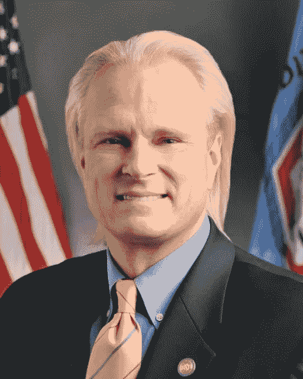
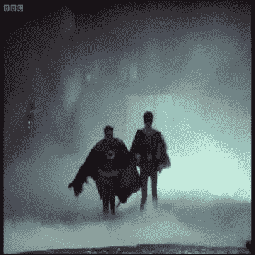

# 2018 年 1 月 25 日:神秘领域最大的故事

> 原文：<https://medium.com/hackernoon/25-01-2018-biggest-stories-in-the-cryptosphere-95b51288b10>

**1。前 CFTC 专员加入加密交易所 Omega One**

巴特·奇尔顿是美国商品期货交易委员会(CFTC)的前委员。他经常呼吁通过监管市场来促进加密货币交易的繁荣。[奇尔顿现在加入了欧米茄一号](https://www.coindesk.com/ex-cftc-commissioner-joins-crypto-exchange-as-regulatory-adviser/)，一个分散的加密货币交易所，在监管顾问的角色下。这位前专员最初被该公司吸引，因为他们都认为监管是这种交易增长的基础。此外，奇尔顿也有兴趣参与由区块链科技公司 ConsenSys 发起的跨行业监管风险投资 [Brooklyn Project](https://thebrooklynproject.consensys.net/) ，该公司也是 Omega One 的合作伙伴。考虑到奇尔顿在 CTFC 七年的重要性，这对于密码圈来说是个大新闻。

**2。昆士兰州将很快拥有第一个加密货币机场**

位于昆士兰州首府布里斯班的布里斯班机场(BNE)即将成为全球首个加密货币机场航站楼。据报道，旅行者将可以使用比特币、Dash 和 Ether 作为支付方式进行购物。战略规划和发展总经理 Roel Hellemons [说](https://cointelegraph.com/news/worlds-first-cryptocurrency-airport-in-brisbane)许多加密投资者经常旅行，向他们提供加密货币体验对他来说似乎是很自然的。该机场将得到当地和国际公司的帮助。TravelbyBit 将负责支付系统，允许人们使用他们的加密货币。

**3。Ripple 与两家国际支付提供商签订合同**

Ripple 已经与两家处理数百万笔交易的国际支付提供商签订了合同:IDT 公司和 MercuryFX。此举增加了该公司象征性的 XRP 的价值，其价值已经在一年内增长了 500%。根据协议，这两家供应商将使用 xRapid 平台向其客户提供流动性。尽管银行小心翼翼，但它的目标是成为[【银行的比特币】](https://www.bloomberg.com/news/articles/2018-01-25/ripple-wants-xrp-to-be-bitcoin-for-banks-if-only-the-banks-wanted-it)。他们的平台将通过第三方区块链平台帮助持有其他货币资金的公司。这将降低成本，节省时间，并允许资本更自由地流动。

**4。DNV GL 与区块链初创公司 VeChain 合作**

挪威质量保证和风险管理公司 [DNV GL](https://www.dnvgl.com/about/index.html) 已经[与区块链初创公司 ve chain](https://www.coindesk.com/audit-giant-dnv-gl-partners-with-vechain-to-launch-data-tracker-blockchain/)合作，旨在利用区块链技术改善其资产所有权跟踪系统，从而改善供应链。最初，该平台将使他们能够跟踪食品、时尚和零售。然后它会扩展到航空航天工业。DNV GL 首席执行官 Luca Crisciotti 表示，这种合作关系将使这家巨头更容易适应客户的需求。

要想在你的邮箱里收到我们的每日新闻综述，请在这里注册:[http://bit.ly/BlockExNewsRoundup](http://bit.ly/BlockExNewsRoundup)