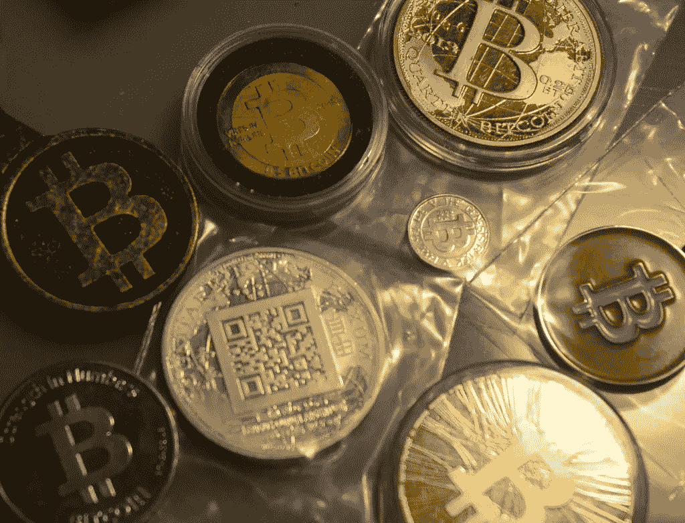

# 2018 年 4 月 25 日:神秘领域最大的故事

> 原文：<https://medium.com/hackernoon/25-04-2018-biggest-stories-in-the-cryptosphere-aeb2676b45fc>

## 通过 BlockEx

**1。巴西银行联盟 126 名成员正在调查区块链**

巴西联邦银行，[Febraban，目前正在调查区块链科技](https://www.ccn.com/febraban-an-organization-that-brings-together-120-banks-in-brazil-reveals-tests-in-blockchain/)。126 家银行的联盟已经在平台上进行了试验，比如银行业联盟 R3 的 Corda 平台。伊塔乌、布拉德斯科和 B3 参与了在 Corda 平台上进行的第一次概念验证，即指纹验证。所有成员都参与了第二个项目，DNA，它是在 IBM 的平台上用 Hyperledger Fabric 开发的。关于创新技术的活动也将于 6 月举行，CIAB Febraban。另外两个项目也在开发中，包括在巴西支付系统(SPB)下的储备转移系统(STR)中使用以太坊平台，以及为当地低收入地区提供金融服务。

**2。中国国家审计署正在研究区块链，以改善其数据存储系统**

中华人民共和国国家审计署正在考虑利用区块链使其数据存储系统运行更加顺畅。审计管理的大量数据造成了拥塞。因此，去中心化的分类账平台会更有效率。国家审计署是中国国务院的一部分。处理的数据涵盖了所有的政府金融交易，这就是为什么有这么多的数据。主要问题是审计需要存储所有数据。但是，这个想法目前还很抽象。

**3。在 Crypto 缴税？亚利桑那州众议院委员会通过法案**

我们之前[报道过](https://hackernoon.com/09-02-2018-biggest-stories-in-the-cryptosphere-87f43192308a)一项允许使用加密货币缴税的法案。[SB 1901](https://legiscan.com/AZ/text/SB1091/2018)法案上个月由众议院筹款委员会批准，现在已经被亚利桑那州众议院委员会通过。[法案现在需要三读也是最后一读](https://cointelegraph.com/news/bill-allowing-residents-to-pay-taxes-in-crypto-passes-arizona-house-committee)才能生效。该法案现在扩大了可以使用的加密货币的数量，包括莱特币。交易将在电子点对点系统上进行，资金将在收到后兑换成美元。

**4。汤姆·李支持比特币，而不是比特币现金**

Fundstrat Global Advisors 的联合创始人 Tom Lee[告诉美国消费者新闻与商业频道，目前他更愿意投资比特币 BTC](https://cointelegraph.com/news/id-put-new-money-into-bitcoin-not-bitcoin-cash-says-tom-lee) ，而不是比特币现金(BCH)。它澄清说，他对这两种加密货币相互竞争的想法不感兴趣。然而，如果他要做出决定，李开复会向比特币投入新的资本。他为自己的选择辩护说，BTC 接收更多移民的机会更大，尤其是与 BCH 相比。还讨论了即将到来的比特币现金硬分叉，Lee 认为这一事件是加密货币最近上涨的原因之一。

> 本新闻综合报道由 [BlockEx](http://bit.ly/BlockEx_) 为您带来。

> *要想在你的邮箱里收到我们的每日新闻综述，请在这里注册:*[*http://bit.ly/BlockExNewsRoundup-Updates*](http://bit.ly/BlockExNewsRoundup-Updates)