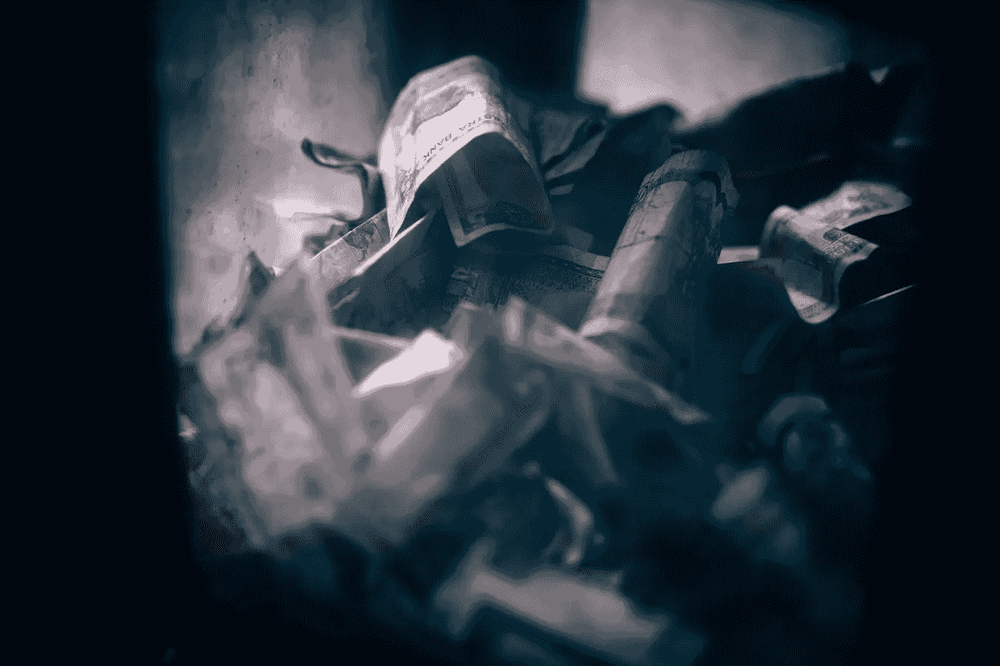

# 2018 年 5 月 25 日:神秘领域最大的故事

> 原文：<https://medium.com/hackernoon/25-05-2018-biggest-stories-in-the-cryptosphere-bd115808725a>

通过 BlockEx

**1。中国城市研究区块链打击逃税**

中国深圳市正与当地互联网巨头腾讯[合作，采用区块链技术解决逃税问题](https://www.coindesk.com/tencent-partners-with-city-authority-to-combat-tax-evasion-with-blockchain/)。深圳国家税务局和腾讯已经启动了“智能税务”创新实验室，以创新税收流程。这将通过结合学术研究和新兴技术来实现，区块链也不例外。目前，区块链的数字发票也正在开发中。这将是实验室创造的第一个产品。区块链的不可改变性意味着有问题的发票不可能被伪造。该项目正在腾讯的区块链平台上进行。

**2。南非称加密货币为“网络代币”**

南非储备银行[决定使用术语“网络令牌”](https://www.bloomberg.com/news/articles/2018-05-24/crypto-money-is-a-token-not-a-currency-s-africa-s-sarb-says)而不是加密货币，因为它不被中央银行视为法定货币。昨天，5 月 24 日，副总督 Francois Groepe 在比勒陀利亚与媒体讨论了此事。然而，正如我们之前[所报道的](/swlh/05-04-2018-biggest-stories-in-the-cryptosphere-2b40a3a2302)，该银行已经成立了一个金融科技部门，在政策和监管方面处理区块链和加密货币。因此，尽管对使用哪个术语存在分歧，加密货币在该国并未被禁止。世行实际上关注的是一个潜在的监管框架。

**3。曼谷银行加入 R3 的马可波罗贸易融资计划**

曼谷银行是泰国最大的银行，也是东南亚的主要银行，已经加入了马可波罗贸易融资计划。该项目由企业软件公司 R3 和贸易融资开放平台 TradeIX 创建。该计划旨在通过使用区块链技术来简化和改善贸易融资流程。荷兰国际集团、法国巴黎银行和德国商业银行等金融机构已经加入了这个项目。目前，三个主要关注领域是:风险缓解、应付款融资和应收款融资。

**4。ICO 市场的东方与西方分野**

就 ico 而言，东西方之间存在着明显的鸿沟。 [CoinDesk](https://www.coindesk.com/bet-vs-buy-ico-market-serious-east-west-divide/) 在纽约市区块链周期间调查了此事。在西方，主要关注的是项目背后的想法，而在东方，目标是确保(快速)回报。黑脸田鸡风险投资公司的管理合伙人 Jason Fang 认为亚洲人对赌博的热情是造成这种差异的原因之一。此外，亚洲市场的运行速度不同，买入和卖出的速度更快。另一方面，在欧洲和美国，金融知识更丰富，投资组合更多样化，这有助于解决波动性问题。

> 这是由 [BlockEx](http://bit.ly/BlockEx_) 为您带来的新闻综述。

> 【http://bit.ly/BlockExNewsAndUpdates】[*要想在你的邮箱里收到我们的每日新闻综述，请在这里注册*](http://bit.ly/BlockExNewsAndUpdates)