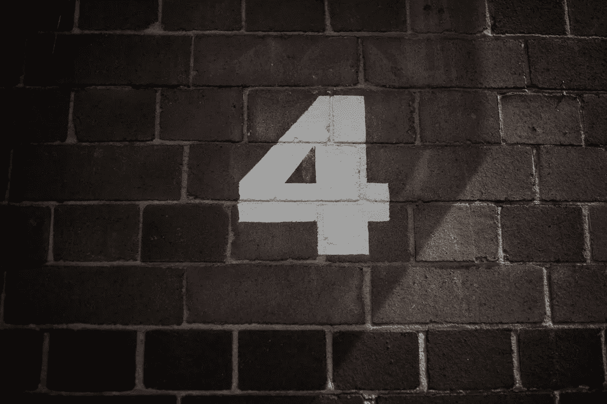
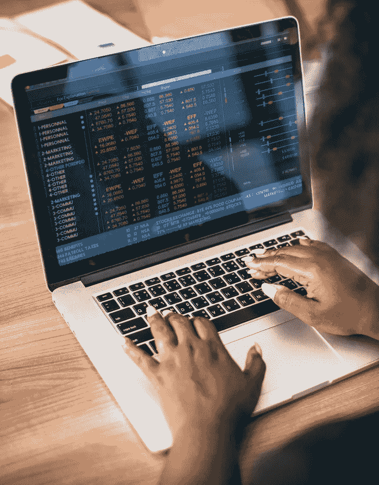

# 2018 年 7 月 25 日:神秘领域最大的故事

> 原文：<https://medium.com/hackernoon/25-07-2018-biggest-stories-in-the-cryptosphere-260cce4c85c8>

通过 BlockEx

**1。印度法律委员会将加密货币定义为电子货币**

尽管[报道](https://hackernoon.com/12-07-2018-biggest-stories-in-the-cryptosphere-dea952c9d880)印度可能不会禁止加密，毕竟，围绕此事仍有很大的不确定性。然而，印度法律委员会现在[发布了一份 7 月份的报告](https://www.ccn.com/indian-law-commission-recognizes-cryptocurrency-as-an-electronic-payment-report/)，题为“[法律框架:赌博和体育博彩，包括印度的板球](http://lawcommissionofindia.nic.in/reports/Report276.pdf)”。由于监管机构正在考虑“数百万美元的体育博彩行业”的合法化，该报告得以发表。如果是这样的话，就允许的支付方式而言，加密货币将与信用卡和借记卡归为一类。考虑到该国加密交易所面临的问题，印度法律委员会将比特币定义为电子货币是一大进步。然而，人们仍在等待监管方面的明确表态。

**2。加密货币礼品卡将限量推出**

比特币基地将限量发行加密货币礼品卡。用户可以通过兑换硬币获得品牌电子证书。该项目正在与英国的创业公司 WeGift 合作进行。服务中包含的品牌包括耐克、乐购、优步、Google Play、Ticketmaster 和 Zalando。从现在开始，来自欧盟和澳大利亚的公民将能够从新系统中受益。更具体地说，比特币基地将从英国、西班牙、法国、意大利、荷兰和澳大利亚开始。然而，在未来几个月，无论是在零售商合作方面，还是在所涉及的国家方面，都有扩张的计划。

**3。“四大”普华永道对 Tezos 进行审计**

“四大”[普华永道的瑞士分支将在被《加密账簿》雇佣后审计泰佐斯基金会](https://www.coindesk.com/tezos-hires-big-four-firm-pwc-to-conduct-external-audit/)。该声明是通过基金会发布的[新闻稿](http://tezosfoundation.ch/news/tezos-foundationnames-pwc-switzerland/)发布的。普华永道将进行外部审计，同时检查该实体的财务和运营情况。这是“大型”区块链公司被普华永道接纳为客户的首例。然而，对于后者来说，这并不是区块链的第一次经历。事实上，普华永道多年来一直积极与区块链合作，甚至为有意在其业务中整合分布式账本技术(DLT)的公司提供服务。Tezos 基金会认为，让一家领先的公司参与进来，将有助于客户认为这家公司是值得信赖和透明的。

**4。美国资产管理公司希望上市加密指数基金**

Bitwise 资产管理公司向美国证券交易委员会申请了一项专利。它希望创建一个“首款”在美国上市的 ETF，能够跟踪包括 10 种加密货币在内的指数，比特币就是其中之一。加密货币的总市值为 3000 亿美元，代表了货币支付和兑换的替代系统。此举将允许任何拥有经纪账户的人投资，尤其是散户和机构投资者。这个消息似乎给那些认为“比特币相关投资在美国上市”不会再发生的人带来了希望。

> 本新闻综合报道由 [BlockEx](http://bit.ly/BlockEx_) 为您带来。

> *要想在你的邮箱里收到我们的每日新闻综述，请在这里注册:*[*http://bit.ly/BlockExNewsAndUpdates*](http://bit.ly/BlockExNewsAndUpdates)