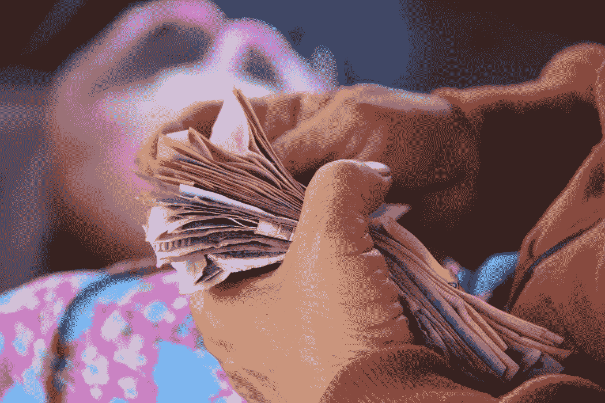

# 2018 年 7 月 26 日:神秘领域最大的故事

> 原文：<https://medium.com/hackernoon/26-07-2018-biggest-stories-in-the-cryptosphere-f33d11f75197>

通过 BlockEx

**1。韩国密码法规正在制定中**

我们[报道过](/@BlockEx/20-07-2018-biggest-stories-in-the-cryptosphere-219d98c05188)几天前，韩国金融服务委员会(FSC)成立了一个部门，负责制定区块链行业的政策。据[报道](https://www.newsbtc.com/2018/07/26/korean-authorities-to-legitimize-crypto-market-as-soon-as-possible-to-prevent-hacks/)，该国的首个加密和区块链立法计划将尽快通过。监管框架已经起草完毕，广泛涵盖了企业和项目。该机构希望通过监管来促进对这个蓬勃发展的行业的监管。此外，分析师认为，监管的清晰将有助于“聪明钱”进入市场。

**2。安提瓜巴布达公民身份可以用 12 BTC 购买**

购买安提瓜巴布达公民身份所需的最低金额是 10 万美元的投资，现在可以使用比特币进行投资。由于波动性，它们将每天兑换成美元。这是由于该国议会修订了安提瓜和巴布达的投资项目公民身份法案，以扩大加密货币(包括比特币)的支付方式。岛国总理兼财政部长、公私合营企业管理部部长 Gaston Browne 阁下宣布了这一消息。该国希望帮助那些只能用加密货币支付的人，但更重要的是，吸引新的客户群。

**3。委内瑞拉将发行与石油挂钩的新货币**

委内瑞拉总统尼古拉斯·马杜罗透露，委内瑞拉将发行新的国家货币，并将与石油支持的石油挂钩，这是一种加密货币，我们之前在[报道过其发行](https://hackernoon.com/20-02-2018-biggest-stories-in-the-cryptosphere-100cd402b7d8)。目前的货币玻利瓦尔福尔特(VEF)将被玻利瓦尔索贝拉诺取代。这一举措是应对日益增长的通货膨胀的策略，许多人认为今年通货膨胀率将达到 100%。“经济复苏”预计将于 8 月 20 日随着玻利瓦尔主权债券的发行和流通而开始。另据报道，该国将从玻利瓦尔中删除五个零，而不是先前计划的三个零。

**4。伊朗央行正致力于加密货币**

在当地公司的帮助下，伊朗中央银行正致力于开发一种国家加密货币。考虑到今年早些时候，央行禁止金融机构处理加密货币，这一消息可能会让一些人感到惊讶。然而，我们之前[报道过](/@BlockEx/22-02-2018-biggest-stories-in-the-cryptosphere-e4e7939bbf2f)伊朗在计划推出国有加密货币时不喜欢比特币。当时，信息和通信技术部长 Mohammad-Javad Azari Jahromi 表示，加密货币将与国有银行邮政银行合作发行。

> 本新闻综合报道由 [BlockEx](http://bit.ly/BlockEx_) 为您带来。

> *要想在你的邮箱里收到我们的每日新闻综述，请在这里注册:*[*http://bit.ly/BlockExNewsAndUpdates*](http://bit.ly/BlockExNewsAndUpdates)