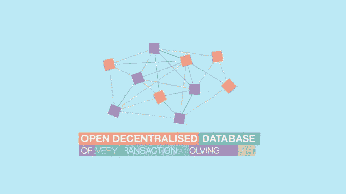

# 2018 年 2 月 27 日:神秘领域最大的故事

> 原文：<https://medium.com/hackernoon/27-02-2018-biggest-stories-in-the-cryptosphere-12f62ca154dd>

**1。投资巨头贝莱德认为加密货币在未来会越来越多地被采用**

贝莱德是世界上最大的投资公司，拥有 5.7 万亿美元的资产，在其最新的[每周评论](https://www.blackrock.com/investing/insights/weekly-commentary)中讨论了加密货币。该巨头认为，尽管加密货币尚未成为主流投资形式，但它将在未来被广泛采用。然而，[也指出](https://cointelegraph.com/news/57-trln-investment-company-blackrock-cryptocurrency-will-be-widely-used-in-future)加密货币在成为传统投资组合的一部分之前，其波动性有必要降低。贝莱德是积极看待加密货币的公司之一。该公司的全球宏观投资策略师 Isabelle Mateos Y Lago 表示，这种新型货币不只是炒作，而是具有潜力的东西。区块链也受到了好评。然而，也有人提出了在全球一级实施以区块链为基础的系统的困难。

**2。日本监管机构正在考虑针对 ico 的法规**

据日本报纸[产经新闻](http://www.sankei.com/politics/news/180227/plt1802270002-n1.html)报道，当地金融厅(FSA)正在[审查该国的法律，以便为 ico 制定监管框架。这一决定是由这种筹款方式的受欢迎程度大幅上升而促成的。目前，日本确实有专门针对 ico 的法律。因此，各种 ico 的状态不清楚。一套量身定制的法规将涵盖每一种类型。目前，该机构还在密切关注针对日本投资者的被认为不可信的 ico。](https://www.coindesk.com/japans-finance-watchdog-eyeing-ico-regulation-says-report/?utm_content=buffera7b83&utm_medium=social&utm_source=twitter.com&utm_campaign=buffer)

**3。台湾央行行长对区块链感兴趣**

新任台湾中央银行行长杨金龙最近在[的一次演讲中](https://www.cbc.gov.tw/ct.asp?xItem=63004&ctNode=302&mp=1)[宣布](https://cointelegraph.com/news/taiwanese-central-bank-sees-future-in-blockchain-for-payment-systems)将对区块链科技公司进行调查，目的是改善其支付系统。我们之前[报道过](https://hackernoon.com/09-02-2018-biggest-stories-in-the-cryptosphere-87f43192308a)关于台北想要成为‘智慧城市’的消息。因此，这一消息应该不足为奇。此外，基于人工智能和大数据分析的技术将使世行能够更好地预测和应对全球事件。这是[台湾中央银行第一次](https://ibsintelligence.com/ibs-journal/ibs-news/taiwan-central-bank-remains-open-minded-blockchain-big-data-technology/)如此公开地讨论这种类型的创新，以及它如何有益于当前的系统。

**4。以色列最高法院称银行有义务允许加密交易**

以色列最高法院[做出决定](https://www.financemagnates.com/cryptocurrency/news/israeli-supreme-court-backs-crypto-forces-banks-allow-trading/)强制银行允许加密交易，并向在加密领域运营的个人或公司拥有的银行账户提供同样的服务。这一判决意味着，该国第二大银行 Leumi Bank 将无法以任何方式限制当地加密兑换黄金的银行账户。前者此前曾通过阻止交易拒绝为后者提供服务，这一决定使其成为新闻焦点。Bits of Gold 的首席执行官 Yu val Roash[对这一消息表示欢迎](https://www.newsbtc.com/2018/02/27/israeli-supreme-court-leumi-bank-must-stop-obstructing-financial-operations-of-crypto-exchange-bits-of-gold/)，称他们是第一个要求在该国制定法规的人，这一决定将使他们能够使该行业蓬勃发展，并在该国建立一个更强大的社区。

> *要想在你的邮箱里收到我们的每日新闻综述，请在这里注册:*[*http://bit.ly/BlockExNewsRoundup*](http://bit.ly/BlockExNewsRoundup)