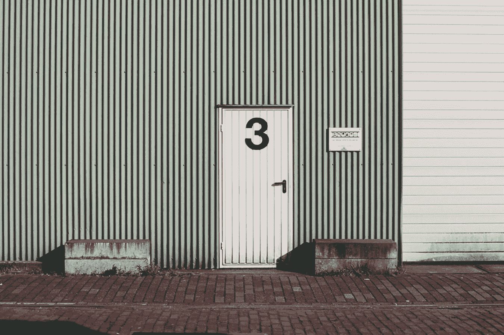
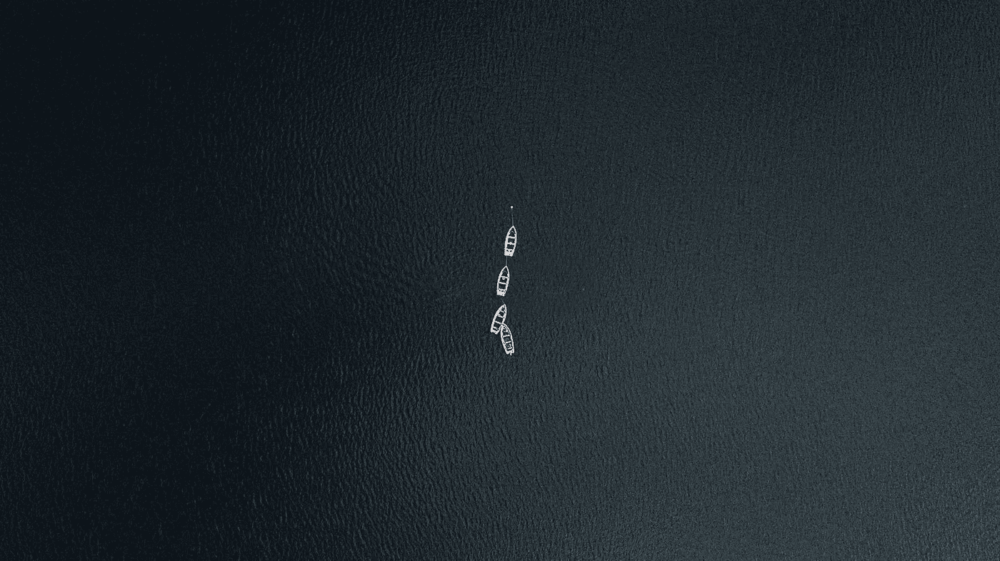

# 2018 年 8 月 28 日:神秘领域最大的故事

> 原文：<https://medium.com/hackernoon/28-08-2018-biggest-stories-in-the-cryptosphere-7e4d1796005c>

通过 BlockEx

**1。劳埃德保险公司为加密存储提供保险**

加密货币存储[王国信托已经从伦敦劳埃德保险社](https://uk.reuters.com/article/us-cryptocurrency-lloyds-of-london-insur/crytocurrency-storage-firm-kingdom-trust-obtains-insurance-through-lloyds-idUKKCN1LD1GF)获得保险保障。该公司现在将免受盗窃和破坏的风险。这家资产达 120 亿美元的托管公司是越来越多寻求保险服务的存储公司中的一员。尽管存在波动性和监管不力，但这仍是一项不断增长的业务。尽管去年积极寻找保险覆盖面，首席执行官马特·詹宁斯透露，王国信托自 2010 年成立以来一直在寻找。詹宁斯希望此举能吸引更多的机构投资者。另一方面，伦敦劳合社拒绝对该消息发表评论。这可能是因为保险公司不愿意承认他们正在覆盖加密货币业务。尽管如此，王国信托公司的冷藏系统确实帮了大忙。

**2。74%的德勤调查受访者相信区块链的商业用途**

“四大”审计和服务网络德勤[进行了一项区块链调查](https://www2.deloitte.com/us/en/pages/consulting/articles/innovation-blockchain-survey.html?id=us:2sm:3tw:4gblock18::6cons:20180827010700:&linkId=55968490)以调查在大公司工作的高管如何看待区块链。这项调查涉及七个国家(加拿大、中国、法国、德国、墨西哥、英国和美国)和九个行业，针对 1000 名了解区块链的高管。74%的受访者认为采用区块链有“令人信服的商业理由”。34%的人甚至表示他们的公司已经在使用这项技术；而 41%的人计划在未来 12 个月内这样做。最重要的是，近 40%的受访者表示，他们的企业将在区块链投资至少 500 万美元。JP 摩根首席信息官 Lori Beer 似乎同意这项调查的结果，因为他最近在布宜诺斯艾利斯的新闻发布会上表示[他相信区块链将很快取代现有技术](https://cointelegraph.com/news/jp-morgan-cio-blockchain-will-replace-existing-technology)。

**3。伊朗加密货币的更多细节被披露**

早在 7 月份，我们[报道了](https://hackernoon.com/26-07-2018-biggest-stories-in-the-cryptosphere-f33d11f75197)伊朗致力于创造自己的加密货币。据[报道](https://www.ccn.com/breaking-iran-reveals-national-cryptocurrency-features-as-u-s-sanctions-sting/)，该国已经透露了一些将定义新加密货币的特征。这条新闻是由新闻机构 Ibena 最先在 T4 报道的。加密货币由伊朗官方法定货币里亚尔支持，将由该国中央银行发行；后者也将决定音量。该加密货币基于 Hyper-ledger 结构平台技术，由信息服务公司(ISC)设计和开发。这应该解释了为什么它是第一个分享这些特征的人。此外，不可能开采这枚在区块链私人基础设施上开发的硬币。经过测试和审查后，伊朗银行和密码公司将可以使用该基础设施。该代币还将作为银行间支付工具和零售支付工具。

**4。朝鲜将组织区块链活动**

据报道，朝鲜将举办一场加密货币和区块链活动。为期两天的会议将被称为“韩国国际区块链大会”，将于 10 月 1 日举行。来自几个国家的顶尖专家有望出席此次活动。会议结束时，他们将与朝鲜工业领袖进行接触。关于此次活动的细节以及与会者的身份仍不清楚。金正恩的出席也仍然是个谜。此外，一个值得关注的问题是该国的旅行限制，这可能会导致国际与会者试图进入该国的问题。

> 这是由 BlockEx 为您带来的新闻综述。

> *要想在你的邮箱里收到我们的每日新闻综述，请在这里注册:*[*http://bit.ly/BlockExNewsAndUpdates*](http://bit.ly/BlockExNewsAndUpdates)