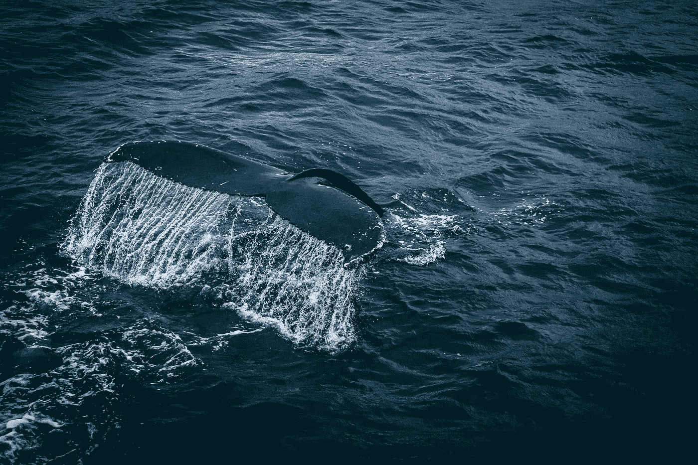
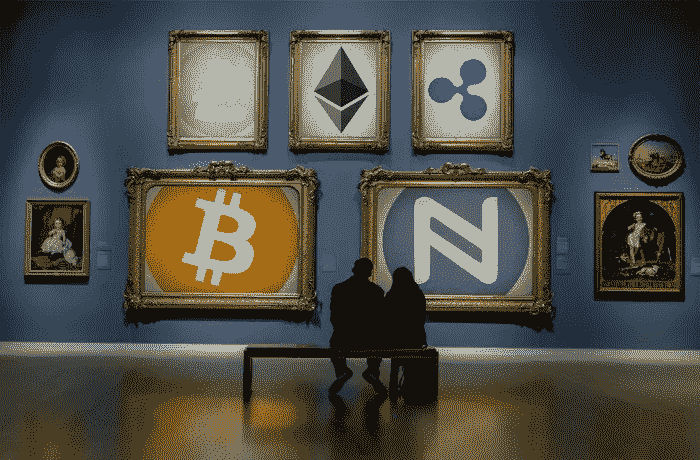

# 2018 年 1 月 29 日:神秘领域最大的故事

> 原文：<https://medium.com/hackernoon/29-01-2018-biggest-stories-in-the-cryptosphere-acd08a271e4b>

**1。世界自然基金会将利用区块链结束非法捕鱼和金枪鱼捕捞奴役**

世界自然基金会(WWF)在其官方[网站](http://www.wwf.org.au/news/news/2018/how-blockchain-and-a-smartphone-can-stamp-out-illegal-fishing-and-slavery-in-the-tuna-industry#gs.jyW2jNk)上宣布，它将开始使用区块链技术来结束非法捕鱼和金枪鱼行业的奴役。这项技术将使买家能够通过智能手机扫描二维码，了解生产商是否不受监管，或者是否侵犯了人权。WWF-Australia、WWF-Fiji 和 WWF-New Zealand 与区块链科技公司 ConsenSys、海鲜追溯技术专家 TraSeable 和金枪鱼捕捞和加工公司 Sea Quest Fiji Ltd .联手合作。该项目将重点关注太平洋岛屿金枪鱼产业。

**2。分散保险可能是下一个**

试图分散 Airbnb 的初创公司 Bee Token 和金融服务平台 WeTrust 已经合作分散保险业务。这两家总部位于旧金山的区块链创业公司将通过创建“基于众包保证金的分散保险层”来实现这一目标。该项目的目标受众是已经对加密货币感兴趣的人。然而，他们并不是唯一相信区块链技术会彻底改变保险业的人。Ageas 英国战略发展主管 Ken Markle 表示，这项技术[通过改善交易流程，可以削减高达 30%的管理成本](https://www.intelligentinsurer.com/news/blockchain-could-cut-insurers-admin-costs-by-30-b3i-goes-commercial-14473)。Markle 也是另一个希望利用区块链技术改善保险业的项目 B3i 的代表。

**3。韩国最大的电子商务平台之一增加了 12 种加密货币，包括比特币**

韩国最大的电子商务平台之一 WeMakePrice 宣布将在其支付平台 Pay 上增加 12 种加密货币。将被纳入的加密货币的例子有比特币、以太坊和莱特币。该平台也被称为 Wemepu，正在与该国最大的加密货币交易所 Bithumb 合作。这是这种规模的电子商务首次提供加密货币支付。然而，考虑到该国几乎每个大型商业集团都持有加密货币公司的股份，这应该不会令人感到意外。

**4。日本电子商山田接受比特币支付**

日本最大的消费电子产品商[山田电机](https://news.bitcoin.com/japans-largest-consumer-electronics-chain-trials-bitcoin-payments/)已经与 Bitflyer 合作，目前正在其商店中测试比特币支付。采用将是渐进的，[从位于东京的两家商店开始](https://www.coindesk.com/japanese-electronics-retailer-launches-bitcoin-payments/?utm_content=bufferded97&utm_medium=social&utm_source=twitter.com&utm_campaign=buffer)。然后它将扩展到全国其他地区。一个在东京的商业区，另一个在游客经常光顾的地区。根据该公司的公告，审判于 1 月 27 日开始。该公司希望提高比特币的认知度和使用率。个人账户的结算上限为 30 万日元(合 2760 美元)。

> 要想在你的邮箱里收到我们的每日新闻综述，请在这里注册:[http://bit.ly/BlockExNewsRoundup](http://bit.ly/BlockExNewsRoundup)