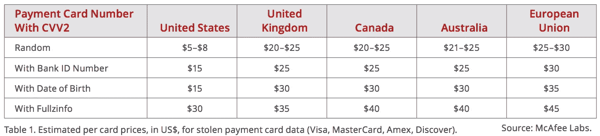

# 2018 年，3 家大公司在很大程度上损害了客户的安全

> 原文：<https://medium.com/hackernoon/3-big-companies-that-majorly-compromised-their-customers-security-in-2018-7022068ac04a>

## 如今，没有“大到不能倒”这样的事情，尤其是在网络安全和网络攻击方面。

即使是世界上最大的组织也不能幸免于数据泄露。他们似乎拥有所有的资金和资源来防止黑客入侵他们的系统，但最近的历史表明，无论他们在做什么都是不够的。

[雅虎！](https://techcrunch.com/2017/11/08/yahoo-senate-commerce-hearing-russia-3-billion-hack/)和 [Equifax](https://hackernoon.com/is-equifax-the-new-normal-3b4beb279efc) 数据泄露只是过去五年中成为头条新闻的几起高调攻击事件，还有许多其他事件。可悲的是，2018 年也没有什么不同。据非营利隐私倡导者 [PRC](https://www.privacyrights.org) ，[仅在今年，就有超过 13.5 亿条记录](https://www.privacyrights.org/data-breaches?title=&taxonomy_vocabulary_11_tid%5B%5D=2436)被认为已经被暴露或泄露。

这些攻击说明了这种令人讨厌的黑客是多么无情，尤其是考虑到他们能得到的东西是如此之少。金融和个人数据可能在黑市上只卖几美元，但考虑到公司可能会存储数百万条这样的记录，对攻击者来说，一个相当大的数据库的漏洞可能是一个巨大的收益。

*Image source:* [*https://www.mcafee.com/enterprise/en-us/security-awareness/hidden-data-economy.html*](https://www.mcafee.com/enterprise/en-us/security-awareness/hidden-data-economy.html)

处理违规也不便宜，大公司平均花费数百万美元。所以，很奇怪为什么他们继续犯错误，使他们的数据易受攻击。

以下是 2018 年曝光客户数据的三家大牌商家。

# 脸谱网

脸书是世界上最大的社交平台。根据最近的数据，该公司声称每月有 22.7 亿活跃用户，其中超过一半每天都在使用其产品。

去年九月，黑客能够利用脸书代码中的错误获取用户的个人信息。脸书的“查看”功能中的一个漏洞，允许用户查看他们的个人资料页面对其他用户的外观，使得攻击者能够查看受害者个人资料的所有数据。据报道，允许用户使用脸书账户认证和登录的第三方网站也可能受到了影响。

脸书已经修补了漏洞，并强制受影响的用户更改密码，以防止进一步暴露。

据估计，大约有 5000 万用户受到了此次入侵的影响，他们现在面临着越来越大的身份被盗风险。这是该公司自 2004 年成立以来遭遇的最大一次 T2 安全漏洞。然而，鉴于最近涉及剑桥分析公司的[丑闻](https://hackernoon.com/facebook-data-scandal-50eedc7762b6)，这并不是脸书最近面临的唯一数据相关问题。

# 安德玛

运动服装公司安德玛已经取代耐克和阿迪达斯成为行业巨头。自那以后，它开始涉足健身技术，收购了健身应用程序 MyFitnessPal。该应用程序允许用户设定健身目标，记录他们的锻炼活动和饮食，并跟踪他们的卡路里摄入量。

去年三月，一个未经授权的团体在泄露前一个月获得了该应用数据库的访问权限，这可能会泄露 1.5 亿用户的私人信息，包括他们的用户名、电子邮件和散列密码。

该公司[尚未透露](https://www.washingtonpost.com/news/the-switch/wp/2018/03/29/under-armour-announces-data-breach-affecting-150-million-myfitnesspal-app-accounts/)其数据库是如何被黑客攻击的，但它表示，并非所有用户数据都因此次入侵而暴露。例如，客户在购买时共享给服务的信用卡数据不会被泄露。该应用程序也不会收集其他标识符，如社会安全和驾照号码。

MyFitnessPal 声称，大多数被盗的密码[使用了 Bcrypt 哈希函数](https://www.wired.com/story/under-armour-myfitnesspal-hack-password-hashing/)，当应用于冗长复杂的密码时，应该会产生一个攻击者难以破解且耗时的哈希。不幸的是，一些用户密码仍然是用弱 SHA-1 加密法存储的，这种加密法不太安全，一旦被黑客破解，很容易被破解。

# 国外手机交友软件

虽然 Tinder 没有直接受到影响，但第三方集成解决方案最终成为了薄弱环节，这款流行的约会应用的用户数据被暴露无遗。 [Branch.io](https://branch.io/) ，一个被许多顶级公司使用的移动参与解决方案，包含一个跨站脚本(XSS)缺陷，该缺陷最近在一个 Tinder 子域中被发现，该子域被用作 Branch.io 的移动流量归属机制的一部分。

估计有[6 . 85 亿用户](https://www.theregister.co.uk/2018/10/12/branchio_xss_flaw/)的个人信息被该漏洞暴露。

XSS 漏洞非常危险，因为黑客可以注入客户端脚本，这些脚本可以对受害者执行各种恶意行为。例如，点击包含受影响子域的链接可能会触发脚本，从而窃取数据或劫持系统。如果代码看起来来自合法来源，攻击者甚至可以绕过访问控制，更深入地访问系统。

关于 Branch.io 缺陷的新闻在主流新闻中被淡化，但人们不能忽视问题的规模。据报道，Tinder 已经着手解决这个问题。不幸的是，这种暴露并不仅限于约会服务，似乎也影响了其他 Branch.io 用户。幸运的是，到目前为止还没有关于这个缺陷被恶意行为者利用的报道。

# 安全的未来

即使是大公司也容易受到网络攻击，这是相当可怕的。这些品牌很受欢迎，他们势必会吸引更多的客户，与他们分享信息。伴随着大数据而来的是巨大的责任。

随着黑客想出更巧妙的方法来攻破系统，网络攻击预计会变得更加猖獗。公司应采取一切可用措施，防止客户信息暴露给恶意行为者。