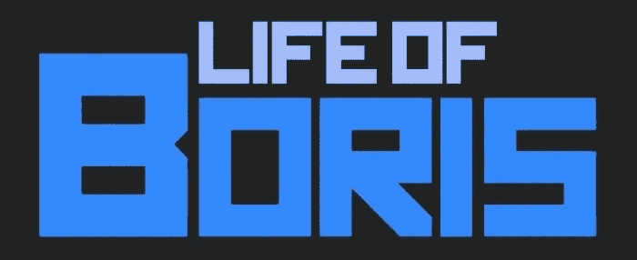

# 3 位品牌部落领袖分享他们成功的秘诀

> 原文：<https://medium.com/hackernoon/3-brand-tribe-leaders-share-the-secrets-of-their-success-989d0458c26a>

如今，仅仅试图向消费者推销你的产品是不够的。如果你的目标是成为 DVD 和蓝光的头号零售商，就像 hmv 一样，像 YOU.gr 一样成为一家受欢迎的电子商店，或者拥有数百万订户的《鲍里斯的一生》背后的 YouTuber，这都没有关系。你需要的是推销你的生活方式。一个想法，一个愿景，一个真实的信息，让你的品牌的消费者集体认同这个产品，分享关于这个品牌的相似观点和想法。简而言之，一种生活方式的选择。

但是你如何激励消费者、顾客或观众在你的促销中扮演重要角色呢？你需要那个吗？我有幸采访了你。gr，hmv，还有那个叫鲍里斯的著名优步。让我们听听这些行业专家关于为什么你应该追求卓越的内容策略，以及如何将你的客户塑造成品牌部落。

# YOU.gr

YOU.gr 是一家成功的公司，主要销售高科技产品。如今，YOU.gr 是希腊最受欢迎的电子商店之一。

我问 YOU.gr 的数字营销主管 Stavroula Kakkava，为什么在顾客和他们的品牌之间建立联系对他们在 T2 的成功至关重要。

*“比起从未听说过的公司，用户更有可能从他们了解和熟悉的公司购买。此外，他们更有可能从他们信任的公司购买。”* Stavroula 还表示，获得可靠的可信度是一个长期的过程，当你在一家知名且稳定的公司工作时，这非常有帮助，对你来说，这就是 Info Quest。

然后，我们讨论了培育已经建立的信任需要做的大量工作。Stavroula 解释说，他们总是试图在对客户说的话和客户对他们的期望方面保持一致。*Stavroula 补充道:“这意味着一致的品牌声音、一致的信息传递，以及在所有平台和营销活动中一致的信息传递”。*

*在 YOU.gr，他们坚信内容非常重要，有助于与客户建立联系。她说，“*客户将内容与信任联系起来”，*我不得不同意这种说法，因为这是所有采访中的一个常见因素。他们保持内容良好状态的关键活动是每年的 SEO 变化和每天检查产品内容，以丰富他们的品牌，视频和其他对客户有用的内容。*

*根据 Stavroula " *的说法，当今最好的促销方式是程序化和动态的再营销。此外，我们寻找忠诚度计划，这将有助于我们更好地吸引客户。”**

*在这次采访中，不仅仅提到了忠诚度计划。也是 hmv 内容营销的要义之一。*

# *hmv*

*hmv 是一家非常受欢迎的娱乐零售公司，拥有 97 年的历史。第一家 hmv 品牌商店于 1921 年由留声机公司在牛津街开设，hmv 的名称也用于 20 世纪 30 年代以后生产的电视机和收音机。*

**

*hmv 的数字营销经理 Silvia Santinello 说:*“我们通过各种渠道建立 hmv 社区和受众，然后长期与他们保持接触和沟通。**

*没有进一步的麻烦，我们就直接跳到事情当中，讨论他们在音乐和电影领域的营销活动。*“我们可以利用产品发布活动和相关的产品搭配，在产品发布的任何一方创建扩展的活动。”*例如，如果一部新电影将在几个月后推出 DVD，他们可以利用影院宣传来鼓励商品购买、电影目录促销以及鼓励预购，从而在生命周期的早期提高知名度、整体兴趣以及与新版本粉丝的互动。*

**“这使我们能够通过所有可用的渠道，如在线编辑、电子商务和店内渠道，在新产品发布的不同阶段吸引他们，从而培养我们的社区关系。我们总是试图为我们的社区创造具有相关性和价值的接触点。”**

*正如我在第一次采访结束时所说的，忠诚计划在 hmv 创造互动和吸引人的内容方面起着重要作用。"*我们拥有如此广泛的受众和广泛的产品范围，因此我们的内容必须能吸引每个人。只要有可能，我们鼓励互动，例如通过我们的“purehmv”忠诚度计划使用竞争和独家优惠。* Silvia 强调，这种引人入胜的互动内容必须在所有渠道一致呈现，从店内到电子商务网站，以及两者之间的任何地方。*

*hmv 将自己定位为娱乐行业的公正权威，更类似于传统媒体，而不是零售商的立场。*“在我们的供应商合作伙伴的支持下，我们能够接触到令人难以置信的乐队和主要电影人才进行采访和店内亮相，因此我们能够为我们的社区提供高价值和互动的内容。*”*

*该公司目前正在探索监控活动效果的可能性。*“当我们开展地理定位和社交渠道活动来推动店内和线上收入时，我们希望能够通过我们的忠诚度计划 purehmv 来跟踪这一点。这将有助于我们了解 hmv 社区中最有价值和参与度最高的成员的线上和线下购买行为的单一视图。”**

# *鲍里斯的一生*

*2015 年 5 月 4 日可能会让铁杆粉丝想起一些事情，因为这是鲍里斯 YouTube 频道发布第一个视频内容的日期。现在是 2018 年，该频道拥有超过 100 万的订户和 YouTube 的黄金创作者奖，毫不夸张地说，这是一个巨大的成功。*

**

*我很高兴与作者、创作者、烤肉串之王和斯拉夫巨星鲍里斯进行了一次长谈。*

*我的第一个问题显然是关于他的成功秘诀。鲍里斯解释得很快，没有这回事。他的成功背后有很多工作，他很友好地和我分享了他的信念。*

*鲍里斯认为，在创作者和观众之间建立一种纽带是至关重要的。它让人们不断回来，并在未来保持兴奋。“即使我不与这 150 万人中的每一个人交谈，我仍然愿意相信我正在与他们沟通。”*

*他的第一个支柱是真诚，真实。*正如他所说，“做一个永远是我自己的人。观众在核心层面上能与之产生共鸣的人。**

*即使这个频道的想法仍然是一样的，他多年来多次改变语气和态度来滋养观众。他从一个平静的声音变成了一个更响亮的声音，从一个平静的个性变成了一个更社会化的人。*“有些人甚至说我的声音变了很多，听起来不一样了。”**

*内容创作的主要挑战是改编。由于免费娱乐市场已经饱和，创作者必须找到新的方法来保持相关性。而且每个人都需要自己的。在我看来，要保持观看的趣味性，没有什么灵丹妙药。相反，我认为应该从不同的类别发布不同的内容。只要观众为创作者而来，无论内容是什么，他们都会留下来。当然，总会有一些人在看到不符合他们确切标准的视频后退订，但与此同时，又有 10 个人取代了他们的位置。*

*Boris 向我解释说，要理解渠道增长，就要把渠道看成一个观众。只要创作者认为内容值得观看，就会有观众同意他的观点。*

*我们一致认为内容的新鲜和定期上传一样重要。*“如果你在一个话题上磨磨蹭蹭太久，人们就会失去兴趣，去找别的事情做或者找别人看。数字视频内容是高度一次性的。观众可以看 3 秒钟的视频就离开。另一个视频总是只需点击一下。”**

*最吸引人的部分是关于促销。有趣的是，Boris 从不进行预先计划的广告活动，也不使用其他 YouTubers 来推广该频道或他的服装商品——we slav。*

*“我在脸书、推特和 Instagram 上都有账户。当新的限量版商品上市时，我会在那里张贴通知。我非常相信口碑广告。如果我的品牌和生活方式能够影响至少一个人告诉另一个人，那么它就是成功的。”*

*鲍里斯相信观众的真正兴趣，完全依靠观众的好奇心不断回来。这与经典的营销策略略有不同，但是，共同点总是高质量的内容。*

# *部落是数字丛林的法则*

*拥有超过 100 万的订户，客户来自整个国家或大洲。那是一个部落。一群信任你的品牌并遵循你的指导的人。他们的声音比你的更有价值。但是，这不是侥幸。你必须监视他们。而不是让他们在无人监督的情况下操作。你必须让他们感到被重视，而不是被命令，他们会带来浏览量、流量和受欢迎程度，并产生收入。一个品牌部落会为你销售产品。*

> *当一个产品成为一种崇拜时，它就是成功的。*

*无论你是在零售业，经营一家网店，还是试图作为优步突破，与你品牌的消费者建立信任和牢固的关系是你的首要任务。你必须掌握大量的技能来利用你的内容策略的潜力。然而，一旦你知道如何设置所有的变量，你就走上了建立一个强大的值得信赖的品牌和获得忠诚的，专注的客户的道路。自己的品牌部落。*

*如果你渴望阅读作者的更多文章，你可以在 [Kentico 的博客](https://www.kentico.com/blog/author/michal-kadak?utm_campaign=content-ext&utm_source=hackernoon)上找到。*