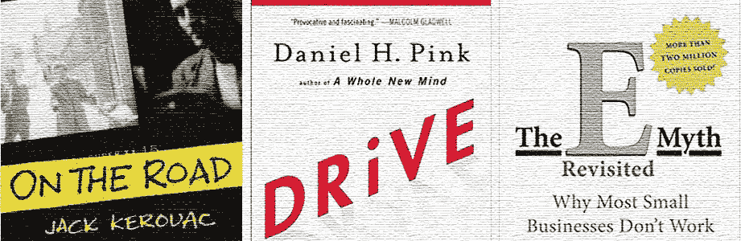
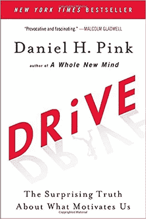
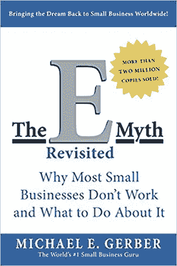
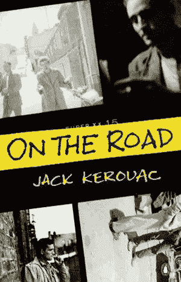

# 我希望我能早点读完的 3 本经典书籍

> 原文：<https://medium.com/hackernoon/3-classic-books-i-wish-id-read-earlier-1b3faefb09c7>

## 这些简单的读物将帮助你在商业、生活和其他方面茁壮成长。

时机就是一切。至少他们是这么说的。有时候，一本书在完美的时间进入你的生活，或者你认为这是对的。不管怎样，这里有三本书，我确信我会比以前更早地阅读并从中受益。

它们继续对我为什么做我要做的事情以及我如何去做这件事产生深远的影响。它们以一种非常简单的方式处理动机、逆境和创新。

# 驱动力:丹尼尔·平克关于我们动力的惊人真相

我有幸听到丹尼尔·平克在一次会议上发言。后来，我走近他，说道:“你知道，你的书改变了我的生活。”当我说出这句话的时候，我意识到他可能一直都是这样。“我希望更好，”他傻笑着回答。我们都笑了。

这本书的关键在于，在工作中(以及在生活中)，我们被[自主、掌控和目标](http://www.danpink.com/books/drive/)所激励。根据顶尖心理学家 [Edward Deci 和 Richard Ryan](https://www.learning-theories.com/self-determination-theory-deci-and-ryan.html) 的工作，当我们拥有自由(或对自由的感知)、能力(和改进的能力)和相互关联(让我们的价值观与我们正在做的事情相一致)时，我们就会以最佳状态成长，并找到意义。

# 《电子神话:为什么企业不运转以及如何应对——迈克尔·葛伯

令人惊讶的是，有多少人将这本书作为经典，无论是企业家还是其他人。我父亲把这个给了我，我记得当时的感觉是，“格柏是不是专门为我写的？”他随意的风格、个人故事和趣闻轶事让这本书引人入胜。无论你在职业生涯的哪个阶段，它都可以直接应用到你的商业和工作生活中。

现在它有了一个修订版，据最新统计，亚马逊上有 1773 条好评。事实上，如果你还没有读过这篇文章，那就别读了，去给自己复印一份吧。

# 《在路上》——杰克·凯鲁亚克

又一个经典。我把这个包括进来只是因为我认为它现在比以往任何时候都更相关。在这个充斥着假新闻、智能手机成瘾和伪公众人物的世界里，真实是例外。

他的传记作者安·查特斯写道，凯鲁亚克“创作了一本书，预示着这个国家意识的改变。”凯鲁亚克成为新一代人的声音，他们不仅思考，而且以不同的方式生活。一个有趣的补充说明是，凯鲁亚克创造了一个神话，他在咖啡因和苯丙胺的刺激下，在三周内毫不费力地写完了这本书。事实上,“狂欢”很像六年(也可以说是极度痛苦的一年)。

无论哪种方式，凯鲁亚克引诱你进入他的世界，令人眼花缭乱。当你读完最后一页时，这比你当前的网飞狂欢季节突然结束还要糟糕得多。

## *加入成千上万的人，只需点击**[***这里***](https://www.jonasaltman.com/newsletter) 就能消化我的创意和工作*