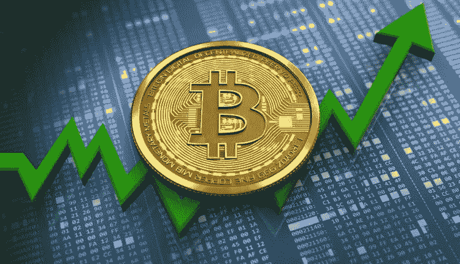
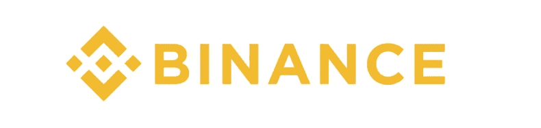
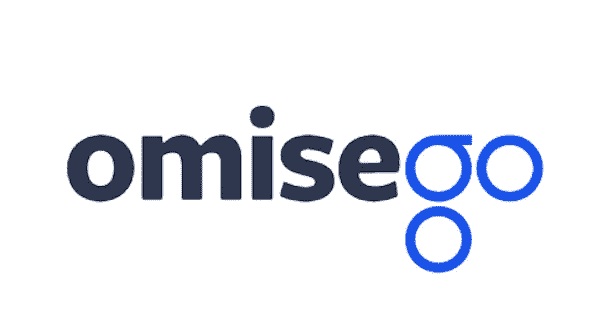

# 一旦市场再次变绿，3 枚硬币值得关注

> 原文：<https://medium.com/hackernoon/3-coins-to-watch-once-the-market-turns-green-again-9d97647e9c53>

市场在流血。街道上有血。人们很恐慌。如果你想了解我对这种情况会如何发展的想法，可以看看我之前的一篇博文*“街头有血——加密货币现在怎么办？”*你可以在这里找到(今天依然适用)。

尽管市场在流血，但并非一切都是悲观的。将彻底改变我们生活的技术仍然存在，并且正在蓬勃发展。在经济低迷时期，有许多项目在**取得了显著进展**，而正面消息却被蒙上了阴影。

在这篇文章中，我将谈论在过去几周有重要发展的三种硬币。一旦市场复苏，你一定要留意这些。

# [币安硬币](https://www.binance.com/?ref=10881502) (BNB)

几个月前(2017 年 7 月)，币安交易所**启动。从那时起，它已经成功地巩固了自己作为领先加密货币交易所之一的地位，在专业性、交易量、安全性、用户体验等方面都是如此。它还举办了非常成功的比赛，并积极主动地进行项目分叉和空投——这是许多交易所都无法夸耀的。**

******币安不仅经营了一家非常成功的交易所，还推出了许多其他平台，如 [**币安实验室**](https://labs.binance.com/) (一家区块链科技孵化器) [**币安信息**](https://info.binance.com/en) (一份法典)，以及组成**币安生态系统**的其他平台。******

****一个鲜为人知的事实是，**币安有自己的硬币，叫做**币安硬币** ( **BNB** )。参与者可以使用 BNB 来降低交易费用，作为交易对使用，也可以作为他们各种平台上的货币。BNB 将变得更加重要。******

****3 月 13 日，在这场市场动荡中，**币安** [公布了推出](https://support.binance.com/hc/en-us/articles/360001668872-Binance-Chain)**币安连锁店**的计划。****

> ****作为一家上市区块链，币安链家将主要专注于区块链资产的转让和交易，以及为区块链资产的未来流动提供新的可能性。币安链将侧重于性能，易用性和流动性。币安硬币(BNB)将被升级，在自己的区块链主网上存在，成为一个本地硬币。与此同时，币安将从一个公司转变为一个社区。****

****换句话说，******旨在推出自己的**D**e centralized**Ex**change(**DEX**)瞄准埃特芬克斯、IDEX 等人。你可能会疑惑，为什么****会想推出一款有竞争力的产品给自己的集中交易所。用他们自己的话来说——*“集中式和分散式的交流在不久的将来将会并存，相互补充，同时也有相互依存性”。你可以在这里找到更多关于**币安链条**的信息。***************

****关于**币安链**的具体细节尚不清楚，但如果他们遵循与其他 dex 类似的方法，预计 **BNB** 持有者将根据交易所的交易量获得股息，并可能减少费用。一旦市场好转，BNB 真正的投资潜力将浮出水面。****

****不出所料，**币安币** ( **BNB** )可以在 [**【币安**](https://www.binance.com/?ref=10881502) 买到。****

# ****阿拉贡(蚂蚁)****

********

> ****Aragon 是一个项目，旨在通过使用区块链技术使组织结构的创建和维护非中介化。我们希望让世界各地的人们能够轻松、安全地管理他们的组织。我们为任何人提供工具，让他们成为企业家，经营自己的组织，掌控自己的生活****
> 
> ****通过让世界上的每个人都有可能组织起来，我们正在实现一种无边界、无限制和更有效的价值创造****

****[**阿拉贡**](https://aragon.one/) 正在搭建一个平台，在这里任何人都可以发起 [**D** 去中心化 **A** 自治化 **O** 组织化](https://www.coindesk.com/information/what-is-a-dao-ethereum/) ( **道**)。简而言之，在一把**刀**上记录了区块链的一切。这包括公司的结构、投票权、角色、会计等等——这使得组织完全透明。****

****虽然市场在过去几个月里一直在流血，但 **Aragon** 继续坚持不懈地工作，最近在 [Rinkeby 以太坊测试网](https://www.rinkeby.io/)上发布了*架构师——*Aragon Core v 0.5。阿拉贡计划在接下来的几个月里在以太坊主网上发布建筑师*的作品，这需要经过第二次外部独立审计和 bug 奖励活动。*****

*****架构师*是 Aragon 的路线图(以及加密货币领域)向前迈出的一大步，将解开许多依赖 Aragon 的 **D** 去中心化 **App** 应用程序(dapp)的束缚；即 [Auctus](https://auctus.org/) 、 [district0x](https://district0x.io/) 等等。你可以在这里找到更多关于*建筑师* [的信息。虽然这一版本在加密货币社区中很大程度上没有引起注意，但一旦市场开始复苏，这一版本的重要性将变得非常明显。](https://blog.aragon.one/aragon-core-v0-5-the-architect-release-327c7163b89c)****

****除了令人兴奋的【建筑师 发布之外，他们还发布了一个精彩的视频，强调区块链和 DAOs 将如何赋能未来，我敦促大家观看。****

****可以在 [**上购买**阿拉贡(蚂蚁)**Bittrex**](https://bittrex.com/)， [**Liqui.io**](https://liqui.io) 和[其他](https://coinmarketcap.com/currencies/aragon/#markets)。****

# **[奥米塞戈](https://omisego.network/) (OMG)**

****

> **OmiseGO 正在建立一个分散的交易所、流动性提供者机制、票据交换所信息网络和资产支持的区块链网关。奥米塞戈不属于任何一个政党。相反，它是一个开放的分布式验证器网络，强制所有参与者的行为。**

**过去几周，OmiseGO 出现了一波积极的消息，我预计一旦笼罩在加密货币市场上的乌云散去，这些消息将会得到充分的赞赏。其中包括:**

*   ****Cosmos Hard Spoon** —本质上，这是一款新的区块链，考虑了现有链条的状态。引用 Vitalik Buterin(以太坊联合创始人):*“硬勺子是区块链之上的元协议，它创建了一个继承区块链底层令牌余额的令牌。”。*你可以在这里**[找到更多关于硬勺的信息。](https://blog.omisego.network/o-m-forking-g-e6925aca9c96)****
*   *****大规模合作**—4 月 5 日，Omise & OmiseGO 与新韩金融集团的子公司 ShinhanCard 签署了一份谅解备忘录(MoU)，该集团是韩国银行和支付领域的主要参与者。更多信息，请查看他们的官方声明。***
*   ***OmiseGO eWallet SDK —除了许多 SDK 之外，OmiseGO 团队还共享了 OmiseGO eWallet 的存储库。这将使电子钱包提供商能够开始启动过程，并使我们离完全白标钱包的发布更近了一步。你可以在[这里](https://blog.omisego.network/the-omisego-ewallet-sdk-is-now-open-source-fce7c61017e9)找到更多关于这些新闻的信息。***

***如果你想了解更多关于 OmiseGO 的信息，该团队制作了一份精彩的指南，你可以在这里找到。***

*****OmiseGO (OMG)** 可以在 [**上购买**](https://www.binance.com/?ref=10881502)**[**bit trex**](https://bittrex.com/)[**Ethfinex**](https://www.ethfinex.com/)和[多多](https://coinmarketcap.com/currencies/omisego/#markets)。*****

*****总之，这些只是众多项目中的 3 个，由于市场条件的原因，这些项目的重大发展都被忽略了。我们都应该密切关注这些项目，因为当事情开始好转时(他们会的)，这些项目将达到他们的路线图里程碑，并处于“捕捉反弹”的主要位置。*****

*****一定要给帖子一个👏**拍手**👏和我的博客 a **关注**如果你喜欢这篇文章并想看更多。*****

**********

*****也可以捐款到以下地址以示支持:
**ETH/BNB/ANT**/**OMG**:0x4c 7195 e 074 cf 0 ab 6 f 77 BDB 7 c 97 FD 2567066 bb 712*****

*****免责声明:这篇博文中的所有信息和数据仅供参考。我的观点是我自己的。我对任何信息的准确性、完整性、适用性或有效性不做任何陈述。我将不对任何错误，遗漏，或任何损失，或因其展示或使用引起的损害负责。所有信息均按原样提供，不含任何担保，也不授予任何权利。*****