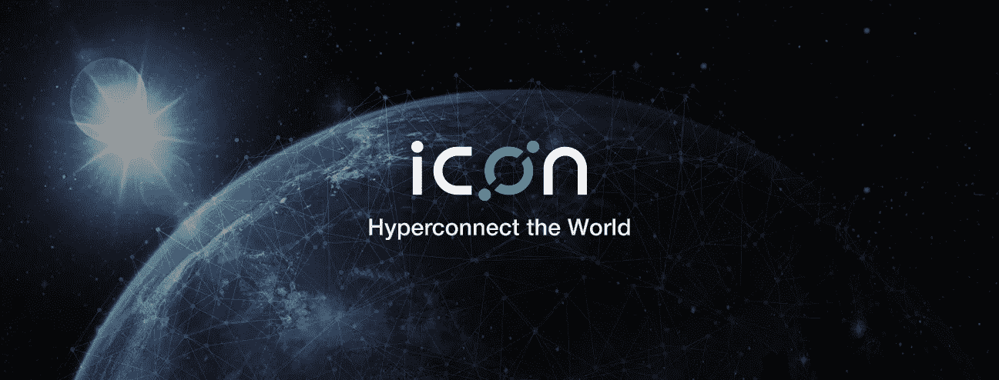
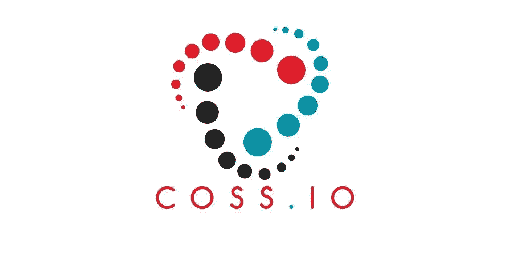
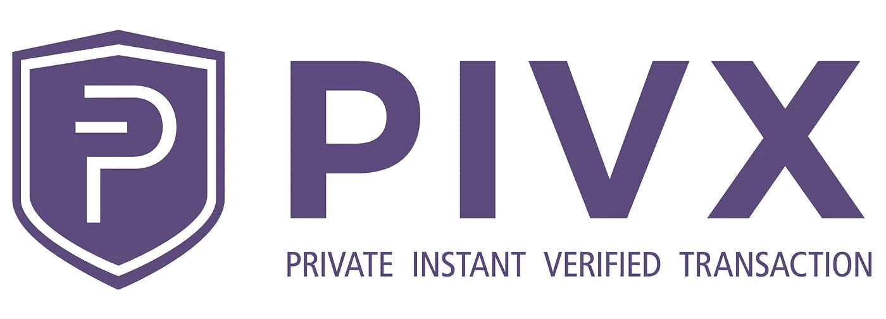

# 3 种加密货币让你在睡觉时也能赚钱——第二部分

> 原文：<https://medium.com/hackernoon/3-cryptocurrencies-to-earn-passive-income-with-part-2-39c127cd5dd8>

在继续之前，我想感谢我博客的每一位读者，感谢他们在过去的几周里给了我巨大的支持和回复。

正如第 1 部分中所承诺的，你可以在这里找到，我将重点介绍 3 种(更多)加密货币，让你获得被动收入。由于这句话上一次被强调了数百次，我想再次重复并引用沃伦·巴菲特的话——*“如果你在睡觉的时候没有找到赚钱的方法，你会一直工作到死”*。

*方便链接到:* [***第一部分***](https://hackernoon.com/3-cryptocurrencies-to-earn-you-money-while-you-sleep-part-1-3ef340fa4c70)*|*[***第三部分***](https://hackernoon.com/3-cryptocurrencies-to-earn-you-money-while-you-sleep-part-3-24fd758b058a)

# [图标(ICX)](https://icon.foundation/?lang=en)

图标是另一个最近成为头条新闻的项目，我也认为它有很大的潜力。它被称为“韩国以太坊”,但它有更多的优势，这个标签并不合理。 **ICON** 最近已经[推出了他们的主网](/helloiconworld/icon-mainnet-1-0-launched-d54b9132017e)，并将很快允许将“占位符” **ICX** [**ERC20 代币**](https://www.investopedia.com/news/what-erc20-and-what-does-it-mean-ethereum/) (这些只是用于推出他们的初始硬币发售)转换(或代币互换)为“真正的” **ICX 代币**。

密切跟踪 ARK.io 从我的[上一篇文章](https://hackernoon.com/3-cryptocurrencies-to-earn-you-money-while-you-sleep-part-1-3ef340fa4c70)，**图标**使用一种被称为**循环容错** (LFT)的共识机制，其激励系统非常类似于**委托利益证明** (DPoS)。这个机制要求硬币持有者投票给**代表**，他们负责验证交易和维护区块链。你可以在这里找到更多关于 LFT 的细节。

一旦 **ICON** 完全启动了他们的主网(包括他们的钱包 ICONex 和代币交换机制),你所要做的就是建立一个 **ICON** 账户并投出你的代表票。然后，您将通过代表获得一笔支出，作为为他们投票的奖励。你将获得多少回报的细节还没有正式确定，因为没有历史数据来计算估计值。

可以在 [**币安**](https://www.binance.com/?ref=10881502)[**曹仁**](https://sso.coss.io/api/invite/UG924F1RQ2)**[**gate . io**](https://gate.io/signup/820917)[等众多](https://coinmarketcap.com/currencies/icon/#markets)上购买 **ICX** (ERC20 代币)。**

# **COSS.io**

****

**与上面讨论的所有其他硬币不同，**C**rypto**O**ne**S**Stop**S**olution(**COSS**)是一种“交换代币”，在过去的几个月里越来越受欢迎。**

**COSS 的工作方式如下——在交易所进行的每笔交易都有少量费用(0.04-0.2%之间，取决于每个人的交易量),对定价者和接受者都是如此。然后一半的费用会被放入一个[**D**e centralized**A**autonomous**O**organization(DAO)](https://en.wikipedia.org/wiki/Decentralized_autonomous_organization)，然后在周末分发给 **COSS** Token 持有者。这些红利以交易执行时各自的代币支付，即，如果交易是在 ETH/OMG 对上进行的，您将收到 ETH 和 OMG 支付，而不是 COSS。**

**根据您存放 **COSS** 代币的地点，领取您的红利的程序略有不同:**

*   **如果您的 **COSS** 代币存储在 **COSS.io 交换**中，则不需要任何额外的东西。支出将每周自动发生(这是累积的，你可以通过几次点击来索赔)。**
*   **如果您使用**外部钱包**存储您的 **COSS** 代币(即 MyEtherWallet ),那么您需要执行 COSS 代币智能联系人中的特定功能。如何做到这一点的细节可以在[这里](https://coss.io/coss-token-based-fee-split-allocation-tutorial)找到。**

**CossCalc 有一个优秀的计算器，可以让你决定股息，同时还可以让你修改影响支出的具体变量(每日交易量和费用)。**

****曹仁**可以，不出所料，购买了 [**上的曹仁**](https://sso.coss.io/api/invite/UG924F1RQ2) **。****

# **[PIVX (PIVX)](https://pivx.org)**

****

****P**rivate**I**nstant**V**erified**T**transaction(**PIVX**)，是破折号(**破折号**)的一个[叉。与使用**工作证明(PoW)** 作为共识机制的 **Dash** 不同， **PIVX** 使用**利益证明(PoS)** 。我不会详细介绍 PoW，但是你可以在这里找到更多的细节。](https://www.investopedia.com/terms/h/hard-fork.asp)**

**来自[以太坊的维基](https://github.com/ethereum/wiki/wiki/Proof-of-Stake-FAQ)(最终也将成为 PoS):**

> ****PoS 是公共区块链的一类共识算法，依赖于验证者在网络中的经济利益**。在基于 PoS 的公共区块链中，一组验证者轮流对下一个区块进行提议和投票，每个验证者投票的权重取决于其存款(即股份)的大小。**

**有关 PoS 的更多信息，请点击查看[。](https://github.com/ethereum/wiki/wiki/Proof-of-Stake-FAQ)**

**自然，那些拥有最多硬币和赌注的人将在保护网络方面发挥最大的作用。作为保护网络安全的奖励，他们会得到新铸造的硬币。**

**有两种方法可以用 **PIVX** 获得被动收入。**

1.  ****运行主节点** —主节点为 PIVX 网络提供比普通节点更多的服务。作为回报，主节点会获得额外的奖励。为了运行一个 Masternode，你至少需要 10，000 个 PIVX。关于如何设置你自己的 Masternode 的细节可以在[这里](https://pivxmasternode.org/masternode-setup/setup-your-own-masternode/)找到。**
2.  ****Stake your PIVX** —这种方法非常简单，没有最低 PIVX 要求；您可以下注任意数量的 PIVX。您只需设置 PIVX 钱包并保持钱包“活动”(即在线)。如何下注 PIVX 的详细步骤可以在[这里](https://pivx.org/knowledge-base/staking-setup-guide/)找到。**

**为了找出你可以用 **PIVX** 被动赚取多少，你可以访问 PIVX 奖励计算器页面[这里](http://pivx.cryptonode.co/)。**

**可以在 [**币安**](https://www.binance.com/?ref=10881502) 和[其他](https://coinmarketcap.com/currencies/pivx/#markets)上购买 **PIVX** 。**

**如果你喜欢这篇文章并想看更多，请确保给这篇文章一个**掌声**并关注我的博客**。****

****

**您也可以通过向以下地址捐款来表达您的支持:**

****ICX**:0x4c 7195 e 074 cf 0 ab 6 f 77 BDB 7 c 97 FD 2567066 bb 712
**COSS**:0x4c 7195 e 074 cf 0 ab 6 f 77 BDB 7 c 97 FD 2567066 bb 712 **PIVX:**ddxq 5 C2 MQ can 8 ntg 3 shxoojyqgowcnjq1f** 

*****免责声明:这篇博文中的所有信息和数据仅供参考。我的观点是我自己的。我对任何信息的准确性、完整性、适用性或有效性不做任何陈述。我将不对任何错误，遗漏，或任何损失，或因其展示或使用引起的损害负责。所有信息均按原样提供，不含任何担保，也不授予任何权利。*****