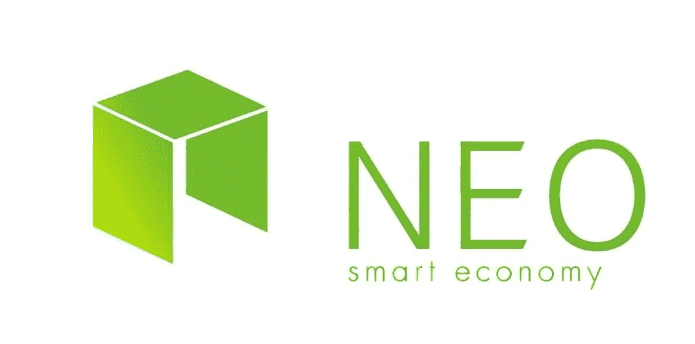
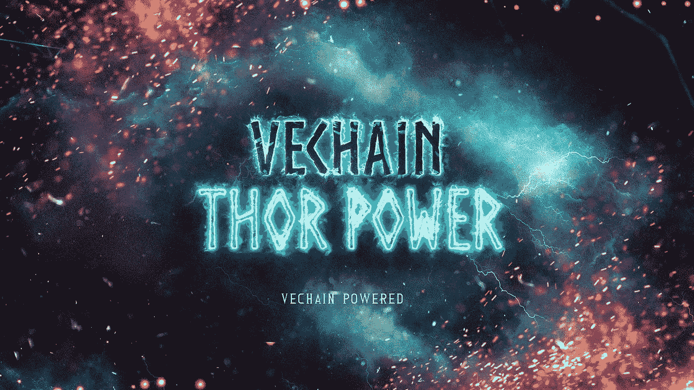
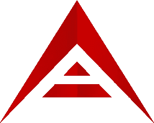

# 3 种加密货币让你在睡觉时也能赚钱——第 1 部分

> 原文：<https://medium.com/hackernoon/3-cryptocurrencies-to-earn-you-money-while-you-sleep-part-1-3ef340fa4c70>

在加密货币领域有许多赚钱的方法，包括长期投资、日内交易、套利等。一个鲜为人知的事实(尤其是对新人来说)，就是某些加密货币让你获得一份被动收入；仅仅是你没有做太多就赚到的钱。在本帖中，我将重点介绍 3 种加密货币，它们可以让你做到这一点。在继续之前，我想引用沃伦·巴菲特的话— *“如果你在睡觉的时候没有找到赚钱的方法，你会一直工作到死”*。

*方便链接到:* [***第二部分***](https://hackernoon.com/3-cryptocurrencies-to-earn-passive-income-with-part-2-39c127cd5dd8)*|*[***第三部分***](https://hackernoon.com/3-cryptocurrencies-to-earn-you-money-while-you-sleep-part-3-24fd758b058a)***|***[***第四部分***](https://hackernoon.com/3-cryptocurrencies-to-earn-you-money-while-you-sleep-part-4-1bd5d32c3b17)

Courtesy of Listen Money Matters

# [近地天体](https://neo.org/)

我真的相信 **NEO** 的未来是非常光明的，正如我在 2018 年博客文章中的 *3 个硬币值得关注，你可以在这里找到[。NEO 一直在不断壮大，并在这次市场动荡中表现出色。](https://blog.goodaudience.com/3-coins-to-watch-in-2018-890616de8d3b)*

**NEO** 使用一种被称为**委托拜占庭容错** (dBFT)的共识机制。

> …这是一种共识机制，支持通过代理投票大规模参与共识。NEO 令牌的持有者可以通过投票选择其支持的簿记员。被选中的簿记员小组通过 BFT 算法达成共识并生成新的区块。在 dBFT 中，所有簿记员中有 2/3 的人会同意每个区块中的内容。

你可以在 dBFT 上找到更多的信息，簿记员是做什么的等等。[此处](http://docs.neo.org/en-us/)。

本质上， **NEO** 的行为就像一股股票，通过拥有它，你就拥有了区块链的一部分。此外，通过拥有和持有**尼奥**，你被动地赚取**汽油**；在**近地天体区块链**上用作燃料的令牌。比如 **GAS** 用于部署智能合约、网络投票等。

为了赚取**汽油**、**、**你只需要把 **NEO** 放在钱包里，随着时间的推移**汽油**就会累积起来。你一点也不费力。在交易所持有它不会让你产生**气**，除了[币安](https://www.binance.com/?ref=10881502)和[库币](https://www.kucoin.com/)。根据你持有的 **NEO** 数量，点击[此处](https://neogas.io)，了解你产生了多少**气体**。

可以在 [**【币安】**](https://www.binance.com/?ref=10881502)**[**gate . io**](https://gate.io/signup/820917)[**ku coin**](https://www.kucoin.com/)**和[很多其他的](https://coinmarketcap.com/currencies/neo/#markets)上购买 **NEO** 和**气。******

# **[VeChain Thor(兽医)](https://www.google.co.uk/url?sa=t&rct=j&q=&esrc=s&source=web&cd=9&cad=rja&uact=8&ved=0ahUKEwj7ka-DirDZAhUEa8AKHSFSC18QFghwMAg&url=https%3A%2F%2Fwww.vechain.com%2F&usg=AOvVaw3WdfrkQZluS5-jxahDqnNg)**

****

**虽然仍在进行中，但我不能忽视 **VeChain Thor** ( **VeChain 的** pivot &重新品牌化)；一个最近在这个领域掀起波澜的项目。 **VeChain Thor** 即将超越供应链，进入**企业** [**分散应用(dApp)**](https://www.coindesk.com/information/what-is-a-decentralized-application-dapp/) **解决方案**。我不会讨论 **VeChain** 目前是如何工作的，而是将重点放在 **VeChain 或**上。**

****VeChain Thor** 将推出两款新代币:**

*   ****VeChain Tokens** (VET)将作为智能支付货币，以便在基于 **VeChain 区块链**的生态系统内实现快速价值流通。VET 代表占有和使用公共区块链资源的权利和特权。一个人拥有的资格越多，他就拥有越多的权利和更高的优先权(使用区块链)。**
*   ****雷神动力** (THOR)将是区块链上的燃料，在执行某些操作后会被消耗/燃烧，比如转移 VET 或者执行智能合约。**

****VeChain 区块链**将由 4 种不同类型的节点保护。成为一个节点有一些最低要求。节点类型由它们持有的**VET**数量和**到期日**决定。你可以在这里找到更多细节[。](/@vechainofficial/vechain-apotheosis-part-ii-thor-power-forged-974111a93278)**

**所有 **VET** 持有者(不管他们是否是 node)将通过在他们的钱包中持有 **VET** 来被动赚取 **THOR** 。作为保护网络的奖励，的节点(天生拥有更多 VET)将获得更高比例的**或**支付给它们。**

**根据你持有的**兽医**数量，点击[此处](https://thorcalculator.com/)，查看你可以被动赚取的**雷神**数量。**

****VeChain**(VEN)**VET**的前身，可以在 [**【币安】**](https://www.binance.com/?ref=10881502)**[**gate . io**](https://gate.io/signup/820917)[**COSS**](https://sso.coss.io/api/invite/UG924F1RQ2)**和[许多其他](https://coinmarketcap.com/currencies/vechain/#markets)上购买。******

# ******[方舟](https://ark.io/)******

************

********ARK** 使用一种被称为**委托利益证明** (DPoS)的共识机制。这个机制要求硬币持有者投票给**代表**，后者负责验证交易和维护区块链。它与 dBFT 非常相似，主要区别在于，在 dpo 中，只有一名代表验证数据块，而在 dBFT 中，2/3 的簿记员必须达成共识并生成新的数据块。您可以在[这里](https://blog.ark.io/dpos-and-ark-voting-explained-68596a171ca1)找到有关 dpo 和代表的更多详细信息。******

****与前两种加密货币一样，被动赚取**方舟**所需的努力非常少。步骤很简单——建立一个 **ARK** 账户，投下你的代表票。然后，您将通过代表获得一笔支出，作为为他们投票的奖励。关于如何投票给代表的详细教程可以在[这里](https://blog.ark.io/how-to-vote-or-un-vote-an-ark-delegate-and-how-does-it-all-work-819c5439da68)找到。要想知道通过为代表投票你可以被动赚取多少钱，请点击[此处](https://docs.google.com/spreadsheets/d/1FGo3FkC3uSWXGHatPQyny2brMWjAIJsHFCR-Lhkl_m0)。****

******方舟**可以在[上购买**T5【币安】**](https://www.binance.com/?ref=10881502)**[**Bittrex**](https://bittrex.com/)**[**曹仁**](https://sso.coss.io/api/invite/UG924F1RQ2) 和[其他一些](https://coinmarketcap.com/currencies/ark/#markets)。********

****你可能已经从标题中注意到了，这只是第一部分。还有一些加密货币，我想写一下。我将在接下来的一篇文章中讨论这些，这篇文章将在接下来的几周内发布；所以，如果你有兴趣了解更多，请留意。****

*****编辑:在这里* *找到* [*的 Part 2“3 种加密货币在你睡觉的时候赚你的钱”。*](https://hackernoon.com/3-cryptocurrencies-to-earn-passive-income-with-part-2-39c127cd5dd8)****

****如果你喜欢这篇文章并想看更多，请确保给这篇文章一个**掌声**并关注我的博客**。******

********

****您也可以通过向以下地址捐款来表达您的支持:****

******BTC**:395 jpxqaqlvyp 2 CP 4 uvmdbppartdkbfzk
**BCH**:181 fsplrfwvk 3 tpfmev 678 plrua 2 kpeofh
**LTC**:lgj w5 vjo 2 exxftqawuljvbrtqdiscxng 7 u
**ETH/VEN**:0x4c 7195 e 074 cf 06 ab 6****

****免责声明:这篇博文中的所有信息和数据仅供参考。我的观点是我自己的。我对任何信息的准确性、完整性、适用性或有效性不做任何陈述。我将不对任何错误，遗漏，或任何损失，或因其展示或使用引起的损害负责。所有信息均按原样提供，不含任何担保，也不授予任何权利。****