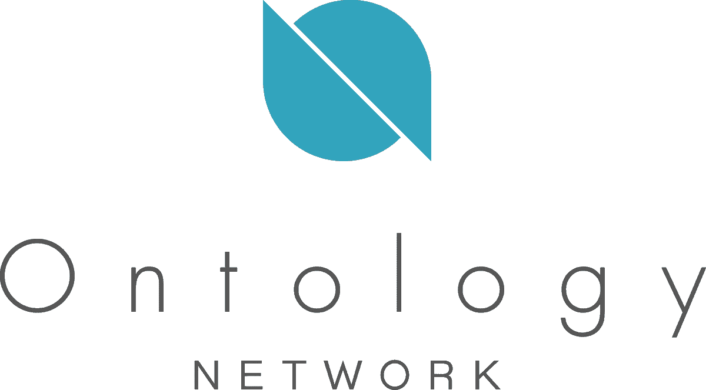
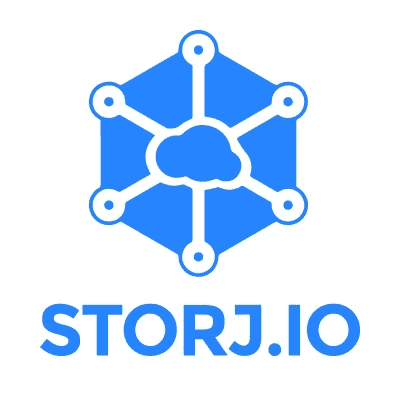

# 3 种加密货币让你在睡觉的时候赚钱——第三部分

> 原文：<https://medium.com/hackernoon/3-cryptocurrencies-to-earn-you-money-while-you-sleep-part-3-24fd758b058a>

首先，我想感谢 [**顶级密码作家——看到我的内容和知识分享与读者产生共鸣，这意味着很多。**](https://medium.com/u/e35242ed86ee# 28/100)Medium 上的<a class=)

正如我在以前的一篇文章中提到的，尽管有熊市，但并非一切都是悲观的。将彻底改变我们生活的技术仍然存在，并且正在蓬勃发展。除此之外，还有一些硬币，不管市场是绿是红，你都可以用它们获得被动收入。

在我系列的第 3 部分中，我将重点介绍另外 3 种加密货币，它们可以让你获得被动收入。如果你没有机会阅读我以前的文章，这里有一些方便的链接: [**第一部分**](https://hackernoon.com/3-cryptocurrencies-to-earn-you-money-while-you-sleep-part-1-3ef340fa4c70) | [**第二部分**](https://hackernoon.com/3-cryptocurrencies-to-earn-passive-income-with-part-2-39c127cd5dd8)

> *“如果你在睡觉的时候没有找到赚钱的方法，你会一直工作到死”* —沃伦·巴菲特

Image courtesy of [http://alternativeinvestmentcoach.com](http://alternativeinvestmentcoach.com)

# [本体(ONT)](https://ont.io/)

> 本体是一个多样的、集成的、分布式的信任网络，是构建信任生态系统的基础设施。本体鼓励信任合作，并允许具有不同业务场景和合规要求的所有形状、大小和技术的项目通过本体的链网络，并以他们认为合适的方式利用分布式信任网络。

与我过去讨论过的所有其他硬币不同(除了 VeChain Thor)，**本体**仍然是一项正在进行中的工作，但具有巨大的潜力，这可以从它在熊市中的表现中看出来。为了给你一个概念，它于 **~1.30 美元**在币安推出，在撰写本文时，它处于 **~7.42 美元**(上涨**~ 570%**)**的水平，这是加密货币总市值从**下降**超过 **13%** 的时候。**

****本体**会使用一种被称为**V**erified**B**yzantine**F**ault**T**olerance(VBFT)的共识机制。**

> ****VBFT** 是一种新的一致性算法，结合了 **PoS** 、 **VRF** (可验证随机函数)和 **BFT** 。随着 **VBFT** ，**本体节点**首先通过放置**标桩**申请加入网络共识。然后，通过使用可验证的随机数，从所有共识节点中选择几个节点。选定的节点负责提议、验证和投票选举新的块。**

**共识机制是**本体**的被动收入“部分”的核心。更多关于 **VBFT** 、[的信息可以在这里](/ontologynetwork/ontology-launches-vbft-a-next-generation-consensus-mechanism-becoming-one-of-the-first-vrf-based-91f782308db4)找到。**

****本体**网络将采用绑定在一起的双令牌机制——**ONT**(主链服务的加密货币)& **ONG** (主链操作的效用令牌)。通过拥有和持有**ONT**；你将被动获得 **ONG。****

**允许“被动收入”的**本体治理模式** l 被*“使用 ONT/ONG 并结合 VBFT 共识算法和共识管理智能合约的 Triones 经济模型”*所折衷。关于“ **Triones 共识系统经济模型**”、[你可以在这里](/ontologynetwork/ontology-announces-the-economic-model-design-of-the-triones-consensus-system-cd58a03f17d6)找到更多信息。**

**为了赢得 **ONG** 、**、**，你只需要把 **ONT** 放在钱包里，然后 **ONG** 就会随着时间的推移而累积。你一点也不费力。为了知道你将产生多少 ONG，你可以检查这个计算器。**

**可以购买 **ONT** 上 [**币安**](https://www.binance.com/?ref=10881502)[**火币**](https://www.huobi.br.com/en-us/topic/invited/?invite_code=awpf3)[**库币**](https://www.kucoin.com/#/?r=1caxM)**[**gate . io**](https://gate.io/signup/820917)**和[其他很多](https://coinmarketcap.com/currencies/ontology/#markets)。******

# ******[颁布法令(DCR)](https://www.decred.org/)******

************

> ********法令**是解决区块链治理的加密货币。它允许用户无缝地从一组共识规则过渡到另一组。这是一个复杂的问题，比特币治理所经历的困难就证明了这一点。**decreded**采用了创新的混合动力**p**roof-**o**f-**w**ork(**PoW**)/**p**roof-**o**f-**s**take(**PoS**)系统，类似于 **p** roof- **o********

******decreed**实现了一种混合共识机制，结合了[**Proof-O**f-**W**ork](https://cointelegraph.com/explained/proof-of-work-explained)(**PoW**)和**P**roof-**O**f-**S(**PoS**)******

**这种混合设计允许每个[区块被开采](https://www.coindesk.com/information/how-bitcoin-mining-works/)，就像比特币( **PoW** )一样，也允许利益相关者对一些事情进行投票(**PoS**)；新开采区块的有效性以及任何提议的特征或对网络的改变。投票是通过购买投票票来实现的，投票票会暂时锁定投票人的 **DCR** 。收到的投票者奖励，目前占总奖励的 30%；查看[此处](https://docs.decred.org/advanced/inflation/)获取最新的奖励数字。您还可以在[这里](https://docs.decred.org/research/hybrid-design/)找到关于这种混合动力设计的更多信息。**

**简而言之，要想通过**法令**获得被动收入，你必须遵循以下步骤:**

*   ****调教**和**基金**一**颁布钱包****
*   **挑选一个**投票池**(也称为股份池)**并在投票池网站上注册**。有关赌注池的更多信息，请参见[此处](https://www.decredible.com/mining/pos/)。**
*   ****购买投票票****

**你可以在这里找到如何设置**法令赌注**和赚取被动收入[的详细指南](https://www.decredible.com/how-to-stake-decred-beginners-guide/)。**

****DCR** 可以在 [**上购买**Bittrex****](https://bittrex.com/)**[**Poloniex**](https://poloniex.com/)**[**隐名**](https://www.cryptopia.co.nz/Register?referrer=teh0wner) 和[少数其他](https://coinmarketcap.com/currencies/decred/#markets) **。********

# ****[斯托伊(STORJ)](https://storj.io/)****

********

> ****Storj 是一种协议、加密货币和一套分散式应用程序，允许用户以安全和分散的方式存储数据。它使用受比特币启发的功能，如交易账本、公钥/私钥加密和加密哈希函数来实现安全性。****
> 
> ******Storj** 节点，或运行该软件的普通计算机，出售资源来存储和传输信息，并赚取 **STORJ** (或其他加密货币)以换取他们的服务。****

****本质上， **Storj** 是**开源**，**去中心化**，**区块链的**对应的 Dropbox，OneDrive，Google Drive 等。传统的集中式解决方案有许多缺点(隐私、安全性、中断等。)其中 **Storj** 使用**区块链**和**对等网络**解决。****

****与这篇文章(以及本系列之前的文章)中的所有其他硬币不同，对于 **Storj** ，你需要贡献资源来换取回报。对 **Storj 网络**的贡献来自于**存储空间**和**带宽**的形式。鉴于设置和开始使用 **Storj** 非常容易，如果您有未使用的存储空间和/或带宽，这实际上就变成了被动收入。****

****关于如何在 **Storj** 网络上设置并开始贡献您未使用的资源的**教程**，可以在[这里](https://docs.storj.io/docs/intro)找到。****

****不幸的是，没有简单的方法来计算 Storj 支付额，因为有许多因素会影响支付额，例如:****

*   ****未来有多少人会上传到网络上(又有多少)****
*   ****有多少人和多少人会再次下载这些文件****
*   ****贡献资源的节点的质量****

****说到这里，还有关于如何计算和如何付款的细节，[这里](https://docs.storj.io/docs/storj-share-gui#section-8-payments)。****

****如果你想看到一篇讨论类似于 **Storj** 的硬币(即贡献未使用的资源以换取回报)的博客帖子，请随时给我留言或发表评论。****

****可以在 [**上购买 **STORJ** ，**](https://www.binance.com/?ref=10881502) [**火币**](https://www.huobi.br.com/en-us/topic/invited/?invite_code=awpf3) **，**[**Bittrex**](https://bittrex.com/)**，**[**gate . io**](https://gate.io/signup/820917)**[其他很多](https://coinmarketcap.com/currencies/storj/#markets)。******

****确保你给这篇文章你的👏**50**拍手👏和我的博客 a **关注**如果你喜欢这篇文章并想看更多。****

********

****也可以捐款到以下地址以示支持:
**ONT**:af 1 igvz 5 gp 6 vdbe 1 WDM 9 ovsevq 7 wcs 3 za
**DCR:**dscwdvztkjey 4 ddzh 6 lyvhdvisjm 5 tfyhd 3
**ETH/STORJ**:0x4c 7195 e 074 cf 0 ab 6 f 77 BDB 7 c 97 FD 2567066 bb 712****

****免责声明:这篇博文中的所有信息和数据仅供参考。我的观点是我自己的。我不提供个人投资建议，我也不是合格的特许投资顾问。我对任何信息的准确性、完整性、适用性或有效性不做任何陈述。我将不对任何错误，遗漏，或任何损失，或因其展示或使用引起的损害负责。所有信息均按原样提供，不提供任何担保，也不授予任何权利。****