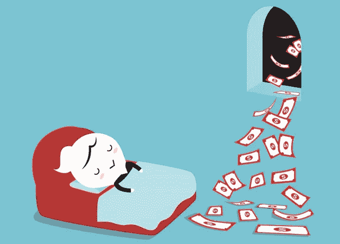
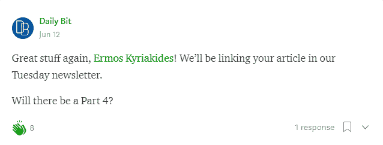
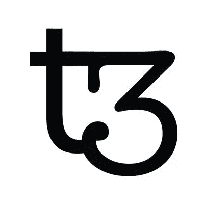
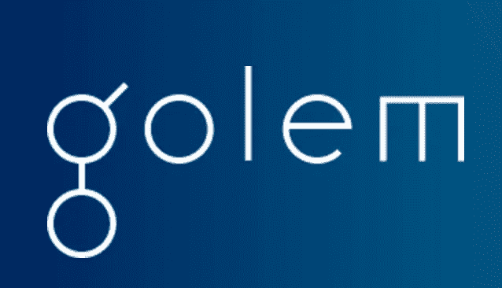

# 3 种加密货币让你在睡觉的时候赚钱——第四部分

> 原文：<https://medium.com/hackernoon/3-cryptocurrencies-to-earn-you-money-while-you-sleep-part-4-1bd5d32c3b17>

我知道你在想什么。我们正处于“熊市”之中，而你却在谈论能让你获得被动收入的加密货币？你疯了吗？

听我说完。如果你真的相信加密货币，相信熊市不会永远持续下去，那么当市场逆转时，当它们的价值升值时，了解那些让你获得被动收入的加密货币不是很好吗？

此外，我不能忽视这个系列已经收到的积极反馈。我不得不满足无数读者对第四部分的要求！

在我的系列文章第四部分的**中，我将重点介绍另外三种加密货币，它们可以让你获得被动收入。如果你没有机会阅读我以前的文章，你可以在这里找到一个汇总列表**和一些方便的链接: [**第一部分**](https://hackernoon.com/3-cryptocurrencies-to-earn-you-money-while-you-sleep-part-1-3ef340fa4c70)|[|**第二部分**](https://hackernoon.com/3-cryptocurrencies-to-earn-passive-income-with-part-2-39c127cd5dd8)|**|**[**第三部分**](https://hackernoon.com/3-cryptocurrencies-to-earn-you-money-while-you-sleep-part-3-24fd758b058a)****

> **“如果你在睡觉的时候找不到赚钱的方法，你会一直工作到死”——沃伦·巴菲特**

# **[泰佐斯(XTZ)](https://tezos.com/)**

****

> **泰佐斯是一个可以通过自我升级来进化的区块链。利益攸关方就《议定书》的修正案，包括表决程序本身的修正案进行表决，以就提案达成社会共识。Tezos 支持智能合约，并提供了一个构建分散应用的平台。**

**[这里](https://medium.com/u/948dd45fd3d0#using-the-tezos-baking-application)。**

**请注意，尽管迄今为止 **Tezos** 拥有[最大的](https://www.bitcoinmarketjournal.com/biggest-icos/)**I**initial**C**oin**O**offerings(**ICO**)之一，但它已经陷入了一场[争议风暴](https://cointelegraph.com/news/the-history-of-tezos-the-infamous-ico-trying-to-rebound-amidst-lawsuits-and-disputes)，所以如果你想购买 **XTZ** ，请记住这一点。**

**可以在 [**上购买**XTZ**Bitfinex**](https://www.bitfinex.com)， [**Gate.io**](https://gate.io/signup/820917) **，**[其他一些](https://coinmarketcap.com/currencies/tezos/#markets)。**

# **[SpankChain(打屁股)](https://spankchain.com)**

****

> ****SpankChain** 得到了一些人的大力支持，这些人认为成人娱乐业是创新的驱动力，也明白最有动力转向新经济平台的群体是那些被现有平台边缘化的群体。**
> 
> ****SpankChain** 的任务是将区块链技术的核心优势——隐私、安全、自主身份和经济效率——带给成人娱乐业。我们的目标是做到这一点，同时最大限度地遵守法律法规。**

**[少数其他](https://medium.com/u/9f9f2cef797a#markets) **。****

# **[假人(GNT)](https://golem.network/)**

****

> **假人是一台全球性的、开源的、分散的超级计算机，任何人都可以访问。它由从个人电脑到整个数据中心的用户机器的组合能力组成。**
> 
> **假人能够计算各种各样的任务，从 CGI 渲染，通过机器学习到科学计算。假人的局限性只能由我们的开发者社区的创造力来定义。**
> 
> **假人创造了计算能力的分散共享经济，并为软件开发者提供灵活、可靠和廉价的计算能力来源。**

**从本质上说，[其他很多](https://medium.com/u/8b0d088e8160#markets)。**

# **这个帖子值得多少掌声？跟着来怎么样？**

**如果你喜欢这篇文章，请随意👏**拍手**👏很多次(你知道你想！)，给我的博客一个👣**跟随**👣**和**🤲**分享**🤲和朋友在一起。有一个限制👏 **50 拍**👏你可以给每个职位，所以我劝你不要试图超过这个限度…你可能会打破中等！**

****

# **说到这个…**

**如果你仍然关注我，请留下评论，让我知道你还想看到我写些什么。你可以找到我的社交媒体的链接，并在下面注册我的时事通讯。**

**********************

contact@ermos.io** 

**也可以捐款到以下地址以示支持:
**Tezos:**tz 1 yinh 9 hoxkipmsdugfzifymffgrdm 2d Cui **SPANK/GOLEM**:[0x4c 7195 e 074 cf 0 ab 6 f 77 BDB 7 c 97 FD 2567066 bb 712](https://goo.gl/H8xSTn)**

**免责声明:这篇博文中的所有信息和数据仅供参考。我的观点是我自己的。我不提供个人投资建议，我也不是合格的持牌投资顾问。我对任何信息的准确性、完整性、适用性或有效性不做任何陈述。我将不对任何错误，遗漏，或任何损失，或因其展示或使用引起的损害负责。所有信息均按原样提供，不提供任何担保，也不授予任何权利。**