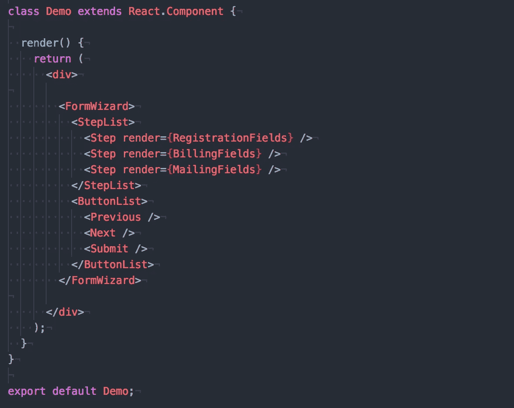
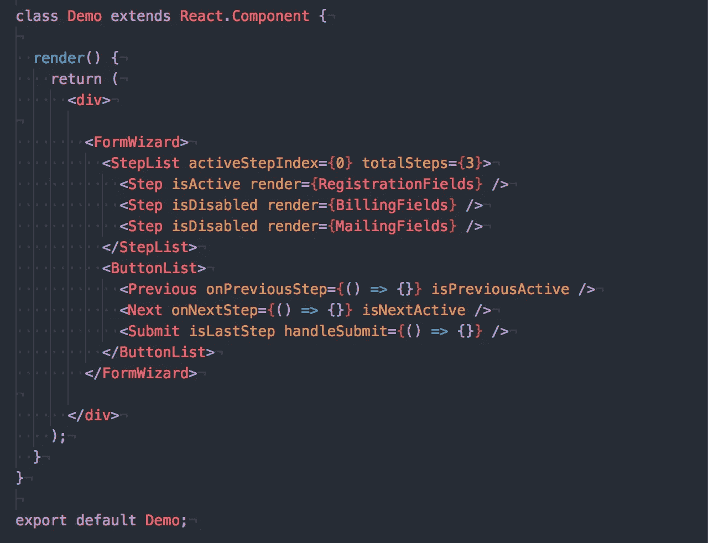
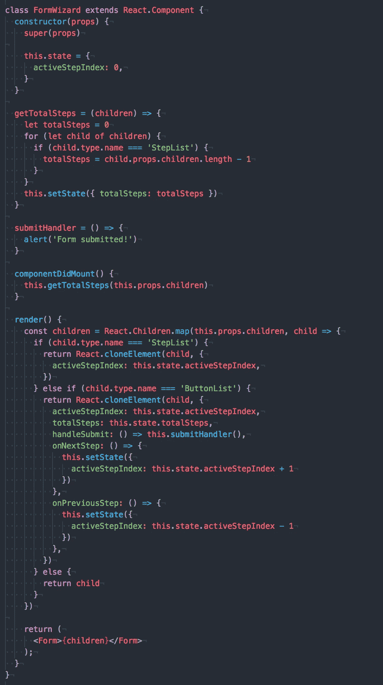
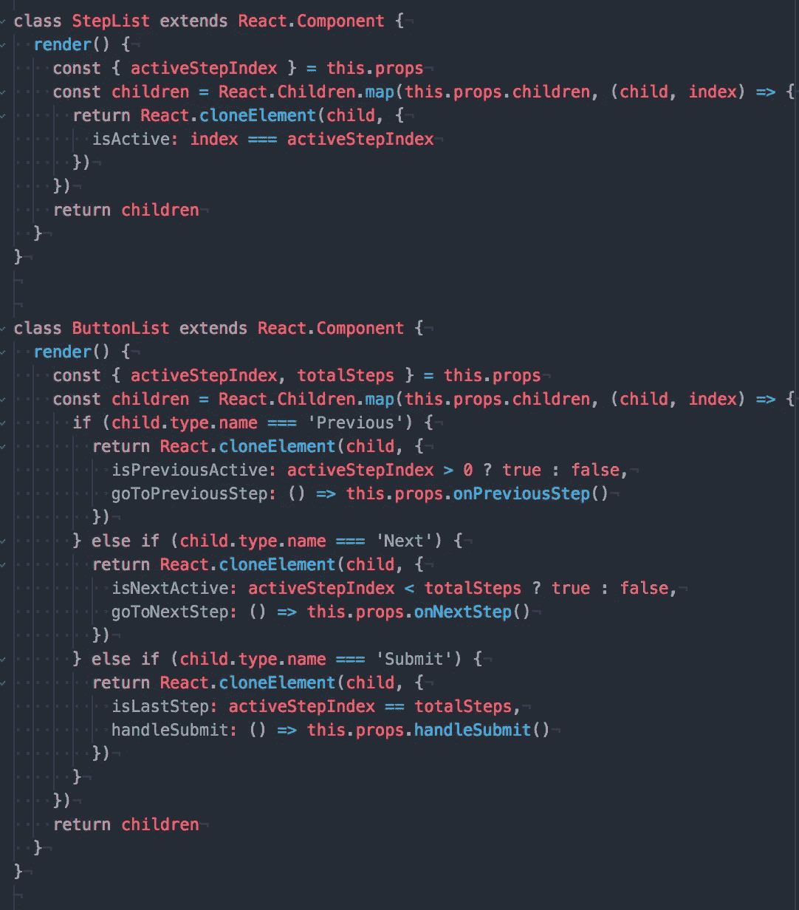
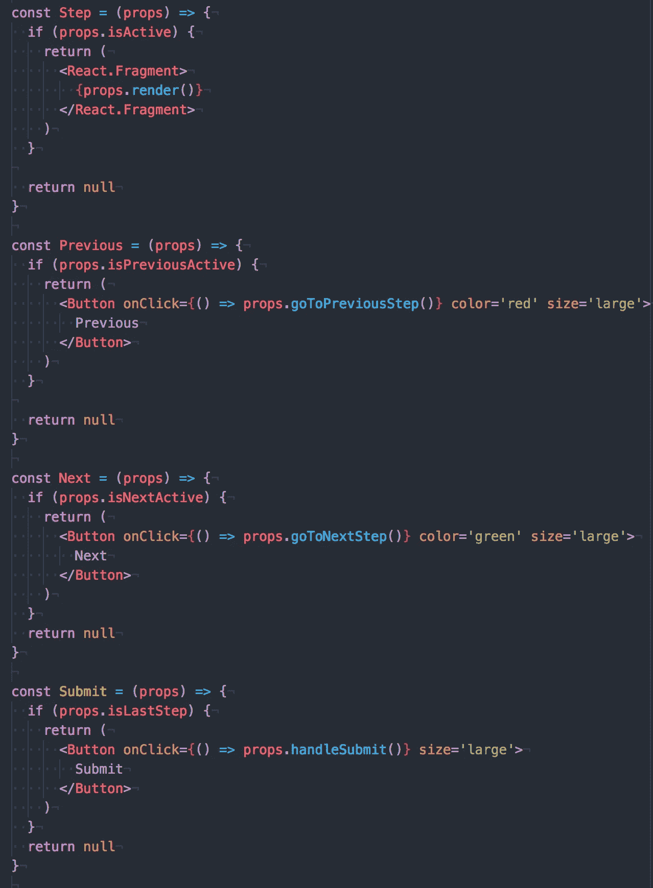

# 编写复合组件的 3 个简单步骤

> 原文：<https://medium.com/hackernoon/3-easy-steps-to-writing-compound-components-5d4647b7bb7>

## 让我们深入到使用复合组件的干净 React 代码的世界。

在 React 中实现了我的第一个复合组件之后，我正式对这种模式上瘾了。作为自称的这方面的专家(实际上我是从 Ryan Florence 和他的 T2 关于复合成分的演讲中学到的)，我将教你如何通过几个简单的步骤学习最好的高级反应模式。为什么？因为你值得拥有更好的代码库！

此时你可能会想，这个人是谁？他不是[肯特·c·多兹](https://twitter.com/kentcdodds)，他写了[关于复合成分的课程](https://egghead.io/lessons/react-write-compound-components)。他不是我们敬爱的反应先知丹·阿布拉莫夫。嗯，我对你的回答是你是正确的！

You’re correct dancing horse for everyone!

是的，我不是你曾经认识的人。但如果你真的想认识我，我叫史蒂文。可以在[推特](https://twitter.com/stevennatera)关注我。虽然我是一个无名小卒，但如果你对复合成分的想法感到兴奋，这就是你的指南。

复合组件使您的 JSX 标记保持整洁。当逻辑隐藏在容器组件中时，您可以真正专注于表示。我第一次编写复合组件时，一个小时的编码过程变成了通宵编程。我忍不住重构了我的副业项目的整个代码库。

在这 6 个小时里，我开发了一个心理指南，让你在设计组件时不再猜测。最棒的是，我在这里与你分享它，让你的代码库开心。

# 化合物组分的 3 步指南

好了，该是你写复合组件的无意义自由指南的时候了。今天，您将构建一个多步窗体向导。完成后，您将拥有一个干净的、可重用的表单向导，可以在任何 React 项目中使用。

正如 Ryan Florence 曾经说过的，当您使用复合组件时，您必须记住这种模式是关于以编程方式传递属性的。如果你能理解这个概念，那么接下来就一帆风顺了。

## 第一步。模仿你想要的 JSX 标记

您希望通过对相关组件进行分组来使 JSX 标记易于阅读。该方法是可扩展的，因为添加另一个步骤或按钮就像向相关组件组添加另一个组件一样简单。驱动底层基本组件的逻辑将来自上面的组件。步骤列表和按钮列表构成了相关组件的第一层。

一个**步骤**呈现一个给定的组件，如果它是活动步骤的话。**上一个**如果可能的话后退一步。**下一步**如果可能的话向前移动一步。**提交**仅在最后一步显示提交信息。**步骤列表**和**按钮列表**向下传递属性，以确定在给定步骤上呈现哪些按钮以及哪个步骤是活动的。

## 第二步。确定你的组件需要什么道具

从这里开始，您考虑每个容器组件需要什么道具。**步骤列表**需要确定当前步骤呈现给用户。使用当前步骤道具。**按钮列表**显示某些步骤上的**上一步**、**下一步**、**提交**按钮。活动步骤和总步骤有助于确定何时显示每个按钮。您需要一个提交功能，因为这是一个表单。现在你有了道具，就大功告成了！不完全是。

Don’t do this! We want to pass props indirectly.

考虑到你的道具，你可能会想把你的道具直接写在你的组件上，就像你上面看到的那样，但是有一个更干净的方法来传递道具。比较好的方式是间接传递你的道具。你怎么问？React API 有几个有用的方法，可以用来从现有组件创建新组件。这就是[的反应。孩子](https://reactjs.org/docs/react-api.html#reactchildren)和[反应过来，cloneElement](https://reactjs.org/docs/react-api.html#cloneelement) 就有用了。

## 第三步。用 React API 连接您的组件

React 最好的部分是组件是一个常规对象。与任何对象一样，您可以操纵它们来传递不同的属性和功能，而不必直接注释 JSX 组件。**做出反应。Children** 将允许你迭代一个组件的子组件。React.cloneElement 将允许你从一个现有的组件元素中创建一个带有附加属性的新组件。

这里你使用 **React 迭代**表单向导**中的子元素。儿童**。当你迭代时，使用 **React.cloneElement** 创建一个新的组件，它带有你想要传递到组件树的属性。

下一步上的**和上一步**上的**前进功能由**下一步**和**上一步**按钮使用。 **handleSubmit** 由 **Submit** 使用。我们将这些道具添加到新的**按钮列表**组件中，以向下传递。 **activeStepIndex** prop 帮助 **Step** 组件和表单按钮确定它们是否应该呈现。**

新的**步骤**组件将从**步骤列表**中获得一个 **isActive** 道具，以知道何时渲染一个步骤。**按钮列表**组件中的功能和状态属性会转到需要它们的相应按钮。我们的表单在第一步隐藏了“上一步”按钮，在最后一步隐藏了“下一步”按钮，在最后一步显示了“提交”按钮。在这些外壳之外，按钮是可见的。

最后，使用传递给基本组件的道具来确定应该呈现什么。看，简单！算是吧。我承认有很多事情需要你去思考。但最棒的是，奥普拉和我都是水瓶座(水瓶座的复数是什么？水瓶座？)因此:你得到一个演示，你得到一个演示，每个人都得到一个演示！这是指南的[演示。](https://codesandbox.io/s/n4yl5n9vp0)

在 React 16.3 中，你可以使用[上下文 API](https://reactjs.org/docs/context.html#when-to-use-context) 使表单向导在属性方面更加灵活。因为你的应用程序只有几层深度，你应该遵循文档中给出的建议。当您在多个层次上将相同的数据传递给许多组件时，请使用上下文。

如果你喜欢这个 dope techno 指南，那么[加入 dope Technophiles 时事通讯](http://eepurl.com/duxX8b)，在那里我们分享我们正在制造的 Dope 狗屎。现在继续传播复合组件的概念。与朋友分享这篇文章，让他们吸毒！

干杯！
2018 年 5 月 12 日

👋🏽嗨！我是史蒂文·纳特拉。在 Twitter 上关注我 [@StevenNatera](https://twitter.com/stevennatera) 。我积极参与了[开源社区](https://github.com/nodox)，特别是 [GatsbyJS](https://www.gatsbyjs.org/contributors/steven-natera) 。我喜欢写代码、初创公司、React 和 Kubernetes。