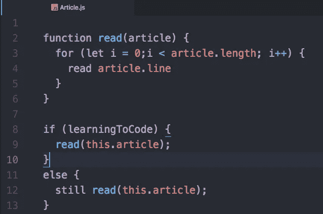

# 对于 2018 年学习 Web 开发的人来说，3 个重要的教训…来自于 2018 年学习 Web 开发的人

> 原文：<https://medium.com/hackernoon/3-essential-lessons-for-anyone-learning-web-development-in-2018-from-someone-learning-web-c4adfe53982f>

首先欢迎！你正在开始一段漫长的旅程，这将使你能够以一种前所未有的方式构建、创造和传播想法。

毫无疑问，在你的编程之旅中，你会学到无数的经验，但是我在这里分享我发现对我继续进步绝对关键的 3 个。

## 1.利用你的资源(尤其是免费的！)

2018 年学习 [网络开发](https://hackernoon.com/tagged/web-development)(网络开发)比以往任何时候都要容易。这并不是说这很容易，但你可以感到安慰的是，在你之前有成千上万的人，他们所有人可支配的资源都比你现在只拥有一台电脑和一个网络浏览器要少。

你也应该利用这样一个事实，那就是成千上万的人中有相当一部分已经把为后面的人开辟道路作为一个重点，你可以沿着任何数量的这些道路达到你的目标。无论你是在大学学习计算机科学，参加编码训练营，还是像我一样自学成才，所有开发人员之间的一个共同点是他们互相帮助。随着您的进步和遇到代码中的问题，您可以访问大量信息和世界各地的其他开发人员社区。对于学习，你可以使用从 Youtube 到更专注的网站，如 Udemy、Lynda、FreeCodeCamp 和[等等。](https://skillcrush.com/2016/03/15/64-online-resources-to-learn-to-code-for-free/)

随着你技能的提高，你的问题会越来越复杂，但是你永远不会独自面对 web dev。一旦你建立了自己的项目，你可以通过在 StackOverflow、Github 或 Quora 上发布它们来众包更多微妙的问题。不知不觉中，你会发现自己也在回答别人的问题。通过用难住别人的问题来挑战自己，你可以学到很多东西，而且通过帮助别人来建立自己在这些社区中的声誉会更令人满意。它仍然让我不知网上的人们多么愿意和有空与他们从未见过面的开发伙伴分享他们的知识。我不知道这种支持结构是建立在共患难的文化基础上，还是建立在组成开发的不断迭代和学习的基础上。我只能保证，你对这些社区投资越多，从长远来看，你的回报就越多；不仅是为了你自己的学习，也是为了你的后来者的学习。

## 2.不要相信冒名顶替综合症

我从其他自学 web 开发的人那里听到的一个问题，也是我经常问自己的一个问题，“我什么时候才能真正‘成为’一名开发人员？”对于许多独立学习的人来说，很难判断你的技能水平与其他已经从事网络开发的人相比处于什么水平。我认为这是对你自己和你的学习的一种有害的成功衡量。在过去一年学习 web 开发的大部分时间里，我一直在寻找成为“web 开发人员”所需的技能，但是我发现没有明确的答案。网上有如此活跃的开发者社区，你会发现他们每个人做的事情都略有不同。

在意识到这一事实之前，我发现自己陷入了一个被称为“冒名顶替综合症”的陷阱，这会让你觉得你所付出的所有进步和工作都毫无意义，你正处于被“发现”为冒名顶替者的边缘，并因此而被回避。我不能在这里说得足够清楚，但这绝对是假的。对于什么是 web 开发人员，没有一个真正的答案，也没有一个万能的权威来告诉你是否是 web 开发人员。在我看来，通过阅读这篇文章，你已经迈出了巨大的第一步。如果你正在寻找一种方法来衡量你的水平或为自己设定一个目标，我最好的建议是看看你已经创建或参与了多少个项目。寻找可以让你在课程之外创建项目的学习资源，或者在网上阅读后疯狂地尝试拼凑一些东西；在这里你可以做任何事。

我要稍微欺骗一下，多谈谈资源，但事实是网上有这么多资源，几乎没有人再从头开始构建东西了。每个人都在使用一个由他人构建的[库](https://en.wikipedia.org/wiki/JavaScript_library#Libraries)或代码，以快速有效的方式开始他们的项目。这在您的编程之旅中非常有用，但一开始会感觉像是作弊，并且会导致对自己能力的怀疑。然而，这是学习 web 开发的美妙之处的重要部分，甚至在行业中受到鼓励。每个人都在创造和贡献，不仅是他们自己的项目，也是更大的全球网络开发社区。这意味着你可以在你的一个项目中使用其他五个人的作品，但是你可以从中创造出更多的人最终用于他们自己需求的东西，然后循环继续。

## 3.学会学习

我的第三点也是最后一点对我来说有点启示。事实是，人们可以在发展中有所了解，但无论技能、天赋或职位如何，没有人知道一切。这听起来很明显，但是当你刚开始的时候，似乎其他人什么都知道，而你什么都不知道。

归根结底，web 开发并不意味着成为一名工程师或理解代码的每一个不同部分。最重要的是你要学会学习。如果你在任何时候都努力成为教室里最好的学习者，那么与你所能释放的潜力相比，你最初的知识只是雷达上的一个光点。这种心态可以应用到很多技能上，但是网页开发是独一无二的，因为不断的学习是这个职业成功的关键部分。你会在这篇文章中注意到，我从来没有把任何人描述为“web 开发人员”，而是说“学习 web 开发的人”这对我来说是一个重要的区别，因为每个所谓的“网络开发者”都还在学习。它从未停止。

如果你仅仅在三、四年前学习开发，那么你现在可能正在使用一套完全不同的工具和语法。开发职业的节奏很快，但如果你专注于自己吸收和应用信息的能力，那么你就能保证自己的成功。

## 摘要

当你学习任何新技能时，你会遇到你从未预料到的挑战和问题，但是在 web dev 的世界里，你已经有成千上万的人在你身边，可以帮助你度过这些挑战。只要你利用你所拥有的资源，记住相信你自己的能力，永远不要停止学习，那么你将克服你可能面临的任何挑战。