# 作为 ICO 的一员，我学到了 3 件重要的事情

> 原文：<https://medium.com/hackernoon/3-essential-things-i-learned-being-part-of-an-ico-fb22f52da758>

*这篇文章反映了我的个人观点，仅代表我的个人观点。这里分享的观点不一定是我参与过的任何项目的观点。*

**重点话题**:

*   ICO Bench 是狗屎(和大多数其他 ICO 索引网站一样)
*   创意骗子和你如何从中受益
*   不要做赏金

嗨，让我自我介绍一下。我是 Michiel，只是一个街角的家伙，发现了 ICOs 的金色世界，或者应该说是乌托邦？我是区块链的开发人员/顾问，曾为几个 ico 工作过。我想称自己为专家吗？绝对不会。

**在这篇文章中，我想谈谈发生在我们 ICO 领域的黑幕，并分享我通过亲眼目睹获得的知识。**

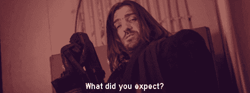

[Source](http://visiteur-du-futur.tumblr.com/post/75392110818/nellyfg-so-this-is-the-best-french-show-there): French web-series — Le Visiteur du Futur

# 避免 ICO 索引网站

是的，你没看错。

一开始，我参与的许多项目都渴望在尽可能多的 ICO 索引网站上上市。很快，我们发现他们中的一些人要价很高，尽管他们几乎没有流量，或相关的流量(高跳出率或明显的 bot/farmed 流量)。我们已经学会了仔细选择少量有价值和值得信赖的 ICO 列表网站(如果网络流量允许的话)。避免给人绝望的印象。ICO 指数网站会给你适当的知名度，所以要明智地选择。付钱给他们没有错，但要确保这是值得的投资:通常不是这样。

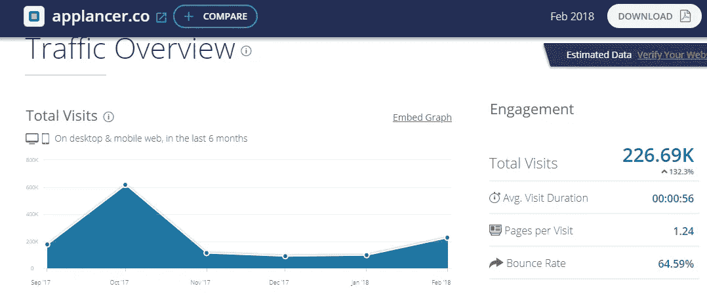

Source: [similarweb.com](https://www.similarweb.com/website/applancer.co#overview)

给一些数字，applancer.co 要求在他们的网站上列出 2300 美元的代币。据 similarweb 称，该网站在过去几个月里平均有 10 万访问者。仅上个月，访客数量就增加到了 227，000 人。考虑到低“每次访问的页面数”和高跳出率，你不太可能从这个索引网站获得任何流量。

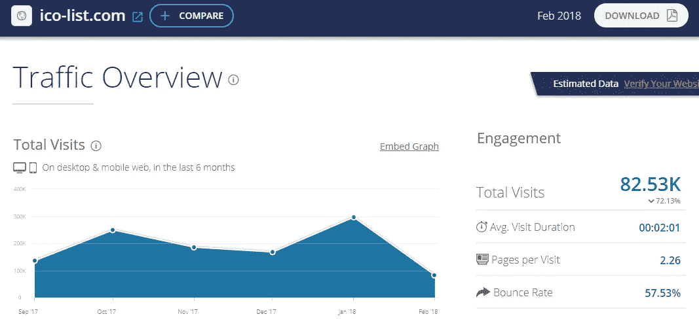

Ico-list.com 敢问你 0.29 BTC 成为他们网站的索引。他们只能给你提供 82500 次浏览。只需在此简单浏览一下他们的低成本网站:

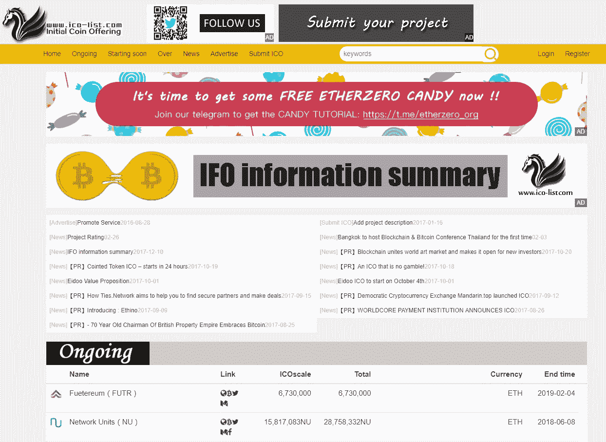

## ICO 板凳纯粹是屎

最近在 ICO Bench 上偶遇[这个项目](https://icobench.com/ico/skyfchain)。

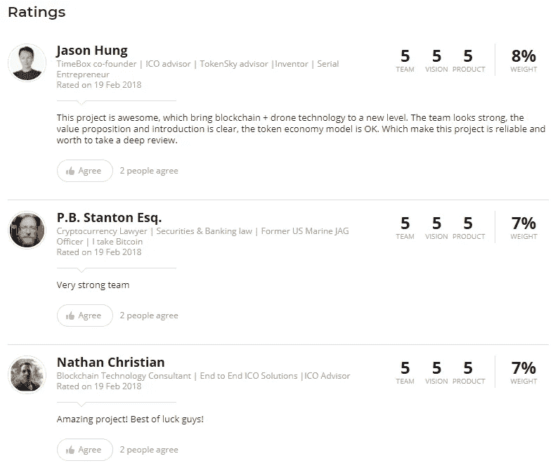

看起来很合法，对吧？这份名单还在继续，有 14 篇相似的评论，平均得分为 4.9。此外，我非常怀疑这类项目是否需要区块链。

我不喜欢这样说，但这听起来像一个大骗局(最有可能是贿赂审查人员)。1)讲解视频只是先令项目；2)该项目是积极营销的，这是一个危险信号的历史迹象；3)这些机器人无人机没有必要运行在去中心化的网络上，使用加密货币。看起来他们只是需要资金来建造他们的原型，或者更糟，生产蒸汽软件(中饱私囊)并放弃一个不可避免失败的项目。

> “如果你是一个区块链项目的投资者，你应该得到客观的尽职调查报告，不会因为虚假评级项目的付款而被武断地评估为较高的评级。”— [理查德·桑德斯](https://concourseq.io/U/th3r21ndr0p)。

很少有 ICO 列表网站提供专门的 ICO 客观评论。我们必须面对现实，这就是区块链产业和 ico 的现状。**说实话，这让我义愤填膺。**

还记得 Benebit 或者[战役世界](https://www.reddit.com/r/icocrypto/comments/77592z/scam_endorse_by_icobench/)骗局吗？没错。许多人指责 ICO Bench 和许多其他 ICO index 网站仅仅因为给他们夸大的评级和评论而接受金钱(这是有道理的)。似乎他们还没有吸取教训。

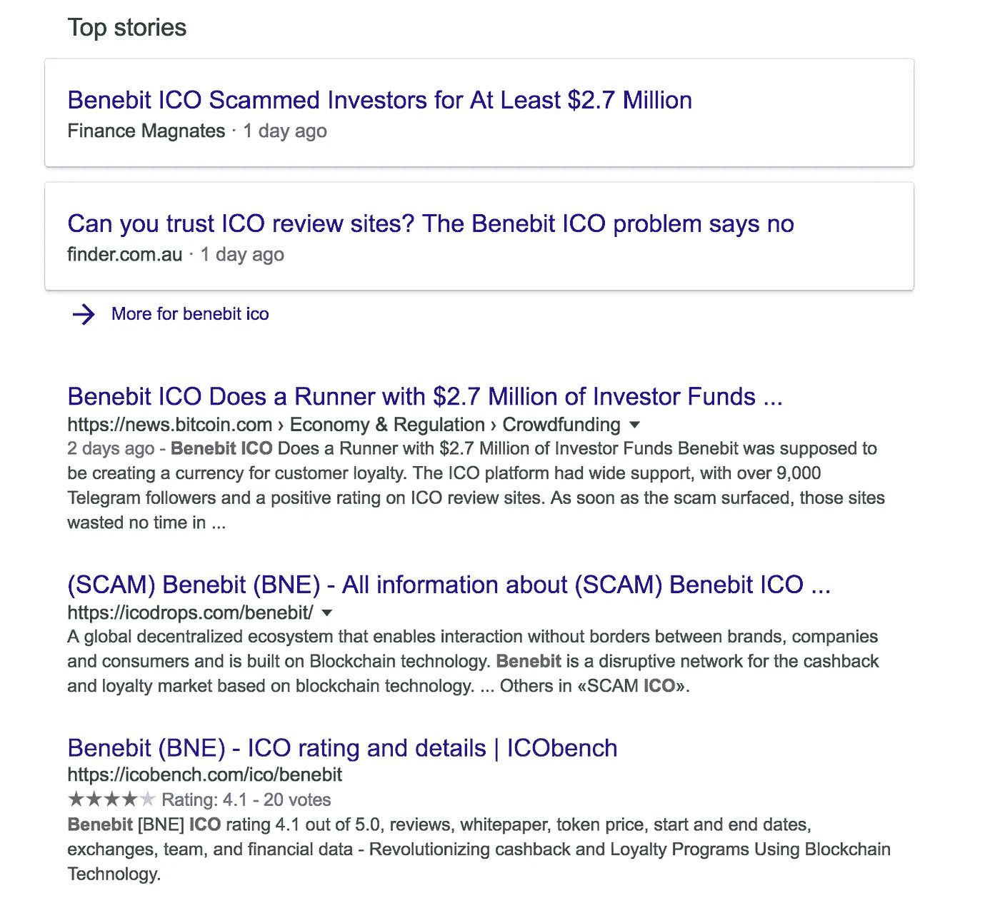

Google search result on Benebit ICO.

# 不要做赏金

请避开赏金！如今，人们称自己为职业赏金猎人。

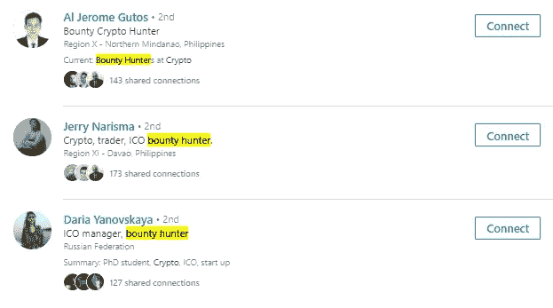

LinkedIn search on ‘bounty crypto hunter’

ICO 奖金计划的最初目标是获得“免费”营销，或其他有利于项目的任务。也许在早期，这是一个非常有效的营销工具。人们写博客，创造伟大的内容，并收到大量的代币作为回报。通过这种方式，该项目可以创建一个健康的长期社区。

> 如果数百万代币一文不值，或者团队不太可能将奖励分发给赏金猎人，那么接受这些代币作为赏金是没有意义的。—帕斯卡尔·泰尔曼

对于一个 ICO，我们总共在 2300 次浏览中花费了价值超过 11，000 欧元的代币。96%的 ICO 作品都是垃圾。

奖金的问题不仅仅发生在 ICO 团队身上，也是“赏金猎人”面临的一个风险。大多数赏金战役会奖励大量的代币，但是这些代币的价值非常小，以至于不能从项目交换中转移出去，甚至不能在 ERC20 交换中交换。

如今，人们错误地认为赏金计划是一种获得容易和免费的钱的方式，一旦代币上市就可以出售。这对长期代币持有者有负面影响，因为代币的价格会因为这些短期淘金者而立即下跌。

此外，这些短期现金掠夺者的涌入，他们甚至经常不访问项目的网站很长一段时间，更不用说阅读他们的白皮书，并且缺乏对项目的了解。这些类型的人对区块链的创业社区有害，对他们没有任何价值，除非“什么时候是月亮”是你喜欢每天在电报中阅读 20 次的问题。

毫不奇怪，我们从 bounty 内容提交中收到的大部分内容完全是垃圾，或者出版商的浏览量几乎为零。

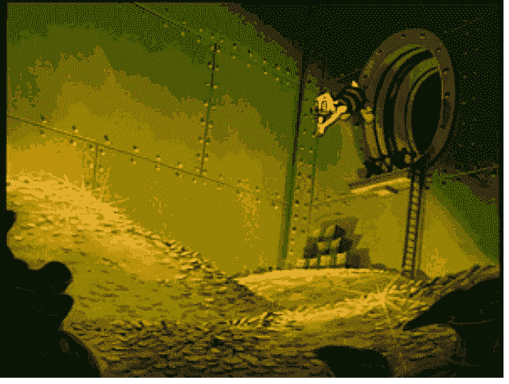

Source: [www.themuse.com](https://www.themuse.com/advice/this-is-how-you-wish-you-could-respond-to-annoying-job-search-advice)

这不仅仅是这些所谓的‘赏金猎人’的错。ico 数量的增加导致了大量的可用奖金计划。许多 ico 失败了，人们收到了没有价值的代币，这些代币永远不会上市，价值太低，无法在平台外交换，或者在许多国家远远低于最低工资。

Source: q4nobody.co.uk

为了回应这一点，我们首先联系了精心挑选的网站、YouTubers 和策划的博客。只有那些精心挑选的网站才能参与我们的“私人赏金计划”，我们奖励的代币比例高于散弹枪式的大规模赏金计划，后者的效果不太明显。所以，这更像是一个选择性的赏金项目。

再看[宝石](https://gems.org/) ICO。在某个时候，他们有超过 42，000 名电报成员。在你加入白名单之前，你必须证明你对社区的贡献(比如分享博客/写博客)。)由于这个白名单模型，他们成功地围绕这个项目制造了巨大的宣传。最后，人们发现只有少量的代币被公开出售。正因为如此，他们制造的巨大宣传和售出的少量代币让许多人认为这是一个骗局。

> 因此，请选择具有长远眼光和强大用例的优质 ico！避免通过激进的营销、大量的推荐项目或不可持续的模式过度宣传 ico。

# 创意骗子以及如何从中获益

在我参与的区块链项目中，我在电报聊天中看到过无数的骗局。经常发生的一种情况是，骗子采用一个流行的加密 YouTuber 或影响者的身份。他们会试图达成交易，在他们的渠道上推广该项目，以换取一些代币。

为了对抗这种情况，我们总是要求“骗子”通过从其官方渠道/博客发送消息或邮件来确认他们的身份。无数次，骗子向我们提供了来自 ProtonMail 的电子邮件，这是一个完全匿名的邮件服务提供商，被 Bitcointalk.org 论坛上的骗子广泛采用。

Source: [www.champbulldogs.com](http://www.champbulldogs.com/scam.htm)

但是，让我们看看事情好的一面。当这种骗局发生时，我们总是试图利用它来为我们服务。我们将努力与骗子假装代表的渠道取得联系，并告知他们正在使用他们的身份进行诈骗。通过这种方式，我们经常建立强大的联系，出于感激，我们可以以折扣价甚至免费获得特色博客或视频。

下图显示的是一个冒充 Crush Crypto 的 Victoria Wong 的骗子。在 LinkedIn 上与真实的 Victoria Wong 联系后，我们可以通知她这个骗局。

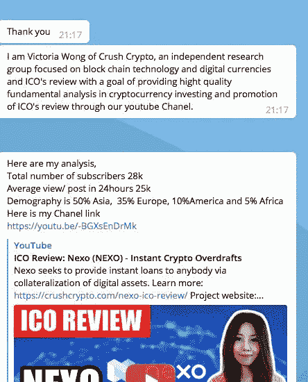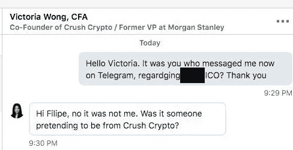

# 底线——合适的项目

好的项目有一个软上限和一个硬上限，反映了他们试图完成的目标。

糟糕的项目花费太多的钱在他们的项目上，或者进行激进的营销，而一个具有强大用例的项目不需要这种先令。我见过许多 ico 为了在顶级网站上获得(更准确地说，贿赂)高排名评论而支付惊人的金额。可悲的是，这类网站并不关心项目的好坏，而只关心搭上这辆炒作列车能赚多少钱。在我看来，如果一个项目被证明是一个骗局，他们就是同谋，特别是如果他们发布任意积极的评论并误导人们。

在我参与的每一个 ICO 项目中，我都明确建议他们首先建立一个面向公众的项目原型。这完全是一个长期愿景与透明度相结合的问题。老实说，没有这些方法，项目注定会失败。

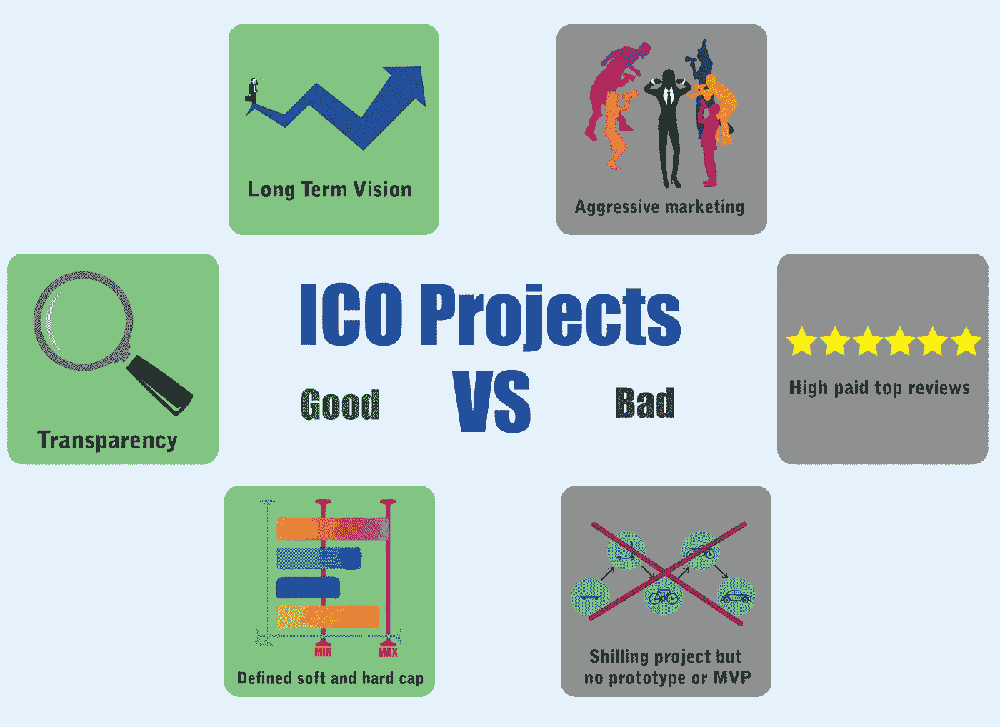

Good vs. Bad ICO Projects

我希望你能从我在 ICO 领域和区块链工业的经历中学到一些有价值的经验。在你把时间和金钱托付给一个项目之前，要保持警惕，做好你的研究。

> 伙计们，要透明，不要贿赂，保持加密空间干净，因为它已经被愚蠢的淘金者污染了。