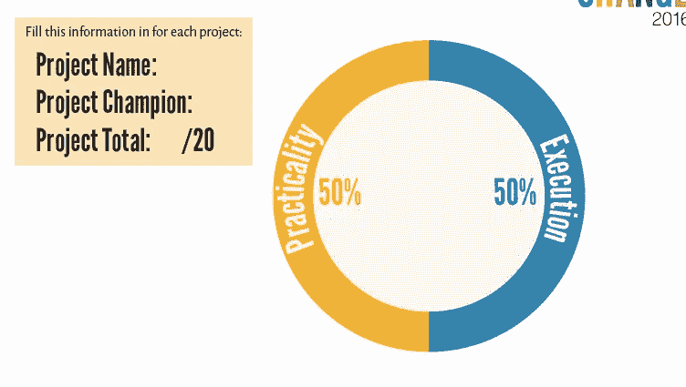
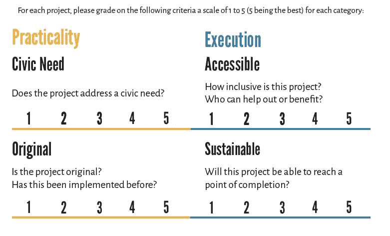
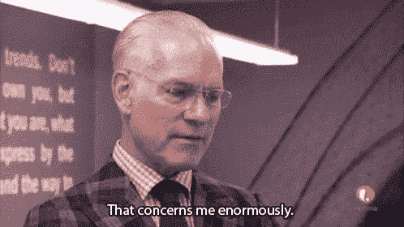
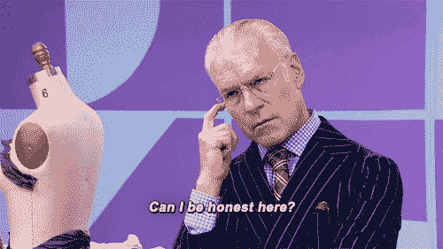

# 提高黑客马拉松裁判水平的 3 个最快方法

> 原文：<https://medium.com/hackernoon/3-fastest-ways-to-improve-as-a-hackathon-judge-a9fad17305fd>

你刚刚被邀请成为黑客马拉松的评委。**现在怎么办？**

首先，恭喜你！

其次，这里有三个技巧帮助我评估项目以及它们在黑客马拉松环境中的成功。

# 要求一个标题。

根据黑客马拉松的运行方式和奖励方式，拥有一个项目评估表/标题的基线会非常有帮助。

在活动开始前，花点时间通读你手头的所有材料。重要的是要掌握什么样的项目/挑战正在被破解，并开始对你必将见证的创造力形成想法。

现在，公民黑客马拉松变得更加棘手，因为我们超越了正常的“令人印象深刻”和“技术难度”的标准，而是着眼于社会影响方面。但这是我们所做的工作，它离完美还很远，但它是有效的。

ATX Hack for Change 2016–17

标准通常是以下几种:

*   X% —用户体验/设计
*   X% —创新
*   X% —“惊喜”因素
*   X% —影响/可持续性
*   X% —技术难度
*   X% —协作

但是一定要熟悉。这对你有帮助。这有助于黑客。它帮助活动主办者。

# 尊重 da tech。

这个总是很有趣。作为一个非技术人员，但在许多方面是一个建设者，我知道从零开始并试图一路解决问题是什么感觉。一边造飞机，一边开飞机，太棒了。

我花时间观察黑客，提出问题，并了解他们使用什么工具来构建他们的想法的基本原理。你不必精通技术，也能欣赏完成产品的创造力、激情、动力和天赋。

Leo has spoken

我鼓励第一次当评委的人，甚至那些以前参加过黑客马拉松的人，坐下来看看网站是如何建立的，应用程序是如何测试的，图形设计师是如何制作你以后会点击的按钮的……所有这些不仅会增强你的理解，而且你会承认黑客们的工作和努力。也许学到了新东西。

这有点像“天桥骄子”,在那里你可以看到团队经历整个过程，并欣赏他们为了越过终点线必须走多远。

向蒂姆·古恩欢呼。

# 滴答。托克。

我觉得这在评判量规上强调的不够。在未来，我想在一次黑客马拉松上创建一个文档，记录项目如何快速地发展成一个最小可行的产品。当你拥有团队中的所有技能，并且所有人都朝着一个方向一致时，这绝对令人震惊。

我们似乎专注于结果和“惊喜”因素，而忘记了时间有多重要。

作为一个喜欢以最佳速度跑步以确保高质量轻松完成任务的人，这是关键。团队是否在短时间内创建了新的工作流程？(让我们体会一下一些组织中的人是如何在一起的几个月甚至几年里都无法克服这个障碍……)让我们给予该给予的信任。

问问你的活动组织者，黑客到底要攻击多少个小时。我还是一直心存敬畏。

这就是了。

祝你好运，最重要的是，玩得开心！黑客们真的很努力，所以我完全赞成给出建设性的反馈，但是**不要忘记在你的陈述中加入你喜欢的积极的东西。**

不是作家…只是一个写东西的公民黑客。在下面分享你的规则和判断技巧。我知道外面还有更多。