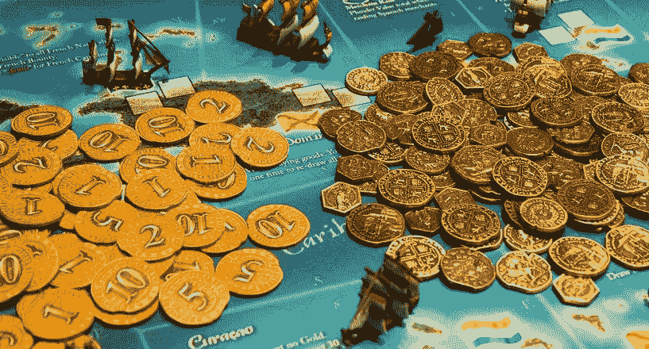

# 区块链可以增加游戏收入的 3 种创新方式

> 原文：<https://medium.com/hackernoon/3-innovative-ways-the-blockchain-can-ramp-up-your-in-game-revenue-c00cc92c661e>

游戏开发是一项高风险、高回报的业务，需要在编程、数学、声音和图形设计方面进行大量投资。因此，可以理解的是，开发者对承诺和花钱购买像区块链这样的额外技术持谨慎态度。好消息是，有一些令人敬畏的项目正在进行中，旨在使区块链轻松无缝地集成到您的游戏中。

游戏中的物品和支付正在被分散化。有了合适的工具，你不仅能接触到有用的新技术。你将向一个真正的全球游戏社区开放你的游戏。然而，要做好这件事，你必须成为大规模行业改造的一部分。

# 从游戏中赚钱

互联网彻底改变了视频游戏行业的经济状况。以前很简单；制作一个游戏，然后以固定价格卖给玩家。网络游戏的发展让事情变得更加复杂。玩家现在想和来自世界各地的其他玩家一起玩像[魔兽世界](https://worldofwarcraft.com/en-us/)这样的游戏，赚取游戏中的货币和物品，互相交易，体验不断发展的虚拟世界。如今，游戏在发布后很长一段时间都需要投资和开发。

结合这一事实，[开发成本失控](https://www.economist.com/blogs/economist-explains/2014/09/economist-explains-15)以及[许多类型游戏的零售价格实际上正在下降](http://au.ign.com/articles/2013/10/15/the-real-cost-of-gaming-inflation-time-and-purchasing-power)，你就能明白为什么这个行业需要新的创意。旧的经济模式在这种新环境下不起作用了。开发人员现在正在尝试不同的方法来利用他们的技能和创造力赚钱。

对一些人来说，广告和额外的可下载内容是很好的持续收入来源，但许多玩家对这种模式的发展方向感到沮丧。我们将会看到游戏行业正在开发的最激动人心也最具争议的方法:游戏内购买。

# 游戏内交易

我们之前都遇到过游戏内交易，尤其是手游。许多手机游戏可以免费下载和使用，但某些功能会被锁定，直到你付费。这些游戏被称为免费游戏。

自 21 世纪以来，游戏中 1-5 美元的小型“微交易”也开始进入主机游戏。这种商业模式的第一个例子是有争议的[马甲包](https://marketplace.xbox.com/en-US/Product/Horse-Armor-Pack/00000000-0000-400c-80c0-0000425307d1):一个 2.50 美元的《上古卷轴 4:湮没》的附件。游戏社区对这一发展有[不同的反应。可以理解的是，有些人讨厌在支付游戏的全价后还要支付更多费用的想法。但其他人喜欢这个想法，他们非常乐意为游戏中的额外服务付费。有时，他们定期支付数百甚至数千美元来获取这些项目。](https://www.usgamer.net/articles/the-history-of-gaming-microtransactions-from-horse-armor-to-loot-boxes)

游戏内购买和微交易让玩家想花多少就花多少。许多游戏玩家可以免费或以大幅折扣的价格玩史诗游戏，而挥金如土的人可以挥霍新角色和物品，在这个过程中支付游戏的大部分开发成本。我们已经看到这种情况在移动市场发生，在某个时刻 [50%的移动游戏收入来自仅仅 0.15%的玩家](https://venturebeat.com/2014/02/26/only-0-15-of-mobile-gamers-account-for-50-percent-of-all-in-game-revenue-exclusive/)。

这种新模式需要一种不同的思维方式。Xbox Live 的总经理卡姆·费乐理说，“你必须停止把视频游戏看作一个玩具，而开始把它们看作一种娱乐服务。”

那么，作为一名开发人员，有什么工具可以帮助您交付这种娱乐服务，而不需要大量的时间或财务投资呢？

# 当前平台

像 Steam 和 Roblox 这样的平台是目前游戏开发者创造和向玩家营销游戏内物品的最佳渠道。Steam 允许开发者使用他们的市场和游戏内支付途径来销售游戏内物品，并从游戏中持续产生收入。Roblox 是一个游戏开发平台，可以让你开发游戏和物品卖给其他玩家。虽然这些平台已经向开发者支付了数百万美元，但它们并不完美。

支付速度很慢，信用卡和贝宝的交易大大减少了小额交易的利润。Valve 在 Steam 上的交易份额没有公布，但显然它在 30%左右。 [Roblox 市场费用差不多](http://roblox.wikia.com/wiki/Marketplace_fee)。市场也受到严格控制，相互之间以及与其他游戏市场隔离。迫切需要一种新的商业模式。

# 游戏内货币化的区块链解决方案

区块链是许多这些问题的理想解决方案。它不仅会让事情变得更简单，还会改变我们对游戏的看法。

这也不仅仅是猜测。第一届区块链奥运会开幕了，人们为之疯狂。这一切都始于 Crypto Kitties，一款基于区块链的游戏，它允许你拥有和繁殖新的卡通猫。[每个加密猫都是](https://www.cryptokitties.co/)“独一无二的，100%归你所有；它不能被复制、带走或摧毁。”它们是*密码收藏品*。这款游戏非常受欢迎，有时它占据了以太坊网 30%的交易量，某些猫咪的售价高达数万美元。[仅在头几个月，Kitty 的总销售额就超过了 2200 万美元](http://kittysales.herokuapp.com/)，Crypto Kitties 背后的开发者从每笔交易中抽取 3.75%的佣金[。对开发者来说，秘密资产交易可能非常有利可图。](https://motherboard.vice.com/en_us/article/d3xpnj/cryptokitties-maker-axiom-zen-its-crazy-interview)

Crypto Kitties 只是开始。简化的交易、数字资产的真正所有权以及与电子竞技博彩的无缝集成是区块链技术对开发者和玩家的一些直接好处。有一些杀手级项目可以帮助开发者实现这一目标。

# 1.加密货币:游戏内货币 2.0

简化交易是实施区块链技术后最直接的好处。加密货币交易发生在区块链上，如果实施得当，它们快速、安全、廉价。

有了加密货币，游戏中的交易只需几分钱，几秒钟就能完成。这使得真正的微交易前景更好，尤其是对开发者而言。即使是最便宜的游戏道具也能有很大的利润空间，钱几乎瞬间就到了你的账户里。

游戏中的数字硬币和货币并不新鲜，与加密货币不同的是它们是*去中心化*。这意味着交易不需要通过中央服务器。想想比特币如何在交易中消除对银行的需求。这意味着玩家要对自己的代币负责，并把它们存放在自己的钱包里。作为一名开发者，你不需要担心安全、欺诈、退款以及其他许多令人头疼的问题和法律问题，这些都是运营一种集中的虚拟货币的责任。

另一个很棒的事情是，你甚至不需要自己实现这一切。 [BitGuild](https://www.bitguild.io/) 是一个让开发者更容易使用加密货币的项目。该平台的核心将是一种名为 PLAT token 的游戏专用加密货币。玩家将能够使用 PLAT 代币购买和交易游戏、游戏中的物品和货币。

这个想法是让区块链即插即用。当平台完成后，你将能够轻松地将 PLAT payments 直接集成到你的游戏中。无需设置所有不同的支付渠道，游戏内支付和微交易都将可用。玩家可以购买或赚取 PLAT 代币，并在任何使用 BitGuild 平台的游戏中使用它们，或者他们可以出售代币来套现。

游戏内经济是一件大事。在 2012 年，他们已经成长为一个[150 亿美元的产业，仅魔兽世界](https://www.superdataresearch.com/monetization-is-a-four-letter-word/)就有[20 亿美元。加密令牌可以让这些经济体再次扩大一个数量级。](https://venturebeat.com/2016/12/25/5-lessons-from-the-15-billion-virtual-goods-economy/)

然而，加密货币确实带来了新的瓶颈。区块链交易不能退款，玩家要对自己的货币负责。这意味着如果玩家和开发者不小心，就有可能出现无法逆转的黑客攻击，就像我们在比特币上看到的[攻击一样。此外，以太坊和比特币区块链目前也存在拥堵问题。有一些](http://fortune.com/2018/01/26/bitcoin-price-coincheck-nem-mt-gox/)[有希望的解决方案正在等待](https://www.computerworld.com/article/3245928/emerging-technology/ethereum-explores-a-fix-for-blockchains-performance-problem.html)，但如果情况变得更糟，这可能会成为一个问题。

# 2.游戏中资产的真实所有权

你有没有想过你新买的反恐精英皮肤很酷？想象一下，同样的物品，但是永久居住在区块链，被证明是独一无二的，并且存放在你自己的钱包里。这才是老板！

数字代币不仅仅代表货币。像物品和皮肤这样的游戏资产可以与它们独特的外观、特征和历史一起被编码到加密令牌中。比特币作为一种货币发挥作用，因为比特币不能被复制或复制。同样的情况也会发生在游戏中的资产上。这些特点意味着玩家将能够真正拥有他们的数字资产。物品都是完全独特的，就像现实世界中的物品一样。

Crypto Kitties 证明了人们喜欢真正拥有数字物品，很容易看出这种想法如何转化为视频游戏世界。如果人们为独一无二的猫而疯狂，想象一下，当独一无二的角色和具有自己历史和特点的物品可以在流行游戏中使用时，会发生什么。

[金恩币](https://enjincoin.io/)为此提供了一个平台。您可以使用金恩硬币“铸造独特的游戏内物品、货币和虚拟代币，使用金恩硬币作为母货币。这些资产可以随时转换回 ENJ。”

基于以太坊，它是一个开源智能合同和软件开发工具包的集合，您可以使用它轻松地将区块链集成到您的游戏中。你的玩家甚至可以在其他使用金恩币的游戏中交换资产。金恩已经是一个强大的社交游戏平台，拥有一个共同的分散货币市场可以让这些社区更加团结。

《反恐精英:全球攻势》刚出来的时候被普遍认为是个败笔。直到他们发布了武器交易更新，允许玩家互相交易武器皮肤，并“体验黑市武器交易的所有非法刺激”在那次更新之后，[的月玩家数量暴涨](https://associate.vc/how-virtual-weapons-created-a-booming-economy-3da2da0fec79)，在接下来的三年里增长了 26 倍。这是一个荒谬的跳跃，同样的事情也可能发生在整个游戏行业。

玩家们乞求互相交换有用和独特的物品。像金恩币这样的区块链平台可以帮助你将这些功能集成到你的游戏中，并在这个过程中开辟新的收入渠道。

至于加密货币，令牌化物品的一个潜在问题是玩家必须对其负责。开发者需要找到方法来帮助所有玩家有效地做到这一点。此外，物品只能在使用相同区块链的游戏之间转移。选择正确的将是重要的。

# 3.比赛中的直接投注

像 [Twitch](https://www.twitch.tv/) 这样的流媒体平台已经把电子竞技带到了大联盟。该行业预计到 2020 年将拥有超过 5 亿的观众。但是仍然缺少一种关键的成分。打赌。在常规体育运动中，在一场比赛上下注的收入远远超过其他任何事情的收入。到目前为止，电子竞技博彩市场还没有取得同样的成功。

电子竞技博彩已经以数十亿美元计，但该行业在美国等国家受到禁止性法律的严格限制。潜力是存在的，但是大部分赌注都集中在少数几场比赛中。主要游戏是英雄联盟[，它拥有 38%的市场份额](https://www.esportsbettingreport.com/guide/)和比 NBA 总决赛更多的观众。这一切都是在短短几年内完成的。

但是一个大问题是禁止性的法规。事实上，电子竞技博彩在美国是被禁止的。 [Unikrn](https://unikrn.com/) 是一个老牌的电竞博彩平台， [UnikoinGold](https://static.unikrn.com/4242/unikrn_bm/doc/whitepaper_en.pdf) 是他们解决这些问题的区块链方案。他们打算利用加密货币的力量在全球范围内开辟电子竞技博彩。用户将能够在职业电子竞技比赛中下注，在竞争性视频游戏比赛中为 UnikoinGold 比赛，并举办锦标赛。不需要银行账户。

开发者应该对此感到兴奋。UnikoinGold 将是 Twitch 等平台的扩展，可以允许玩家对他们从游戏启动器中流出的游戏进行下注。只需插入它，并为玩家提供一个完全无摩擦的流/下注体验。

# 结论

视频游戏行业比以往任何时候都更大，联系也更紧密，区块链科技正在展示它如何开辟全新的游戏赚钱方式。有一些很棒的新项目让开发者更容易将这些功能集成到他们的游戏中。区块链不能帮助设计角色或创造史诗般的战斗，但它可以照顾[游戏内的货币化](https://howtotoken.com/for-developers/in-game-monetization-using-a-blockchain-platform/)。精明的开发者正在试验区块链，许多人已经从中赚到了钱。那些没有这样做的人有被落在后面的危险。

## 关于作者:

基里尔·希洛夫——geek forge . io 和 Howtotoken.com 的创始人。采访全球 10，000 名顶尖专家，他们揭示了通往技术奇点的道路上最大的问题。加入我的**# 10k QA challenge:**[geek forge 公式](https://formula.geekforge.io/)。