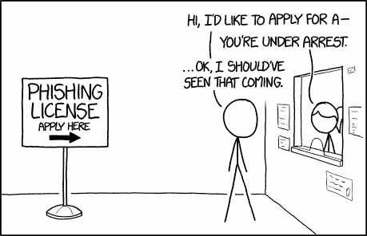

# 你需要知道的 3 种流行的区块链

> 原文：<https://medium.com/hackernoon/3-popular-types-of-blockchains-you-need-to-know-7a5b98ee545a>

## 区块链的三种流行类型

我花了一段时间去理解区块链。现在有多种类型？啊？目前，有三种类型的区块链，因为这是一个新兴领域，我不能向你保证一个数字。

# 无权限区块链

这个，你已经知道了。比特币、以太坊就是这种区块链的例子。在这种类型的区块链中，我们没有授权批准交易。让我们考虑一下比特币。这是一个共享的分类帐。如果我给你发 5 个比特币，我就对网络里的人喊。

***“伙计们，看我给了这家伙 5 个比特币”。***

炫耀，是不是？比特币网络中的人会听到我的信息，并开始验证交易的过程。验证交易的人不是被选中的人。我们无法预测谁有发言权。关键是没有一个人有权力验证交易。当你希望你的系统真正民主时，可以使用无权限区块链。任何人都可以创建智能合同、转账或贡献数据。在这种情况下，用户可能会保持匿名。是的，你可以在无权限的区块链中保护敏感信息。

***“卢克想开发一个应用程序，任何人都可以在这里发表自己对政党的看法。他想保护投稿人的隐私。”***

在卢克的情况下，我们可以使用无许可的区块链。任何地方的任何人都可以在这个应用上发表自己的意见。任何当局都不能删除他们的意见，这些意见将被永久记录下来。

Credits : [xkcd](https://xkcd.com/1200/)

# 公共许可的区块链

在这里，我们选择了批准交易的人。它可能是一个权力机构，高级雇员，政府，机构或任何指定的人。公众可以查看数据(敏感信息可以得到保护)。

***“以利沙希望给金枪鱼供应链带来透明度。她希望人们知道鱼是在哪里被捕获、加工、包装等的***

在这里，当你购买这条鱼时，你可以扫描代码，从它被捕获的那一点开始追踪它的旅程。只允许您查看数据。你没有权限写任何东西。渔民的 IOT 设备被允许在鱼被抓住时写入数据。加工鱼的食品加工者被允许写数据等等。公众把数据写入其中是没有意义的。在这里，像任何区块链一样写入的数据被永久记录。

Credits : [xkcd](https://xkcd.com/1694/)

# 私人许可的区块链

这类似于公共许可的区块链，除了一件事。公众无法查看这些数据。

***“Sara 的生意涉及另外两家小企业和一家会计事务所。他们相互之间有定期的交易。”***

在 Sara 的情况下，她与其他企业的交易属于私人信息。它不应该对公众开放。然而，数据是永久记录的。在这里，当他们彼此交易时，他们不必维护单独的分类账。每笔交易都会被即时记录。

我希望你对区块链的类型有所了解。选择合适的区块链是必须的，你将节省金钱和时间。在某些情况下，你甚至不需要区块链。我在这里准备了一份[问卷，帮助你决定是否需要区块链。在未来的日子里，我们可以期待区块链的更多创新。](/wethinkideas/how-to-validate-if-your-ideas-need-a-blockchain-e1a4846d16fd)

***拍手请*** 👏，*谢谢*😊。*关注我们，*[*HackerNoon*](https://hackernoon.com)*和我(*[*Febin John James*](https://medium.com/u/75a616711f4e?source=post_page-----7a5b98ee545a--------------------------------)*)了解更多故事。*

我想向您介绍两款加密产品。 [*比特币基地*](https://www.coinbase.com/join/58d416ab6586f20e3eb10647) *是一款简单易用的加密货币钱包，支持比特币、以太坊、比特币现金和莱特币。* [*赚*](https://earn.com/febin/referral/?a=rzjbj73qc4dhiv6y) *付给你读邮件的比特币。*

