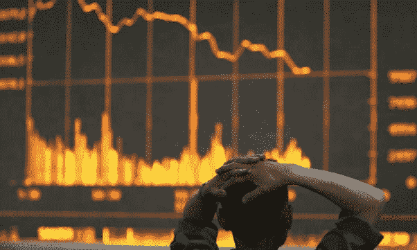

# 比特币崩溃的 3 个原因&为什么你应该停止恐慌

> 原文：<https://medium.com/hackernoon/3-reasons-bitcoin-crashed-why-you-should-stop-panicking-32848b6bda40>

我希望你喜欢你的熊市洗礼。

*Image courtesy of* [*ElevenNews*](https://elevenews.com/2018/02/06/bitcoin-crash-cryptocurrency-plummets-60-per-cent-in-month-as-market-continues-to-tumble/)

每当我教某人如何参与加密货币投资时，我知道每当市场遭受损失时，我都会接到那个人疯狂的电话，询问他们的钱都去了哪里。

每次都是这样，毫无例外。

我不是在抱怨，我认为这个市场上的更多人应该尽力帮助新投资者——这是这个市场发展的唯一途径:这符合我们作为当前投资者的最大利益。

**很难确定到底是什么导致了比特币最近的回调。**

关于加密货币的法规有几个新的发展，可能会影响价格。无论催化剂是什么，这都是一次正常而健康的市场调整，如果有什么不同的话，应该会让你松一口气。

**不要惊慌。**

泡沫没有健康的市场修正。比特币(以及大多数其他加密货币)刚刚结束了一个历史性的牛市周期。

> 历史上没有一个金融市场像过去几个月加密货币那样盈利丰厚。

如果比特币的价格继续以现在的速度上涨，我会尽快退出。

这是不可持续的增长。

**泡沫就是这样破灭的。**

为了保持在 100 页以内，我将彻底简化这一点——但最近比特币价格的下跌可以归因于以下因素。

## **1。负面新闻**

一切都始于小小的恐慌。

你注意到这里的一个主题了吗？加密货币市场极其情绪化。

据我所知，有三个主要的负面催化剂在很大程度上助长了比特币的下行螺旋。

**围绕印度法规的困惑**

在我看来，人们对这条新闻给予了过多的关注。印度只是在经历每个国家都必须经历的过程，当他们的人口开始越来越多地采用加密货币时。与美国非常相似，印度正在试图确定他们希望如何监管这个市场——但由于其总理关于比特币从未成为其支付系统一部分的一些声明，人们已经开始恐慌。[【1】](https://www.quora.com/Whats-the-reason-behind-Bitcoin-s-latest-downfall/answer/Reza-Jafery-1#WZVgB)

**中国严打**

还有传言称，中国将再次打击加密货币交易所和 ICO。《金融新闻》发布了一篇文章，称中国人民银行将不再为与加密货币交易所相关的账户提供服务。

请记住，中国已经 3 次试图禁止加密货币。它总是反弹回来。[【2】](https://www.quora.com/Whats-the-reason-behind-Bitcoin-s-latest-downfall/answer/Reza-Jafery-1#bxpjp)

**韩国法规**

[虽然在主流媒体上没有这么大，但韩国也一直在增加关于加密货币的监管。](http://fortune.com/2018/01/17/china-bitcoin-cryptocurrency-crackdown/)

**信用卡加密购买现在归类为“预付现金”**

美国最近做出规定，如果有人用信用卡购买加密货币，将被视为“预付现金”。退一步说，这对那些取得进展的人不是很有利。[【3】](https://www.quora.com/Whats-the-reason-behind-Bitcoin-s-latest-downfall/answer/Reza-Jafery-1#cOGKV)

## **2。投资者在纳税季前获利/索赔损失**

回到我之前关于我们刚刚走出历史性牛市的陈述，人们正在获利回吐。比特币在极短的时间内从 5000 美元左右涨到了 2 万美元。

虽然买入接近 20，000 美元的人现在很恐慌，但仅在几个月前买入的投资者仍然信心十足。我们已经看到了大量的获利回吐，以及投资者声称的损失。

申报你的资本损失可以抵消你的资本利得税，让你可以少付给山姆大叔一些钱。

## **3。恐慌**

这是最近比特币崩盘的最大促成因素。

加密货币的独特之处在于，它是唯一一个主要由新投资者或没有接受过金融培训的投资者组成的金融市场。

这意味着，这是现存的最情绪化的市场。

我发现艾略特波浪理论是我的技术分析武器库中预测价格行为的最佳工具。

埃利奥特波背后的基本概念是，市场在这些“心理冲动波”中波动，随着老投资者要求盈利\亏损和新投资者买入，这些心理冲动波不断上下波动。

关于艾略特波浪，我可以滔滔不绝地讲上几个小时，但我还是留到以后再说吧！

**长话短说；我们处于一个极度情绪化的市场。因此，当一个催化剂出现时，比如印度监管方面的负面消息，我们会看到比传统股票或证券等成熟的投资工具更剧烈的价格波动。**

**很多交易加密货币的人，之前都没有交易过。**

当你将负面消息与*纳税季即将到来*以及机构投资者/高净值个人声称他们的损失以抵消资本利得税的事实结合起来时，你会为占加密货币市场绝大多数的不太老练的投资者制造一场大规模的歇斯底里。

> 有一点我想重申:这是完全正常的。

如果比特币不回撤其价格，让新投资者进入，并让最后一波看到足够百分比收益的投资者退出，那将非常令人担忧。

我喜欢把比特币想象成一根橡皮筋，它修正的越低，弹射的越高。

有些人会说我这样想太天真了，我还很年轻，从来没有经历过多年的熊市——但我所知道的是:

> **自 2009 年以来，买入比特币一直是一种成功的策略。**

顺便说一下，听起来不像一个戴着锡箔纸帽子的疯狂家伙，但这是一个非常疯狂的巧合，比特币的价格几乎正好下跌到大多数大型投资集团和金融机构所说的风险/回报比足以进入多头头寸的水平。

**脚注**

[【1】](https://www.quora.com/Whats-the-reason-behind-Bitcoin-s-latest-downfall/answer/Reza-Jafery-1#cite-WZVgB)[随着比特币跌至 11 月 16 日以来的最低水平，加密货币的价值蒸发了 600 多亿美元](https://www.cnbc.com/2018/02/05/bitcoin-price-drops-below-8000-over-60-billion-wiped-off-cryptocurrencies.html)

[【2】](https://www.quora.com/Whats-the-reason-behind-Bitcoin-s-latest-downfall/answer/Reza-Jafery-1#cite-bxpjp)

[【3】](https://www.quora.com/Whats-the-reason-behind-Bitcoin-s-latest-downfall/answer/Reza-Jafery-1#cite-cOGKV)[比特币基地警告称，银行现在将信用卡加密购买视为“预付现金”](https://www.marketwatch.com/story/coinbase-warns-crypto-investors-that-banks-now-process-credit-card-payments-as-cash-advances-2018-02-01)

— — — — —

## 如果你喜欢我的工作，愿意支持我严重的咖啡因上瘾，我的意思是，写作，你可以在下面找到我的 BTC/ETH 地址。

从来不期待支持，但总是感激。

**BTC:**1 F2 yaapebfxo 9 x4 FCA zu 8 ft 7 neffumugjy
ETH:0x 9852 f 8956973 e 8830 e 08 CAD 3 F2 a 7 f 6d 04 E8 d 837 e