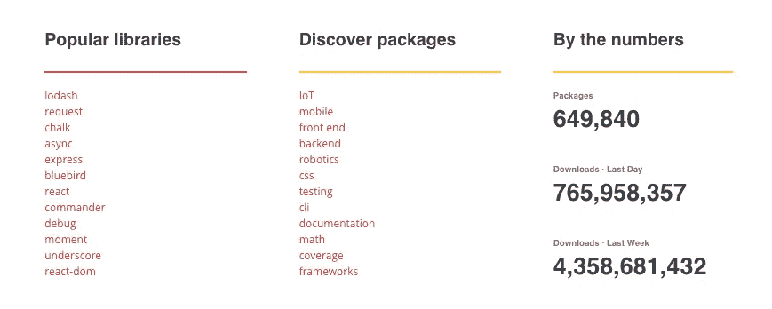
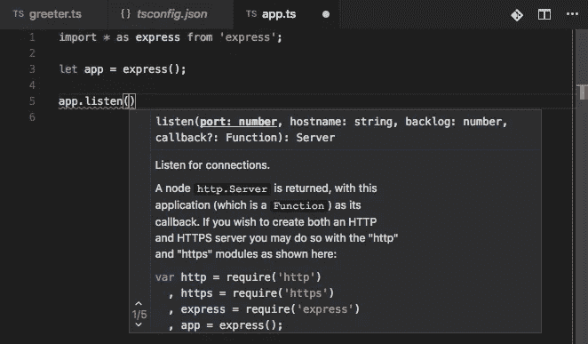

# 我们使用 TypeScript 提高开发效率的 3 个原因

> 原文：<https://medium.com/hackernoon/3-reasons-why-we-use-typescript-to-boost-dev-productivity-81044d72a57f>

Visual approximation of my productivity with TypeScript

创办一家新公司的好处之一就是你可以从零开始挑选开发团队的所有组件。我们有机会评估当今最好的语言、框架和其他开发工具。

> TypeScript 让我们避开了许多开发的痛苦

对于我们在 [Unbounded Systems](http://bit.ly/2t1A1Qx) 开发的大多数软件，我们选择了 [TypeScript](http://www.typescriptlang.org/) 作为我们的首选语言。我们发现 TypeScript 让我们避开了许多开发的痛苦，并专注于我们试图构建的东西。尽管 TypeScript 有很多方法可以帮助减轻开发人员的痛苦，但我将只关注我们认为能给我们带来最佳生产率提升的三种方法。

# 1.JavaScript 库的力量

因为 TypeScript 基本上是带有类型的 [JavaScript，所以](/@wesharehoodies/typescript-javascript-with-super-powers-a333b0fcabc9) [NPM](https://www.npmjs.com/) 上的整个 JavaScript 库仍然对我们可用。对于许多这样的模块，尤其是那些更受欢迎的模块，TypeScript 类型信息已经可用，因此我们可以立即获得类型检查的好处。虽然您可以使用没有类型信息的模块，就像您通常在 JavaScript 中一样，但是我们通常会为还没有类型信息的模块创建类型信息(一个 TypeScript [声明文件](https://www.typescriptlang.org/docs/handbook/declaration-files/introduction.html))。

Modules available on npmjs.com — 2/27/2018

大量可供 JavaScript 使用的库意味着我们可以利用许多开源项目所做的大量工作，并且花更少的时间重新发明。

# 2.学一次，到处跑

TypeScript 代码直接编译成 JavaScript，这意味着它几乎可以在任何地方运行。我们可以在浏览器中使用它，在我们的 web 应用程序前端使用像 [Angular](https://angular.io/) 和 [React](https://reactjs.org/) 这样的框架。我们可以在后端的 [Node.js](https://nodejs.org/) 环境中运行它。我们也不必担心这些不同的运行时支持哪个版本的 JavaScript，因为 TypeScript 代码可以编译到更早版本的 JavaScript……一直到 ES3。

在一个初创公司规模的工程团队中，这意味着我们可以围绕单一语言开发一个更强大的内部专业社区，我们的全栈工程师花费更少的时间进行上下文切换。

# 3.类型是你的朋友

虽然上面的前两个好处是与 JavaScript 共享的，但它是类型系统的添加，以及一个令人敬畏的工具生态系统，使我们的开发更有成效。它是验证 API 契约并尽早标记潜在错误的类型系统，而不是在测试期间发现错误。或者更糟……在生产中。

事实上，有了令人敬畏的 IDE 集成(我们喜欢 [VS 代码](https://code.visualstudio.com/))，TypeScript 编译器会递增地重新编译，在您键入时提供反馈并标记错误。这是一个巨大的生产力提升！

VS Code giving feedback as I type

如果你不相信类型的价值，2017 年[对 JavaScript 项目](http://bit.ly/2CMcdjc)的一项研究发现，用 TypeScript 或[流](https://flow.org/)添加类型能够检测到 15%的*公开报告的错误。*虽然你可能不认为 15%很大，但是考虑到研究是在已经提交的代码上进行的，这些代码已经通过了项目的测试和评审过程*。试想一下，如果您的工具在您输入时标记了错误，您可以避免在单元测试中发现多少错误。*

# 到处都是打字稿？

虽然 TypeScript 是我们在大多数地方使用最频繁的语言，但它仍然不是所有问题的答案。也有一些地方不适合使用 TypeScript。在后续的文章中，我将介绍为什么以及在哪里使用 [Go](https://golang.org/) 、C++、JavaScript 和 Python。

在我们的[博客](http://bit.ly/2t3yklI)、 [Twitter](http://bit.ly/2t1Gqv3) 和 [YouTube](http://bit.ly/2t66FAF) 上与[无界系统](http://bit.ly/2t1A1Qx)联系，跟上最新的开发工具和趋势。偶尔咆哮一下。

> 最初发表在[无界系统博客](http://bit.ly/2t3yklI)上。