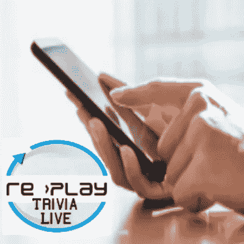
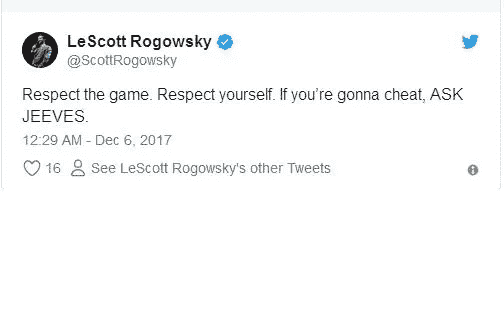
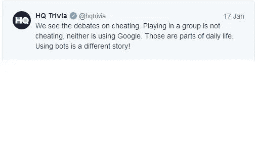

# 你应该知道人们用来欺骗直播琐事应用游戏的 3 个秘密而简单的方法:

> 原文：<https://medium.com/hackernoon/3-secret-and-easy-hacks-people-use-to-cheat-live-trivia-app-games-you-should-know-be4ffa1442be>

Hot New Live Trivia App Game offers $1,000,000 prize soon! (http://www.replaytoken.com)

数百万用户每周登录玩 HQ 琐事和 Q 平台，而一些人试图简单地欺骗系统来轻松赚钱。对于像我这样的移动应用程序游戏创作者来说，将作弊排除在系统之外是一个问题。我将讨论人们作弊的三种方式，以及平台可以帮助最小化作弊的方式之一。

> 我知道，每当你捐出大笔资金时，总会有人试图欺骗系统。当我创建一个最受期待的新应用游戏“Re>Play Trivia Live”时，我使用了一种相应的新游戏加密货币 Re>play Token。(http://www.replaytoken.com)，我得到的一个一致的问题是，“你将如何阻止作弊机器人？”

《华盛顿邮报》、*雅虎财经*、 *TechCrunch* 、 *Vox* 和其他媒体机构估计，随着总部和 Q 琐事平台在受众规模和容量方面领先，琐事应用游戏的受众规模正在爆炸式增长。

这些估计得出的结论是，超过 200 万人在一个游戏中玩过。据*华盛顿邮报*报道，奥斯卡颁奖典礼电视转播期间有 210 万用户玩 HQ Trivia，根据*维基百科*报道，2018 年 3 月单场比赛期间有 256 万用户。

但也是在今年 3 月，HQ trivia 应用程序游戏版主为他们的 25，000 美元游戏竞赛解雇了一名参赛者，并指控他作弊。据《每日野兽》报道，当 Jeric Brual 和 Kayla 在 Discord 聊天中谈论他们如何欺骗系统时，已经有将近 170 万人登录玩这个游戏。HQ 平台启动了 Jeric。

为了庆祝它在 iOS 和 Android 上的 Q 平台上发布，我的 live trivia 应用程序游戏，" *Re > Play Trivia Live！*"将是第一款送出 1，000，000 美元 Re >游戏代币的现场琐事应用游戏(http://www.replaytoken.com)。

目前还没有任何一款直播琐事应用游戏出价 100 万美元。HQ Trivia 已经提供了巨额奖金，其中包括根据*美国消费者新闻与商业频道*、 *CNET* 和*福克斯新闻频道*提供的 30 万美元奖金，但还没有 100 万美元和" *Re > Play Trivia Live！*“是第一个开出这么大一笔款子的。

> 所以保护游戏免于作弊将是我和我们团队的第一线努力！

首先想象一下，像 HQ trivia 和 Q trivia 这样的平台“每款游戏”都有数百万用户。据《每日野兽》报道，170 万用户将获得 25000 美元的奖金。因此，你可以想象将会有数百万用户登录到" *Re > Play Trivia Live！“带着一个一百万美元的钱包。*

所以我担心吗？我当然很担心，我们已经从战略上规划了我们认为可行的解决方案。

但是为了理解解决方案，首先我要分享三种当今人们作弊的秘密而简单的方法。

1 **)谷歌**:HQ Trivia 主持人 Scott Rogosky 在 2017 年 12 月的一条推文中指出了三种作弊方式之一。当被问及他是否觉得谷歌搜索一个问题是作弊时，他表示是的，但也提供了另一种选择:“尊重游戏。尊重你自己，如果你要作弊，去问吉维斯。”他发了微博。

HQ Trivia host Scott Rogowsky’s Tweet: (TWITTER)

2 **)自动化/机器人**:从自动化的计算机中获得答案。一直有媒体报道称，电脑和机器人困扰着总部琐事。《每日野兽》报道称，一名程序员在一月份吹嘘自己创造了一个能为游戏给出正确答案的机器人。

—有一种方法可以对抗自动化和机器人，我们正在研究这个计划。通过注入计算机无法识别的人为因素。

Re>Play Trivia Live! (Re>Play Trivia)

3 ) **群玩:**获取优势的方式之一就是加入用户群，比如 *Discord* 、 *Reddit* 等聊天室上的用户群。虽然一些平台认为这些团体获取了不公平的优势或作弊，但一些平台对此完全没有意见。— HQ Trivia 在 2018 年 1 月发推文称，虽然他们不认为群体答案或使用谷歌是作弊，但他们肯定认为使用机器人和自动化是作弊。

HQ Trivia’s Tweet (TWITTER)

> -这些场景的解决方案是非技术性很强的解决方案。我称之为“超人性化”的游戏。

帮助应对这三种情况的一个方法是一个非常非技术性的解决方案，我们已经将它融入到我们的游戏中。

每一种作弊方式都依赖于公开的问题答案。为了打击这些作弊方式，直播琐事应用游戏需要使用只有主持人/主持人知道答案的问题，并且这些问题可以由问答团队验证。

我们都看过 reCaptcha，它能让你识别出哪些照片中有标志、桥梁或汽车？这些之所以有效，是因为它们需要人为干预。

直播琐事元素应该通过使用只有主持人知道的东西来帮助打击作弊，例如，主持人的图书证号码或其他一些可验证的形式(我故意给出一个弱的例子)。这将需要一种手动的双因素识别。这将最终与赞助商一起使用，使修复成为增加游戏趣味的机会。

这个例子实际上需要另一个步骤，我故意忽略了，因为我们可以被其他游戏和骗子复制，他们会努力工作，试图找出如何击败我们的新系统。

所以这应该能解决大部分问题。这将消除自动化、机器人和谷歌。一个人仍然可以利用群体来获得答案。我们也不会消除这一点，但这会让它变得更加困难。

当你想玩我的游戏" *Re >玩琐事直播！*，“跟随 Re >播放令牌获取信息和更新。

# http://www.replaytoken.com

# trivia app # gaming app # live trivia #以太坊#区块链#加密货币# mobile gaming # mobile game # alt coin # ICO # token # game # game