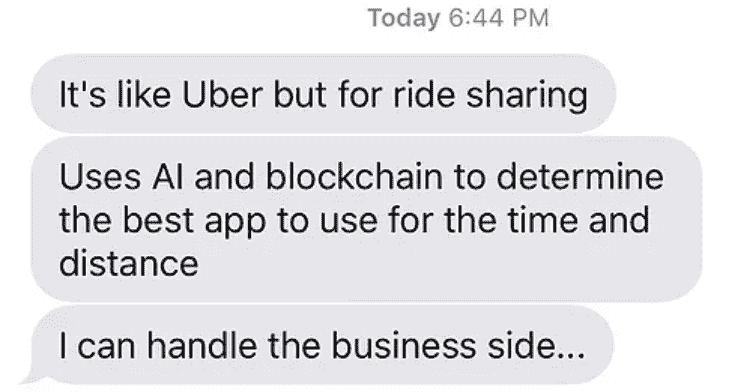
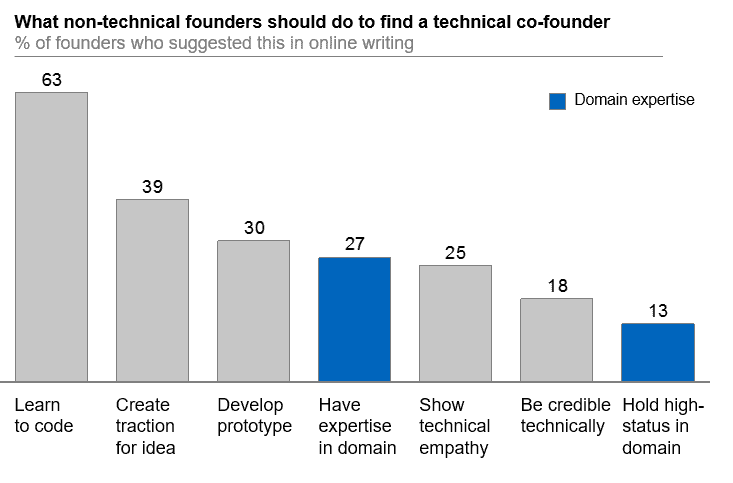
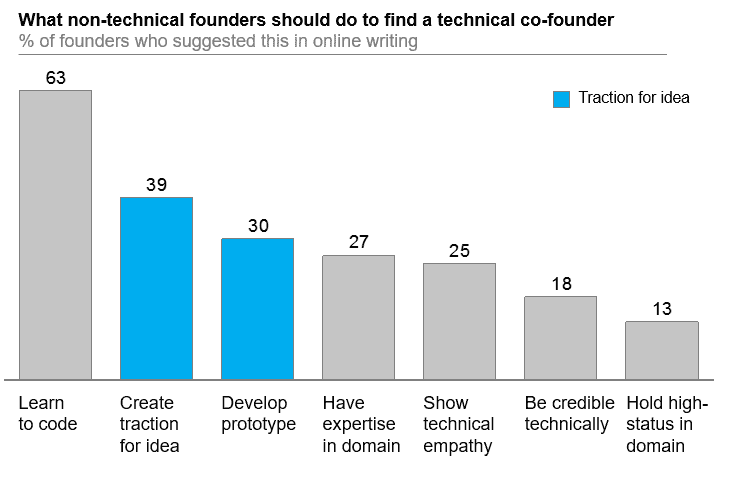
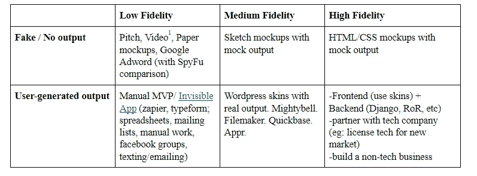
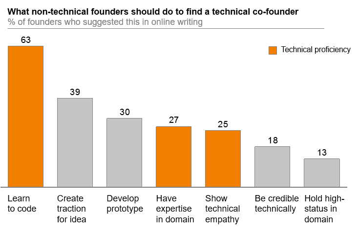

# 寻找下一个技术合伙人的 3 个策略，不要看起来像个白痴

> 原文：<https://medium.com/hackernoon/3-strategies-to-find-your-next-technical-co-founder-without-looking-like-an-idiot-fc184d733b9a>

培养专业技能、牵引力和技术熟练程度。不存在“商业方面”——你现在就要尽一切努力建立一个可行的企业。

**由** [**吴彦祖**](https://www.linkedin.com/in/wu12345/) **和** [**斯蒂芬·图班**](https://www.linkedin.com/in/stephenturban/)

五个字可以终结你的创业梦想:[“我来处理业务方面的事情。”](https://www.facebook.com/groups/1401833413216649/)

对于一代程序员来说，非技术型联合创始人的想法已经从糟糕变成了有价值的迷因。这个形象并不讨人喜欢——一个有着古怪创业想法的兄弟，想要在通往 CEO 的道路上使用和处置程序员。

*如何不接近技术联合创始人*

但是，等等，如果你*是*一个没有专业技能的人，却对[一家初创企业](https://hackernoon.com/tagged/startup)感兴趣，那该怎么办？显然，非技术型创始人也能成功；看看 AirBnB 的布莱恩·切斯基或 LinkedIn 的雷德·霍夫曼就知道了。如何成功展现自己的价值，找到技术联合创始人？

为了回答这个问题，我们开始了一个非正式的研究项目，涉及 50 多名技术和非技术联合创始人。我们的元分析包括一个定量部分——我们使用这些创始人的博客和写作来统计非技术型创始人的理想特征——和一个定性部分——我们在一系列一对一的采访中验证这些想法。

绝大多数情况下，我们的创始人都同意一件事:有生命力的公司不能被无组织地分成商业和技术两个“方面”[有经验的技术人](http://paulgraham.com/schlep.html)都知道这个。相反，公司需要专业知识、牵引力和技术技能的结合。作为一名非技术型的联合创始人，你需要建立证据证明你会让业务发生，而不仅仅是处理业务“方面”

具体来说，对于寻找技术联合创始人的人来说，我们认为三个行动是关键:

1.  专业知识——表明(只有)你能够发展和推销这个想法；
2.  为你的想法牵引——证明你的想法有价值，有牵引力；和
3.  技术熟练——发展你需要的技术技能*。*

***行动 1:展示你可以发展和推销这个想法***

**

*为什么是你？你找到了一位技术创始人，他的想法很有吸引力。太好了。为什么他们会想和你一起工作，而不是另一个朋友？还是和其他搞技术的人？*

*为了证明你的价值，表明你，也许只有你，可以发展和推销这个想法。我们的大多数创始人都认为，你需要展现出对用户和问题的专业知识。*

*以 Zott 为例，这是一家迅速发展的娱乐发行公司，主要面向住院儿童。联合创始人之一泰勒·卡罗尔(Taylor Carol)在 11 岁时被诊断出患有白血病。在接下来的五年里，他进进出出医院病房——偶尔，一次被困在隔离室几个星期。正如他[所说，](https://gamechangercharity.org/)“在接受治疗的几个月里，视频游戏是我的逃避。”*

*泰勒不是技术型的；但是，他带来的是对病人经历的深刻理解。很难想象没有他或者像他这样的人，能创建一个面向患者的内容公司。因此，当他和他的父亲一起开始 Zott 时，他们的技术领导人正在寻找加入的机会。*

***要吸引技术型联合创始人，你应该展示出你是他们和问题之间的粘合剂。当这是一个你亲身经历过的痛苦问题时，就变得更容易了，就像泰勒一样。***

*也许你太在乎这个问题了，你以前已经尝试过解决它了。泰勒从癌症中康复后，他和父亲一起创建了一个非营利组织来解决这个问题。他们共同创立了 Game Changer charity，这是一家 501c3 公司，与科技公司合作，为医院里的儿童提供视频游戏和娱乐。迄今为止，他们已经为儿童医院娱乐活动筹集了超过 1600 万美元。*

*你的故事就是你的卖点。因此，记录并展示你在这个问题上的经历、失败和成功。展示现有的解决方案很糟糕——尤其是因为你已经尝试过用它们来解决你的问题。说服业内人士给你建议，并宣传他们的支持。所有这些都让你成为一个有吸引力的联合创始人。*

***行动 2:建立强有力的证据，证明这个想法是有价值的，有吸引力的***

**

*相当一部分创始人认为，当一个非技术型的联合创始人有一个已经有吸引力的想法时，他们会处于更有利的地位。原因很简单——你不能仅仅通过写代码来创建一家公司。*

*想象两个场景，在这两个场景中，你都是在 Stripe 工作的后端工程师。你有一个朋友带着一种新型点对点支付的想法来找你。*

**场景 A(低吸引力):你的朋友拿着几张幻灯片走近你。他告诉你，他已经和十几个朋友谈过了，他们似乎都喜欢这个主意。“我们将成为下一个文莫，”他告诉你，他的眼睛闪烁着可能性。**

*场景 B(高吸引力):你的朋友带着一个难以置信的花哨的 iphone 应用接近你。这款应用速度很慢，但他告诉你，只有几十个人在积极使用这款应用，还有数百人在等待名单上。他的客户来自于他手工解决问题的努力。他向你展示了一些来自一些用户的热情洋溢的评价。“我认为这里有一些东西，”他告诉你，他的眼睛也闪烁着可能性。*

*如果你和大多数人一样，你第二个朋友眼中的闪光更有吸引力。人们正在*使用*这款应用——更好的是，这款应用的零碎版本——这一事实表明，这款应用有增长的兴趣和潜力，而不是抽象的想法。*

***你如何为一个想法建立牵引力？正如我们的创始人所说，你必须用越来越多的可信度来检验假设；然后跟踪结果，表现出兴趣。***

*就拿 [Airbnb](https://www.businessinsider.com/how-airbnb-was-founded-a-visual-history-2016-2#a-month-later-airbnb-finally-picked-up-a-600000-seed-investment-from-sequoia-capital-in-april-2009-chesky-describes-it-as-going-from-only-eating-leftover-cereal-to-ramen-profitable-14) 来说吧。Airbnb 的非技术创始人乔·格比亚(Joe Gebbia)和布莱恩·切斯基(Brian Chesky)通过一封简单的电子邮件创建了他们的第一个 AirBnB。它的内容很简单——在当地会议期间，你可以在他们家租一张充气床垫。*

*这些客户喜欢这种体验，因为他们尖锐地面对价格问题，有几个人注册了。有了这些初步数据，他们招募了他们的第一位技术联合创始人——内森·布莱查尔奇克(Nathan Blecharczyk)。在证明大量游客想要这个产品后，他们建立了一个平台并进行扩张——支持其他主机建立自己的 Airbnbs 来吸引自己的游客。剩下的就是历史了。*

*Airbnb 所做的，是创造越来越接近真实的假设。然后，他们使用易于理解的指标跟踪结果——如注册人数、使用过原型的人数等。当他们接触一位联合创始人时，他们并不仅仅是带着一个想法而来；他们有一个对他们的工作感到兴奋的小客户群。*

**

**Example of the process from low-to-high fidelity**

***行动 3:培养你需要的技能***

**

*最后，我们 63%的创始人同意，成为“非技术型创始人”并不意味着你在技术上无能；相反，这意味着技术开发不是你作为创始人的重点。你可以——也应该——在技术上做出贡献；但是，确保这是一个你可以快速学习的领域。*

*拿前端。我们的创始人中同意非技术型创始人应该学习前端和一点后端的比例最高。学习前端很重要，因为它在技术上更容易，可以帮助你快速迭代产品。*

*这里的关键词是*“*需要。”除非你想改变职业，否则你不会成为项目的首席技术官。正如 Yipit 的联合创始人 Vinicius Vacanti 所说，“我意识到我的目标不是成为 Yipit 的首席技术官。我的目标是建造一个能吸引人的原型。”你的目标是学到足够有用的东西；但是，不要太专注于编码，否则你就不会花时间在你的价值主张上——寻找适合市场的产品和吸引早期客户。*

*许多创始人认为，拥有技术技能是为了培养同理心和可信度。作为一名创始人，你越精通技术，就越能理解其中的利弊。这种同理心反过来会带来可信度。当你提出一项战略举措时，你的联合创始人知道你来自一个理解的地方。*

***现在就开始创业***

*我们知道寻找一个技术上的联合创始人可能很难。伟大的黑客是一个珍贵的群体；他们正受到来自四面八方的挑逗:大型科技公司、其他联合创始人、他们自己的创业想法，甚至非营利组织。所以不要等技术上的联合创始人。为了成功，你愿意尽一切努力来建立企业。培养专业技能、牵引力和技术熟练程度。现在开始。*

**☞同意还是不同意？在 LinkedIn 上加吴单加备注* [*此处*](https://www.linkedin.com/in/wu12345/) *。**

*— — — — — — — — — — — — — — — — — — — — — — — — — — — — — —*

***吴彦祖**
[吴彦祖](http://www.linkedin.com/in/wu12345)是一名科技律师，拥有哈佛大学的法学博士学位，专注于城市创新。 [*Shelterforce*](https://shelterforce.org/2018/06/26/cdcs-and-nonprofits-are-indeed-leading-affordable-housing-innovation/) 、 [*Urban.us*](/urban-us/here-are-the-startups-helping-you-fight-utility-waste-and-save-you-money-c47a40b15b93) 、[*Product Hub*](https://producthubbpma.org/2018/07/24/what-prd-template-provides-a-useful-roadmap/)*就[技术](https://hackernoon.com/tagged/technology)和法律如何推进经济适用房和公交建设进行了专题介绍。**

**斯蒂芬·图尔班
[斯蒂芬·图尔班](https://www.linkedin.com/in/stephenturban/)是著名的美中主持人、作家和演说家。作为一名作家，斯蒂芬的作品出现在*哈佛商业评论*和*赫芬顿邮报*上。斯蒂芬以最高荣誉毕业于哈佛学院，主修统计学。**