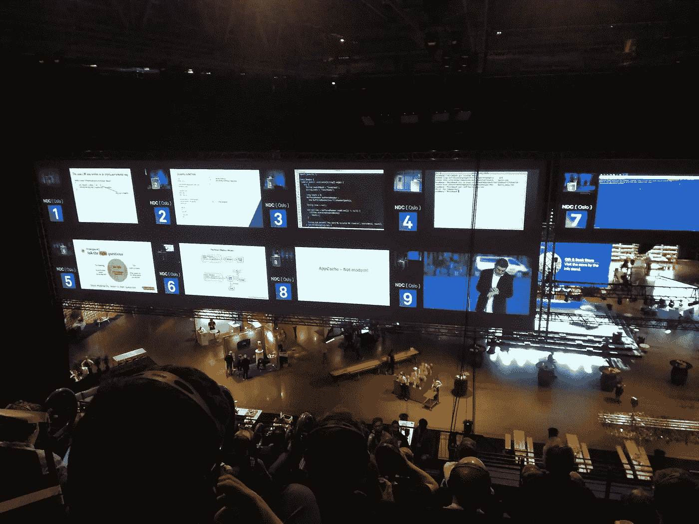
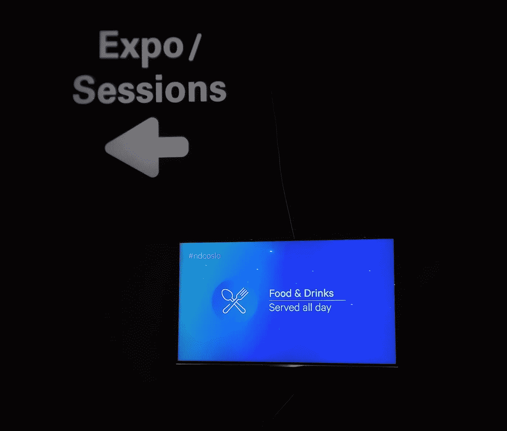
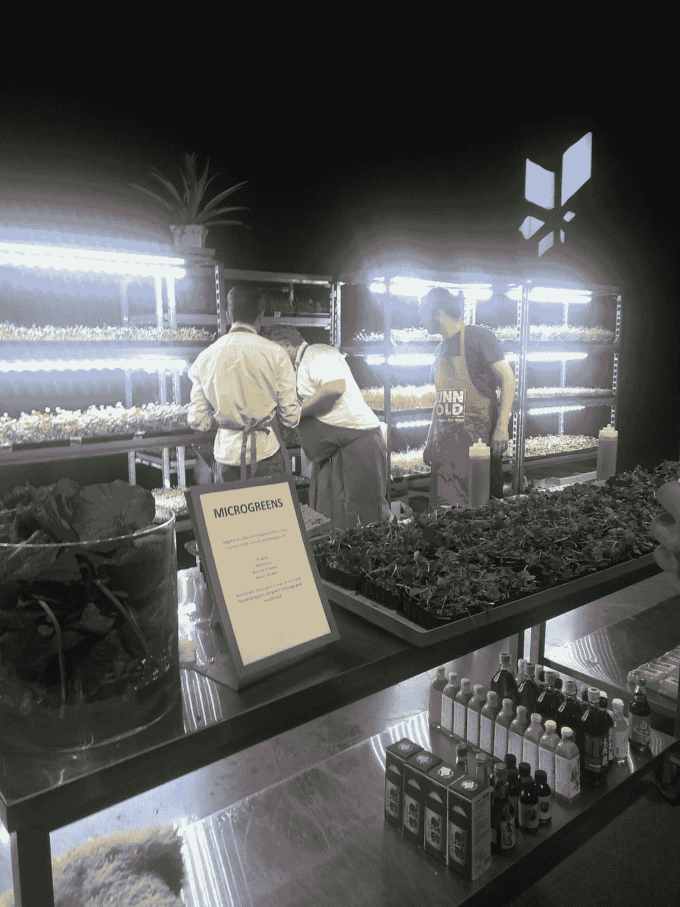
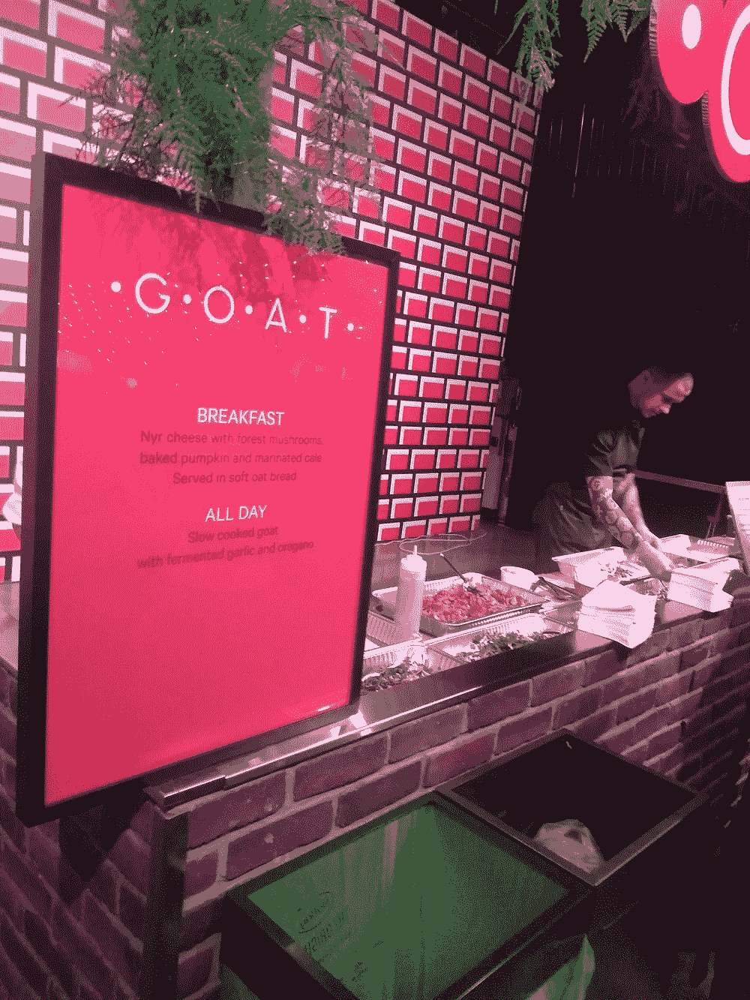
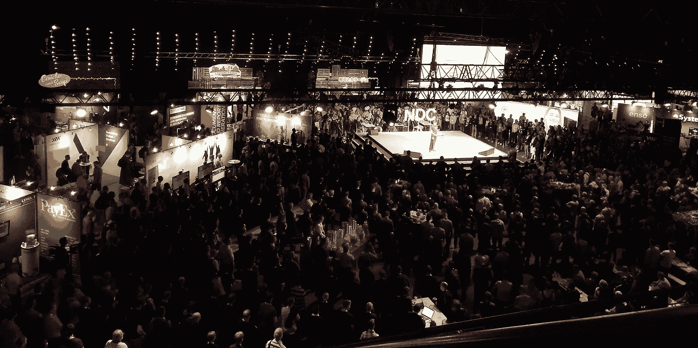
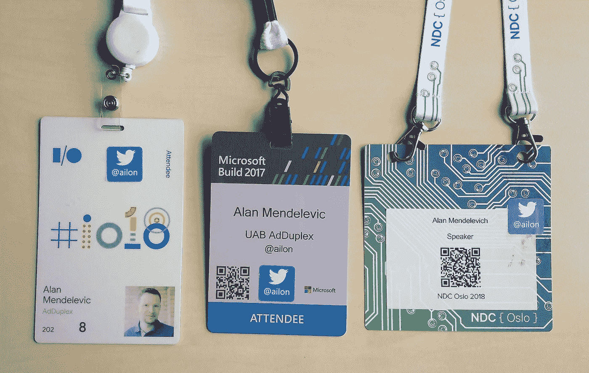
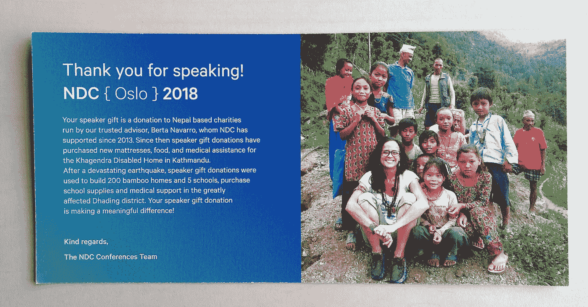

# Google I/O 和微软 Build 可以从 NDC 奥斯陆会议中学到的三件事

> 原文：<https://medium.com/hackernoon/3-things-google-i-o-and-microsoft-build-can-learn-from-a-conference-like-ndc-oslo-88231422da67>

一个多月前[,我从[技术不可知论者]的角度比较了 Google I/O 和微软 Build](https://blog.ailon.org/microsoft-build-vs-google-i-o-comparing-the-two-major-developer-conferences-9eb6a912e024) 。从那以后，我有幸参加了世界上最好的独立开发者大会之一——[NDC·奥斯路](https://ndcoslo.com/)。

由于这三个会议在规模、长度和价格方面都有一定的可比性，我认为通过独立会议的视角来看待这两个主要的企业开发者大会是一个好主意。

再说一次，根据内容的优劣来比较这些会议是没有意义的，因为它们涵盖了各自的领域。相反，我将专注于后勤和组织方面。

# 那么，NDC·奥斯路能教给另外两个人什么呢？

## #1 注意力缺陷多动症室

NDC 奥斯陆有多达 9 个平行轨道在任何给定的时间。在某些时段，很难决定你最想看 9 个话题中的哪一个。其他时候，当你到那里的时候，你选择的演讲的房间已经满了。还有一些罕见的时刻，这 9 个地方没有一个是必看的，但有些地方却很吸引人。

在所有这些情况下，NDC 著名的“溢出室”(昵称添加室)来拯救。你有 9 个屏幕和一个在耳机中切换声音的装置，你可以观看任何你想看的演讲，并随时切换到不同的演讲，而不会因为走出去而冒犯演讲者。

## #2 全天食物

在 NDC 奥斯陆有 10 个左右不同的小吃摊，全天都有食物供应——从真正新鲜的蔬菜到慢煮的山羊，应有尽有。

这显然是一个很吓人的命题，如果你不能克制自己的话。但这让整个体验变得更加愉快。也不是因为你能狂吃，恰恰相反。

在建造时，尤其是在 I/O 时，获得食物的体验与我记忆中的苏联时代相当。花了数千美元参加会议的人不应该“打架”或排着长队去吃一些普通的饭菜。全天供应食物消除了焦虑，并使整个体验更加令人满意。

## #3 低调的主题演讲

我知道这不会发生，因为[微软](https://hackernoon.com/tagged/microsoft)和[谷歌](https://hackernoon.com/tagged/google)都将这些活动视为一个绝佳的机会，尽可能以最好的方式向更广阔的世界展示自己。但是准备和运行主题演讲的制作水平堪比某个主要流行歌星的演唱会。

我为什么在乎？因为无论如何我都要为此付出代价。除了制作成本，还有整个租用一个巨大的房间 4 天，只是使用它几个小时的事情。在 Google I/O 上要好一点，因为分组会议也在圆形剧场举行，但在 Build 上，这只是一个巨大的浪费空间。

另一方面，NDC·奥斯路为主题演讲浪费了很少的额外空间(只有舞台)，它基本上是一个非常著名的演讲者的常规演讲。

同样，我知道主题演讲的目标是不同的，但我是“客户”,我在那里是为了内容而不是大规模的生产。

## #4 双面徽章、两条肩带或胸围

NDC 奥斯陆的与会者徽章不是特别好——文本很小，没有 twitter 句柄，很难区分演讲者、参展商和其他与会者。但是他们做对了一件事——徽章上有两个孔，在那里徽章与挂绳相连。这个小“技巧”可以防止徽章一直翻到错误的一面，让人们避免忘记新(或老)朋友名字的尴尬。

在我看来，微软今年已经解决了这个问题:

这可能是业内最好的会议徽章。轮到你了，谷歌。

## #5 帮助有需要的人

NDC·奥斯陆做了一个伟大的姿态，代表发言者向慈善机构捐款。由于 I/O 和 Build 的大多数发言人分别是谷歌和微软的员工，所以它在那里不起作用。但是，将每张门票收入的一小部分捐给慈善机构，对那些需要帮助的人和帮助你的与会者自我感觉良好都有很大帮助。

—

暂时就这样了。我确实在其他会议上看到过值得“窃取”的伟大想法，但当时我没有列出清单。你在参加过的会议上见过什么很棒的“特写”吗？大家一起分享讨论吧！