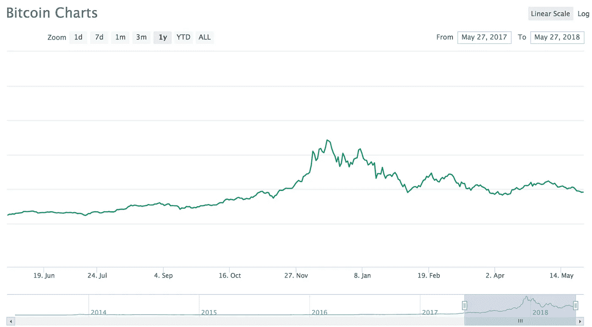
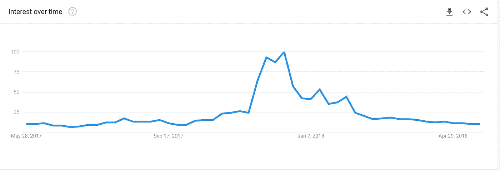

# 比特币下跌时不要做的 3 件事

> 原文：<https://medium.com/hackernoon/3-things-not-to-do-when-bitcoin-is-going-down-e80097d15796>

交易或投资加密货币是对自己的心理战。股票交易者经常说，投资传统市场需要极端的精神训练。这种纪律是他们在市场波动时控制自己的方式。他们如何停止做出愚蠢的决定，并坚持他们的战略。

如果说传统交易需要极端的纪律，那么加密需要绝地的精神毅力。密码市场比世界上任何市场都更加不稳定。你需要在情感上等同于流星雨期间在山顶沉思的尤达。

是的，世界可能要结束了，但一切都很好，你还在你的山顶上。

Photo by [Ian Stauffer](https://unsplash.com/@ianstauffer?utm_source=medium&utm_medium=referral) on [Unsplash](https://unsplash.com?utm_source=medium&utm_medium=referral)

*你孤独的堡垒。*

我在这个领域已经有几年了。我一开始是一名投资者，但却陷入了更深的困境。我在区块链一家营销机构工作，最近加入了一个我喜欢的项目的团队。我认为这让我对基本面有了全面的了解。

对这个市场参与者的了解给我的启示是..

这个市场几乎完全是由情绪驱动的。这意味着它并不总是让*有意义*。Crypto 的散户投资者比其他任何市场都多。如果你看看“比特币”这个词的谷歌搜索趋势图表旁边的比特币价格图表，你就可以看到这一点。图表非常相似，似乎谷歌比特币的人越多，价格就越高。搜索量图看起来更平滑，因为绘制该图使用了更少的数据点。

Bitcoin Price Over 12 Months

Bitcoin Google Search Volume Over 12 Months

就在价格上涨之前，搜索量实际上开始上升。

当市场受情绪驱动时，价格运动受情绪驱动。要在情绪驱动的市场中胜出，你必须在交易中消除情绪。

我告诉你这一切的原因是为了让你明白，重要的不总是你做了什么，而是你没做什么。这是你在展示我们讨论过的精神坚韧时所克制的。当比特币的价格下跌时，你看着你所有的加密货币都失去了价值，很难保持冷静。当市场变得血腥时，你甚至可能会怀疑比特币是否会再次上涨。我没有水晶球，但我可以相当自信地说，它将恢复昔日的辉煌。

# 不要试图抓住确切的底部。

如果你足够幸运，在市场暴跌时，在菲亚特或 BTC 有一些投资资本，这可能是构建投资组合的好时机。我喜欢把市场修正想象成“加密闪电销售”。我几乎总是藏一些菲亚特或 BTC，以防市场大幅下跌——但我对抓住下跌趋势底部的痴迷让我失去了一些大的胜利。

当你盯着硬币图表，看着它的价格暴跌，想知道它什么时候会停止。你想抓住底部。“抓住底部”意味着你试图在下跌趋势的底部交易。抓住交易的准确底部是非常困难的。难到经常被称为“接落刀”。

Photo by [Thanh Tran](https://unsplash.com/@coffee_wanderer?utm_source=medium&utm_medium=referral) on [Unsplash](https://unsplash.com?utm_source=medium&utm_medium=referral)

如果你一直试图抓住底部，很可能你会错过交易。我不能告诉你我等了多少次，等了又等，只为了在我进去之前有一个趋势反转。在交易中，我试图成为一个完美主义者，这让我失去的比得到的多得多。有时候，如果你打算交易，最好在底部附近进场，而不是等待。

# 不要为了上涨的硬币而卖掉你的硬币。

每个人都做过。你不必感到羞耻。这只是人之常情。我们都曾在下跌趋势的底部卖出，却看到它立即反转并向上飙升。

好像每次我弃船去 FOMO，进入另一个地方，我卖出的硬币就会上涨。FOMO 代表害怕错过，这是一种普遍的恐惧，会导致很多交易中的错误决策。

让我给你描述一下。

你以 0.25 美元买入 XYZ，你已经做了尽职调查，研究了一段时间图表，你准备好了。你甚至没有试图抓住底部，你知道这是一个长期持有，所以你对你的进入很好。你很冷静。

两周过去了，XYZ 仍处于 0.25 美元的水平。你开始质疑你的信仰，逻辑感，甚至你的现实。你开始和丹尼店里的老人争论“钱”是什么意思。你的包稳稳地坐在地上而不是“月亮”上的时间越长，你就变得越苦。

又过了两周。XYZ 的价格是 0.2 美分。你的朋友约翰上周刚进入加密领域，他告诉了你一些叫做$ABC 的东西。你嘲笑他甚至考虑除了 XYZ 以外的任何硬币。然后，在约翰购买了 100 美元 ABC 后仅仅 6 个小时，它就暴涨了.涨了 70%，约翰认为他是密码之王。他给你建议，知道你的硬币还在阴沟里。

正是在这个决定性的时刻，你看不到什么是最重要的。

你的策略。

”*去它的！*”，大家惊呼。

“如果这个市场奖励像约翰这样的白痴，它就没有意义”，你想。

毕竟，他只交易了 12 个小时就涨了 80%，这是什么变态的玩笑。他已经比你升职了，现在他得到了所有的好交易？！

第二天，约翰的愚蠢的$ABC 硬币上涨了 150%。你凝视窗外，不是美丽的洛杉矶地平线，而是下面的街道。不知道从窗户跳出去会不会比看着约翰挥舞着他的硬件钱包告诉办公室里的每个人“Hodl”是什么意思更痛苦。你回到家，打开你的交易所，和$XYZ 说再见。你亏本卖出你所有的股份，把你的资本转移到$ABC。

第二天，XYZ 股价上涨了 800%。约翰兴奋地打电话给你，“祝贺你！我看到$XYZ 今天 mooned，哦，我希望我离开$ABC 当我领先的时候，它现在下跌，几乎和我进来的时候一样。我应该听你的，买下$XYZ”。

不要成为那样的人。我就是那样的人，糟透了。

# 不要整天盯着图表。

信不信由你，你不能用绝地武士的思维技巧来强迫图表上涨或下跌。

*Sorry for all the Star Wars references, I watched the Han Solo movie last night.*

相信我，我试过了。当我第一次开始交易时，我花了无数个小时“制图”。回想起来，如果我对自己诚实的话，很多时间都被浪费了。当然，我花了很多时间学习并把我学到的东西应用到我的交易中，但我也花了很多时间漫无目的地盯着电脑屏幕看了几个小时。

我明白了我的大多数错误都是在这样的时刻犯下的。当我没有效率的时候，我会像老鹰一样毫无必要地监控我的资产。这让我更加情绪化，也让我过度交易。我现在知道要不惜一切代价避免两件事。

有时候你能做的最好的事情，就是设置一个限价单，然后离开。相信你的策略，永远记住——如果你没有用策略交易，你就是在赌博。

— — — — — — — — — — —

## **如果你喜欢这篇文章，请随意看看我最近的一些作品。**

 [## 不熟悉加密货币？从这里开始

### 加密货币、比特币和区块链速成班

medium.com](/swlh/new-to-cryptocurrency-start-here-44cc5a6d6626)  [## 了解加密货币市场周期，以便更好地投资

### 为什么以太币、莱特币和其他替代币会在比特币创下新高时下跌，以及如何利用这一点

medium.com](/swlh/understanding-cryptocurrency-market-cycles-for-better-investments-c6cc4bc80099)  [## 加密货币的未来

### 鸟瞰是什么导致了加密市场的兴起

medium.com](/swlh/on-the-future-of-cryptocurrency-e8ff9e171be9)  [## 关于 Facebooks 加密货币你需要知道的一切(Libra 项目)

### 我阅读了 Project Libra 白皮书，所以你不必这样做。

medium.com](/swlh/facebook-crypto-d13449171a9f)