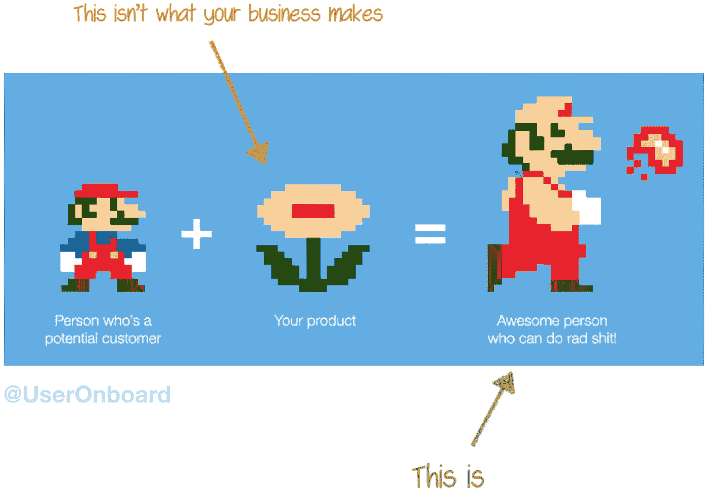

# 总能提高转化率的 3 件事

> 原文：<https://medium.com/hackernoon/3-things-that-always-improve-conversion-b8c6f7c9604c>

简单有效的方法来增加你的网上业务的销售

我在我们的网站、应用程序和电子邮件上领导 [Rev](https://www.rev.com?3things) 的转换工作。在过去的一年里，转化率的提高导致[自助服务收入](/@gokulrajaram/self-serve-first-the-overlooked-but-essential-paradigm-underlying-great-software-companies-45a67dbec4c4)增加了 500 多万美元。

皈依是一种可以通过实践学习和磨练的技能。为了节省你的时间，以下是我的基本原则:

1.  **主动回答客户问题**
2.  **关注客户利益，而非产品特性**
3.  **简化**

This is your website getting more money after following these principles

# 主动回答 5 大客户问题

逛街的人总会有疑问。例如，当我买跑鞋时，我想知道有什么颜色和尺码，其他人对它们的评价，以及它们的价格。

不要隐藏答案。

你的工作是找出主要的问题，以及如何在网站上发布这些问题的答案，而不会让网站信息过载。您可以通过与客户交谈、接听支持电话、阅读支持电子邮件和票证、在您的网站上添加[实时聊天](https://hackernoon.com/growth-tools-101-with-6-conversion-examples-and-real-numbers-921d63436915)以及[用户测试](/front-conference/user-testing-doing-it-better-doing-it-faster-7f1964f7e3db)来发现这些问题。

不要在你的主登陆页面上添加 100 个问题的 FAQ。找到影响最大的主要问题。

# **关注客户利益，而非特性**

顾客优先考虑方便。他们不关心你在构建功能上投入的时间，也不关心你的产品能做多少事情。

对于我的跑鞋，我想要适合跑步的。我不在乎材料来自南极，它是在冰岛制造的，设计师是瑞典人。如果它不能让我成为一个更好的跑步者，那么我不会买它。

顾客向你寻求帮助。你有责任向他们展示他们做出了正确的决定。

Credit to Samuel Hulick, my favorite user onboarding expert

# 简化

你的访问者来到你的网站或应用程序来完成一项任务。不要妨碍他们。让他们很容易理解下一步需要做什么以及为什么要做。我想选择我的鞋码，并将其添加到我的购物车中，而不是注册邮件列表。

许多网站增加了混乱，因为他们想告诉客户他们能做的一切。人们不希望这样。如果你有一个热心的搜索者，他们会通过阅读 10 页的在线评论找到相关信息。不要为那些人建造。

我有两种最喜欢的简化方法。

首先，**把字数减半**。第二，**再次将它们切成两半**。你会觉得这是不可能的。它不是。从有外部视角的人那里获得帮助。倾听你的顾客以及他们是如何说话的。

如果你正在研究增长、产品或有问题，请联系:Barron.Caster@gmail.com 或 [LinkedIn](https://www.linkedin.com/in/barroncaster) 。

*相关阅读:* [*成长工具 101*](https://hackernoon.com/growth-tools-101-with-6-conversion-examples-and-real-numbers-921d63436915) *和*[*3x 转换剧本*](https://hackernoon.com/the-3x-conversion-playbook-3a9b954b937d) *。*

*关注查看更多关于成长和产品的帖子。*