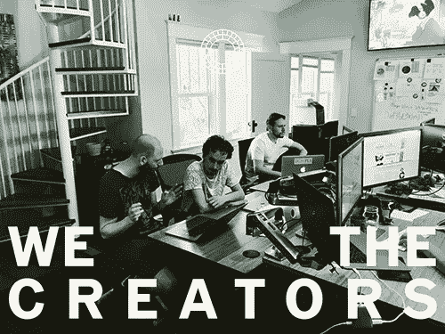

# 作为新产品领导者要避免的 3 件事

> 原文：<https://medium.com/hackernoon/3-things-to-avoid-as-a-new-product-leader-8674cce35fd9>

我为一家公司领导一个产品开发团队。我们的团队由一小群有才华的软件工程师、一名设计师和我组成。我们有一段为顾客、司机和餐馆制造产品的美好时光。这是什么意思？大量的产品和功能。作为一个小团队，我们必须对我们做出的每一个产品决策都非常有战略眼光。路线图不断更新，优先级瞬息万变，我们需要保持敏捷。

下面这篇文章收集了我从艰难的道路上得到的教训。我希望这能帮助你用不同的方法来开发产品。

Nifty VSCO photo showing off part of the Delivery Dude product team.

# 1.在筒仓中设计和建造

与你的用户交谈——让它成为你工作过程的一部分。产品开发过程中的过度沟通从来不会发生。花时间提前更好地理解你正在解决的问题，你最终会获得积极的投资回报。确保你不是在一个筒仓中设计和构建的一个有效方法是进行用户访谈。

# 2.作为功能工厂运营

一个可靠的产品领导者知道关注*结果*，而不是*产出*。如果你是一个盲目发布特性的团队中的一员，你将会失败。构建、测量和迭代。在接触代码之前，做好充分的准备工作。赞美航运往往会发生，但**不是**正确的。相反，赞美你的产品或功能的结果。使用类似 OKR 的框架(目标和关键结果)预先定义这些结果，以交付影响业务的工作。你正在努力提高记忆力吗？增加转化率？尽早进行这样的对话，并把它作为你工作的北极星。

# 3.利用功能和假设解决客户问题

科技很有趣！想法被设计出来，功能被构建出来，如果它们没有成功，那么就是实现出了问题，对吗？**错了。我们经常从特征构建状态开始，而不是从问题识别状态开始。一个肯定会感到沮丧的方法是询问高管或同事应该构建什么功能。**

> “我听说 X 公司发布了 Y 功能，他们[指标名称]上涨了 400%！让我们开始建设吧！”

如果资源被浪费，那不是高管或同事的错，而是产品负责人的错。一个真正的产品领导者知道什么是对用户最好的，并把对话转回到解决问题的空间。

# 感谢阅读我的第一篇文章！

我还要感谢 Marty Cagan，[灵感](http://a.co/9b3YiFN)的作者——这本书对我作为产品领导者的行为产生了巨大的影响，是一本令人惊叹的读物。

在推特、 [Instagram](https://instagram.com/parxrex) 上关注我，或者在 parker.m.rex@gmail.com[给我留言](http://parker.m.rex@gmail.com)

我总是希望结交新朋友。