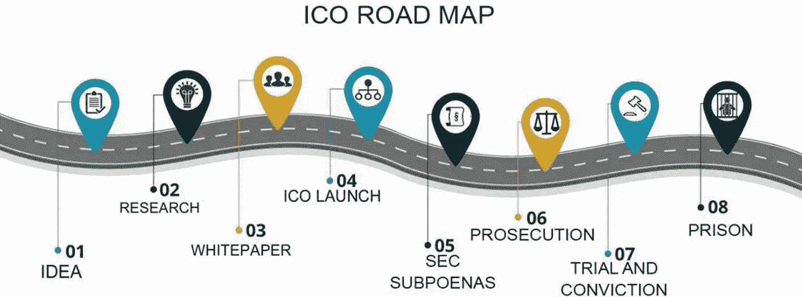

# 确保你的 ICO 营销策略符合现行法律法规的 3 件事

> 原文：<https://medium.com/hackernoon/3-things-to-check-to-ensure-that-your-ico-marketing-strategy-is-compliant-with-current-laws-35fe2eb4821f>

## ICO 似乎是为你的项目筹集资金的一种快速简单的方式，不需要通过任何额外的法律程序。然而，大多数 ICO 创始人对这一过程的法律方面存在误解，这可能经常导致他们受到民事甚至刑事指控。为了避免这种情况，你应该永远记住单词是很重要的！

Tezos、Titanum、Centra、rise Bank、Munchee、plex coin……所有这些 ico 的路线图都与上面的非常相似。他们失败的主要原因是通过白皮书、社交网络、电子邮件、ICO 网站等传达给投资者的误导性营销信息。

为了避免当前法律法规的任何问题，您应该仔细检查您营销策略的每个方面，并确保它们在提供 ICO 的每个国家都是合规的。应特别注意:

**1。定义您的令牌类型**

令牌主要有两种: ***实用*** 和 ***安全*** 令牌。在大多数国家，发行安全令牌的 ico 需要通过注册。然而，这通常是避免的，因为该程序是昂贵和耗时的。作为替代，ICO 可以指定提供一个实用程序令牌，并开始 ICO 启动。

> ***效用令牌是您可以用来获得产品或服务的令牌。最重要的是，应用工具令牌应该在 ICO 时具有功能。***

任何没有功能的代币都作为投资合同出售*。*因此，仅在白皮书中声明您正在提供实用工具令牌是不够的，除非您的令牌符合上述定义。

然而，实用程序令牌不仅仅局限于定义，因此，还应该确保他们将它作为一个实用程序进行宣传。

还记得在 ICO 期间筹集了 1500 万美元的 Munchee token 吗？

他们的实用工具令牌旨在让用户能够访问他们应用程序中的一些服务。这款应用在 ICO 时代就已经推出，用户可以在一段时间内开始使用 MUN 令牌。然而，美国证券交易委员会已表示，模拟证券是一种未注册的证券，因为它被宣传为一种投资。这是他们文件中的引文:

> [*麦奇发表公开声明或赞同他人的公开声明，吹捧获利的机会。例如，大约在 2017 年 10 月 25 日，Munchee 在脸书上创建了一个公开帖子，链接到第三方 YouTube 视频，并写道“以 ICO 价格在 MUN token 上获得 199%的收益！现在就报名预售！”*](https://www.sec.gov/litigation/admin/2017/33-10445.pdf)

因此，如果您有一个基于公用事业的令牌，您应该确保在您的营销传播中没有使用基于投资的语言，即您没有承诺从以下方面获得回报:

*   代币价值的增值
*   向投资者分配利润(不承诺支付奖励、收入分成或股息)

**2。不要欺骗投资者**

一旦你确定你的令牌是兼容的，你应该确保你对你的观众诚实。尽一切可能避免对你的团队、合作伙伴、证明、商标等撒谎。甚至夸张也可能导致法律问题。

让我们看看 Titanium，它在 ICO 期间筹集了 2100 万美元。他们提供了有关业务关系的虚假信息，并被美国证券交易委员会指控犯有投资欺诈罪:

> *截至 2018 年 1 月 29 日，在 TBIS 的网站上，TBIS 同样就其与众多特定蓝筹公司的关系发表了虚假陈述。TBIS 通过名字和公司标识确定了近 30 家知名公司是 EHI 的客户——此外还包括威瑞森、麦当劳、思科、辉瑞、SAP、惠普、Acxiom——并提供了一个链接到 EHI 网站的客户名单和推荐。*[*https://www . sec . gov/诉讼/投诉/2018/comp-pr 2018-94 . pdf*](https://www.sec.gov/litigation/complaints/2018/comp-pr2018-94.pdf)

此外，Titanium 还声称他们的 8 种产品被注册了商标，尽管 ICO 还没有注册过一个。他们的证明似乎也是假的。

尽管描绘一幅美丽的画面来吸引投资者更容易，但一个合法的 ICO 不应夸大其词，在任何情况下都不应就其活动和合作关系的任何一个方面向投资者撒谎。

**3。利用名人做推广时要小心**

让一个名人来宣传你的项目总是很好的，因为除了吸引新用户之外，它还能建立知名度，为你的项目带来更高的可信度。但是 ICOs 要慎重做好这个推广。

在大多数司法管辖区，利用名人推销证券是非法的。有时，这种广告涉及披露关于所支付报酬的性质和金额的信息。

所以，如果你想让一个名人来推广你的 ICO，确保你的令牌是*而不是*证券。

明星代言也可能是 ICO 可以被宣称为骗局的原因之一。ICO Centrum 是最耀眼的例子之一，它筹集了 3200 万美元。在 ICO 轮启动之前，该团队向名人支付费用，让他们在社交媒体上发布关于他们项目的帖子。然而，他们从未透露支付他们的信息。这是文件的摘录:

> *被告还向名人支付费用，在社交媒体上推广 Centra 的 ICO，他们在 2017 年 9 月和 10 月的不同时间都这样做了……例如，一位名人 Centra 推广者在推特上写道:“Centra 的(CTR) ICO 几小时后开始。Centra 在其官方推特上转发了这条消息:“在他们售罄之前，我得到了我的。”这些名人帖子——引起了 ICO 的极大兴趣——没有披露 Centra 向名人支付了大量报酬，以换取他们对产品的推广。*[*https://www . sec . gov/诉讼/投诉/2018/comp-pr 2018-70 . pdf*](https://www.sec.gov/litigation/complaints/2018/comp-pr2018-70.pdf)

由此可见，在推广你的 ICO 时，选对词真的很重要。此外，正确的信息不仅应该来自官方的项目沟通，还应该来自团队的个人账户以及参与项目的任何第三方。除此之外，在参与线下活动、与社区交流、在会议和聚会上发言以及接受采访时，也应该保留这种沟通方式。

如果你打算推出 ICO，你应该咨询顾问和律师，他们会帮助你降低可能的风险。

如果你有任何问题，或者想联系，在 [LinkedIn](https://www.linkedin.com/in/tanya-petrusenko-b6696911b/) 上加我，或者发邮件给我 [t@bitmedia.io](mailto:t@bitmedia.io) 。我喜欢社交和结识新朋友。

*免责声明*

*本文件不构成法律或投资建议，也不应被视为法律或投资建议。你不应该依赖它，如果试图做一个 ICO 或任何其他相关的活动，你应该寻求单独的专业顾问。它仅供参考。*