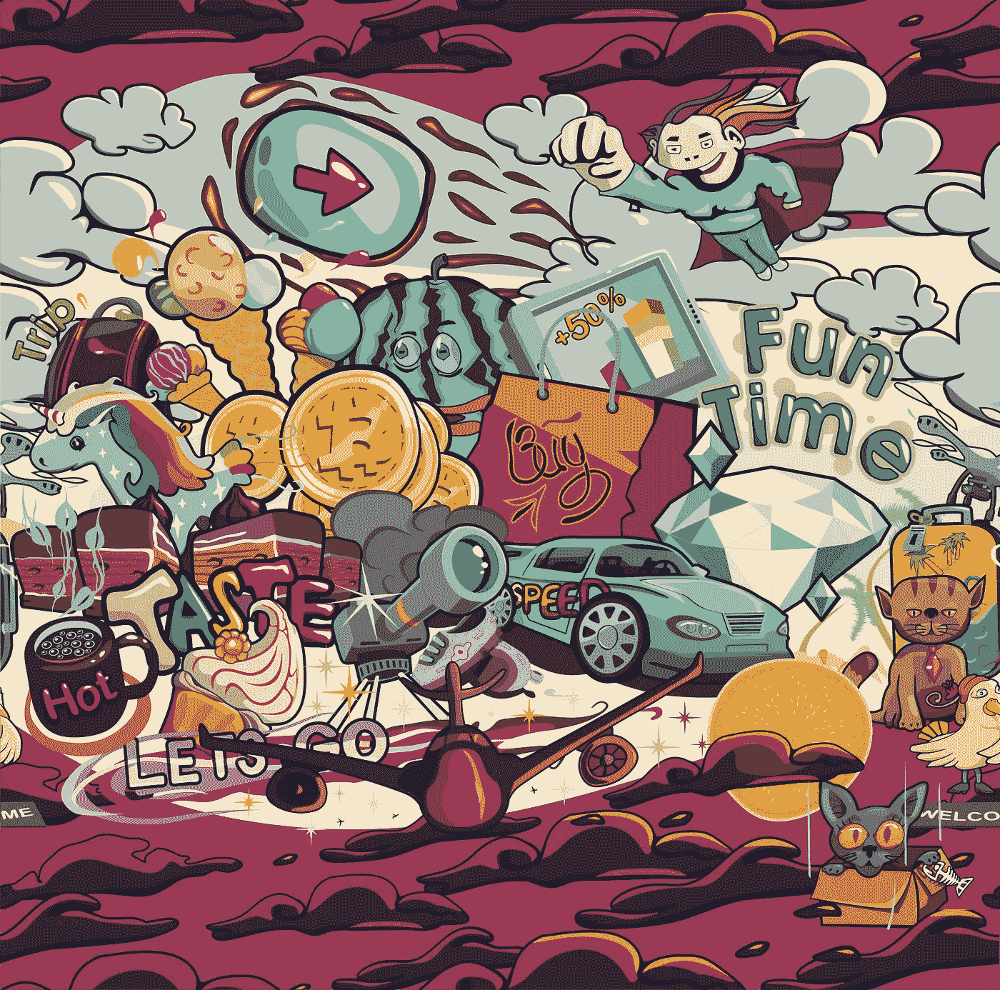

# 浏览秘密艺术景观时要记住 3 件事

> 原文：<https://medium.com/hackernoon/3-things-to-keep-in-mind-when-navigating-the-crypto-art-landscape-d70f7b665c9a>

Image by [dansser.](https://www.shutterstock.com/g/dansser)

人们常常想给艺术分配一个等级。

这种分类的需要在新的和过渡的风格中显而易见，如 crypto 和区块链艺术。有这么多创新和不寻常的作品，人们已经准备好确定某种排序。

> 问题是，并不是所有的艺术都是为了同样的目的。

这使得我们很难并排比较工作，然后选出一个“赢家”如果两位艺术家试图唤起不同的情感或服务于特定的目的，那么就不可能将作品相互比较。相反，我们应该问一件作品是否符合艺术家的意图。

如果成功地做到了这一点，那么这个艺术家就完成了一些事情。

虽然数字和加密艺术可能看起来与艺术界所习惯的不同，但它实际上遵循了新的和最初令人不安的艺术的悠久传统。

作为一个在传统和秘密艺术领域都有背景的人，我是这样想的:

# **1。密码艺术分为三个主要类别。**

## **密码领域的第一种艺术是基于技术的。**

凯文·阿博施就是一个很好的例子，他在项目 [IAMA 硬币](https://www.iamacoin.com/)中将自己的血液符号化，将真正的[区块链](https://hackernoon.com/tagged/blockchain) [技术](https://hackernoon.com/tagged/technology)融入他的艺术中。人们现在可以真正购买“他”的股份，这是他身体存在的一部分。另一个是 CoinArtist，他正在使用区块链技术创作需要解密的谜题和游戏。

尽管这两位艺术家的风格截然不同，但 CoinArtist 和 Abosch 都属于艺术的范畴，实际上是基于加密的，并且依赖于技术本身来工作。

## **第二类加密艺术利用独立于艺术品本身的区块链解决方案。**

例如，这个群体中的一位艺术家可能会在区块链艺术集体上注册一幅花瓶的实物画——然后通过交易对手比特币令牌[将其令牌化](/blockchain-art-collective/how-tokenization-is-turning-art-into-a-commodity-and-changing-monetization-d7eaee7b46c9)。

## 第三种隐密艺术是艺术家使用传统形式，但使主题参考隐密和区块链。

关于这一类别以及它是否真正属于加密艺术的范畴还有一些争论。

我喜欢想起沃霍尔，他的作品非常关注名声、流行文化和金钱，甚至一度画过美元符号。当然，这是关于钱的——这是观众能想到的。当你在艺术中看到比特币时，它会让你想到加密货币、去中心化、区块链和其他围绕这个空间的概念。

在我看来，一件艺术品的内容，以及它所表达的内容，也是它作为艺术被体验时的一个重要部分。

# **2。艺术家正在塑造空间和进行实验。**

各种各样的艺术家正在做独特的和开创性的工作。了解它们也不需要太多。以下是一些艺术家在加密领域的表现:

*   [Eve Sussman](http://www.ricegallery.org/eve-sussman/) 最近制作了一部关于著名的迭戈·贝拉斯克斯画作《拉梅尼娜斯》的电影，现在正在用 Snark.Art 标记该电影的像素化剧照
*   [纳努·伯克思](/blockchain-art-collective/crypto-art-is-no-easy-calling-heres-what-artist-nanu-berks-really-thinks-about-the-industry-7c5e84663614)的作品讲述了与区块链和密码相关的意象。
*   像 [DADA](https://dada.nyc/artgallery) 这样的网站允许人们一起共同创作数字艺术品，并拿出你可以收集的狂野、复杂的图画。
*   Primavera de Filippi 的创意, [Plantoids](http://okhaos.com/plantoids/) 是实体雕塑，当人们捐赠比特币来支付建造它们的物资和劳动力时，它们就会“生长”。

# **3。数字和密码艺术不断以新的方式呈现。**

如此多的创新都与教育息息相关。

回顾不同的时期，艺术家总是会想出新的方法来直观地表现事物和概念。毕加索、梵高、希尔玛·阿夫克林特——他们都在各自的时代突破了界限，影响了我们今天所知的艺术环境。

有时媒介会改变。有时候观念是转变的。在其他情况下，艺术家会根据作品改编题材。唯一不变的是变化，无论结果如何，艺术界都受益于新事物。

> 新思想、新风格、新格式——当你回顾历史书籍时，它们都是每一个连续浪潮的一部分。

今天，加密空间正在经历这种情况。

当新概念和意识形态被引入的时候，人们会用很多不同的短语来描述这个时代。我们沿着当代艺术、后互联网艺术和现在的秘密艺术的路线前进。

这是艺术和艺术家的新浪潮。令人兴奋的是，我们现在有资源和能力来了解和了解它，当它发生时，并在未来几年的艺术史时间表中看到秘密艺术时，塑造它的样子。

**感谢阅读！**

**我们区块链艺术集体的团队希望确保艺术世界的变革者和创新者——无论是个人还是机构——对这个不断增长的生态系统产生影响。**

**听起来像你？** [**填写表格**](https://blockchainartcollective.com/ecosystem/) **向区块链艺术集体工作组提出申请。**