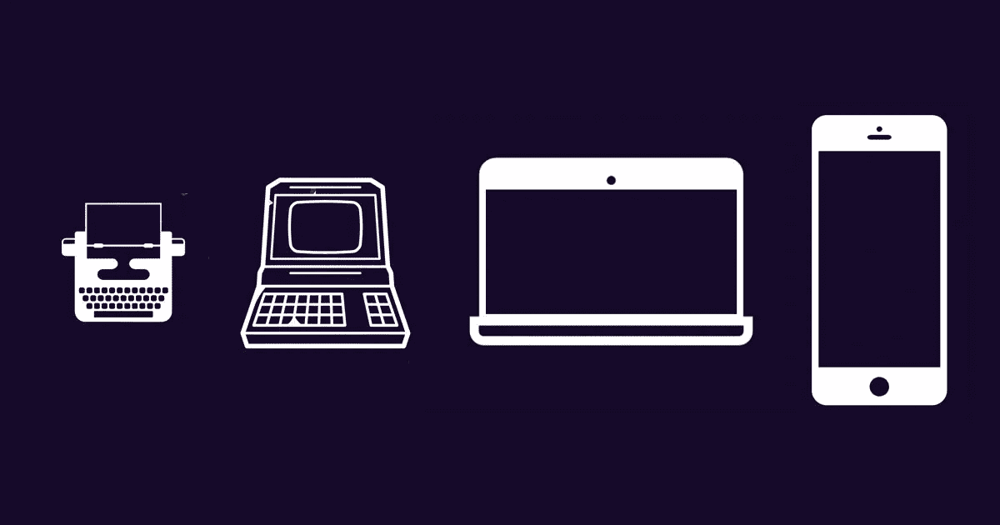
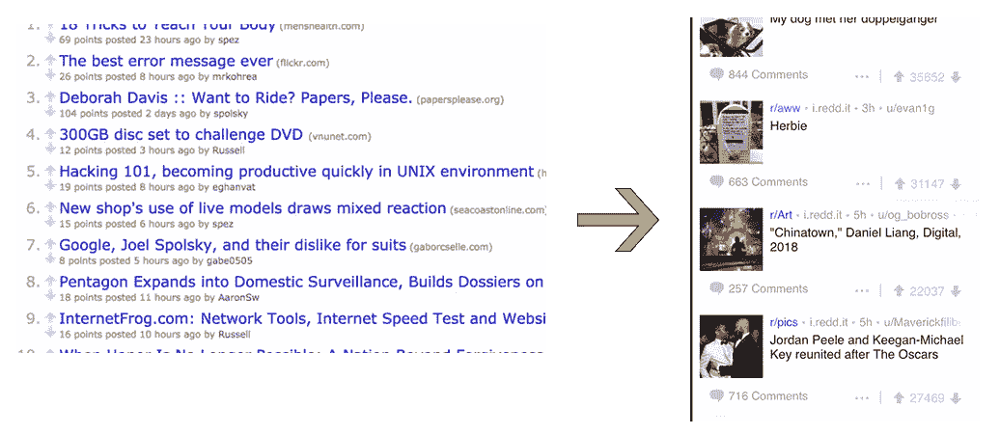
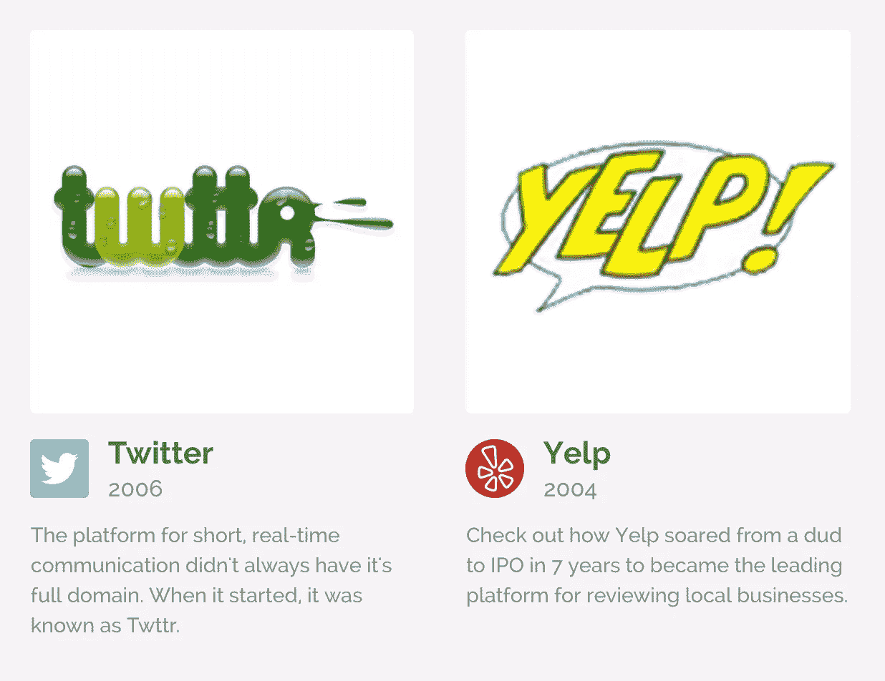

# 来自网站博物馆的 3 个网页设计趋势

> 原文：<https://medium.com/hackernoon/3-trends-in-web-design-from-the-museum-of-web-design-7bbc4a25885f>

昨天，我和我的联合创始人一起建立了“[网站博物馆](https://www.kapwing.com/evolution-of-products)，展示流行网站的演变。因为我们都是前端设计爱好者，所以把这个项目放在一起很有趣，看到当今科技巨头的卑微开端也很有启发。在这篇文章中，我将分享从浏览网页最受欢迎的登陆页面的历史设计趋势中学到的三点。

## 一:更多的媒体和更大的图像

随着世界向更小的屏幕发展，网站已经把它们的图像变得更大。越来越多的媒体(图像和视频)占据了比文本更多的空间。参见 [Reddit](https://www.kapwing.com/museum-of-websites/reddit) 、[产品搜索](https://www.kapwing.com/museum-of-websites/product-hunt)、[亚马逊](https://www.kapwing.com/museum-of-websites/amazon)。

## 第二:横幅广告

在网站顶部放置一个醒目的广告，通常带有视觉效果和颜色，似乎是越来越受欢迎的设计选择。看看 Airbnb，雅虎，纽约时报。

## 三:标志改变

一般来说，我认为徽标是静态的，是一个不变的坚定不移的品牌网站。其实大部分(全部？)的大科技公司都换了 logo，大多数都换了好几次。看看你是否能认出 [Twitter](https://www.kapwing.com/museum-of-websites/twitter) 、 [Yelp](https://www.kapwing.com/museum-of-websites/yelp) 、 [Pinterest](https://www.kapwing.com/museum-of-websites/pinterest) 原来不那么标志性的 logos。

感谢阅读！查看 Kapwing 的网站博物馆，了解更多设计知识。