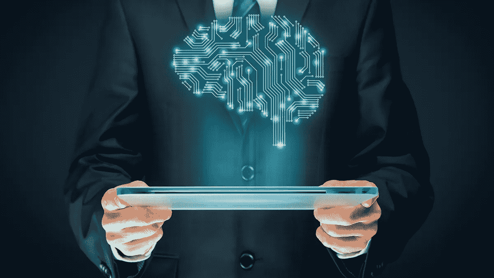

# 人工智能改变我们周围世界的三种方式

> 原文：<https://medium.com/hackernoon/3-ways-ai-is-changing-the-world-around-us-fa99de3f2b58>

人工智能正在改变我们周围的世界。它已经在多个方面产生了影响。不仅如此，它将改变我们工作和享受日常生活的方式。

和你一样，我们也在关注 AI 的影响。它决不会消失。从这里开始，AI 只会改进，我们需要适应变化，否则就会灭亡。

在这篇文章中，我们将关注人工智能如何改变我们周围的世界。人工智能是计算机科学的一个分支。人工智能让计算机在最少或没有人工干预的情况下自己学习和解决问题。第一波人工智能研究始于 1956 年。然而，快速发展和研究只是在最近十年左右才开始。现在，人工智能(A.I)几乎应用于每个行业，包括金融、农业、网上购物等等。

# 自动驾驶汽车

人工智能正在改变我们驾驶汽车的方式。道路事故一直是政府的主要关切。自动驾驶汽车可以真正改变我们驾驶汽车的方式，或者让机器在道路上驾驶汽车。随着自动驾驶汽车的大量试验[成功](https://www.scientificamerican.com/article/are-autonomous-cars-really-safer-than-human-drivers/)，自动驾驶汽车在包括美国在内的许多国家上路。随着时间的推移，它们将变得更加普遍，并改善道路状况，大大减少交通事故。

# 改善我们周围的爱情关系

嗯，把人工智能和爱情联系起来有点奇怪。然而，它的影响是不容忽视的。人工智能可以改变我们约会的方式，管理我们的关系，并在不久的将来创造新的实体，如性爱机器人。 [Tinder](http://www.bbc.com/news/technology-39048613) 已经表示有兴趣在他们的应用中使用人工智能。另一个重要的演奏者是[维奥拉。AI](https://viola.ai/) ，一个由区块链和人工智能驱动的平台，旨在解决单身和情侣的问题。

除此之外，人工智能聊天机器人已经出现在人们可以接受基本互动训练的场景中。OKCupid 也成功地利用人工智能帮助了许多女士。

# 网络安全

网络安全是许多公司最关心的问题之一。随着复杂性和新技术的不断增加，网络安全专家很难管理或保护系统免受黑客攻击。市场上没有足够的网络安全专家来保证系统始终安全。然而，这一切都可以被人工智能改变。现在，有许多基于人工智能的解决方案协同工作，主动阻止黑客的企图，并解决系统内的问题。一些致力于使用人工智能保护网络世界的例子是 [Secureworks](https://www.secureworks.com/) 、 [Deep Instinct](https://www.deepinstinct.com/) 、 [Cylance](https://www.cylance.com/en_us/home.html) 和 [Sift Science](https://siftscience.com/) 。

# 结论

人工智能是真正革命性的。它的影响几乎可以在我们社会的每一个部门听到。然而，许多专家认为这会导致许多人失业，增加失业率。许多杰出的专家也认为，人工智能驱动的机器可能对整个人类构成威胁。目前，我们只能关注人工智能的积极方面，以及它在改变我们日常生活中的作用。

*渴望了解更多关于 FundYourselfNow 的信息吗？在我们的* [*电报*](https://t.me/fundyourselfnow) *群上加入我们的众筹革命对话，或者在* [*推特上关注我们。*](https://twitter.com/fundyourselfnow)