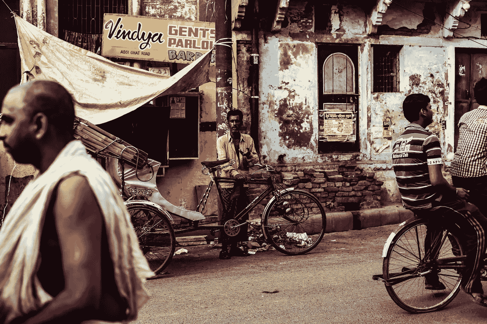

# 区块链可以战胜贫困的 3 种方式

> 原文：<https://medium.com/hackernoon/3-ways-blockchain-can-combat-poverty-18827e5aacaf>

很长一段时间以来，世界上最贫穷的人似乎一直被忽视。不幸日复一日地袭来，腐败、高通胀、高失业率和缺乏机会的世界似乎对他们不利。区块链纲领寻求解决的正是这样的全球性问题。以下是区块链对那些最需要它的人有用的一些方法。