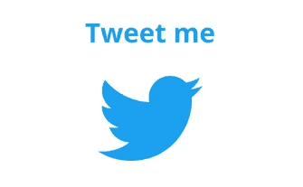
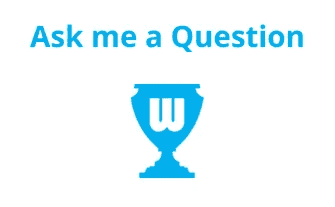

# 区块链变革教育的 3 种方式

> 原文：<https://medium.com/hackernoon/3-ways-blockchain-can-revolutionize-education-648e2faa5783>

自从**中本聪**发表了他/她/他们的论文《[比特币:一个点对点的电子现金系统](https://bitcoin.org/bitcoin.pdf)》以来，已经过去 10 年了，区块链在这篇论文中扮演了主要角色。快进到今天，区块链是**科技界的**热门话题。世界各地的公司都在涉足这一革命性的“新”技术，在这篇文章中，我将讨论如何利用区块链进行教育革命。

## 什么是区块链？

网上有很多定义，所以我将保持简短，以方便那些第一次看到与区块链相关的帖子的人。

区块链是一个**去中心化**和**分布式账本**，以**透明**、**安全**、**不可变**和**可验证**的方式记录同一网络的两个用户之间的交易。它的工作原理如下:

*   它是使用加密技术链接在一起的“块”的列表。一个块包含前一个块的**密码散列**，以及**时间戳**和**交易数据**。
*   “完成”一个块后，它会被永久地添加到区块链中(按时间顺序)，并创建一个新的块。一旦添加到区块链中，块**不能被修改或移除**。
*   每个网络参与者(节点)持有区块链的**完全相同的副本**。

GIF courtesy of realdolmen

## 什么是去中心化？

我在上面提到区块链是分散的，但这意味着什么呢？

分散式系统是指没有一个人、机构或机器告诉其他人该做什么。以太坊的联合创始人，[**维塔利克·布德林**](https://medium.com/u/587a00dbce51?source=post_page-----648e2faa5783--------------------------------) **，**分门别类**分权**成 3 种类型(你可以在这里阅读更多)，其中区块链募得 3 种中的 2 种:

*   政治分权——因为没有中央政党控制它。政治分散系统的一个例子是，没有中央权力机构对网络进行决策，而是依靠其“利益相关者”进行决策。
*   **架构分散**—因为没有单一的基础设施中心故障点。体系结构分散系统的一个例子是，如果网络的一部分离线，剩下的网络将正常运行，影响最小。

## 区块链变革教育的 3 种方式

现在我们已经了解了区块链和分权的基本情况，区块链的某些特征可以彻底改变教育。其中包括:

**1 —所有权证明
所有权证明**和**知识产权证明**由于其**不可变**和**透明**的性质，使用区块链非常容易实现。不幸的是，今天存在的集中式系统容易受到薄弱出处("*某事物的起源或最早已知历史")【T12 ")和篡改的攻击。区块链提供特殊的**出处**从而给内容创作者带来保护。*

这对**教育**意味着什么？

*   学生们将有能力**轻松证明**他们是**原创内容的创作者。**
*   **货币补偿将正确归于**原创者。
*   学生将能够拥有一个**透明的工作文件夹**，相关方可以轻松、放心地访问该文件夹。
*   它将教育学生保持对他们的知识产权的控制的重要性，同时也教授自主性和自信，为进入工作世界做准备。
*   **证书可以存储在区块链**上。例如，机构可以有能力在区块链颁发证书，学生一旦获得证书就可以在区块链获得证书。这将使证书欺诈成为不可能，同时学生将能够透明和可验证地证明证书的获得。

**2 —去中心化的信息共享** 区块链可以**通过去中心化来推倒围墙和壁垒**。这促进了一种新的、革命性的共享信息的方式，这种方式在分散化的区块链出现之前是不可用的。

这对**教育**意味着什么？

*   全球信息共享变得更加容易。在过去，全球知识共享很难实现，但有了区块链，这不再是一个问题。现在，知识可以**很容易地在全球流动**，没有中央机构的参与，这可能会限制访问。
*   它**有助于后代获得更高水平的教育**，因为知识现在更广泛，更容易获得，也更便宜。
*   作为一个整体，我们的社会将受益于所有部门和学科，这是知识进化的后续影响。

**3 —令牌化经济** 当今区块链最大的应用之一是加密货币。加密货币*“是一种数字资产，旨在作为一种交易媒介来保护金融交易”。*因此，现在可以使用加密货币对整个经济进行令牌化，包括学生经济。

这对**教育**意味着什么？

*   教育平台作为中间人，经常以费用的形式拿走很大一部分。随着象征性经济的出现，不再需要中间人。因此，学生们会因为分享他们的知识而获得更多的收入。这可能有助于缓解未来迫在眉睫的学生债务危机。
*   这些平台通常有地理上的进入壁垒。这将不再是一个问题，并将解放发展中国家的学生，让他们比以前挣得更多。
*   银行通常收取的货币转换费将被取消，这可能是一种负担，尤其是对学生而言。
*   一个象征性的经济可以通过实施“学习就是赚钱”来“游戏化”教育，并进一步激励学生。随着学生完成一定的任务，加密货币可以获得奖励。然后，这可以兑换成其他教育材料和/或甚至兑换成法定货币。

## 案例分析: [Spitball 2.0](https://token.spitball.co/)

在这个领域引起我注意的一个项目是**。 [**Spitball**](https://token.spitball.co/) 是一家**Ed**educational**Tech**nology(**Ed Tech**)公司，现有超过 500，000 名学生的用户群、庞大的内容数据库、拥有丰富运营经验的团队以及许多教育合作伙伴。他们现在正寻求推出一种分散的学生经济(称为 **Spitball 2.0** )，旨在解决教育问题。**

> ****Spitball** 是一个市场，学生们在这里收获知识和服务共享生态系统的回报，同时也为他们提供的知识、内容和服务赚钱。该市场让学生能够获得家庭作业帮助、买卖课程笔记、找工作、买卖书籍等等，扰乱了由赚取巨额利润的中间商主导的市场。**
> 
> **利用区块链技术， **Spitball 2.0** 正在建立第一个此类的**全球分散学生经济**连接并激励来自世界各地的学生。它允许他们使用 SBL 本地令牌直接交换知识、商品和服务，在平台上创建所有权证明，并使令牌化的跨境交易便宜、快速、安全。**

****

**事实上， **Spitball** 已经在它现有的平台上发布了一个测试版的 marketplace，上面运行着一个基于区块链的应用程序。**

**你可以通过访问他们的网站[这里](https://token.spitball.co/)，阅读他们的白皮书[这里](https://token.spitball.co/Home/DownloadWhitePaper)，找到更多关于 Spitball 的信息。**

**如果你想了解更多关于 **Spitball** 的信息，请在我的各种社交媒体上给我留言，或者在下面留言！**

# **这个帖子值得多少掌声？跟着来怎么样？**

**如果你喜欢这篇文章，请随意👏**鼓掌**👏很多次(你知道你想！)，给我的博客一个👣**跟随**👣**和**🤲**分享**🤲和朋友在一起。有一个限制👏 **50 次鼓掌**👏你可以给每个职位，所以我劝你不要试图超过这个限度…你可能会打破中等！**

****

# **说到这个…**

**如果你仍然关注我，请留下评论，让我知道你还想看到我写些什么。你可以找到我的社交媒体的链接，并在下面注册我的时事通讯。**

**********************

contact@ermos.io** 

**也可以捐款到以下地址以示支持:
**ETH**:[0x4c 7195 e 074 cf 0 ab 6 f 77 BDB 7 c 97 FD 2567066 bb 712](https://goo.gl/H8xSTn)**

***免责声明:本文中的所有信息和数据仅供参考。我的观点是我自己的。我不提供个人投资建议，我也不是合格的特许投资顾问*。我对任何信息的准确性、完整性、适用性或有效性不做任何陈述。我将不对任何错误，遗漏，或任何损失，或因其展示或使用引起的损害负责。所有信息均按原样提供，不提供任何担保，也不授予任何权利。**