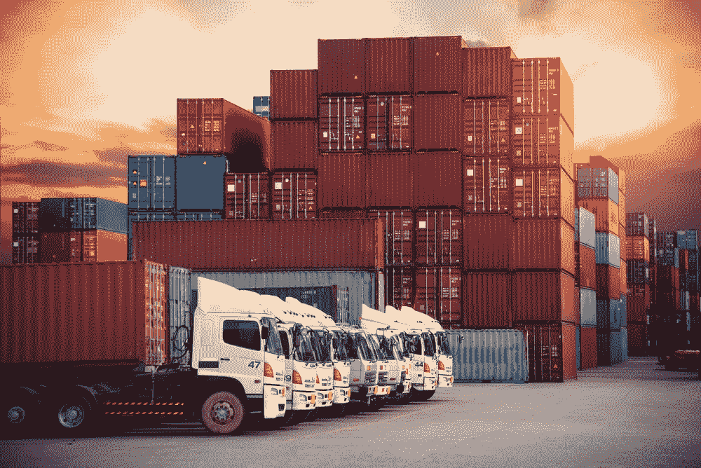

# 区块链将使航运和物流更加透明(和高效)的 3 种方式

> 原文：<https://medium.com/hackernoon/3-ways-blockchain-will-make-shipping-and-logistics-more-transparent-and-efficient-699322f1d555>

[John Monarch Twitter](https://twitter.com/realjohnmonarch?lang=en)

任何航运和物流公司的目标都是以安全和准时的方式将物品从 A 点运输到 B 点。但真正做到这一点，行业严重缺乏。

由于监管链的混乱，货物丢失、损坏或延误的情况屡见不鲜。比如**很多公司还没有数字化**，所以他们的文件必须传真或者扫描。由于这种过时的流程，当有人修改文档时，没有人知道是谁做的，也不知道为什么要修改，这就存在着“纸笔修改”的高风险。

即使是精通技术的航运公司也会遇到麻烦。如果他们是一个更长的交付链的一部分，数字企业仍然必须与其他可能类似的公司进行交接。

这就造成了信任的缺失。

如果货物丢失，您可能会损失价值数百万美元的库存。不用说，这是一个巨大的问题。但区块链有潜力让航运变得更加透明、可靠和安全。这是一项净收益，将惠及参与航运的所有人，包括仓库、司机、客户和监管者。

这种技术可以通过三种方式为行业开创一个透明的新时代:

## **1。区块链创造了一个不可变的账本。**

区块链将使我们能够轻松跟踪监管链上的变化。修改了什么，谁做的，他们什么时候做的，为什么做？

这种增加透明度的能力背后的关键特性是散列函数。哈希就像数学指纹，没有两个哈希是相同的。如果有人对文档进行了更改——例如，即使只是添加了一个句点——哈希也会反映出来。数据存储在谁在何时做了修改的记录旁边，这使得有人很难篡改它。

让我给你一个真实的例子:

当独立的卡车司机搭上主要运输公司的车时，他们经常不得不在卡车之间进行交接。部分问题在于许多不同的公司拥有许多不同的卡车。因此，当一个司机需要将一个托盘从芝加哥运输到迈阿密时，他可能会与几个托运人和车辆打交道。指挥链很长，出问题的机会很多。但是，使用区块链和哈希，您可以看到每个交叉点发生了什么——如果文档发生了更改，是什么原因导致的，或者哪个驱动程序对此负责。

这为流程带来了一些急需的可见性。它还可以与现有技术结合使用，以增加透明度。

## **2。它提供了与现有跟踪系统的协同作用。**

区块链当然是革命性的，但它不应该存在于真空中。

如果您将物联网(IoT)跟踪技术与分布式账本相结合，您可以更清楚地了解运输过程的每一步。这将帮助我们确定问题发生的时间和地点。

从卡车和仓库到托运人和司机，有如此多的移动部件。将区块链与现有的跟踪系统一起使用，可以将来自不同参与者的所有信息放在一个可见的地方。假设您收到一件损坏的产品。通过将物联网与区块链结合使用，您可以确定路线上的某辆卡车是否进行了紧急制动，何时发生在运输途中，以及哪位司机对此负责。

在运输易腐货物时，在区块链上铺设物联网也很方便。例如，想想食物。当冷藏车将消耗品转移到其他冷藏车和仓库时，您将能够在物品运输过程中跟踪温度。

除了限制损耗，这些信息还将提高整个供应链的安全性和可靠性。

## **3。它允许安全的监督和问责。**

国际货运对监管机构来说可能是个问题，他们必须应对丢失的文件、不能及时到达的文件和欺诈。

> 仅在美国，每年就有大约 300 亿美元的货物欺诈和盗窃报告。因为很多公司不报这个，实际数字要高很多。

但有了区块链，托运人可以向监管者提供一个私人密钥，允许他们立即确认所有的文件都在那里，并跟踪任何编辑。这无疑提高了效率，但也最大限度地减少了欺诈。试图通过少报某项商品来逃避海关的公司将无法再愚弄监管者。

因此，这种监督和问责将对经济产生积极影响。监管者将能够更准确地评估关税、关税和罚款——适当的税收也将更容易征收。

这还不止于此:*利益超越了经济。*

在航运业使用区块链也将大大提高我们的安全性。想想所有可能包含在货物中但没有申报的危险物品。区块链技术，结合称重和分析货物内容的传感器，让航运业变得透明。**我们可以肯定地说**:这就是货物里的东西，这是账本为证。

航运和物流是一个古老的行业，但我们已经看到很多人对采用区块链技术来增加透明度感兴趣。这将使每个人受益，并带来积极的变化，包括减少文书工作，改善货物跟踪，并减少欺诈。