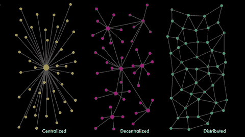

# 2018 年 1 月 30 日:神秘领域最大的故事

> 原文：<https://medium.com/hackernoon/30-01-2018-biggest-stories-in-the-cryptosphere-2389e8c43659>

**1。联合国儿童基金会将向区块链初创公司提供无股权投资**

昨天，我们[报道了](https://hackernoon.com/29-01-2018-biggest-stories-in-the-cryptosphere-acd08a271e4b)世界自然基金会使用区块链技术的情况。现在，另一个组织决定探索它的潜力。联合国儿童基金会(UNICEF)在其网站上宣布[将向有潜力造福人类的区块链初创公司提供 5-9 万美元的无股权投资。参与者可以在 2 月 28 日之前提出申请。该计划将由该组织的](http://unicefstories.org/blockchaincall/)[创新基金](https://www.unicef.org/innovation/innovation_90879.html)管理。联合国儿童基金会感兴趣的提案包括智能合同、数据分析、采矿和代币。然而，这并不是该组织第一次参与区块链科技的融资。它之前与 Ixo 基金会合作推出了一个“影响力证明”协议和[项目。](http://amply.tech/)

**2。菲律宾 SEC 将监管加密货币和 ico**

菲律宾证券交易委员会(SEC)正在起草针对加密货币交易和初始硬币发行的法规。这项工作将在今年年底前完成。美国证券交易委员会专员埃米利奥·阿基诺(Emilio Aquino)表示，这些法规将涵盖加密货币的发行和注册。此外，还将包括投资者的金融素养、发行者的资格以及加密货币市场的网络安全准则。为了保护投资者和降低风险，过去一年受欢迎程度的提高导致该国做出了这一决定。

**3。SBI 瑞波亚洲想把 DLT 带到证券界**

日本投资公司 SBI 和美国 DLT 支付初创公司 Ripple 成立的合资公司 SBI 瑞波亚洲[宣布](http://www.sbigroup.co.jp/news/2018/0130_10962.html)将联合 18 家证券公司调查[使用分布式账本技术(DLT)如何使证券产品受益](https://www.coindesk.com/sbi-ripple-asia-forms-consortium-to-bring-dlt-to-securities/?utm_content=buffer3b88c&utm_medium=social&utm_source=twitter.com&utm_campaign=buffer)。分布式账本技术指的是人们通常认为的区块链技术。然而，区块链只是分布式账本技术的一种。这个[财团](https://dictionary.cambridge.org/dictionary/english/consortium)的主要目标是通过采用新兴技术，尤其是 DLT，改善客户体验并削减管理成本。一个 DLT 高级实验工作组将会成立。在参与的证券中，我们可以找到 SBI 证券、大和证券和野村证券。SBI Ripple Asia [之前与 47 家银行组成了另一个财团](https://www.coindesk.com/47-banks-blockchain-complete-dlt-cloud-pilot-ripple-tech/),尝试在银行间交易中使用 Ripple 的技术。

**4。香港开展加密货币和 ico 教育活动**

财经事务及库务局(FSTB)和证券及期货事务监察委员会(证监会)的附属机构投资者教育中心(IEC)，[发起了一项活动](https://www.coindesk.com/hong-kong-seeks-to-educate-the-public-on-cryptocurrency-and-icos/?utm_content=buffer6b7f8&utm_medium=social&utm_source=twitter.com&utm_campaign=buffer)，旨在教育公众有关加密货币和 ico 的知识。香港政府在 1 月 29 日分享了这个消息。这一举措不仅仅局限于电视广告，而是通过各种渠道进行传播。公众将通过地铁系统和社交媒体获得信息。FSTB 副秘书长 Joseph Chan [表示](https://www.techspot.com/news/72988-hong-kong-launch-tv-ad-campaign-warning-people.html)政府希望确保潜在投资者在参与之前充分了解加密货币和 ico。也可以在 IEC 金融教育网站 Chin Family 上找到各种资讯文章。

> 要想在你的邮箱里收到我们的每日新闻综述，请在这里注册:[http://bit.ly/BlockExNewsRoundup](http://bit.ly/BlockExNewsRoundup)