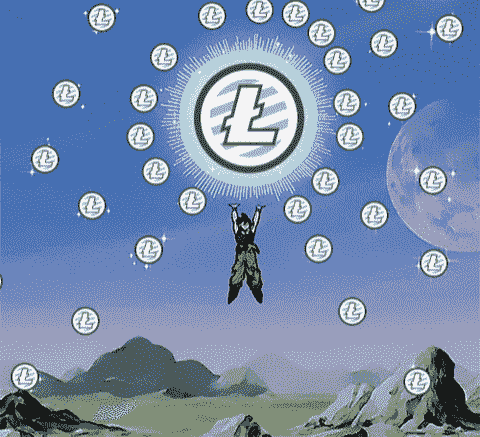

# 2018 年 4 月 30 日:神秘领域最大的故事

> 原文：<https://medium.com/hackernoon/30-04-2018-biggest-stories-in-the-cryptosphere-251f07930e73>

通过 BlockEx

**1。资产规模最大的银行中国工商银行发布首个区块链专利**

全球资产规模最大的银行中国工商银行(ICBC)[正在研究区块链](https://www.coindesk.com/chinese-bank-giant-wants-to-view-users-certificates-on-blockchain/?utm_content=buffera546a&utm_medium=social&utm_source=twitter.com&utm_campaign=buffer)，以验证数字证书，并创建一个可共享的数据存储平台。这项技术将改进其证书颁发系统，并为客户节省时间，因为他们不再需要多次填写相同的信息。不同的实体都可以访问区块链平台上的数据。[专利](https://www.scribd.com/document/377630914/ICBC#from_embed)于 2017 年 11 月提交给国家知识产权局(SIPO)，但直到现在才公布。第一个区块链与银行的专利有关。

**2。ANZ 银行集团与 IBM 合作为保险行业推出区块链解决方案**

澳新银行集团 [(ANZ)将与 IBM](https://www.anz.co.nz/resources/2/3/230edff2-58d4-4825-8ffd-d0a6393e6256/developing-blockchain.pdf?MOD=AJPERES&CACHEID=230edff2-58d4-4825-8ffd-d0a6393e6256) 合作推出旨在改善保险行业的区块链解决方案。Suncorp 新西兰公司也将成为该项目的一部分。这个想法是为了加快和增加经纪人和保险公司之间的数据传输和交易的透明度。新的区块链解决方案将与现有的行业系统相集成。ANZ 和 IBM 也发布了一份概念验证白皮书，概述了这项技术，以及它将给保险业带来的优势。该项目采用了基于区块链的平台 Hyperledger Fabric。

**3。日本金融厅希望交易所放弃促进匿名的加密货币**

日本金融服务厅(FSA)希望通过要求加密交易所放弃促进匿名的替代硬币来打击洗钱等非法活动。受影响的加密货币包括 Zcash (ZEC)、Dash(破折号)和 Monero (XMR)。FSA 表示，鉴于这些加密货币授权的相当高的隐私级别，识别用户或跟踪资金流动是很难的。比特币不存在同样的问题，因为它使用公共区块链，更容易追踪。欧洲刑警组织以前曾表示过这一关切。去年，欧盟执法机构报告称，这三种加密货币在这些类型的活动中越来越受欢迎。

**4。查理·李愿意为莱特币的去中心化离开他的角色**

Litecoin 的创始人、前比特币基地工程总监查理·李在[接受 TenX](https://www.youtube.com/watch?v=aHOcTllK1_c&feature=youtu.be&t=10m56s) 采访时表示，为了让 Litecoin 最终成为一个国际去中心化的 altcoin，他将[愿意离开他的角色](https://cointelegraph.com/news/charlie-lee-to-make-litecoin-more-decentralized-eventually-i-would-step-away)，他认为这是不可避免的。他承认，去中心化是比特币的一个特点，而这正是他的硬币所缺少的。不过，他接着说，比特币和莱特币的功能不同，而且在相互加强。在 4 月 27 日星期五的采访之前，李开复曾表示他永远不会离开莱特币，并希望专注于它。

> 本新闻综合报道由 [BlockEx](http://bit.ly/BlockEx_) 为您带来。

> *要想在你的邮箱里收到我们的每日新闻综述，请在这里注册:*[*http://bit.ly/BlockExNewsRoundup-Updates*](http://bit.ly/BlockExNewsRoundup-Updates)