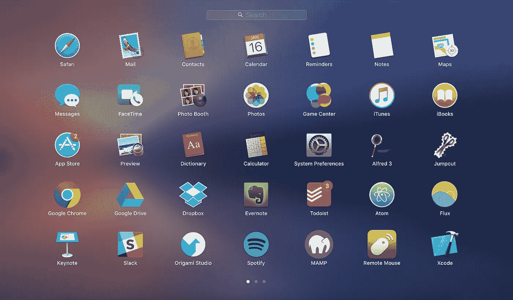
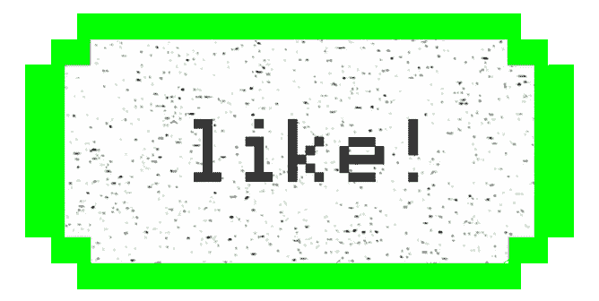
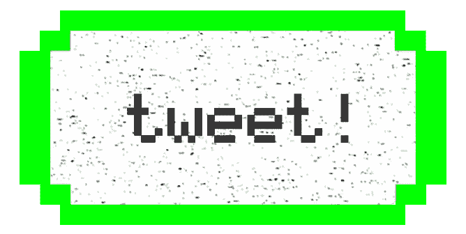
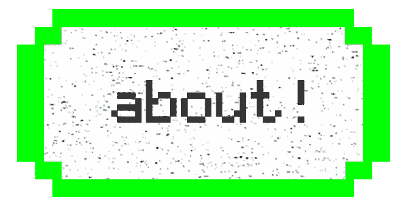

# 30 个 Chrome 扩展、应用和黑客，让您的工作效率提高两倍

> 原文：<https://medium.com/hackernoon/30-chrome-extensions-apps-and-hacks-to-2x-your-productivity-440ee18dcb94>

Some of my apps on my launchpad

在过去的三年里，我尝试和测试了数百个应用程序、Chrome 扩展和生产力黑客，以使自己变得更加有效和高效。

我通过播客或阅读其他生产力工具列表找到了其中的大部分，但我想写一个列表，列出我喜欢和使用的所有工具。

这篇文章就是它的产物，它应该是目前网络上最好的生产力工具和黑客列表。

因此，如果你想让你的效率和效力每天都翻倍，这里有 30 个你可以使用的生产力窍门:

# 第 1 部分:Google Chrome 扩展

Google Chrome 扩展是最容易设置和使用的，所以我最喜欢的一些技巧来自这一部分。如果你目前没有使用 Chrome，你应该切换到它，这样你就可以使用所有这些扩展(即使 Chrome 使用更多的 RAM)。以下是我喜欢的扩展:

1.  **【脸书新闻供稿根除器】——它做了它所宣传的:它根除了你的新闻供稿，并用漂亮的报价取而代之。大家应该都在用这个！**
2.  **[**气势**](https://chrome.google.com/webstore/detail/momentum/laookkfknpbbblfpciffpaejjkokdgca?hl=en)——有了这个，你每次打开一个新的标签页，都会给你展现一幅大自然的美丽画卷。动力令人难以置信地放松和平静，每当你打开一个新标签，你都会让别人惊叹。**
3.  **[**视频速度控制器**](https://chrome.google.com/webstore/detail/video-speed-controller/nffaoalbilbmmfgbnbgppjihopabppdk?hl=en) —这个扩展可以让你使用简单的键盘快捷键，以 0.1 的增量加速或减速你在线观看的任何视频。非常适合在桌面上快速加速那些 YouTube 视频或网飞节目。**
4.  **[**视频拦截器**](https://chrome.google.com/webstore/detail/video-blocker/jknkjnpcbbgcbdbaampbjlhkcghmgfhk?hl=en) —视频拦截器可以让你输入特定的 YouTube 频道和视频关键词，这样那些类型的视频就不会再在 YouTube 上弹出来了，无论是在推荐中还是在搜索中！我通常在这里输入“NBA”或“Chris Smoove ”,所以我在 YouTube 桌面上看不到任何 NBA 的精彩视频，我看了太多。**
5.  **[**屏蔽网站**](https://chrome.google.com/webstore/detail/block-site/eiimnmioipafcokbfikbljfdeojpcgbh) —这有助于您屏蔽让您分心的特定网站，因此您将被禁止访问它们。类似的 Chrome 扩展是 [Forest](https://chrome.google.com/webstore/detail/forest-stay-focused-be-pr/kjacjjdnoddnpbbcjilcajfhhbdhkpgk) 。**
6.  **[**Adblock Plus**](https://chrome.google.com/webstore/detail/cfhdojbkjhnklbpkdaibdccddilifddb) —让您删除广告，这将有助于消除混乱并节省您的时间。**
7.  **[它会检查联系人是否在 Linkedin 上，并在你的电子邮件旁边显示一份简短的简历和照片。](https://rapportive.com/)**
8.  **[**HubSpot Sales**](https://chrome.google.com/webstore/detail/hubspot-sales/oiiaigjnkhngdbnoookogelabohpglmd)——这可以让你追踪谁打开了你的电子邮件，非常有用！[**MailTracker**](https://chrome.google.com/webstore/detail/mailtracker-free-email-tr/pgbdljpkijehgoacbjpolaomhkoffhnl?hl=en)**也是另一个不错的选择。****
9.  ****Evernote Web Clipper(Evernote Web Clipper)——这可以让你将互联网上的任何内容保存到 Evernote 上，以备将来阅读。对我来说，它比脸书的保存功能好 10 倍(谁会阅读他们保存在那里的文章？我不知道。)****
10.  ****[**what font**](https://chrome.google.com/webstore/detail/whatfont/jabopobgcpjmedljpbcaablpmlmfcogm)**和**[**ColorZilla**](http://www.colorzilla.com/chrome/)——这些可以让你找出网站上某个元素使用的字体或者它的具体颜色。这些对设计师和网页开发者都很有用！****

# ****第 2 部分:桌面/移动应用****

1.  ****[**jump cut**](http://jumpcut.sourceforge.net/)——这是目前为止我在这里最喜欢的工具。Jumpcut 是一个 Mac 应用程序，可以让你跟踪你命令复制的所有东西，你可以循环浏览你复制的 40 个过去的东西。非常适合在编码或发邮件时复制粘贴东西。所有 Mac 用户都应该下载这个！对于 Windows 用户来说，[**同上**](https://ditto-cp.sourceforge.io/) 是一个很好的替代用法。****
2.  ****[**f . lux**](https://justgetflux.com/)**—Flux 将你的屏幕调成微橙色，让你更容易入睡。更少的睡眠时间+更好的睡眠=你有更多的时间和精力。******
3.  ******[**阿尔弗雷德**](https://www.alfredapp.com/) —阿尔弗雷德让你在 2 秒钟内关闭电脑——按下 option-空格键，然后键入“sh”并回车。它也是 Mac spot light 的一个更好的版本，可以让你非常容易地打开文件。******
4.  ****[**speech ify**](https://www.getspeechify.com)—speech ify 是一款用于 Mac 的桌面应用程序，可以让你在线高亮显示任何文本(或 pdf 格式的文本)，并让它为你大声朗读，速度和口音可调。它是由我的朋友[克里夫·威茨曼](https://medium.com/u/c33ede88fcd8?source=post_page-----440ee18dcb94--------------------------------)创建的，主要是为那些有阅读障碍的人(比如他自己！)，而 Cliff 和这个 app 的故事还是蛮励志的。我用 Speechify 让它为我朗读，以节省时间，不用为学校朗读冗长的阅读材料。****
5.  ****[**Google Photos**](https://photos.google.com)—Google Photos 可以让你上传你所有的照片以节省手机空间，你可以搜索像“论文”或特定日期这样的关键词来轻松找到照片。我经常使用他们的搜索功能。****
6.  ****[**App Detox**](https://play.google.com/store/apps/details?id=de.dfki.appdetox&hl=en)**——对于安卓用户来说，App Detox 可以让你限制自己在任何 App 上花费的时间，比如脸书、推特、Instagram。你可以设置每天的时间限制，或者只设置你可以打开应用程序的特定时间范围。挺酷的。******
7.  ******[**Todoist**](http://todoist.com) — Todoist 是我的首选任务管理器，因为我热爱设计，我同时使用桌面和移动应用程序。稍后在 Todoist 上了解更多关于我如何分类任务的信息。******
8.  ****[**Evernote**](http://evernote.com)——这是我记录一切的地方。我是 Evernote 的粉丝，我特别喜欢搜索功能、Web Clipper 扩展和整体设计。****
9.  ****[**谷歌日历**](http://calendar.google.com)——大家应该都已经在用这个了。确保同步笔记本电脑和手机上的日历****
10.  ****[**Dropbox**](http://Dropbox.com) **和**[**Google Drive**](http://drive.google.com)——让你从任何地方访问你的文件。每个人都应该已经在使用这些了。****

# ****第 3 部分:一般生产力技巧****

1.  ******将你的触控板灵敏度提高到最高/最快**——这是我从[诺亚·卡根](https://medium.com/u/f644ebba8f33?source=post_page-----440ee18dcb94--------------------------------)那里学到的，也是我最推荐的技巧之一。如果你整天用电脑工作，让你的鼠标移动得更快一定会让你工作得更快。只要转到你电脑的设置，把灵敏度调到最高。我想说这会让你的工作速度提高两倍，任何人都可以习惯。你只需要几天时间。****
2.  ******学会更快地打字**——除了触控板，下一个最重要的优化是你的打字速度，用于打印电子邮件或文件。我使用了一个打字教程应用程序，如 [this](https://chrome.google.com/webstore/detail/typingclub/obdbgibnhfcjmmpfijkpcihjieedpfah?hl=en) 来学习更快地打字(我现在打字速度是每分钟 90-100 个字，而以前是每分钟 40 个字！)你可以在[10 快指](https://10fastfingers.com/typing-test/english)上测试和提高你的打字速度。****
3.  ****每天早上和晚上写日记，这并不能让我变得更有效率，但是可以让我变得更有效率。目前，我在使用蒂姆·费里斯的一个版本的日志实践，你可以在他的新书[泰坦的工具中找到。](https://www.amazon.com/Tools-Titans-Billionaires-World-Class-Performers/dp/1328683788)我所做的是列出我感激的事情和我想在早上完成的事情，然后在晚上列出我在那天完成的事情和我本可以改进的事情。****
4.  ******每天早上冥想(或者当你感到不知所措的时候)**——这是我做的另一个练习，让自己更放松，头脑更清醒。根据 Tim Ferriss 的说法，他采访过的 80%的成功人士都有正念/冥想练习。所以绝对值得尝试融入你的生活。我推荐使用 [**顶空**](https://www.headspace.com/) 或 [**唤醒**](https://wakingup.com/) 手机应用来尝试冥想！****
5.  ******使用看板/完成工作效率框架来管理你待办事项清单上的任务**——这个有点难实现，但对我很有帮助。基本上，我在我的 Todoist 上创建了 4 个项目/类别，在那里我对任务进行分类，从“今天的任务”，到“暂停”，到“本周的任务”，再到“积压的任务”。这有助于我划分任务，并帮助我把注意力集中在“今天的任务”上，这有助于减轻压力。****
6.  ******循环播放歌曲来帮助自己集中注意力**——这是我自己做的事情，很多其他高水平的人也这么做，比如 Wordpress 的创始人马特·莫楞威格。我有一些已经循环播放了一千遍的歌曲。Spotify 上的[电子学习音乐播放列表](https://open.spotify.com/playlist/5ZrOmMLxF0i7gCl2rRI0v1)是我以前用来帮助我集中注意力的东西。****
7.  ****吃健康的食物，每天吃适量的卡路里**——这将帮助你一整天都更有活力。例如，吃太多的糖会让你在几个小时后感到困倦或精力不足。确保你没有摄入太少或太多的卡路里。你可以在 [**这个网站**](http://www.iifym.com/tdee-calculator/) 找到正确的卡路里摄入量，然后你可以使用 [**MyFitnessPal**](https://www.myfitnesspal.com/) 来确保你达到了卡路里目标(无论是减肥、保持体重还是增加体重！).******
8.  ******优化你的睡眠**——一些建议包括用合适的低温睡觉，只在该睡觉的时候呆在床上，使用漂亮的厚毯子。这些可以帮助你提高睡眠质量，让你第二天感觉更好。我也做了一个小窍门，就是我设置了一个闹钟，从我睡觉的时间起 7 小时 45 分钟，这样我就可以有五个睡眠周期，并且有 15 分钟的时间入睡。这对我有奇效。****
9.  ******吃饭、散步或通勤时听听播客或有声读物**——这让你即使在空闲时间也能保持高效。我最喜欢的播客是蒂姆·费里斯的节目，我也喜欢音阶大师 T21。****
10.  ****每周至少锻炼 2-3 次，最好是力量训练。力量训练对健康有很多好处，它能提高你的免疫系统和健康水平。从去年开始，我每周锻炼 2-3 次，这让我有了更多的精力，也不那么累了(除了看起来有点缓冲！).****

****原来如此！这些都是我读过并自己使用的提高效率的方法。我想推动的是，你应该始终关注如何优化你自己和你的生产力。如果你想做更多的工作，完成更多的事情，帮助更多的人，为这个世界增加价值，那么你不妨优化一下你的工作方式和保持健康的方式。****

****只要确保你在这个过程中一直保持快乐和感激，不要过度。生活中有些时候你也需要休息一下，休息也是一种降低生产力的方式。****

****无论如何，我希望你们喜欢这个列表！你应该试试上面的扩展、应用和黑客。我向你保证，你不会后悔尝试它们。****

# ******连接更深******

****如果你喜欢这篇文章，点击拍手按钮或在下面留下评论！请随意评论我遗漏的你使用的任何生产力工具或技巧。:)****

****Brian Tan 是一名来自马尼拉的 21 岁 UI/UX 设计师和作家。您可以在[*briantan . XYZ*](http://briantan.xyz)*查看他的作品集，并在*[*blog . briantan . XYZ*](http://blog.briantan.xyz)*查看他撰写的其他文章。在媒体上关注他，阅读他未来的文章。*****

************************