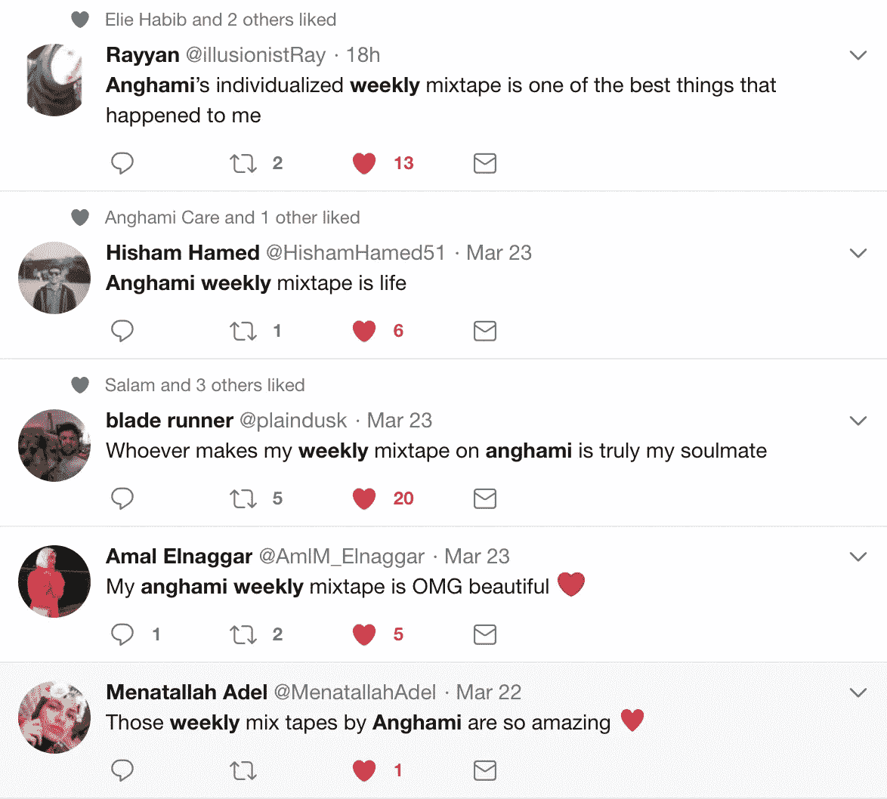
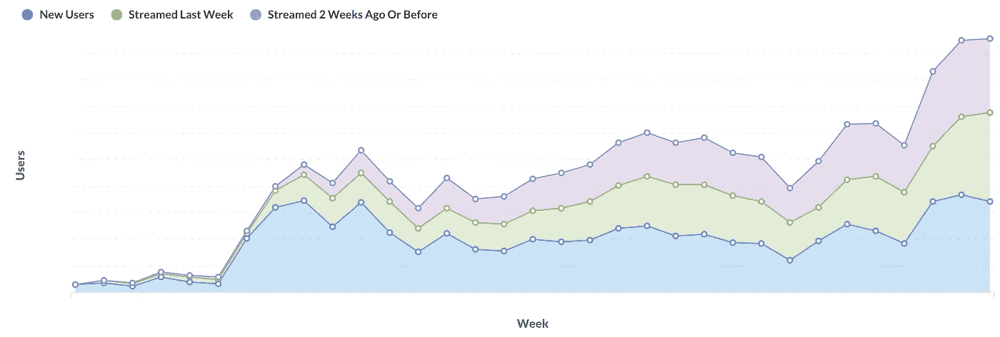

# 3000 万首歌减少到 30 首

> 原文：<https://medium.com/hackernoon/30-million-songs-down-to-30-1e6a4d2aebdc>

## 生成数百万个个性化播放列表@AnghamiTech

[**Anghami**](http://play.anghami.com) 是中东和北非地区领先的音乐流媒体服务。我的团队在个性化相关功能方面领先，其中的冠军是“你的每周混音带”功能。Mixtape 是一个包含 30 首歌曲的播放列表，我们每周为每个 Anghami 用户生成。

I know! I liked them all 😀

每周我们的用户都会根据他们的喜好得到一组新的歌曲。它使用我们的推荐管道(代号*竖琴*)来筛选 3000 万首歌曲，并创建一个我们的用户会喜欢的播放列表；我们在用户知道的歌曲和我们认为他们应该发现的歌曲之间进行平衡。

Curating music based on a user’s taste profile (musical fingerprint).

## 深入探讨我们如何制作混音带

首先，我们的算法使用我们的数据将所有用户-歌曲(可选地，用户-艺术家)交互配对(参见 [Song2Vec](https://towardsdatascience.com/using-word2vec-for-music-recommendations-bb9649ac2484) & [协作过滤](https://en.wikipedia.org/wiki/Collaborative_filtering) +在[未来](https://hackernoon.com/tagged/future)帖子中有更多关于这些的内容)，通过给歌曲&艺术家向量表示，将它们投射到所谓的潜在空间中；本质上是一种方法，它允许我们选取任意两对物品，并获得它们之间的“相似性得分”。现在，我们有能力选择任何一个项目，并根据相似性对所有其他项目进行评分，然后我们从这里开始。

接下来，我们需要将用户的抽象“品味”转化为我们可以处理的东西。我们采用用户最近与 Anghami 上的内容的互动，并对分数使用指数时间衰减，简单地说:最近的互动比旧的互动更有价值。这使我们能够捕捉用户随时间变化的口味，同时仍然纳入他们的历史，因此没有一周的习惯变化可以摆脱混音带，即我们允许你的罪恶快乐:)用更专业的术语来说，我们将用户的“口味”投射到我们投射歌曲和艺术家的同一潜在空间，允许我们在用户和内容之间分配感知的“兴趣分数”。

既然我们可以给每个用户和歌曲分配一个分数，我们就可以开始尝试生成一个播放列表。简单地获得与用户最近的 30 首歌曲的列表被证明是有问题的。推荐系统是一个伟大的[工具](https://hackernoon.com/tagged/tool)，但是如果没有一些逻辑覆盖，它们往往会产生令人厌烦的结果；他们很可能会给出与用户互动过的艺术家的结果，他们也倾向于给出同一艺术家的多首歌曲等等。

为了解决系统的这些方面，我们将人类逻辑的最后一些部分分层，以帮助这些机器:

在我们生成第一个 Mixtape 后，我们会跟踪添加到任何用户 Mixtape 中的所有歌曲和艺术家，以确保我们不会在不同的星期推荐同一首歌曲，这样我们就不会在连续的几个星期里一直推荐相同的艺术家。

1.  我们确保用户最近没有播放过这些歌曲
2.  我们确保我们不会给出以前推荐的同一首歌的不同版本
3.  我们首先为用户生成多达 200 首“可能的”曲目(1 首由艺术家创作)
4.  我们考虑用户“知道”某个艺术家的程度(流媒体+唱片目录的百分比),以便在列表排序中使用它。这是为了允许发现，否则我们将只是给用户他们知道的艺术家的歌曲，混音带会变得无聊。
5.  我们现在有一个重新排序的 200 首初始曲目的列表，从中我们选择了混音带的前 30 首曲目。

现在你有了它，一个简单的公式来生成个性化的播放列表，并得到用户的喜爱。与所有产品一样，当我们迭代产品以使其更好时，公式会不断变化。

下面的图表给出了用户与 Mixtape 交互的频率。我们看到，在数据验证和确认的一个小部分进行阶段性推广时，起步较慢。然后，当我们推出一项新功能，用户开始看到它并与之互动时，我们会看到一个快速上升，之后我们会看到一个轻微的下降，稳定下来，然后回到增长。这是一个非常标准的使用图表，它非常健康，因为我们在图表的末尾看到，我们的使用量几乎平均分配给了从未尝试过 Mixtape 的用户、之前播放过 Mixtape 的用户和之前播放过 Mixtape 但之前没有播放的用户。我们遇到了一些问题(2 个主要问题),比如发送通知和不能在用户主页上正确显示 Mixtape🙊

Usage on the Mixtape by User Segment

更多关于推荐的帖子即将发布:我们对协同过滤的看法，“你的欢迎混音带”，基于内容的推荐(代号*耳蜗*)，Radios@Anghami，NewMusic@Anghami。

非常感谢昂哈密和我的团队([拉姆兹·卡拉姆](https://medium.com/u/f0b042f4ac2d?source=post_page-----1e6a4d2aebdc--------------------------------)、[阿卜杜拉·穆萨维](https://medium.com/u/d953ce72fa8b?source=post_page-----1e6a4d2aebdc--------------------------------)、[奥马尔·埃尔·扎里夫](https://medium.com/u/ff599d0598dc?source=post_page-----1e6a4d2aebdc--------------------------------))。

向阿帕奇星火团队推销，在此基础上建造竖琴。

来凑热闹:[https://www.anghami.com/careers](https://www.anghami.com/careers)