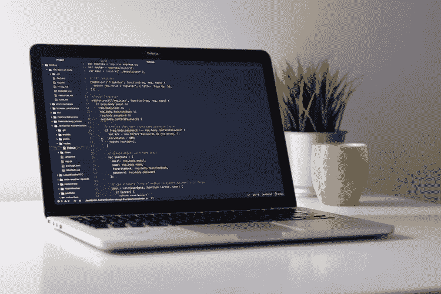
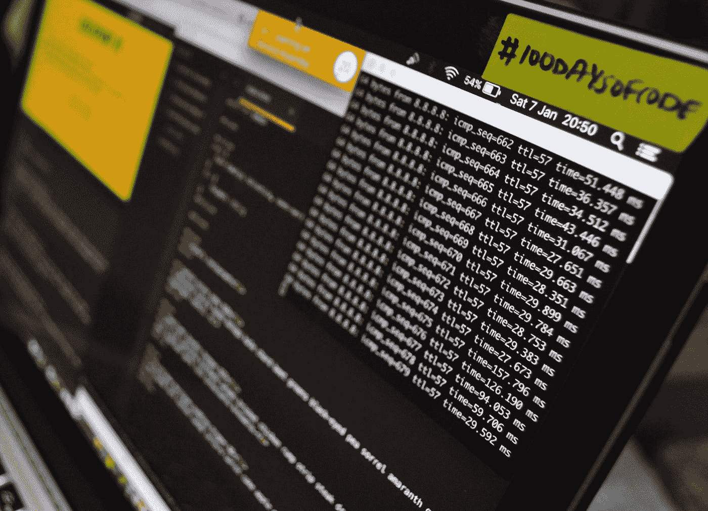

# 300 门免费在线编程课程，您今天就可以开始学习

> 原文：<https://medium.com/hackernoon/300-free-online-programming-courses-you-can-start-today-4cd05bfb4c93>

## 学习你感兴趣的编程语言

最近，我查阅了 Udemy 数据库，发现了这些免费的在线课程。我列出了 300 门这样的免费在线课程，你可以从今天开始学习。我已经根据科目和主题对在线课程进行了分类。参加这些课程学习[编程](https://hackernoon.com/tagged/programming)，web 开发，前端开发，移动应用开发，数据科学开始学习。

可以使用 [**快速码**](http://quickcode.co) 发现更多基于不同技术和[编程语言](https://www.quickcode.co/subjects/all)的免费编程课程。[**chrome 扩展**](https://chrome.google.com/webstore/detail/quickcode-free-online-pro/nnigpbiaggiephcndokoaongeefpbdcj?hl=en) 对于获取新的免费编程课程的每日更新也非常有用。

Free online programming courses

# [安卓](https://www.quickcode.co/free-tutorials-learn/Android/14)

## [面向新手的 Android 开发(8 小时以上的内容)](http://bit.ly/2ljd73g)

了解开发 Android 应用程序所需的一切知识，以获得乐趣和利润。

## [用 Java 学习 Android 4.0 编程](http://bit.ly/2lj2Kg0)

从零开始，学习快速有效地编写真正的 Android 应用程序。

## [从零开始成为安卓开发者](http://bit.ly/2zFR0q7)

这是学习 Android 开发的最佳起点。

## [学习 Android Wear 编程](http://bit.ly/2yPuThu)

使用 Android Studio 和 Eclipse 学习和创建 Android Wear 程序的指南

## [安卓基础:应用开发终极教程](http://bit.ly/2yONhqU)

了解 Android 并为 Android Playstore 创建令人惊叹的应用程序

## [正确地将 Android 应用部署到不同的应用商店！](http://bit.ly/2ljgG9N)

用 30 分钟时间学习如何以正确的方式将您的移动应用程序部署到 Google Play，并探索其他替代方案。

## [如何在谷歌 Play 商店发布安卓应用](http://bit.ly/2lj5wln)

关于如何准备发布应用程序、创建 Google Publisher 帐户并发布应用程序的分步讲座。

## [安卓材质设计 Slidenerd 风格](http://bit.ly/2yQzY9t)

学习构建从零到堆叠的材料设计应用程序

## [Android 开发从无到有，打造酷炫应用！](http://bit.ly/2lj7v9j)

我们通过理解概念和现场实现来开始学习 Android 编程！

## [学习 Android 应用开发](http://bit.ly/2lguIJb)

Android 应用程序开发入门课程

## [如何使用我的智能手机——安卓版](http://bit.ly/2liLXtv)

Android 智能手机入门指南，从 a 到 z 在移动帮助

# [有角度的](https://www.quickcode.co/free-tutorials-learn/Angular/4)

## [初学者角度练习](http://bit.ly/2ljf1B5)

创建 Web 应用程序，为 Android 和 iOS 创建混合应用程序，创建单页面应用程序

## [快速入门角度](http://bit.ly/2ljf3ZJ)

一个快速实用的方法，让你知道 AngularJS 是否是你和你的项目的首选工具！

## [AngularJS 大师班——深潜&了解 AngularJS](http://bit.ly/2yVve4F)

理解核心概念，使用模块化方法创建定制指令、定制服务、路由和实践。

## [AngularJS 认证:使用 Auth0 保护您的应用](http://bit.ly/2li0OV0)

了解如何将 JSON Web 令牌身份验证添加到 AngularJS 应用程序中

## [从零开始学习 Angular 4](http://bit.ly/2liNLCH)

通过这个免费的 Angular 4 课程从零到英雄！

## [Angular 2+](http://bit.ly/2li0Xrw)入门

了解如何构建您的第一个 Angular 2+应用程序！

## [试试 Angular v4 |谷歌的一个令人难以置信的前端框架](http://bit.ly/2li0PZ4)

从 Web 应用程序到移动应用程序，Angular 作为一个客户端框架是一个庞然大物…在本课程中学习基础知识。

# 苹果手表

## [雨燕以身作则；用 Apple Watchkit 制作 Apple Watch 应用](http://bit.ly/2yS34Yc)

我们将一起学习苹果新的尖端编程语言，同时构建一些有用的 Apple Watch 应用程序！

# [ASP.Net](https://www.quickcode.co/free-tutorials-learn/ASP-.NET/12)

## 【ASP.NET 休息 WCF 服务

*   了解如何在 ASP.NET web 应用程序中构建 RESTful WCF 服务，并使用 JQuery 调用其方法。

# [C++](https://www.quickcode.co/free-tutorials-learn/C++/40)

## [开始 C++模板](http://bit.ly/2lijC6l)

深入理解模板&创建通用算法和类。

## [通过创建](http://bit.ly/2yUkR11)学习 C++

用基于项目的方法学习 C++编程基础

## [完全初学者 C++教程](http://bit.ly/2yN581n)

如何编程在流行(和棘手！)C++编程语言，适合完全初学者。

## [C++，短小精悍，第 1 部分](http://bit.ly/2lj1qd2)

基于《加速的 C++》一书的第一门 C++课程。

## [学习在 Windows 平台上用 Visual C++编写井字游戏](http://bit.ly/2lk45mq)

用 Visual studio 2015 / Visual C++和 Windows API 构建一个完整的井字游戏作为 Windows 应用程序

# [C](https://www.quickcode.co/free-tutorials-learn/C/35)

## [从零开始学习 C 语言套接字编程](http://bit.ly/2lj1nOo)

掌握套接字编程概念，并开始用 C 编程语言构建网络应用程序

# [CSS](https://www.quickcode.co/free-tutorials-learn/CSS/9)

## [CSS 开发简介](http://bit.ly/2zGtOI4)

*   级联样式表，或 CSS，是我们控制网站外观的方式，包括颜色、布局、字体等等

## [掌握 CSS 3.0 选择器](http://bit.ly/2li0TIi)

*   通过 CSS 3.0 选择器增强您的开发和设计能力

## 掌握基本的 CSS 选择器。

*   深入学习和掌握 CSS 选择器的基础知识。CSSCasts 课程的一部分

## [CSS 图像过滤器—现代网络图像的颜色处理](http://bit.ly/2ljeYoT)

*   学习使用超级 CSS3 图像过滤器处理任何类型的图像，让你的图像看起来超级棒！

## 结合使用 Dreamweaver CS6 和 Xcode 构建 iPhone 应用程序。

*   用你的 HTML 和 CSS 知识来构建真正的 iPhone 应用程序。

## [用 HTML5 和 CSS3 在一周内建立你的第一个网站](http://bit.ly/2zGtPM8)

*   学习现实世界 HTML 和 CSS 的最快方法

# [数据结构](https://www.quickcode.co/free-courses-learn/Data-Structures/14)

## [数据结构—第一部分](http://bit.ly/2yNTeob)

*   用 Java 语言设计、实现和分析基本数据结构。

# [HTML](https://www.quickcode.co/free-tutorials-learn/HTML/6)

## [HTML 简介](http://bit.ly/2yQNKcp)

*   HTML 是创建 web 应用程序和网站的主要构件之一。

## [html 5 游戏开发简介](http://bit.ly/2liLKX9)

*   开始用 HTML5 制作手机游戏吧！了解如何创建 HTML5 游戏并将其发布到亚马逊应用商店

## [一个如何在 HTML 中引导](http://bit.ly/2yUQI1m)

*   从零开始，以一种快速和容易理解的方式学习网络语言。

## [从头开始学习 HTML5 编程](http://bit.ly/2yPE8OS)

*   初学者的完整 HTML5 编程课程

## [初学 Photoshop 到 HTML5 和 CSS3](http://bit.ly/2zGobtv)

*   了解如何使用 Dreamweaver 将 Photoshop 设计转换为 HTML5/CSS3。

## 适合初学者的 HTML

*   循序渐进地学习 HTML 初学者，包括项目。

## [Web 开发实践:HTML / CSS 从头开始](http://bit.ly/2zGocO5)

*   从零开始的 Web 开发:完全初学者边做边学。HTML 和 CSS。在 1 小时内编写你的第一个网站。

## [企业家编程— HTML & CSS](http://bit.ly/2yPE7KO)

*   你是零[编码](https://hackernoon.com/tagged/coding)经验的创业者吗？—通过这门初学者课程学习 web 开发的基础知识！

## [学习 HTML & CSS:如何开始你的 Web 开发生涯](http://bit.ly/2liLNlN)

*   学习 HTML 和 CSS，开始你的网页开发生涯

## [使用 Adobe Edge Animate 创建交互式 HTML5 动画](http://bit.ly/2yUbuyn)

*   探索在 Adobe Edge Animate 中创建 HTML5 动画和交互式内容的方方面面。

## [HTML 和 CSS 初学者——建立网站&上线](http://bit.ly/2ljf2VF)

*   HTML 和 CSS 初学者课程会给你所有你需要的知识来轻松快速地掌握 HTML 和 CSS。

## [掌握 HTML5 的基础知识& CSS3:初学 Web 开发](http://bit.ly/2liLKq7)

*   通过学习这些基本的编码概念，开始你成为真正的 web 开发人员的旅程

## [HTML5 和 CSS3 基础](http://bit.ly/2yUbsXh)

*   使用 HTML5 和 CSS3，用 HTML5 从头开始构建你自己的网站——专为完全的初学者设计

## [用 HTML5 和 CSS3 构建你的第一个 Glass Web 应用主题](http://bit.ly/2lipwo7)

*   一个完整的一步一步的代码，帮助你用 HTML5 和 CSS3 设计最漂亮的玻璃页脚

## [写得更快的 HTML5 和 CSS 3；emmet 的生产力黑客](http://bit.ly/2lipz3h)

*   改变 HTML 5 和 CSS 3 代码的编写方式。一种更快的方式，可以提高你写代码的效率

## [HTML 入门课程:2 小时学会 HTML！！！](http://bit.ly/2lipyfJ)

*   从学习 HTML 开始你的 Web 开发生涯

## [成为一名 HTML 和 CSS 开发人员——构建一个响应式网站](http://bit.ly/2liNDDd)

*   迈出成为专业网站开发者的第一步

## [HTML:绝对初学者的第一步](http://bit.ly/2liNLmb)

*   即使你没有任何 IT 背景，也要开始开发你的第一个网页

## [html 5 的完整入门教程](http://bit.ly/2liqr83)

*   通过 CSS 和 JavaScript 的预告片，深入了解 HTML 和 HTML5 的新特性

## 开发人员的最佳工具

*   Emmet 是一个文本编辑器插件，可以帮助你更快地编写 HTML 和 CSS。工作更快，节省时间，赚更多的钱。

## [用乌尔都语&印地语](http://bit.ly/2liNH5V)从头开始创建网站

*   HTML 和 CSS 中的网站布局

## [HTML 和 CSS 基础](http://bit.ly/2li0NQW)

*   HTML 和 CSS 的快速入门

## [为绝对初学者学习 HTML】](http://bit.ly/2yPo1AY)

*   开发自己的网站

## [HTML 和 CSS:超级有趣的初学者课程](http://bit.ly/2li0Pbw)

*   所有其他 HTML 课程的起点！

## [HTML 入门——创建你的第一个网页。](http://bit.ly/2yPo13W)

*   学习 HTML 的基础知识，用 HTML 创建你的第一个网页

## [结合使用 Dreamweaver CS6 和 Xcode 构建 iPhone 应用程序。](http://bit.ly/2ySTvrY)

*   用你的 HTML 和 CSS 知识来构建真正的 iPhone 应用程序。

## [用 HTML5 和 CSS3 在一周内建立你的第一个网站](http://bit.ly/2zGtPM8)

*   学习现实世界 HTML 和 CSS 的最快方法

## [快速开发 Windows [Win8]应用程序——仅适用于忙碌的人](http://bit.ly/2yPt4kE)

*   学习在最短的时间内构建一个漂亮的完整应用程序利用开源，HTML5/JavaScript 和更多！

## [学习构造 2:在 HTML5 中创建像素平台！](http://bit.ly/2lk2YTM)

*   利用本课程快速掌握构造 2！到最后，你会很快从初学者变成高级的！

## [用 HTML5 开发黑莓 10 应用](http://bit.ly/2zGo8xP)

*   使用 HTML5 为一个全新的平台制作优秀的应用

# [离子型](https://www.quickcode.co/free-tutorials-learn/Ionic/16)

## [用 Ionic 3 和 Firebase 创建一个 CRUD 应用](http://bit.ly/2yUbsqf)

*   使用 Ionic 3、Angular 4.3 和 Firebase 创建购物清单

# [Java](https://www.quickcode.co/free-tutorials-learn/Java/36)

## [通过构建项目练习 Java](http://bit.ly/2lijAeJ)

*   终极 Java 面试准备课程！100%专注于在现实应用中应用面向对象的设计

## [使用 Java 基础知识进行 Selenium WebDriver 培训](http://bit.ly/2yUQHun)

*   一个简短的课程，帮助您开始学习 Selenium automation 并了解其他集成 API 的基础知识

## [Java 多线程](http://bit.ly/2yN4MI5)

*   揭开 Java 多线程的神秘面纱。终极 Java 多线程课程

## [面向完全初学者的 Java 教程](http://bit.ly/2li88zL)

*   学习使用 Java 编程语言编程

## [面向初学者的 Java 基础知识](http://bit.ly/2yOFI3B)

*   在不到一个小时的时间里教授 Java 基础知识！

## [面向 Noob 的 Java:从 Noob 到半 Noob](http://bit.ly/2yVFKsF)

*   学习成为一名程序员

## [Java 从零开始](http://bit.ly/2yP8nWd)

*   用你理解的方式学习 Java，并在这个过程中获得乐趣

## [简单易懂的 Java 编程—Java 入门](http://bit.ly/2lijBiN)

*   以简单有趣的方式从头开始学习 Java

## [初级 Java 面试准备快速课程](http://bit.ly/2zG5jLk)

*   学习赢得 Java 工作面试所需的所有软硬技能！

## [面向 Noobs 的 Java](http://bit.ly/2yPMDcK)

*   Java 编程初学者指南

## [Java 编程基础知识](http://bit.ly/2lj1qty)

*   学编程！让我们看一些简单的例子，我会一路解释。

## [Java 的第一步](http://bit.ly/2zGx7PB)

*   很好地掌握 Java 编程语言的基础:从基本语法到数据库操作

## [Java FX 速成班:制作 GUI 应用程序的最佳方式](http://bit.ly/2lkuD75)

*   了解如何使用最流行的 Java GUI tookit 创建响应性 GUI 应用程序，并探索 JavaFX 的基础知识

## 学习如何使用所有的 Java 关键字

*   了解每个关键字的用途以及如何在程序中使用它们。

## [面向初学者的 Eclipse IDE:提高您的 Java 生产率](http://bit.ly/2lirrJl)

*   本课程提供逐步指导，帮助您掌握 Eclipse 的核心主题和技术。

## [解码 AP 计算机科学 A](http://bit.ly/2lkNgbi)

*   Ace AP 计算机科学 A 并获得 Java 入门

## [Eclipse 初学者教程:10 步学会 Java IDE](http://bit.ly/2yQzjVx)

*   今天变得更有效率

## [面向 Noobs 的 Java 数据结构(精简版)](http://bit.ly/2yPOfU3)

*   一步一步的指令和图表使数据结构变得简单

# [Javascript](https://www.quickcode.co/free-tutorials-learn/JavaScript/3)

## [学习用 Javascript 编程:初学者到专家](http://bit.ly/2zGoch3)

*   不要只是做一个优秀的程序员，要成为一个伟大的程序员，因为这才是最重要的。

## [JavaScript 开发入门](http://bit.ly/2liLOpR)

*   在本课程中，我们将向您介绍基础知识，并向您展示如何开始在您的应用程序中集成 JS！

## [JavaScript 基础知识](http://bit.ly/2zGtPf6)

*   快速简单地动手学习 JavaScript

## [JavaScript 入门——学习 JavaScript 的基础知识](http://bit.ly/2yQ6x7G)

*   学习 JavaScript 的绝对基础知识，并立即开始！

## [Javascript 基础知识](http://bit.ly/2lkxLju)

*   学习 Javascript 如何工作，一些基本的 API，最后创建一个迷你项目。

## [终极 JavaScript 字符串](http://bit.ly/2liNDmH)

*   JavaScript 中字符串的终极实用指南，它们如何工作，如何使用，以及它们如何帮助您的工作！

## [JavaScript ES6 中的要点——有趣而清晰的介绍](http://bit.ly/2li0R38)

*   一个关于 JavaScript ES6 的有创意又有趣的课程！拥有 Webpack、Babel、React 和所有你需要在 ES6 中编码的新语法！

## [面向初学者的 ES6/EcmaScript 6—要点](http://bit.ly/2yP9zbY)

*   使用 ES6(也称为 EcmaScript 6)更新您的 Javascript 技能集——您需要的最重要的基础知识在这里

## [用画布上的 JavaScript 编写你的第一个游戏:街机经典](http://bit.ly/2liLMhJ)

*   今天就设计一个完整的游戏。不需要特殊的软件或安装。你所需要的只是一个文本编辑器和一个网络浏览器。

## [JavaScript Essentials 2017 迷你课程](http://bit.ly/2yPnZZS)

*   学习 JavaScript 的基础，包括 PHP、Python 和 Node.js 的编程基础

## [调平至 ES6](http://bit.ly/2yP9Ag2)

*   利用 ES6 中提供的最新特性提升您的 javascript 知识

## [对 Web 开发者来说意味着堆栈:基于 Javascript 构建网站](http://bit.ly/2zGo9BT)

*   使用尖端工具，通过 MongoDB、Express、Angular 和 Node 构建快速、健壮的基于 Javascript 的 web 应用程序

## [用 JavaScript 开始 3D GIS Web 开发](http://bit.ly/2ljh480)

*   一种将 GIS 3D 地图部署到 web 的简单方法，无论是否编码。

## [快速 Windows [Win8]应用开发——只针对忙碌的人](http://bit.ly/2yPt4kE)

*   学习在最短的时间内构建一个漂亮的完整应用程序利用开源，HTML5/JavaScript 和更多！

## [用 Phaser 2 制作游戏。X](http://bit.ly/2liLXcT)

*   学习 JavaScript 和 Phaser 的基础知识！

# [JQuery](https://www.quickcode.co/free-tutorials-learn/JQuery/10)

## [学习使用 jQuery UI 小部件](http://bit.ly/2yUbvCr)

*   这是一个 jQuery UI 教程，它将向你展示如何在不学习 jQuery 的情况下使用标签、折叠、日期选择器等等。

# [MongoDB](https://www.quickcode.co/free-tutorials-learn/MongoDB/29)

## [MongooseJS 基础知识—了解 Node.js 的 MongoDB](http://bit.ly/2yPEqVY)

*   了解如何创建 Mongoose 模式，以构建基于 MongoDB 数据库设计的完整 CRUD 应用程序。

## [MongoDB 和 Python:快速入门](http://bit.ly/2zG9NBG)

*   使用 mongoengine 启动并运行

## [MongoDB Essentials —了解 MongoDB 的基础知识](http://bit.ly/2lj1olq)

*   MongoDB 作为 NoSQL 数据库解决方案的介绍和概述。

# [MySQL](https://www.quickcode.co/free-tutorials-learn/MySQL/25)

## [Java 数据库连接:JDBC 和 MySQL](http://bit.ly/2yPoyms)

*   了解如何使用 Java JDBC 连接到 MySQL 数据库

# [节点 Js](https://www.quickcode.co/free-tutorials-learn/Node-Js/5)

## [节点 JS 培训与基础](http://bit.ly/2ljeYVV)

*   节点基础和基本原理，让您准备好使用 express、jade 和节点模块创建任何 web 应用程序。

# [目标-C](https://www.quickcode.co/free-tutorials-learn/Objective-C/21)

## [iOS 记忆游戏目标-C XCode](http://bit.ly/2yPOeiX)

*   用 Objective-C 为 iOS 开发一个记忆拼图 App

# [Oracle SQL](https://www.quickcode.co/free-tutorials-learn/Oracle-SQL/26)

## [面向管理员的 Oracle WebLogic 入门](http://bit.ly/2lkNhMo)

*   Oracle WebLogic 12c 入门课程。了解如何下载、安装和创建 WebLogic 域。

## [Oracle SQL Developer:提示和技巧](http://bit.ly/2ljqArH)

*   了解如何使用 Oracle SQL Developer 并利用其最有用的特性。聪明地使用它。

# [PHP](https://www.quickcode.co/free-tutorials-learn/PHP/7)

## [PHP 开发](http://bit.ly/2ySxDNr)

*   没有必备技能，但是扣好安全带准备发展！涵盖 PHP 的许多方面。

## [实用 PHP:掌握基础知识，编写动态网站](http://bit.ly/2liLOWT)

*   通过真实世界的应用和例子学习 PHP，编写你自己的动态网站

## [用 PHP 构建搜索引擎& MySQL](http://bit.ly/2ljeZsX)

*   学习如何用 PHP 为你的网站从头开始创建一个动态的多部分数据驱动的搜索引擎。

## [了解 PHP 7 的新特性](http://bit.ly/2yOgeDl)

*   回顾 PHP 7 的所有新特性，让你的应用程序跟上速度。

## [从零开始学习 PHP 中的电子商务网站& MySQL！](http://bit.ly/2yUbu1l)

*   学习创建一个网上购物商店(电子商务)网站在 PHP 和 MySQLi 从零开始与贝宝集成。

## [PHP 电子商务网站& MySQLi(乌尔都语/印地语)](http://bit.ly/2ljf143)

*   学习一个完整的网络开发项目“PHP 电子商务网站”从零开始乌尔都语/印地语。

## [拉勒维尔简介 4](http://bit.ly/2ljf287)

*   用发展最快的 PHP 框架 Laravel 4 开始开发 Web 应用程序。

## [初学 PHP 和 MySQL 教程](http://bit.ly/2zGtRne)

*   学习 PHP 和 MySQL，像专家一样开始开发 web 应用程序！这门课程还附有结业证书。

## [从头开始学习 PHP 基础知识](http://bit.ly/2zGtRUg)

*   PHP 基础短期课程

## [通过建立一个完整的网站学习面向对象的 PHP](http://bit.ly/2lipzjN)

*   掌握 PHP 中 OOPs 的快速简单指南

## [对 PHP 和 MySQL 的实际理解](http://bit.ly/2liND6b)

*   学会理解 PHP 和 MySQL 的核心。参加全部课程并构建一个数据库 Web 应用程序

## [构建 CRUD 应用— PHP & Mysql](http://bit.ly/2yPo0wU)

*   创建带有分页的待办事项列表应用程序

## [Appzio 车载](http://bit.ly/2yPo3c4)

*   仅使用 PHP 的本地移动应用程序

# [Python](https://www.quickcode.co/free-tutorials-learn/Python/37)

## [Python 编程:初学者实践介绍](http://bit.ly/2yOBeKp)

*   消除学习编程的障碍:从零开始用 Python 3 编写自己的程序

## [Python 中排名前 5 的机器学习库](http://bit.ly/2zHNiMF)

*   对应用机器学习中使用的顶级 Python 库的温和介绍

## [面向初学者的 Python 3 中 OOP 的四大支柱](http://bit.ly/2zGzcey)

*   学习类、对象、抽象、封装、继承和多态的面向对象编程概念

## [Python 手把手解决 200 个问题](http://bit.ly/2lj7JNK)

*   最全面的 Python 练习器和解决方案集合。涵盖从基础到算法和数据分析

## [Python 编程简介](http://bit.ly/2zHz2U8)

*   Python 编程的快速简单介绍

## 面向 WordPress 开发者的 Django

*   学习如何用 python 编码，以及如何在绘制 WordPress 的平行线时使用 Django

## [深度学习先决条件:Python 中的 Numpy 栈](http://bit.ly/2lkWPXK)

*   Numpy、Scipy、Pandas 和 Matplotlib 堆栈:为深度学习、机器学习和人工智能做准备

# [R](https://www.quickcode.co/free-tutorials-learn/R/41)

## [用 R Part 1 of 10 学习数据科学](http://bit.ly/2ljeBut)

*   数据科学与 R 基础

## [R 基础知识— R 编程语言介绍](http://bit.ly/2yOtCYl)

*   学习 R 编程精要— R 初学者级别！

## [R、ggplot 和简单线性回归](http://bit.ly/2yPa0TE)

*   在学习线性回归基础的同时，开始使用 R 和 ggplot。

## [多项式回归、R 和 ggplot](http://bit.ly/2ljqfoV)

*   学习如何用 R 编写函数和绘制函数图，以及如何用多项式拟合数据集。

## [训练集、测试集、R 和 ggplot](http://bit.ly/2lk44Po)

*   如何评价 R 中回归模型的性能

## [棒球数据与流浪者、R、Retrosheet 的角力](http://bit.ly/2zHwhCr)

*   使用 Chadwick 工具、dplyr 和 ggplot 进行分析。

## [流浪汉和 MySQL 的击球位置图](http://bit.ly/2ljdTxc)

*   一起使用 R 和 MySQL 从大型数据集创建击球位置图表。

# [做出反应](https://www.quickcode.co/free-tutorials-learn/React/2)

## [仅 1 小时基本反应完毕](http://bit.ly/2liNIqv)

*   学习如何构建 React 应用程序的基本概念和工作流程的快速指南

## [React vs Angular vs Vue.js 示例](http://bit.ly/2liNFuP) e

*   自己决定你最喜欢哪一个。

# [红宝石](https://www.quickcode.co/free-tutorials-learn/Ruby/11)

## [Ruby 编程速查](http://bit.ly/2liLLub)

*   快速浏览完整的 Ruby 编程

## [用 Wistia 和 Heroku 为新手打造 Rails 应用](http://bit.ly/2liLNSP)

*   在这个项目中，我将带你经历如何创建一个简单的在线教育 web 应用程序的步骤。

## 从零开始学习 Ruby on Rails】

*   掌握 Ruby 和 Rails 框架的完整指南

## [使用 Neo4j 构建 Ruby on Rails 应用程序](http://bit.ly/2zGoa8V)

*   了解如何使用 Neo4j 后端从头开始构建 Ruby on Rails 应用程序，并开发您的数据模型

# [Scala](https://www.quickcode.co/free-tutorials-learn/Scala/39)

## [通往 Scala 的楼梯—设置说明](http://bit.ly/2li3GRM)

*   为注册 Scala 阶梯培训设置环境和开发工具

# [硒](https://www.quickcode.co/free-tutorials-learn/Selenium/42)

## [Selenium 与 C#和 Java 花絮](http://bit.ly/2yPOhv9)

*   了解你真正需要的硒元素

## [黄瓜加硒渣(基础)](http://bit.ly/2zG9N4E)

*   了解黄瓜的基本知识，并将其与硒结合

## [Selenium WebDriver 用 C#为初学者+现场测试站点](http://bit.ly/2yON7ji)

*   Selenium 是测试网站最流行的工具！和我以及成千上万的学生一起学习 Selenium Webdriver 吧！

## [了解 Docker 并将其用于 Selenium 自动化](http://bit.ly/2zI0PnA)

*   从完整的基础上学习码头和集装箱

# [SQL](https://www.quickcode.co/free-tutorials-learn/SQL/24)

## [SQL Server 初级步骤:安装和配置](http://bit.ly/2yPOfn1)

*   一个绝对的初学者教程，可以快速学习如何在您的计算机上设置 Microsoft SQL Server 练习环境。

## [使用 TeamSQL 介绍 SQL](http://bit.ly/2zHmZpZ)

*   使用 TeamSQL 学习 SQL 的基础知识

# [Swift / IOS](https://www.quickcode.co/free-tutorials-learn/Swift/15)

## [Swift 从零开始——在 iOS 上学习编程](http://bit.ly/2yPOcHR)

*   学习新语言的基础！创建快速，安全和互动的应用程序，没有编程经验！

## [Swift 2.0 快速](http://bit.ly/2yPOdLV)

*   学习苹果新的编程语言

## [Swift 2 中的 iOS 游戏开发](http://bit.ly/2lkjSSf)

*   学习创建一个“特里皮克纸牌”纸牌游戏

## [iOS9 苹果手表工具包:从零开始制作真正的应用](http://bit.ly/2li3BNP)

*   学习使用 Swift 创建 iOS9 Apple Watch 应用程序。从创意到应用商店。不需要经验。内部提示和技巧。

## [雨燕 3&Xcode 8 1 小时](http://bit.ly/2yP27hb)

*   通过创建一个名为 MyPokemons 的简单游戏来学习 Swift 3 和 Xcode 8

## 【Swift 3 雪碧套件简介

*   使用 Xcode 学习游戏开发的基础知识

## [Swift 3——创建一个简单的 iOS 游戏](http://bit.ly/2yUSnnF)

*   创建简单的 Swift 3 iOS 游戏的完整指南

## [初学者学习 Swift 编程(2017 年更新)](http://bit.ly/2lk43ei)

*   绝对初学者学习 Swift 编程！

## [基础版 Swift 4 和 iOS 11 —免费预览版](http://bit.ly/2yOgNNt)

*   学习 iOS 11 和 Swift 4 &成为一名应用创业者！

## [完整的 Swift 4 训练营](http://bit.ly/2zHvQIj)

*   了解 Swift 的所有基础知识，并开始制作 iOS 和 Apple Watch 应用程序！

## [iOS 11 开发简介:Swift 4 和 Xcode 9](http://bit.ly/2yPOiiH)

*   在这个免费的课程中学习 iOS 11 开发的基础知识！我们将介绍 swift 并制作两个完整的应用程序！

## [面向初学者的 iOS 应用开发——不需要敏捷的技能](http://bit.ly/2lkigYL)

*   不用写一行代码就能开发一个完整的应用——iOS 11 和 Xcode 9

## [面向初学者的 Swift 编程—没有编程经验](http://bit.ly/2yPv38A)

*   学习 Swift 进行 iPhone iOS 开发，不需要编程开发经验。完全初学者的 Swift

## [在目标 C 中开始 3D GIS iOS 应用程序开发](http://bit.ly/2yOlQO0)

*   以如此简单的方式创建您自己的 3D 地图应用程序！

## [使用 iOS7 从头开始创建 iPhone 应用程序—入门课程](http://bit.ly/2yOgYZ9)

*   在 Mac 或 PC 上使用 Xcode 5 创建您的第一个 iPhone 应用程序。学习 Objective C 不需要编程经验

## [从零开始成为 iOS 开发者](http://bit.ly/2yOmXNG)

*   一步一步的 iOS 开发教程，面向没有编码或 Objective-C 经验的有志开发人员。

# [Xamarin](https://www.quickcode.co/free-tutorials-learn/Xamarin/17)

## [Xamarin 原生 iOS 内存游戏 C#](http://bit.ly/2y6vUoF)

*   用 Xamarin 和 C#进行原生 iOS 编程

## [Xamarin 安卓滑动拼图 C#](http://bit.ly/2lj1nxS)

*   带有 Xamarin 和 C#的原生 Android 应用程序

# 其他人

## 学习如何使用 Pinegrow 创建一个 WordPress 主题

*   从你的 HTML 模板到一个全功能的 WordPress 主题。

## [加载 Wordpress 快 400%，无需任何技术技能](http://bit.ly/2liLMOL)

*   学习如何提高你的 wordpress 博客速度，不需要任何技术技能。说实话连我都不懂 HTML。

## [设置 OS X 开发环境](http://bit.ly/2lj04is)

*   本课程讲述了设置多个环境堆栈的最简单方法。比如 Java、Ruby、DB 等等

## [CCNA MPLS 核心技术和 MPLS 第三层 VPN:备考](http://bit.ly/2li0UvQ)

*   通过了解 MPLS、VRFs、MBGP、标签、再分发、VPNV4、PHP+等，为 CCNA、ICND2、CCNP 或 CCIE 考试做准备

## [TypeScript//Javascript 编译器入门](http://bit.ly/2li0O7s)

*   了解微软开发的 Javascript 编译器背后的技术

## [亚马逊网络服务(AWS)——从零到英雄](http://bit.ly/2liNG1R)

*   新手，用着学 AWS。AWS EC2 网络服务器、AWS NodeJS 服务器、AWS RDS 数据库服务器、S3、SES & CloudWatch。

## [带 AWS 代码管道和 Mocha 的 NodeJS CI/CD—零到英雄](http://bit.ly/2li0RAa)

*   使用 AWS CodePipeline、AWS Elastic Beanstalk 和 Mocha 为 NodeJS 提供持续集成和交付 CI/CD。

## [引导程序 4:创建登陆页面](http://bit.ly/2yP9yEW)

*   学习 Bootstrap 4，创建一个独特的响应登录页面，带有自定义 CSS、图标、web 字体和平滑滚动。

## [游戏开发速成班 w/Corona SDK:你能行！](http://bit.ly/2yPPK4D)

*   在这个面向初学者的游戏开发课程中，用你自己的 iOS & Android 手机游戏打动你的家人和朋友！

## [Livecode:一个代码统治所有人](http://bit.ly/2yPPKBF)

*   有了 Livecode，一次编写，随处部署的神话终于成为现实。为 Mac、Win、Linux、iOS 和 Android 开发

## [使用 Ionic 的快速原型制作:构建一个数据驱动的移动应用](http://bit.ly/2lgHI1k)

*   从多个 API 中检索数据；d3js 图表、缓存、数据库、RSS 提要、注释、关注(不关注)功能。

## [学习 Apache Hadoop 生态系统- Hive](http://bit.ly/2yO22dt)

*   学习 Apache Hive，并开始使用 Hadoop 中的 SQL 查询数据

## [在 AWS 上构建和部署 LAMP 服务器](http://bit.ly/2lk41Dc)

*   在 AWS 上，一个小时内构建自己的 web 服务器并部署一个网站

## [联系 Tricentis Tosca 测试套件](http://bit.ly/2lk45Ts)

*   本课程将引导你通过 Tosca 进入软件测试和测试自动化的世界。用新工具学习测试。

## [使用 Specflow 和 C#进行 API 和数据库测试](http://bit.ly/2yV1STO)

*   从头开始理解和构建 API 和数据库测试

## [使用 Boozang 学习测试自动化](http://bit.ly/2yV0wsf)

*   在一个下午学习测试自动化，不需要任何编程

## [CCNA R & S 实验室:通过情景学习](http://bit.ly/2lijzaF)

*   通过实际情景学习 CCNA·R&S 课程

> 寻找更多免费编程课程？
> 
> 在[快速代码](http://quickcode.co)上发现免费的在线编程课程。
> 
> 快速代码每天策划新的免费课程。这是一个关于 web 开发、移动开发、大数据、机器学习、数据库、数据科学、聊天机器人、加密货币等免费课程的地方。—无论你在学什么。

> 使用 [**chrome extension**](https://chrome.google.com/webstore/detail/quickcode-free-online-pro/nnigpbiaggiephcndokoaongeefpbdcj?hl=en) 获取新的免费编程课程的每日更新。

# 对最好和最高评级的在线编程课程感兴趣？加入[最佳编程课程](http://www.coursesity.com)列表，在其他人之前获得独家更新。