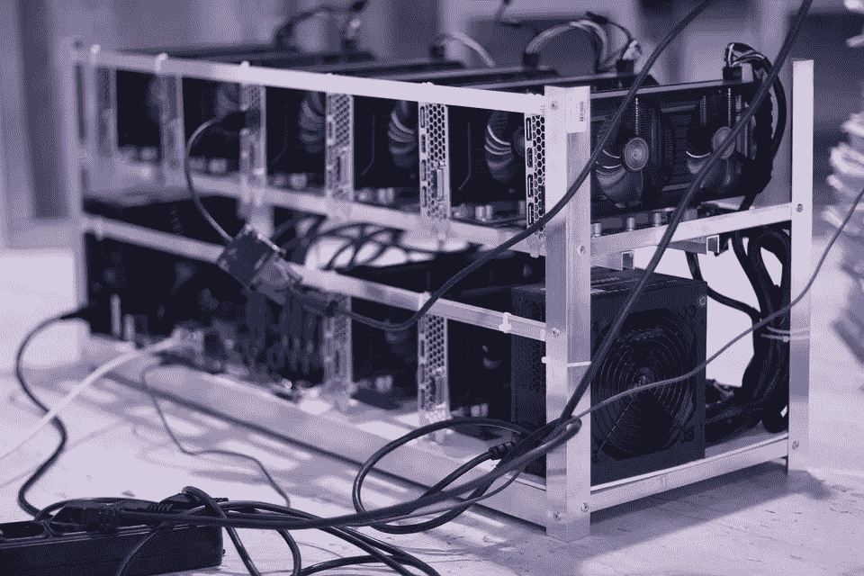

# 2018 年 1 月 31 日:神秘领域最大的故事

> 原文：<https://medium.com/hackernoon/31-01-2018-biggest-stories-in-the-cryptosphere-54ba6d76f75d>

**1。日语聊天应用 Line 移入加密**

日本聊天应用 Line [在其网站上宣布](https://linecorp.com/en/pr/news/en/2018/2024)推出其新公司“Line 金融公司”。此举将允许日本公司将加密货币纳入其投资组合，并与脸书等服务公司竞争。每月有 2 亿人使用这款消息应用，而支付服务有 4000 万用户。目前，该公司专注于日本、泰国、印度尼西亚和台湾。然而，它希望通过此举增加其在其他国家的存在。其加密货币许可证的申请目前正在审查中。该公司将建立一个市场，人们将能够交易加密货币，并获得贷款和保险。

**2。韩国不会禁止加密交换**

韩国财政部长[表示](https://www.coindesk.com/south-korea-doesnt-intend-to-ban-crypto-trading-says-finance-minister/)该国不会禁止加密货币交易和交换平台。[据 Kim Dong-yeon](https://www.reuters.com/article/us-southkorea-bitcoin-trading/south-korea-doesnt-intend-to-shut-down-virtual-coin-trading-finance-minister-idUSKBN1FK0NL) 称，该国不会追随中国对加密市场的立场。引发的强烈反对可能影响了这一决定。这条新闻是在新规定出台一天后发布的。使用加密货币交易时，现在必须提供真实姓名。否则将会受到处罚。考虑到韩国是比特币交易量最大的国家之一，这对加密市场来说是个大新闻。

**3。委内瑞拉拥有的加密货币 Petro 将于 2 月 20 日预售**

我们之前[报道过](/@BlockEx/08-01-2017-biggest-stories-in-the-cryptosphere-66ade71e5d69)委内瑞拉总统尼古拉斯·马杜罗决定发行一种石油支持的加密货币，这种货币将被称为 Petro。[一个日期](https://www.bloomberg.com/news/articles/2018-01-30/maduro-sets-venezuela-s-debut-cryptocurrency-sale-for-february)现在已经公布。马杜罗计划在 2 月 20 日开始加密货币预售。持有国民身份证的 1500 万委内瑞拉人可以使用 Petro。此外，正在大学和学校建立采矿农场。尽管总统很热情，[的反对派](https://www.cnbc.com/2018/01/31/venezuela-says-will-pre-sell-petro-cryptocurrency-on-feb-20.html)已经给这个倡议贴上了非法的标签，以及发行债券来解决国家的金融问题。美国也对该倡议发表了评论，称参与出售将破坏针对该国的制裁。

**4。三星将发行芯片开采加密货币**

三星最近被冠上全球最大芯片制造商的桂冠，夺走了英特尔的头衔。它现在行动迅速，宣布将开始生产旨在挖掘加密货币的芯片。没有透露太多细节。然而，它将与一家不知名的中国经销商合作。这家韩国公司将面临市场领导者比特大陆和迦南创意的竞争，这两家公司都与台湾的 TSMC 合作。得益于这些芯片的销售，后者的季度收入增加了 3 . 5-4 亿美元。

> *要想在你的邮箱里收到我们的每日新闻综述，请在这里注册:*[*http://bit.ly/BlockExNewsRoundup*](http://bit.ly/BlockExNewsRoundup)