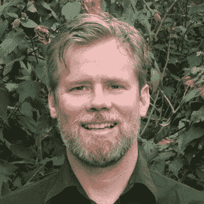

# 32 位新经济领袖，推动区块链革命

> 原文：<https://medium.com/hackernoon/32-new-economy-leaders-pushing-the-blockchain-revolution-5d34cc8c3923>

近十年来，我一直在思考价值和价值分配——在共享和协作经济中，我认识的许多人都在区块链找到了联系。在新经济浪潮中，我也遇到了许多来自不同行业的人——所以列出一个清单似乎是合适的。

重要的事情先来。

[什么是新经济？](https://en.wikipedia.org/wiki/New_economy)

> 根据剑桥词典，新经济是*“基于知识和信息的活动，而不是制造业等传统产业。”*

> 我想在这篇文章的背景下更进一步…
> 
> 新经济是以高速增长为中心的经济和共享经济运动的融合，在技术的帮助下，导致横向价值分配和更大的社会公平。

这份名单上的人以社区为中心，关注新型组织、价值共享、共享所有权、可再生货币、环境激励，以及通过重构我们的经济体系和促进相互依赖来改善人际关系*。*

我想对这个群体给予特别的关注和关注，因为这些人正在推动一种新的叙事，传播一种围绕我们如何开展业务的新意识。

这些新经济领袖既激进又活跃——我希望他们的故事被尽可能广泛地传播。

为此，我为大家带来了 32 位区块链最高领导人(排名不分先后)，他们彻底改变了我们现在和未来的经营方式。

1.**菲利比，** [**道斯塔克**](http://www.daostack.io)

Primavera De Filippi，《区块链与法律》的合著者，DAOStack 的顾问，哈佛大学伯克曼-克莱因中心的副教授，巴黎国家科学研究中心的永久研究员。

最新作品:[区块链与法律的密码](https://www.amazon.com/Blockchain-Law-Rule-Primavera-Filippi/dp/0674976428)

[LinkedIn](https://www.linkedin.com/in/primavera-de-filippi-07558536/)|[Twitter](https://twitter.com/yaoeo/media?lang=en)

2.**安德鲁·海德，** [**来历**](https://www.originprotocol.com/en)

安德鲁·海德是包括 Startup Weekend 在内的四家创业公司的创始人，并在几十个国家建立了全球社区。他是 TechStars 的 1 号员工。乳糜泻咖啡店老板。高个子。旅行。沃尔蒂。

最新作品:[这本书是关于旅行:一本现代手册——15 个国家的 15 件事](https://www.amazon.com/This-Book-About-Travel-Countries/dp/1477597832/ref=asap_bc?ie=UTF8)

[领英](https://www.linkedin.com/in/andrewhyde/) | [推特](https://twitter.com/unicorn?lang=en)

3. **Anu Bhardwaj，** [**女投**](http://thestateofwomen.com/) **，**[**sheq wallet**](http://www.sheqwallet.com)

Women INVESTING in Women DIGITAL 的创始人，这是世界上最大的专注于女性的数字媒体平台&投资，特别关注区块链。2014 年 12 月推出的"女性投资女性数字"包括超过 100 万名 FB 追随者，并与 QRYPTO QUEENS 链接；妇女广播电视网的现状，以及在纽约市、斯德哥尔摩、约翰内斯堡、圣地亚哥、斯科茨代尔、马斯喀特、新加坡、凤凰城、维也纳、洛杉矶和安卡拉举行的 WIIW 全球峰会和妇女参与私募股权圆桌会议系列。

最新作品:[妇女投资于妇女组织的创始人:为提高妇女和女孩的地位建立一个由积极倡导者组成的全球社区](http://www.mynewsdesk.com/se/connect2capital/news/anu-bhardwaj-founder-of-women-investing-in-women-building-a-global-community-of-engaged-champions-for-advancing-the-status-of-women-and-girls-212525)

[LinkedIn](https://www.linkedin.com/in/anu-bhardwaj-1726b41b/)|[Twitter](https://twitter.com/womeninvest?lang=en)

4.**利伦阿尔齐，** [**乌托皮.奥**](https://utopi.io/)

Liron Arzi 在电影、电视、音乐、多媒体、商业发展、企业赞助和咨询方面拥有超过 20 年的经验。他曾与亚洲的华纳兄弟公司和米高梅公司合作，资助和发行主要电影。目前，他是区块链科技公司 Utopi 的创始人，该公司通过独立直播改变慈善事业的面貌。

最新作品:[嘉宾:Utopi.io 首席执行官 Liron Artzi](https://player.fm/series/daily-crypto-bitcoin-blockchain-ethereum-altcoin-digital-cryptocurrency-world-news/guest-liron-artzi-ceo-at-utopiio)

LinkedIn 推特:不适用

5.**基耶斯汀**埃里克森[丰裕实验室 ](https://www.abundancelabs.io/)

KJ 是 Public Market 的首席执行官兼联合创始人，Public Market 是一个建立在以太坊区块链上的公平透明的在线市场。KJ 毕业于斯坦福大学和牛津商学院，受过经济学和博弈论的训练，热衷于建立面向消费者的网络产品和由替代货币支持的市场。

最新作品:[解放电子商务:公共市场&新的商业公地](/public-market/liberating-ecommerce-public-market-the-new-commercial-commons-f71e176328f3)

[LinkedIn](https://www.linkedin.com/in/kjerstine/)|[Twitter](https://twitter.com/kjer?lang=en)

6.**本·巴特利特，** [**伯克利**](https://www.cityofberkeley.info/Home.aspx)

第 15 区国会议员候选人。伯克利市议会成员。环境律师联合行业和政府应对气候变化，为无家可归者建造住房，通过绿色工作减轻贫困，并扩大每个人的机会。

最新作品:[为什么城市要有自己的加密货币？](https://www.citylab.com/life/2018/06/cryptocurrency-city-municipal-bonds-bitcoin/557819/)

[LinkedIn](https://www.linkedin.com/in/bennybartlett/)|[Twitter](https://twitter.com/benbartlettca?lang=en)

7. **Chelsea Rustrum，** [**区块链为善**](https://www.blockchainforgood.com/) **，** [**Blox 7**](http://www.blox7.com)

切尔西写了一本关于分享的书，名为《这是一种可分享的生活》。这让她质疑价值——它是什么，我们如何更好地分配它？我们能完全不用钱来交换吗？作为一名社区建设者、演讲者和作家，她把自己的想法带到了路上——将股权众筹、合作商业模式和区块链融合在一起，以理解如何将共享融入经济本身的结构。如今，她在区块链社区运营着一个支持社会公益的组织，包括一个[区块链道德准则](http://www.blockchaincodeofethics.com)，并联合创立了一个新经济故事机构，为代币融资提供营销和建议 [Blox 7](http://www.blox7.com) 。

最新作品:[为什么我建议共享——共享经济未来的可移植代币](https://hackernoon.com/why-im-advising-sharering-a-portable-token-for-the-future-of-the-sharing-economy-9c2b53ca1253)

[LinkedIn](https://www.linkedin.com/in/chelsearustrum/)|[Twitter](https://twitter.com/chelsearustrum?lang=en)

8.**大卫·帕西亚克，** [**布洛克斯 7**](https://blox7.com/)

David Passiak 是一名主题演讲人、创新者、未来学家，也是三本书的作者——《赋权》、《颠覆革命》和《红牛成佛》。作为一名前宗教学者，他在普林斯顿大学进行了关于“伟大的觉醒”的博士研究，他的工作专注于建筑运动、共同创造、基于人群的创新以及将重塑全球经济的新兴商业模式。如今，他经营着一家为 ICOs 讲述新经济故事的机构 Blox 7，并继续从事思想领袖共创和新经济的工作。

最新作品: [Empower:如何共同创造未来](https://www.amazon.com/Empower-Co-Create-Future-David-Passiak/dp/0989823326)

[LinkedIn](https://www.linkedin.com/in/dpassiak/)|[Twitter](https://twitter.com/passiak?lang=en)

9.**亚历克斯·沃托，** [**康塞斯**](https://new.consensys.net/)

亚历山德罗·沃托(Alessandro Voto)是总部位于布鲁克林的区块链科技创业工作室 Consensys 的西海岸地区总监，也是湾区非营利未来智库未来研究所(Institute for the Future)的研究附属机构。他还非常关心区块链技术的未来伦理和框架，并举办教育讲座和研讨会，教人们如何从合作商业的角度思考区块链。

最新作品:[https://Twitter . com/VitalikButerin/status/931323377008046080](https://twitter.com/VitalikButerin/status/931323377008046080)

[领英](https://www.linkedin.com/in/alessandro-voto-b7254121/) | [推特](https://twitter.com/avotofuture?lang=en)

10. **Faris Oweis，** [**数字小镇**](https://digitaltown.com/)

法里斯是一个讲故事的人，战略家，是想法，概念和人们的天然连接器，这些人在地理和专业上走了一条多样化的道路。在公司的小隔间里工作了多年，观看了一场改变人生的 TED 演讲后，法里斯发现自己来到了一个陌生的地方，这是他能收到的最大的礼物之一。多年来，他一直是智能城市运动的领导者，目前他加入了[数字小镇](http://www.digitaltown.com)，将智能城市置于区块链之上。当谈到解释社会变革的商业案例和走向更加合作的社会的基本必要性之间的交集时，他也是最能言善辩的演讲者之一。

最新作品:[新泽西旅游行业协会与数字镇合作开发智能旅游](http://www.marketwired.com/press-release/new-jersey-tourism-industry-association-partners-with-digitaltown-for-smart-tourism-otc-pink-dgtw-2211246.htm)

[LinkedIn](https://www.linkedin.com/in/farisoweis/)|[Twitter](https://twitter.com/faris_says?lang=en)

11. **Vicki Rox，** [**爱情币**](http://www.lovecoins.co/)

探索今天作为一个男人意味着什么。向陌生人提问。全球男士晚宴沙龙系列策展人。进入未知领域的冒险家。思想作家。真知灼见的代言人。所有人类中创造性天才的欣赏者。

最新作品:[薇姬 Rox 上 Vimeo](http://v)

[LinkedIn](https://www.linkedin.com/in/vickirox/) | [Twitter](https://twitter.com/hellovickirox?lang=en)

12.**阮经天，** [**共和**](https://republic.co/)

与一个忠诚的团队一起在 Republic 24/7 忙碌，让初创企业投资(包括加密和股权投资)更容易进入主街。ICO 平台 CoinList 和由 Shiza Shahid 领导的风险投资平台 NOW 的创始顾问，Shiza Shahid 与诺贝尔奖获得者马拉拉·优素福·扎伊共同创立了马拉拉基金。我之前的商业经历侧重于融资、运营、产品战略和投资——最近是在 AngelList。

最新作品:[股权众筹给资金带来更大的股权](https://www.youtube.com/watch?v=pgTgr3zYeKI)

[LinkedIn](https://www.linkedin.com/in/kendrick-nguyen-7145bb5/)|[Twitter](https://twitter.com/kendrickesq?lang=en)

13. **Daisy Ozim，** [**区块链促进社会公正**](https://www.b4sj.com/)

Dee 致力于发展植根于可持续性和公平的系统和实践。我有幸从事从国际到地方层面的健康计划和政策，开发了一个成功的社会企业，致力于促进区块链生态系统中的公平，并支持风险资本的正确应用。

最新作品:[弹性健康背后的力量！](https://amysmartgirls.com/get-to-know-daisy-ozim-the-force-behind-resilient-wellness-5a78506f7583)

[LinkedIn](https://www.linkedin.com/in/daisyozim/)|[Twitter](https://twitter.com/daisysuniverse_)

14.**安娜斯塔西娅·米隆，顾问**

Anastasia 是摩尔多瓦出生，意大利长大，美国经验丰富的社会企业家，创新布道者和顾问。我以富有感染力的精力和积极进取的态度而闻名，我热衷于通过赋予弱势群体和社区权力来挑战现状。作为 GlobeIn 和 TEKEDU 的联合创始人，我致力于提高技术普及和文化水平，以增加当今日益数字化的市场中的机会。作为 Child Proof Yourself 的创始人，我目前的兴趣在于利用虚拟现实和增强现实来解决以人为中心的问题，如养育子女，并通过创造意识和引发共鸣的沉浸式体验，提供新的方法来防止儿童的压力和焦虑。

最新作品:[泰克威尔梦幻俱乐部](https://www.tekwill.md/events/tekwill-visionary-club-with-anastasia-miron)

[LinkedIn](https://www.linkedin.com/in/anastasiamiron/) | Twitter:

15. **Neal Gorenflo，** [**可分享**](https://www.shareable.net/)

Neal Gorenflo 是 Shareable 的联合创始人兼执行董事，Shareable 是一家屡获殊荣的非营利新闻机构和全球行动网络，报道最新的创新资源共享、团结经济、共享城市和区块链。他是 Shareable 报道领域的演讲者、作家和顾问。他是多本书的编辑，包括 Shareable 的最新作品，《共享城市:激活城市公地》。“作为公认的分享运动先驱，他为世界各地的领导者提供如何通过分享实现目标的建议。这包括与首尔市政府、旧金山市和日本共享经济协会的合作。毫不奇怪，尼尔是一个狂热的分享者，他的“分享生活”实验被 FastCompany、Sunset 和 7x7 杂志报道。作为一名社会企业家，尼尔的及时行动呼吁简单而系统:让我们分享！

最新作品:[激活城市公地](http://www.lifteconomy.com/blog/2017/9/3/shareable-turns-the-page-with-sharing-cities-activating-the-urban-commons)

[LinkedIn](https://www.linkedin.com/in/gorenflo/)|[Twitter](https://twitter.com/gorenflo?lang=en)

16.**斯科特莫里斯，** [**Qoin**](http://qoin.com) **，** [**伊萨卡什**](http://ithacash.com/)

斯科特·莫里斯是伊萨卡什的创始人兼首席执行官。同样，a 在解决方案和系统中思考；社区货币专家；影响力企业家；

最新作品:[“补充货币”如何支持充满活力的地方经济](http://www.lifteconomy.com/blog/2016/8/1/scott-morris-complementary-currencies-with-the-founder-of-ithacash)

[LinkedIn](https://www.linkedin.com/in/cscottmorris/)|[Twitter](https://twitter.com/cs_morris?lang=en)

17.**拉曼弗雷、** [**分派实验室**](https://dispatchlabs.io/)

拉曼是好人晚餐的创始人，这是一个位于旧金山的社区，通过食物、饮料和交谈来增进信任和友谊。在湾区和内华达州的私人住宅和其他场所，有超过 150 次聚会、晚宴、过夜和静修，有专业厨师和演讲人就广泛的主题发言。

最新作品:[超级资本主义还是一个不需要的世界](/@ramanfrey/hyper-capitalism-or-a-world-without-want-a763d2a81f27)

[LinkedIn](https://www.linkedin.com/in/ramanfrey/)|[Twitter](https://twitter.com/ramanfrey?lang=en)

18.**大卫·斯奈德，** [**解网**](https://deco.network/)

大卫是 Deco.network 的首席执行官，其目标是通过让创作者获取更多他们创造的价值，更快、更便宜、更容易地参与数字知识经济。

最新作品:[分散的市场和你的企业如何利用未来的工作 2.0](https://epodcastnetwork.com/decentralized-marketplaces-and-how-your-business-can-capitalize-on-the-future-of-work-2-0/)

[LinkedIn](https://www.linkedin.com/in/dsneider/)|[Twitter](https://twitter.com/davesneider?lang=en)

19.**泰娜瑞丝，** [**默达**](https://moedaseeds.com/)

Reis 小姐是一名自学成才的软件工程师，她在 12 岁时就开始了她的编程活动。赖斯小姐是 Moeda 的创始人兼首席执行官，该公司正在利用区块链技术革新小额信贷。Moeda 是一个允许点对点支付、数字贷款小额融资和通过固定数字代币众筹的市场，所有这些都基于区块链技术。

最新工作:[经济发展部宣布选定的种子项目和大使计划](https://www.prnewswire.com/news-releases/moeda-to-announce-selected-seed-projects-and-ambassador-program-300549639.html)

[领英](https://twitter.com/taynaahreis?lang=en) | [推特](https://www.linkedin.com/in/taynaah-reis/?locale=en_US)

20.**阿曼达·拉文希尔，** [**巴克米斯特·富勒研究所**](https://www.bfi.org/)

Ravenhill 是致力于应对迫在眉睫的全球挑战的国际社会的积极成员。她曾担任项目削减的执行主任，这是一项扭转全球变暖的综合计划。她还是碳清除中心的顾问，也是 Nexus 全球气候变化工作组指导委员会的成员。她还是 Regen.network 的董事会成员，这是一个专门的生态分类账和智能承包框架，开辟了新的自然资本资产类别，以奖励生态再生和农业系统、森林和海洋的碳减排。

最新作品:[阿曼达·瑞文希尔(C10)采访](https://www.youtube.com/watch?v=l4HYdgcnHPQ)

[LinkedIn](https://www.linkedin.com/in/amandaravenhill/)|[Twitter](https://twitter.com/amandaravenhill?lang=en)

21.**卡特琳娜·林迪，** [**顾问**](https://rindiconsulting.com/)

Caterina 的专业知识包括比特币和区块链教育、计划和项目实施、社区参与、运营、管理和行政、发展伙伴关系和网络、社交媒体、解决问题、技术集成、培训和指导。对服务不足的社区和可持续发展的坚定承诺。

最新作品:[实验室电台第七集](https://coinstructive.com/lab-radio-ep-7-caterina-rindi/)

[LinkedIn](https://www.linkedin.com/in/crindi/) | [Twitter](https://twitter.com/caterinarindi?lang=en)

22.**托尼莱，** [**Legal.io**](https://www.legal.io/)

托尼·赖(Tony Lai)是一名律师、企业家和支持访问、开放、创新、参与和共享的治理和系统的倡导者。托尼是 Legal.io 的联合创始人兼首席执行官，这是一家法律技术公司，为受信任的法律组织提供转介管理和法律授权系统和解决方案，包括律师事务所、律师协会和法律援助网络。

最新作品:[固定费用法律服务:介绍](https://www.legal.io/guide/567a3c22e4a99447bb0001d0/Flat+Fee+Legal+Services+an+introduction)

[LinkedIn](https://www.linkedin.com/in/tonyklai/)|[Twitter](https://twitter.com/lai)

23.**艺术布洛克，** [**全息链**](https://holochain.org/)

阿瑟瞄准了那些塑造新兴后工业经济社会动态的货币。为此，他为多种货币系统设计了 100 多种方案，而我的软件公司已经建立并部署了几十个这样的系统。我目前的重点是推出 Holochain，它是运行完全 P2P 分布式应用程序的区块链的替代品。

最新作品:[好奇心讲座:货币专家亚瑟·布洛克全息链的创始人& Ceptr](https://cryptoticker.io/curiosity-talk-currency-expert-arthur-brock-founder-holochain-ceptr/)

[LinkedIn](https://www.linkedin.com/in/artbrock/)|[Twitter](https://twitter.com/artbrock?lang=en)

24.**丹尼斯·库钦奇，** [**众议员**](https://www.kucinich.com/)

今年是丹尼斯参与公民生活的第 40 个年头。他曾担任克利夫兰市议会成员、克利夫兰市法院书记官和克利夫兰市市长。我曾是俄亥俄州参议员，现在是我作为美国国会议员的第六个任期。我曾在地方、州和联邦各级立法、行政和“准”司法部门任职，是当今政府中背景最广泛的人之一。

最新作品:[库钦奇 2020](https://slate.com/news-and-politics/2018/05/dennis-kucinich-lost-in-ohio-on-tuesday-night-but-hes-still-the-future-of-the-democratic-party.html)

[领英](https://www.linkedin.com/in/kucinich/) | [推特](https://twitter.com/dennis_kucinich?lang=en)

25.**松村巫女，** [**Evercoin**](https://evercoin.com/)

Miko Matsumura 创建了 crypto exchange Evercoin，是谷米 Cryptos Capital 的普通合伙人。他也是 BitBull Capital 的风险合伙人和阿灵顿 XRP 资本的顾问。他是潘迪拉资本 ICO 基金(一个 1 亿美元的 ICO 专用基金)的投资者。他个人投资了 FileCoin，Brave，CIVIC，Propy，Mainframe 和 Lyft。作为 Java 语言和平台的首席传播者，他参与了互联网的第一波浪潮，现在正全力投入到加密推动的价值互联网中。

最新作品:[加密货币和区块链投资者向全球政府提供监管新技术的建议。](https://www.cio.com/article/3263324/blockchain/cryptocurrency-and-blockchain-investor-gives-suggestions-to-global-governments-regulating-new-techn.html)

[LinkedIn](https://www.linkedin.com/in/mikomatsumura/)|[Twitter](https://twitter.com/mikojava?lang=en)

26.**苏珊【塔可夫斯基】** [**比特大陆**](https://tse.bitnation.co/)

Susanne 是一名主要在前沿环境中工作的国际企业家，我的抱负是利用激进的技术和有弹性的点对点网络，创造一个无国界和自愿的后民族国家治理替代方案。

最新作品:[比特大陆的开始](https://www.youtube.com/watch?v=Vjo-5naVP3U)

[LinkedIn](https://www.linkedin.com/in/susannetarkowski/)|[Twitter](https://twitter.com/susanneonline?lang=en)

27.**史蒂文【涅拉耶夫】** [**炼金术士**](https://alchemist.com)

Steven Nerayoff 先生是一位多产的企业家、律师和 20 项国际专利的发明者，在硅谷和纽约市创办了七家公司。Steven 是区块链的先驱，他参与的顶级项目包括:以太坊、Lisk、Bancor、tZERO、ZenCash、ZCash、Ripio、Aion 和 Storm。史蒂文还是上市公司 Global block chain Technologies(OTC mkts:blk cf)(TSXV:BLOC)的董事长。

最新作品:[2018 年加密货币价值可能翻三番](https://www.cnbc.com/2018/01/08/ethereums-co-creator-predicts-a-flippening-with-bitcoin-in-2018.html)

[领英](https://www.linkedin.com/in/nerayoff/) | [推特](https://twitter.com/stevennerayoff?lang=en)

28.**布列塔尼凯泽，** [**数据**](https://digitalasset.org/)

Brittany 是国际法、外交和数据驱动的竞选专家，拥有丰富的全球经验。我的工作包括为政治家、政府和企业开发成功的战略，以利用尖端技术实现他们的目标。目前专注于区块链个人数据和代币等数字资产的立法改革。

最新工作:[前剑桥分析公司员工称“有更多”收集用户数据的应用](https://www.cbsnews.com/news/cambridge-analytica-brittany-kaiser-speaks-out-data-collection-facebook/)

[LinkedIn](https://www.linkedin.com/in/ownyourdata/)|[Twitter](http://v)

29.**杰米克林格，** [**约阿图**](http://alpha.joatu.org/)

杰米·克林格是加密货币顾问，高级经济学家。他也是一个基本收入活动家，JoatU 的创始人，扑克教练和摄影师。

最新作品:[基本收入的另一面:基本工作](https://basicincome.org/news/2014/08/jamie-klinger-the-other-side-of-basic-income-basic-jobs/)

[LinkedIn](https://www.linkedin.com/in/jamieklinger/)|[Twitter](https://twitter.com/teddyrux)

30. **Shermin Voshmgir，** [**区块链中枢**](https://blockchainhub.net/)

舍明是维也纳经济大学加密经济学研究所的主任，也是区块链中心的创始人。区块链中心是一个由自主中心组成的国际网络，旨在推广区块链、加密经济学和去中心化网络的理念。她也是 Jolocom 的顾问，这是一个位于区块链的自我主权身份协议。过去，她是爱沙尼亚道博物馆的馆长，也是爱沙尼亚电子居留项目的顾问委员会成员。

最新作品:[代币经济:货币的未来](https://shermin.net/token-economy-future-money-shermin-voshmgir/)

[领英](https://www.linkedin.com/in/sherminvoshmgir/) | [推特](https://twitter.com/sherminvo?lang=en)

31.**大卫·格罗斯布拉特，** [**创始人道场**](http://www.foundersdojo.com/)

大卫·格罗斯布拉特是创始人道场的创始成员。David 为实现伟大目标的伟大团队做出了贡献。Founders Dojo 是一个协作性的创业工作室和社区，总部位于旧金山，覆盖全球。自 2007 年以来，已有超过 500 家初创公司、中小型企业和创始人在 Founders Dojo 工作过。他还积极参与推动加州首府的开创性政策，为区块链技术现在和未来的合法性奠定基础。

最新作品:[区块链联盟迎战萨克拉门托](/@blockadvocacy/blockchain-advocacy-coalition-takes-sacramento-4459df235bed)

[LinkedIn](https://www.linkedin.com/in/davidgrossblatt/?lipi=urn%3Ali%3Apage%3Ad_flagship3_search_srp_people%3BCp2O%2FZGfS1e1XiUJjNCoPw%3D%3D&licu=urn%3Ali%3Acontrol%3Ad_flagship3_search_srp_people-search_srp_result&lici=YFsJTBg3RVKbP0Ldb0h%2Fuw%3D%3D)|[Twitter](https://twitter.com/dmgrossblatt?ref_src=twsrc%5Egoogle%7Ctwcamp%5Eserp%7Ctwgr%5Eauthor)

32.**蒂姆博斯，** [**共享**](https://sharering.network/en)

Tim 拥有超过 19 年的初创企业和成熟企业工作经验，专注于技术领域。Tim Bos 还在 2004 年 7 月成立了他的第一家初创公司，澳大利亚生物观察，目的是建立一个软件框架，用于跟踪全球的有价值资产。2008 年，他将公司卖给了美国的 Procon MRM。他还共同创立了数字资产共享经济公司 Keaz，该公司拥有一支在数百个地点运营的车队。最近，蒂姆与他人共同创立了 ShareRing，这是一家总部位于区块链的公司，致力于改变分散的共享经济格局。

最新作品:[分享。网络访谈首席执行官蒂姆·博斯——共享经济评论](https://www.youtube.com/watch?v=TnemORAgG-8)

[领英](https://www.linkedin.com/in/timothybos/) | [推特](https://twitter.com/therealtimbos?lang=en)

如果你知道谁应该在这个名单上，请评论这个帖子！