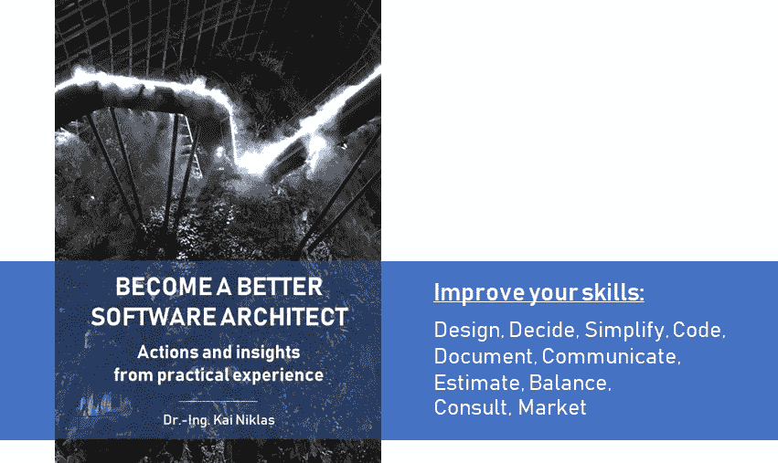

# 成为更好的软件架构师的 38 个行动和见解

> 原文：<https://medium.com/hackernoon/38-actions-and-insights-to-become-a-better-software-architect-f135e2de9a1b>

几年前，有人问我:“你是如何成为软件架构师的？”。我们谈到了必要的技能、经验以及积累知识所需的时间和奉献精神。此外，我还回顾了我采取的步骤、我积极使用或尝试的技术以及我在职业和非职业生涯中学到的东西。

这次谈话触发了我自己，我开始为我的个人成长构建话题。“怎样才能成为一名优秀的软件架构师？”，我想知道，“我怎样才能提高成为一名更好的软件架构师？”。我阅读文章和书籍，当然也和同龄人交谈。今天，我想与你分享我的见解，我认为哪些技能是最重要的，以及如何提高这些技能以成为一名(更好的)软件架构师。

# 什么是软件架构师？

在深入细节之前，我们先来看看两个定义。

> 一个 **软件架构师**是一个软件专家，他做出高层次的设计选择并规定技术标准，包括软件编码标准、工具和平台。首席专家被称为首席架构师。
> (来源:[维基百科:软件架构师](https://en.wikipedia.org/wiki/Software_architect))
> 
> **软件架构**是一个系统的基本组织，由它的组件、它们彼此之间以及与环境的关系，以及决定系统设计和发展的原则来表示。
> (来源:[软件架构手册](http://www.handbuch-softwarearchitektur.de/))

# 建筑的层次

架构可以在几个抽象的“层次”上完成。水平影响必要技能的重要性。由于有许多可能的分类，我最喜欢的分类包括以下 3 个层次:

*   **应用层**:架构的最底层。专注于一个单一的应用。非常详细的低层次设计。通常在一个开发团队内部的交流。
*   **解决方案层次**:架构的中层。专注于满足业务需求的一个或多个应用程序(业务解决方案)。有些高，但主要是低层次的设计。多个开发团队之间的沟通。
*   **企业级**:架构的最高级别。关注多种解决方案。高层次、抽象的设计，需要由解决方案或应用程序架构师详细说明。组织内的沟通。

有时，架构师也被视为不同利益相关者之间的“粘合剂”。三个例子:

*   **横向**:在业务和开发者或者不同开发团队之间架起沟通的桥梁。
*   **垂直**:沟通开发者和管理者的桥梁。
*   **技术**:将不同的技术或应用相互集成。

# 软件架构师的典型活动

为了理解架构师需要的必要技能，我们首先需要理解典型的活动。以下(非最终)清单包含了我认为最重要的活动:

*   定义和决定开发技术和平台
*   定义开发标准，例如编码标准、工具、评审过程、测试方法等。
*   支持识别和理解业务需求
*   基于需求设计系统并做出决策
*   记录并交流架构定义、设计和决策
*   检查和评审架构和代码，例如，检查定义的模式和编码标准是否正确实现
*   与其他架构师和利益相关者协作
*   蔻驰和开发商商量
*   将高层设计细化为低层设计

**注意:**架构是一个持续的活动，尤其是当它应用于敏捷软件开发的时候。所以，这些活动都是反复做的。

# **软件架构师的重要技能**

为了支持规划好的活动，需要特定的技能。根据我的经验，阅读书籍和讨论，我们可以将其归结为每个软件架构师都应该具备的 10 项技能:

> 设计、决定、简化、编码、记录、沟通、评估、平衡、咨询、营销

让我们一个一个来。对于每项技能，我都列出了一些行动或见解，以便在该领域进行改进。

## (1)设计

什么是好的设计？这可能是最重要也是最具挑战性的问题。我将区分理论和实践。根据我的经验，两者兼而有之是最有价值的。先说*理论*:

*   了解基本的设计模式:模式是架构师开发可维护系统所需要的最重要的工具之一。有了模式，您可以重用设计，用经过验证的解决方案来解决常见问题。由[【四人帮】【GoF】](https://en.wikipedia.org/wiki/Design_Patterns)撰写的《 *《设计模式:可重用面向对象软件的元素》* 这本书是每个从事软件开发的人必读的。尽管该模式在 20 多年前就已经发布了，但它们仍然是现代软件架构的基础。例如，本书描述了[模型-视图-控制器(MVC)](https://en.wikipedia.org/wiki/Model%E2%80%93view%E2%80%93controller) 模式，该模式应用于许多领域，或者是新模式的基础，例如 [MVVM](https://en.wikipedia.org/wiki/Model%E2%80%93view%E2%80%93viewmodel) 。
*   **深入挖掘模式和反模式**:如果你已经知道所有基本的 GoF 模式，那么用[更多的软件设计模式](https://en.wikipedia.org/wiki/Software_design_pattern)来扩展你的知识。或者深入挖掘你感兴趣的领域。我最喜欢的一本书是格雷戈·霍佩写的[*企业集成模式*](http://books.dev-insights.com/books/link/0321200683)。每当两个应用程序需要交换数据时，这本书都适用于各个领域，无论是来自一些遗留系统的旧学校文件交换还是现代微服务架构。
*   **了解质量度量**:定义架构不是目的。定义、应用和控制指南和编码标准是有原因的。您这样做是因为质量和非功能性需求。你想要一个可维护的、可靠的、适应性强的、安全的、可测试的、可扩展的、可用的系统，等等。实现所有这些质量属性的一部分是应用好的架构工作。你可以开始在维基百科上了解更多关于质量评估的信息。

理论很重要。如果你不想成为[象牙塔建筑师](http://www.gitshah.com/2011/01/ivory-tower-architect.html)，实践同样重要，甚至更重要。

*   **尝试并了解不同的技术栈**:我认为如果你想成为一名更好的架构师，这是最重要的活动。尝试(新的)技术堆栈，了解它们的起伏。不同的或新的技术伴随着不同的设计方面和模式。你很可能从仅仅翻阅抽象幻灯片中学不到任何东西，而是通过自己尝试，感受痛苦或缓解。一个建筑师不仅要有广博的知识，还要在某些领域有深厚的知识。掌握所有的技术并不重要，重要的是对你所在领域最重要的技术有一个坚实的理解。也要尝试不属于你的领域的技术，例如，如果你对 SAP R/3 很深入，你也应该尝试 JavaScript，反之亦然。尽管如此，双方都会对 SAP S/4 Hana 的最新进展感到惊讶。比如你可以自己试试，免费上 [openSAP](https://open.sap.com) 的一门课。保持好奇心，尝试新事物。也尝试一些你几年前不喜欢的东西。
*   **分析和理解应用的模式**:看一下任何当前的框架，例如 [Angular](https://angular.io/) 。你可以在实践中学习很多模式，比如[可观测量](https://angular.io/guide/observables)。试着理解它是如何在框架中应用的，为什么要这样做。如果你真的很专注，深入研究代码，理解它是如何实现的。
*   **保持好奇心，参加用户组**:例如，在德国，我们在每个大城市都有 Java 用户组(JUG ),在那里讨论各种话题，从低级编码到高级架构话题。我真的很喜欢这些活动，因为它们强化了你跳出框框和个人网络的思维。

## **(2)决定**

架构师需要能够做出决策，并将项目或整个组织引向正确的方向。

*   知道什么是重要的:不要在不重要的决定或活动上浪费时间。了解什么是重要的。据我所知，没有一本书有这些信息(如果你知道，请告诉我)。我个人最喜欢的是我在评估一件事情是否重要时通常会考虑的这两个特征:
    *(1)观念的完整性*:如果你决定用一种方式去做，就坚持下去，即使有时候换一种方式会更好。通常，这导致更简单的整体概念，易于理解和维护。
    *(2)一致性*:例如，如果你定义和应用命名约定，它不是关于大写或小写(真的！)，而是以同样的方式在任何地方应用它。
*   分清轻重缓急:有些决定非常关键。如果不及早采取这些措施，就会产生一些变通办法，这些办法通常不太可能在以后被消除，并且对于维护来说是一场噩梦，或者更糟的是，开发人员只是停止工作，直到做出决定。在这种情况下，有时做出一个“糟糕”的决定比没有决定更好。但是在遇到这种情况之前，考虑一下优先考虑即将到来的决定。这样做有不同的方法。我建议看一下[加权最短工作优先(WSJF)](https://www.scaledagileframework.com/wsjf/) 模型，它在敏捷软件开发中被广泛使用。尤其是措施*时间关键性*和*风险降低*对于评估架构决策的优先级至关重要。
*   **了解自己的能力:**不要决定自己能力范围之外的事情。这是至关重要的，因为如果不加以考虑，它可能会严重破坏您作为架构师的地位。为了避免这种情况，请与您的同事澄清您的职责以及您的角色。如果有不止一个架构师，那么您应该尊重您当前部署的架构级别。作为一个较低层次的架构师，你最好为较高层次的架构提出建议，而不是做出决定。此外，我建议总是和同事一起检查关键决策。
*   评估多个选项:在做决定时，一定要列出多个选项。在我参与的大多数案例中，有不止一个可能的(好的)选择。只做一个选择在两个方面是不好的:(1)看起来你没有做好你的工作，以及(2)它阻碍了做出正确的决定。通过定义度量，可以基于事实而不是直觉来比较选项，例如许可成本或成熟度。这通常会带来更好、更可持续的决策。此外，向不同的利益相关者推销决策也很容易。此外，如果你没有正确评估选项，你可能会在讨论时错过争论。

## **(3)简化**

请记住解决问题的原则[奥卡姆剃刀](https://en.wikipedia.org/wiki/Occam%27s_razor)，它表明了对简单的偏爱。我对这个原则的解释如下:如果你对要解决的问题有太多的假设，你的解决方案很可能是错误的，或者会导致不必要的复杂解决方案。假设应该被减少(简化)以得到一个好的解决方案。

*   **摇动解决方案**:为了简化解决方案，摇动解决方案并从不同的角度观察它们通常会有所帮助。尝试通过自上而下和自下而上的思考来形成解决方案。如果你有一个数据流或流程，那么首先从左到右，再从右到左。问这样的问题:“在一个完美的世界里，你的解决方案会怎么样？”或者:“公司/个人 X 会怎么做？”(这里 X 可能不是你的竞争对手，而是 GAFA 公司[中的一家](https://en.wikipedia.org/wiki/Big_Four_tech_companies)。)这两个问题都迫使你像奥卡姆剃刀建议的那样减少假设。
*   **退一步讲**:经过激烈而漫长的讨论，结果往往是高度复杂的涂鸦。你永远不应该把这些看作最终结果。退一步:再看一下大图(抽象层面)。还有意义吗？然后在抽象的层面上再看一遍，重构。有时停止讨论，第二天继续会有帮助。至少我的大脑需要一些时间来处理，想出更好、更优雅、更简单的解决方案。
*   [**分而治之**](https://en.wikipedia.org/wiki/Divide_and_conquer_algorithm) :把问题分成更小的块来简化。然后独立解决。然后验证小块是否匹配。退一步来看看这方面的整体情况。
*   重构并不邪恶:如果找不到更好的主意，从更复杂的解决方案开始是完全可以的。如果解决方案带来了麻烦，你可以稍后重新思考解决方案并应用你的知识。重构不是邪恶的。但是在你开始重构之前，记住(1)有足够的自动化测试来确保系统的正常运行，以及(2)你的利益相关者的认可。要了解更多关于重构的知识，我建议阅读[*重构。由*](http://books.dev-insights.com/books/link/0201485672)*[马丁·福勒](https://www.martinfowler.com/)改进现有代码*T5 的设计。

## **(4)代码**

即使作为企业架构师，最抽象层次的架构，您仍然应该知道开发人员每天都在做什么。如果你不明白这是如何做到的，你可能会面临两个主要问题:
(1)开发人员不会接受你的说法和
(2)你不了解开发人员的挑战和需求。

*   **有一个副业项目**:这个项目的目的是尝试新的技术和工具，了解现在和未来的开发是如何进行的。经验是观察、情感和假设的结合( [*【软件工程中的经验和知识管理】*](http://books.dev-insights.com/books/link/3540958797) 作者 [Kurt Schneider](http://www.se.uni-hannover.de/pages/en:mitarbeiter_kurt_schneider) )。看个教程或者一些利弊都是好的。但这只是“书本知识”。只有你自己去尝试，你才能体验情感，才能建立关于事物好坏的假设。你使用技术的时间越长，你的假设就越好。这将帮助你在日常工作中做出更好的决定。当我开始编程时，我没有代码补全，只有一些实用程序库来加速开发。显然，在这种背景下，我今天会做出错误的决定。今天，我们有大量的编程语言、框架、工具、流程和实践。只有当你对主要趋势有了一些经验和大致的了解，你才能参与到对话中，并把发展引向正确的方向。
*   找到适合尝试的东西:你不可能尝试所有的东西。这根本不可能。你需要一个更加结构化的方法。我最近发现的一个来源是 ThoughtWorks 的[技术雷达](https://www.thoughtworks.com/radar)。他们将技术、工具、平台、语言和框架分为四类:采用、试用、评估和持有。**采用** 意为“强烈感觉准备好供企业使用”，**试用**意为“企业应该在一个能够处理风险的项目中尝试”，**评估**意为“探索它如何影响您的企业”，**持有**意为“谨慎处理”。有了这种分类，就更容易对新事物有一个总体的了解，并更好地评估下一步探索哪个趋势。

## **(5)文件**

架构文档有时更重要，有时不太重要。例如，重要的文档是架构决策或代码指南。在编码开始之前，通常需要初始文档，并且需要不断地改进。其他文档可以自动生成，因为代码也可以是文档，例如 UML 类图。

*   **干净的代码**:如果做得正确，代码就是最好的文档。一个好的架构师应该能够区分好的和坏的代码。了解好的和坏的代码的一个非常好的资源是罗伯特·c·马丁的书[*干净的代码*](http://books.dev-insights.com/books/link/0132350882)。
*   尽可能生成文档:系统变化很快，很难更新文档。无论是关于 API 还是 CMDBs 形式的系统环境:底层信息经常变化得太快，以至于无法手动更新相应的文档。*示例:*对于 API，如果您是模型驱动的，您可以基于定义文件自动生成文档，或者直接从源代码生成文档。这方面有很多工具，我认为 [Swagger](https://swagger.io) 和 [RAML](https://raml.org/) 是一个很好的学习起点。
*   **尽可能多，尽可能少**:无论你需要记录什么，比如决策文件，试着一次只关注一件事，并且只包括这件事的必要信息。大量的文档很难阅读和理解。附加信息应存储在附录中。特别是对于决策文件，更重要的是讲述一个令人信服的故事，而不是仅仅抛出大量的论点。此外，这也为你和你的同事节省了很多时间，因为他们必须阅读它。看看你过去做过的一些文档(源代码、模型、决策文件等。)并问自己以下问题:“是否包含了理解它的所有必要信息？”，“哪些信息是真正需要的，哪些可以省略？”以及“文件是否有红线？”。
*   **了解更多关于架构框架的知识**:这一点同样适用于所有其他“技术”点。我把它放在这里，因为像 [TOGAF](https://en.wikipedia.org/wiki/The_Open_Group_Architecture_Framework) 或 [Zachmann](https://en.wikipedia.org/wiki/Zachman_Framework) 这样的框架提供了在文档站点上感觉沉重的“工具”，尽管它们的附加值并不局限于文档。获得这样一个框架的认证会教你更系统地处理架构。

## **(6)沟通**

根据我的观察，这是最被低估的技能之一。如果你在设计方面才华横溢，但不能传达你的想法，你的想法很可能影响较小，甚至无法成功。

*   **学习如何传达你的想法**:在白板或活动挂图上合作时，了解如何正确使用它以构建你和你同事的想法是至关重要的。我发现这本书*“UZMO——用你的笔思考”*是一个很好的资源，可以提高我在这方面的技能。作为一名架构师，你通常不只是参与会议，通常你需要主持会议。
*   给大群人演讲:向一个或大或小的群体表达你的想法对你来说应该是可行的。如果你对此感到不舒服，开始向你最好的朋友展示。慢慢放大群。这是你只能通过实践和离开你的个人舒适区来学习的东西。对自己要有耐心，这个过程可能需要一些时间。
*   **找到合适的沟通层次**:不同的利益相关者有不同的兴趣和观点。它们需要在各自的层面上单独解决。在你交流之前，退后一步，检查你想要分享的信息是否达到了正确的水平，包括抽象性、内容、目标、动机等等。*例子*:开发人员通常对解决方案的极小细节感兴趣，而经理更想知道哪个选项最省钱。
*   **经常交流**:如果没有人知道，再好的建筑也是没有价值的。定期在每个(组织)级别上发布目标架构及其背后的思想。安排与开发人员、架构师和经理的会议，向他们展示期望的或定义的方式。
*   透明:定期沟通只能部分缓解透明度缺失。你需要让决策背后的原因变得透明。特别是，如果人们不参与决策过程，就很难理解和遵循决策及其背后的基本原理。
*   随时准备好做陈述:总有人会有问题，你想马上给出正确的答案。尽量将最重要的幻灯片放在一套幻灯片集中，以便展示和解释。它为你节省了很多时间，也给你自己带来了安全感。

## **(7)估算和评估**

*   **了解基本的** [**项目管理**](https://en.wikipedia.org/wiki/Project_management) **原则**:作为架构师或首席开发人员，你经常被要求对实现你的想法进行估算:多长时间，多少，多少人，哪些技能，等等。？当然，如果你计划引入新的工具或框架，你需要对这类“管理”问题有一个答案。最初，你应该能够给出一个大概的估计，比如几天、几个月或者几年。不要忘记，这不仅仅是实现，还有更多活动需要考虑，比如需求工程、测试和修复错误。因此，你应该知道所使用的[软件开发过程](https://en.wikipedia.org/wiki/Software_development_process)的活动。为了获得更好的估计，你可以使用过去的数据，并从中得出你的预测。如果你没有过去的数据，你也可以尝试像巴利·W·玻姆的可可莫这样的方法。如果你被部署在一个敏捷项目中，学习如何正确地评估和计划:Mike Cohn 的书 [*【敏捷评估和计划】*](http://books.dev-insights.com/books/link/0131479415) 在这方面提供了一个坚实的概述。
*   **评估“未知的”架构**:作为架构师，您还应该能够评估架构对于当前或未来环境的适用性。这不是一个简单的任务，但是您可以通过准备一组问题来为它做准备，这些问题在每个体系结构中都很常见。这不仅是关于架构，也是关于如何管理系统，因为这也给你关于质量的内幕。我建议总是准备一些问题，随时使用。一般问题的一些思路:
    (1) **设计实践**:架构遵循哪些模式？它们是否因此被正确使用？设计是遵循红线还是有不受控制的增长？关注点是否有清晰的结构和分离？
    (2) **开发实践**:代码指南是否到位并被遵循？代码是如何版本化的？部署实践？
    (3) **质量保证**:测试自动化覆盖率？静态代码分析到位并有好的结果？同行评审到位了吗？
    (4) **安全**:哪些安全理念到位？内置安全性？渗透测试或自动安全分析工具是否到位并定期使用？

## **(8)余额**

*   **质量是有代价的:**前面我谈到了质量和非功能需求。如果你过度构建，将会增加成本并可能降低开发速度。您需要平衡架构和功能需求。应避免过度设计。
*   **解决矛盾目标**:矛盾目标的一个经典例子是短期和长期目标。项目往往倾向于构建最简单的解决方案，而架构师则着眼于长远。通常，简单的解决方案并不适合长期的解决方案，并且有被抛弃的风险(沉没成本)。为了避免在错误的方向上实施，需要考虑两件事情:
    (1)开发人员和企业需要了解长期愿景及其好处，以便调整他们的解决方案，以及
    (2)负责预算的经理需要参与进来，以了解财务影响。没有必要将 100%的长期愿景直接放在适当的位置，但是开发的部分应该适合它。
*   **冲突管理**:架构师通常是具有不同背景的多个团队之间的粘合剂。这可能会导致不同层面的沟通冲突。为了找到一个反映长期战略目标的平衡解决方案，架构师的角色通常是帮助克服冲突。我关于[传播理论](https://en.wikipedia.org/wiki/Communication_theory)的出发点是舒尔茨·冯·图恩的[“四耳模型”。基于这个模型，可以显示和扣除很多。但是这个理论需要一定的实践，要在交流研讨中体会。](https://en.wikipedia.org/wiki/Four-sides_model)

## **(9)和蔻驰**商量

在咨询和指导方面，积极主动可能是你能做的最好的事情。如果有人问你，往往已经太晚了。清理建筑工地是你想要避免的事情。你需要以某种方式预见未来几周、几个月甚至几年，并为自己和公司的下一步做好准备。

*   **有愿景**:如果你被部署在一个项目中，无论是传统的瀑布式方法还是敏捷方法，你都需要有一个你想要实现的中长期目标的愿景。这不是一个详细的概念，但更多的是一个路线图，每个人都可以工作。由于你不可能一次完成所有事情(这是一个旅程)，我更喜欢使用成熟度模型。它们给出了一个清晰的结构，可以很容易地使用，并且给出了每个时间的当前进展状态。对于不同的方面，我使用不同的模型，例如开发实践或持续交付。成熟度模型中的每个级别都有明确的要求，这些要求遵循 [SMART 标准](https://en.wikipedia.org/wiki/SMART_criteria)，以便于衡量您是否达到了要求。我发现的一个很好的例子是[继续交付](https://www.infoq.com/articles/Continuous-Delivery-Maturity-Model)。
*   **建立一个** [**实践社区**](https://en.wikipedia.org/wiki/Community_of_practice)**【CoP】**:在一个共同的利益群体中交流经验和知识有助于传播思想和标准化方法。例如，每隔三个月左右，您可以将所有 JavaScript 开发人员和架构师聚集在一个房间，讨论过去和当前的挑战，以及如何应对这些挑战或新的方法和途径。架构师可以分享、讨论和协调他们的愿景，开发人员可以分享经验并向同行学习。这样的一轮对企业和个人本身都非常有益，因为它有助于建立更强大的网络和传播想法。另外，请查看 SAFe 框架中的文章[实践社区](https://www.scaledagileframework.com/communities-of-practice/)，该文章解释了敏捷环境中的 CoP 概念。
*   **召开公开会议**:误解或歧义的一个来源是缺乏沟通。划出一个固定的时间段，比如每周 30 分钟，与你的同伴交流热门话题。本次会议没有议程，一切都可以讨论。尽量就地解决小事情。对更复杂的主题安排跟进。

## **(10)市场**

你的想法很棒，你也很好地传达了它们，但仍然没有人愿意跟随？那么你很可能缺乏营销技巧。

*   **激励和说服**:公司如何说服你购买一个产品？他们展示了它的价值和好处。但不仅仅是 5 个要点。他们把它包装得很好，尽可能让它容易消化。
    (1) **原型**:展示你想法的原型。有很多工具可以创建原型。对于喜欢 SAP 的企业来说，看看 [build.me](https://www.build.me) 吧，在这里你可以快速简单地创建好看且可点击的 UI5 应用。
    (2) **播放视频**:除了“无聊的幻灯片”，你还可以播放一段视频，展示你的想法或者至少是方向。但是，请不要过度营销:从长远来看，内容才是王道。如果你的话没有实现，从长远来看，这将损害你的声誉。
*   为你的想法而战，坚持不懈:人们有时不喜欢你的想法，或者他们只是懒得去遵循它们。如果你真的被自己的想法所说服，你应该不断地去追求它们并“战斗”。这有时是必要的。具有长期目标的架构决策通常不是最容易的:开发人员不喜欢它们，因为它们开发起来更复杂。经理们不喜欢它们，因为它们在短期内更贵。你的工作就是坚持不懈地谈判。
*   **寻找盟友**:单靠自己的力量建立或实施你的想法可能很难，甚至是不可能的。试着找到能够支持和帮助说服他人的盟友。利用你的关系网。如果你还没有，现在就开始建立吧。你可以从和你的(思想开放的)同龄人谈论你的想法开始。如果他们喜欢你的想法，或者至少是其中的一部分，如果别人问起，他们很可能会支持你的想法(“X 的想法很有趣。”).如果他们不喜欢，问问为什么:也许你错过了什么？还是你的故事说服力不够？下一步是找到有决定权的盟友。求虚心讨论。如果你害怕讨论，记住有时候你需要离开你的舒适区。
*   **重复一遍，相信它**:[……]研究表明，重复接触一种观点会让人认为这种观点更普遍，即使这种观点的来源只是一个人。”(来源:[金融品牌](https://thefinancialbrand.com/42323/advertising-marketing-messages-effective-frequency/))如果你足够经常地发布少量信息，它可以更容易地帮助说服人们。但是请注意:在我看来，这样的策略应该被明智地使用，因为它可能会适得其反，成为一个糟糕的营销伎俩。

# 想多读点？

订阅我的 [**现代软件架构**](https://mailchi.mp/7f46c21dfc63/better-software-architect) 时事通讯。增长您的技能，成为更好的软件架构师。

支持我的工作，看看我的书“[成为一个更好的软件架构师——实践经验中的行动和见解](https://bettersoftwarearchitect.com)”。它基于这篇文章，并定期更新更多内容。

[Become a Better Software Architect — Actions and insights from practical experience](https://bettersoftwarearchitect.com)

# 书背后的故事

感兴趣，这本书是怎么活过来的？

 [## 成为更好的软件架构师:本书背后的故事

### 提高自己的技能。加快你的职业发展。

medium.com](/@kniklas/become-a-better-software-architect-the-story-behind-the-book-df6c5179d7aa) 

# 行动呼吁

让我知道你有哪些经验，以及你如何提高你的建筑技能。基于你的反馈，我会写出更有深度的文章。