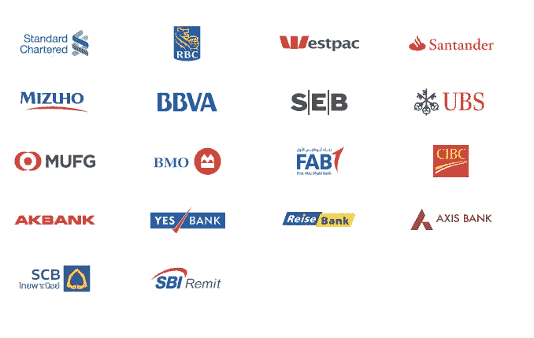

# 5 个令人担忧的原因涟漪可能不是你想的那样

> 原文：<https://medium.com/hackernoon/4-alarming-reasons-ripple-might-not-be-what-you-think-9debc3c86985>

在秘密投资的世界里，新闻和错误信息泛滥成灾。揭示真相对每个希望成为下一个重大创新的一部分的人来说都很重要。

# **涟漪独霸**

你已经听到消息了。在所有加密货币中，Ripple 的市值排名第二，高达 1280 亿美元。高于优步、Airbnb 和 Slack 的估值加上 200 亿美元的零花钱。Ripple 是 2017 年表现最好的加密货币，比年初增长了惊人的 [36，000%](https://coinmarketcap.com/currencies/ripple/) ！

Coinmarketcap.com Jan-Dec 2017

对 Ripple 来说，事情进展得很顺利。对一些人来说这并不奇怪。他们已经杀了它很多年了。从 2012 年到 2016 年，Ripple 从安德森·霍洛维茨(Andre essen Horowitz)、 [GV](https://www.gv.com/) (Google Ventures)以及更多硅谷顶级风险投资公司那里筹集了[9360 万美元](https://www.crunchbase.com/organization/ripple-labs)。这些公司通常会在脸书、斯莱克和优步等初创公司成立时投资它们。他们支持 Ripple 意味着他们相信这个任务，他们相信这个团队。

Major banks using the Ripple platform

Ripple 在网上到处都是。成功的试点项目，与 [100+金融机构](https://ripple.com/insights/ripplenet-grows-to-over-100-financial-institutions/)合作，甚至[日本政府](https://ripple.com/insights/top-korean-banks-work-japan-bank-consortium-modernize-cross-border-payments/)似乎都在背后支持。

一切都很完美。

一家公司凭借创新技术席卷市场的典型案例。

这是真的，如果不是一些更好的细节有巨大的影响的话。

# **1。XRP 没有涟漪**

当人们听到涟漪，他们立即想到他们的硬币 XRP。这是有意义的，因为其他社区和硬币是同一个。当你购买以太网时，你是在押注以太坊，当你购买 BTC 时，你是在押注比特币。为什么 Ripple 会有什么不同呢？

这就是事情变得有趣的地方。要了解 XRP 和 Ripple 之间的区别，首先我们需要考察 Ripple 公司。

Ripple 成立于 2012 年，名为 Opencoin，2015 年更名为 Ripple，目前总部位于加利福尼亚州旧金山。他们有 150 多名员工，一间漂亮的办公室，他们出售使用区块链的银行软件。

Ripple headquarters in California

Ripple 是做什么的？他们有 [3 款产品](https://ripple.com/solutions/) — xCurrent、xRapid 和 xVia。

**xCurrent** 是他们的旗舰产品。它让银行有能力高效地跨境转移资金。它使用 RippleNet，Ripple 区块链，但是**不使用**XRP。银行喜欢这个软件，因为它可以让他们在发送付款时节省金钱和时间，而不会给他们的工作流程带来太大的风险或变化。

xRapid 帮助银行在新兴市场交易时提高流动性。**这是唯一使用 XRP 的 Ripple 产品。银行喜欢它，因为它能帮助他们释放堆积如山的资金，但不喜欢它，因为它引入了未知因素——比如 XRP 的波动性。**

**xVia** 还在开发中，计划 2018 年初问世。它类似于 xCurrent，但允许银行以外的实体(如公司和支付提供商)通过银行汇款。xVia 也不**而**使用 XRP。

还记得 Ripple 合作的 100 多家金融机构吗？你猜怎么着，他们都在用 xCurrent。并且 **xCurrent 不使用 XRP** 。在 Ripple 的 100 多个合作伙伴中，只有一个真正使用加密货币 XRP。墨西哥只有一家名为 Cuallix 的小型“非银行金融机构”在使用 xRapid。

这意味着展示 Ripple 与越来越多银行的合作关系的标题是好的——Ripple 公司正在取得成功——但也不意味着 XRP 获得采纳。

这并不是说银行永远不会采用 xRapid(并开始使用 XRP)。事实上，这从一开始就是 Ripple 商业计划的一部分。让银行使用 xCurrent，然后交叉销售给 xRapid。银行可能会爱上 xRapid。

或者他们可能不会。

对于 Ripple 来说，这种差异并不重要。对于 XRP 的投资者来说，这是他们投资 T21 成败的关键。

# **2。XRP 不是未来的货币**

当人们听到比特币时，他们会想到数字货币。就像，你可以无限制地给世界上的任何人寄钱。

XRP 将来可能会变成这样，但现在 XRP 陷入了银行业。Ripple 也没有提到近期会改变这一点。

这完全没问题，对于 Ripple 公司来说，这是一个完美的选择。通过专注于银行和金融机构，他们可以提供价值并创造有利可图的风险。

XRP 投资者的问题是，XRP 可能会被那些认为它会击败比特币、取代法币、成为世界货币的人买得过多。这意味着市值可能会被人为抬高，并在这成为常识时经历一次修正。

鉴于 Ripple 正在寻求全球银行支付，他们的真正目标是取代 SWIFT，这是一个有 45 年历史的协会，负责在国际银行之间转移资金。

2016 年，SWIFT 获得了 3100 万美元的利润，通过他们的系统发送了[巨额资金。然而，与全球超过 10 万亿美元的](https://www.fincen.gov/sites/default/files/shared/Appendix_D.pdf)[货币资产相比，这只是个小数目。](https://www.marketwatch.com/story/this-is-how-much-money-exists-in-the-entire-world-in-one-chart-2015-12-18)

受限于 SWIFT 市场将 XRP 的机会减少了许多数量级，低于真正的数字世界货币。

# **3。XRP 不是颠覆性技术**

Ripple 并不是唯一一家对改革银行业感兴趣的公司。

[**R3**](https://www.r3.com/) 和 Ripple 做的完全一样。他们已经从顶级风险投资家那里筹集了 1.07 亿美元，并利用区块链帮助银行在国际上转移资金。他们现在是世界上最大的银行中的 70 家，你可能没有听说过他们的原因很简单，因为他们没有自己的硬币。

**SWIFT** 与 11，000 多家机构合作，员工超过 2600 人。要占领这个市场，Ripple 必须增长 100 倍。这里的挑战是【SWIFT 没有理由不能开发自己的区块链技术，并利用他们已经建立的关系，以比 Ripple 更快的速度推广它。

SWIFT Headquarters in La Hulpe, Belgium

SWIFT 会开发自己的区块链吗？SWIFT 全球银行业务主管 Harry Newman 似乎对此并不认同。他认为区块链只是一项新技术，如果利大于弊，可以集成到他们现有的系统中。

> *“如果在未来几年内将其融入我们的全球支付创新产品中是有意义的，我们会的。这就是为什么我不认为这是一种破坏。我认为这些是建设性的技术，可以被研究、采纳和使用。”*

他们言行一致。他们已经完成了与 22 家银行的[概念验证](https://www.swift.com/news-events/press-releases/22-additional-global-banks-join-the-swift-gpi-blockchain-proof-of-concept),使用 Hyperledger Fabric 区块链帮助他们释放存储在 nostro 账户中的资金。他们还在 T2 测试了智能合约。

也许我们都应该跳到斯威夫特的硬币上，如果他们有一个的话？

**恒星流明(XLM)** 由 Ripple 的创始人杰德·麦卡勒布(Jed McCaleb)于 2014 年创建，以解决他在 Ripple 身上看到的问题。

自那以后，Stellar 的总市值已经增长到第八位，并以与 [IBM](http://fortune.com/2017/10/16/ibm-blockchain-stellar/) 和[澳大利亚](http://www.novatti.com/)、[印度尼西亚](https://pundix.com/)、[马来西亚](https://moneymatch.co/)和[韩国](https://www.neoframe.com/)的支付提供商的交易而自豪。

通过将关注点扩展到银行以外，Stellar 有可能比 Ripple 大得多。Stellar 协议支持智能合同，这是流行的以太坊网络的关键组件。他们最近在这方面取得的一个胜利是 Kik，这是一款$1B 消息应用，[承诺在 2018 年将他们的亲属令牌从以太坊转移到 Stellar。](https://www.coindesk.com/goodbye-ethereum-kik-plans-move-ico-tokens-stellar/)

# **4。XRP 不是分权制**

Ripple 控制着 RippleNet，他们拥有现存 XRP 硬币总量的 62%。可以理解，这令 XRP 投资者担忧，Ripple 的回应是锁定 550 亿枚硬币进行托管。

与任何中央集权制度一样，投资者现在不得不相信 Ripple 会信守诺言。

他们很可能会。鉴于他们的战略是在未来 55 个月内每月发行 10 亿美元，他们将以目前的市场价格出售这 550 亿 XRP 代币，从而获得大量资金。

但集中化的风险不仅仅是你是否信任 Ripple 会考虑你的最佳利益并公平竞争。

问题还在于弹性。数字货币过去失败的原因是因为集中的数字货币太容易被监管扼杀**。比特币的分散化是它在 21 世纪初的数字货币(如 E-gold、Liberty Reserve 和腾讯)失败时幸存下来的原因之一。**

**Ripple 面临着与早期数字货币相同的弱点**。当事情不可避免地出错时，这是一个合法攻击的实体。****

# ****5。XRP 领养≠涨价****

**假设一切按计划进行。Ripple 与 100 多倍的银行合作。银行喜欢使用区块链和 xCurrent，然后决定通过 xRapid 在 XRP 上冒险。他们喜欢 xRapid，并对它有足够的信心，可以通过它处理所有的交易——甚至是数百万美元的交易。SWIFT 严重失误，完全未能创新，失去了所有客户，并关门大吉。**

**你很开心。XRP 每天的交易额超过 5 万亿美元。XRP 的价格应该高到天上去。对吗？嗯，不一定。**

****

**XRP 的价值被持有这种资产的人推高，他们相信这种资产将来会更值钱。寻求跨境转移资金的银行不是在投机。事实上，他们不愿持有 XRP，因为他们承担了 XRP 自然波动带来的风险。**

**这意味着银行将尽可能短时间持有 XRP。并且给定波纹网络的速度；那个时间是 [4 秒](https://ripple.com/xrp/)。随着银行——XRP 的实际用户——不再持有他们的硬币，XRP 的市值将会减少，即使在 SWIFT 的水平上**也只会产生大约 2 . 3 亿美元的收益**。******

****这与目前 1280 亿美元的投机价值相去甚远。****

# ******结论******

****涟漪是好的，但 XRP 的成功对投资者来说是一场艰苦的战斗。****

****首先 Ripple 公司需要做好。由于 XRP 是中央集权的，如果瑞波灭亡，XRP 也会灭亡。****

****Next Ripple 需要在 xCurrent 上注册 100 倍的银行和金融机构，才能在国际支付方面与 SWIFT 一样强大。然后，银行需要开始使用 xRapid，并与 XRP 进行交易结算。****

****在这个过程中，SWIFT 这个有 45 年历史的集团一直在与技术一起发展，它必须不能提供有竞争力的产品，否则就会失去整个市场份额。此外，R3 和其他进入这一领域的初创公司也会失败。****

****只有在这个时候，所有的 1000 亿 XRP 硬币才会价值约 2.31 亿美元，或每枚硬币 0.0023 美元。****

****话虽如此，Ripple 仍然是一家令人惊叹的公司。即使他们未能占领整个 SWIFT 市场，他们仍然可以向银行提供一套有价值的产品。它们仍能产生可观的收入，并获得较高的每股价格。****

****这可能不是 XRP 投资者希望的结果。****

********

## ****喜欢这篇文章吗？我们现在有电报信号组了！****

****我们发布**简单有效的交易信号**。所以你可以花更少的时间做技术分析，花更多的时间**得到结果。**
👉[https://t.me/coinandcrypto](http://telegram.coinandcrypto.com/medium)****

********