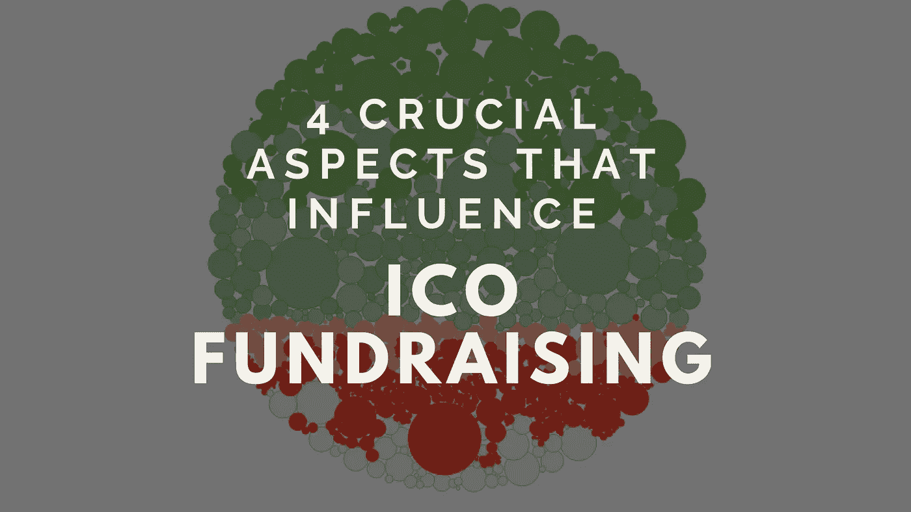
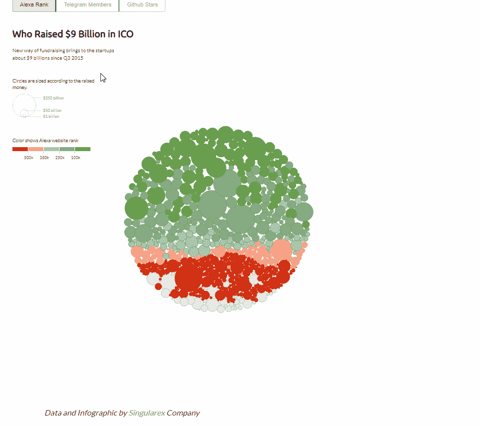
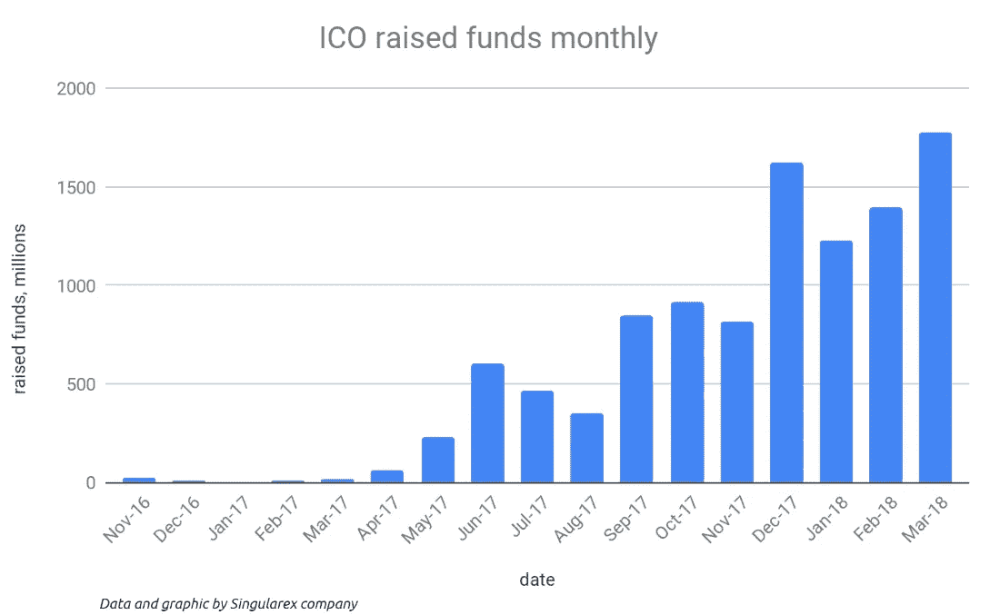
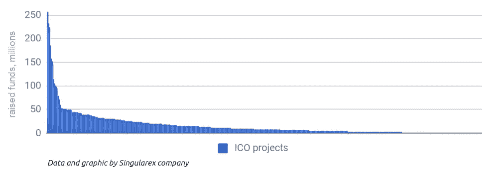
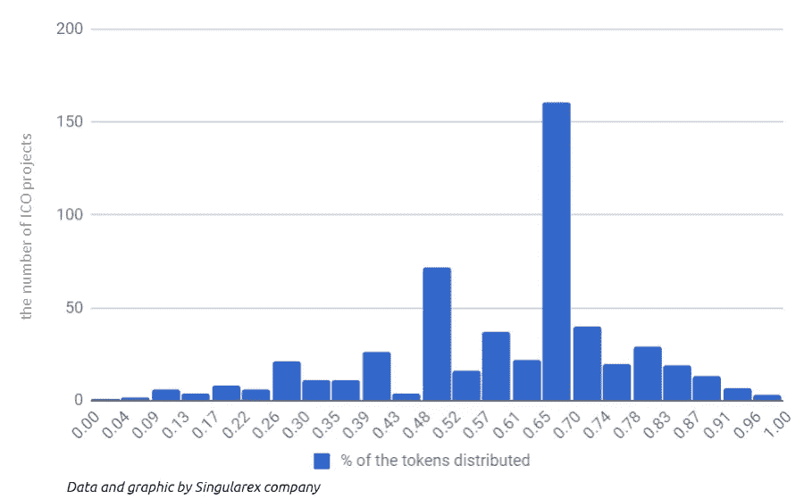
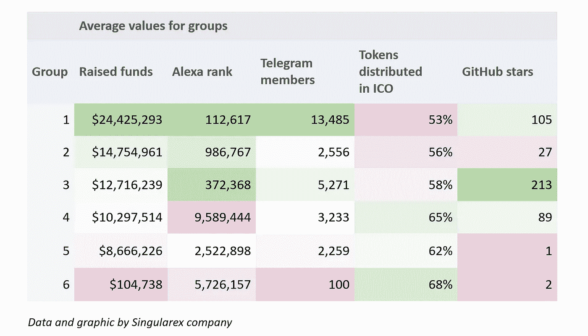

# 影响 ICO 筹资的 4 个关键方面(分析 1200 个 ICO 和 100 个因素)

> 原文：<https://medium.com/hackernoon/4-crucial-aspects-that-influence-ico-fundraising-analyzing-1200-icos-and-100-factors-7e78172ffd10>

Analyzing 1200 ICOs and 100 Factors

社交媒体情报公司 [Singularex](https://singularex.com/?utm_source=Medium&utm_medium=Hackernoon&utm_campaign=ICO) 通过研究从 2015 年到 2018 年 Q1 期间影响 1200 个 ICO 的 100 个因素，揭示了对首次硬币发行( [ICO](https://hackernoon.com/tagged/ico) )市场的见解。该公司缩小了影响筹资数量的四个关键方面，以及任何 ICO 投资者和发行者都有兴趣知道的许多令人惊讶的依赖性。

ICO 分析的主要结果显示在交互图中。

> C [**点击此链接**](http://data.singularex.com/) ，你将能够点击标签，如下图所示:

*点击图中的标签，你会看到筹集的资金如何取决于 Alexa 排名、Github 活动和 Telegram 成员。*

**关于 ICO 筹款的一些重要数据**

2017 年，ico[筹集了](https://www.bloomberg.com/news/articles/2018-01-22/startups-are-raising-billions-using-initial-coin-offerings)68 亿美元。它们不再是风险资金大海捞针，相比之下，[为美国初创企业带来了](https://www.bloomberg.com/news/articles/2018-01-09/venture-capital-investing-hits-highest-since-dot-com-boom)842 亿美元。自 2016 年以来，通过 ico 筹集了约 90 亿美元，这些数字每年都在增长。

*图表显示了从 2016 年 11 月到 2018 年 Q1 青奥会期间通过 ico 筹集的资金数量*

下一张图中的每个条形显示了从最成功到最不成功的每个 ICO 项目筹集了多少资金:

从图中可以看出，不到 10%的 ico 每家融资超过 5000 万美元，约 70%的 ico 融资在 1000 万至 5000 万美元之间，其他的不到 1000 万美元。最大的发行者是:HDAC(2.58 亿美元)、Filecoin(2.57 亿美元)、Tezos(2.32 亿美元)、Votes(2.24 亿美元)。

正如你所注意到的，ICO 市场正在蓬勃发展。如果几年前在 [Bitcointalk](https://hackernoon.com/tagged/bitcointalk) 上阅读 ICO 就足够了，那么今天投资者希望依靠机器学习和神经网络取得成功。因此，在研究中使用这些新方法，有可能确定哪些因素影响 ICO 的成功，哪些因素你不应该考虑。

**哪些因素对 ico 募集资金的数量影响最大？**

在 ICO 分析期间，可以从 1200 个 ICO 项目中收集 650 个项目的数据，以了解所筹集的资金数量。他们研究了 100 多项技术、营销、社交媒体和团队特征。这里列出了最关键的 4 个因素，根据重要程度在这里提到。

1.  **网站人气**

最重要的因素是网站的受欢迎程度，这实际上是一个项目所有营销活动的结果。这种影响是在研究每个 ICO 的 Alexa 排名时发现的。根据 Alexa.com 的说法，这是一个网站的在线流量与其他网站相比的排名。网站排名越接近#1，网站越受欢迎。

**Alexa 排名越高，ICO 项目筹集的资金就越多。**

因此，如果 ICO 项目的 Alexa 排名从 10 万到 10K，筹集更多资金的机会比排名 100 万或更低。

1.  **Github 活动**

投资者通常会关注 Github 活动，以便将真实的项目与炒作的项目区分开来。一些 ICO 项目试图通过存储用户协议、白皮书和工作文档来增加代码量。然而，在研究 Github 之后，发现代码数量或任何其他存储库特征都不重要。相反，Github 用户对代码的采用很重要。

ICO 项目的存储库越多，筹集的资金就越多。

1.  分发令牌的百分比

95%的 ICO 分发 ICO 中 43%到 79%的令牌。分发代币百分比的进一步增加不会导致募集资金数量的增加。

这可能是因为强大的项目感到自信，他们不需要分配太多。

1.  **社区成员**

对社区的研究表明，并非所有的社区都同样重要。例如，Telegram 和 Reddit 的活动远比 Twitter 和脸书重要。可能，因为 Telegram 在加密投资者中非常受欢迎，Telegram 社区比 Twitter 或脸书有更多的目标受众。Twitter 也被认为更容易作弊。

**ICO 社区的 Telegram 成员越多，筹集的资金就越多。**

# ICO 分析摘要

令人惊讶的是，但在这项研究中，并没有发现筹集的资金与脸书帖子和赞、Twitter 粉丝和帖子等社交媒体因素之间有任何显著的相关性。Bitcointalk 帖子的影响力、浏览量以及公告帖子作者的资历也没有得到证实。ICObench 的顶级顾问参与了 30 个项目，每个项目都没有对筹集的资金数量产生显著影响。

发现了筹集大量资金的 ICO 项目所固有的 4 个关键特征。根据这一相似因素，所有被考察的 ICO 项目被分成 6 组并插入一个表中。

最有效的第一组平均筹集了 2400 万美元，这得益于 Alexa 的高排名(约 112K)、大量的 Telegram 成员、约 53%的代币分发量以及平均 105 颗 Github 星。

但即使从表中也可以看出，它并不是唯一存在的正确策略。在 ICO 分析中，只有间接因素通过可公开获得的来源进行了检查。其他一些因素，如项目的创新性、个人关系、协议和运气对筹款的成功有着巨大的影响。由于他们的主观性，他们不能参与这项研究。然而，研究人员相信，他们能够检测到的因素对大约 40%的项目成功负有责任，这在科学界被认为是一个相当大的百分比。

*数据和图形由分析公司*[*Singularex*](https://singularex.com/?utm_source=Medium&utm_medium=Hackernoon&utm_campaign=ICO)*。*

*来源:* [*CCN*](https://www.ccn.com/analyzing-1200-icos-and-100-factors-4-crucial-aspects-that-influence-ico-fundraising/)